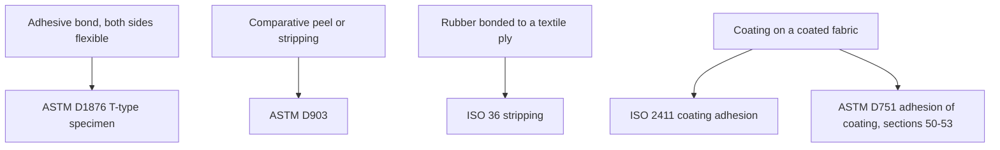
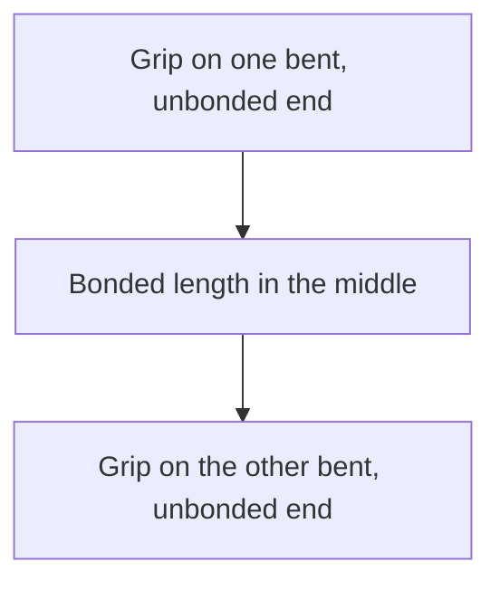
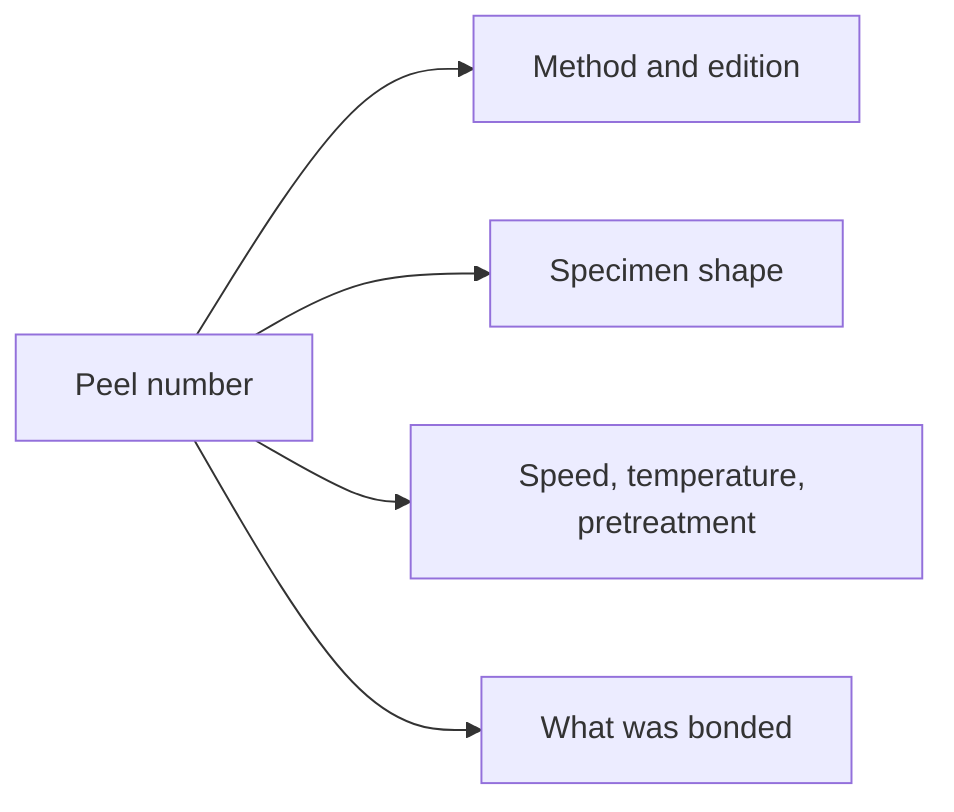

# Adhesion and Peel Test Methods

## Executive summary

A peel number records the mechanical force measured while pulling a test specimen apart. The standard test method must match the geometry and materials of that specimen. Testing a flexible-to-flexible adhesive bond, evaluating peel strength against a rigid backing, stripping a vulcanized rubber ply from a textile casing, and measuring coating adhesion on a coated fabric all require different test standards.

Always record the standard edition, specimen dimensions, pull speed, temperature, and substrate pairing alongside any numerical result. A peel strength published in an industrial handbook applies strictly to the exact adhesive formulation, substrate, and test geometry used in that laboratory run.

Use this guide when evaluating published peel values or planning laboratory tests on rubber bonds. Specific cutting layouts, adhesive selection, and post-failure seam analysis are covered in companion guides.

## Questions this article answers

- [Which method name matches the specimen?](#which-method)
- [What do you write next to the number?](#what-to-record)
- [Which article has the specimen layout?](#where-next)

## Which method name matches the specimen? {#which-method}

### How

Select your test method based on the physical construction of your specimen before comparing or reporting values.

Match your test piece to the appropriate standard:

- For an adhesive bond between two flexible substrates pulled in opposing directions, use ASTM D1876. The unbonded ends are bent perpendicular to the bond line and clamped into the grips.
- For comparative peel or stripping strength of an adhesive bond pulled at 180°, use ASTM D903. This method requires a standard specimen size, specified surface pretreatment, controlled temperature, and fixed machine speed.
- For rubber bonded to a fabric ply, use ISO 36. This stripping method applies to flat pieces or cylinders with an internal diameter greater than roughly 50 mm. Do not use ISO 36 on specimens with sharp bends that cannot be cut out. Coated fabrics and textile conveyor belts are excluded from ISO 36; conveyor belts use ISO 252.
- For the bond between a rubber or polymer coating and its base fabric, use ISO 2411 or ASTM D751 (sections 50–53). ASTM D751 covers industrial coated fabrics including rainwear and tarpaulins.

If a laboratory report mentions a 180° peel angle while citing ASTM D1876, note that discrepancy. ASTM D1876 specifies a T-peel geometry, not a 180° pull.

### Why

Each standard tests a different mechanical failure mode. Pulling two flexible sheets apart in a T-peel spreads stress across a moving bend radius. Stripping a thin coating from a woven fabric pulls primarily at the adhesive interface. Pulling a rubber ply from a heavy textile carcass introduces shear inside the rubber matrix.

ASTM D751 provides distinct sections for each test because whole coated fabrics perform differently from isolated adhesive films. D. C. Blackley notes in *Polymer Latices* Volume 3 that adhesion is physically ill-defined unless the number remains tied directly to the test geometry, rate of pull, and specimen structure.

Detail: Choosing ISO 36 vs ISO 2411 vs ASTM D751 adhesion clauses

ISO 36:2020 (edition 7, confirmed in 2025) specifies the determination of stripping force between two plies of fabric bonded with rubber, or between a rubber layer and a fabric ply. The abstract restricts specimen geometry to flat surfaces or cylinders with an internal diameter greater than approximately 50 mm. The method excludes sharp curves and directs coated fabrics to ISO 2411 and conveyor belts to ISO 252.

ISO 2411:2024 (fifth edition) evaluates coating adhesion on rubber- or plastics-coated fabrics. The introduction defines the property as resistance to delamination between the coating film and the adjacent textile substrate. Specimen preparation covers both dry and wet states. Clause 9.5 classifies failure types, moved into the normative procedure because distinguishing adhesive release from cohesive fabric tear is necessary to interpret results.

ASTM D751-26 establishes comprehensive testing procedures for rubber-coated fabrics, including tarpaulins and rainwear. Section 1.2 directs users to specific clauses for each test property. Adhesion of the coating to the base fabric is governed exclusively by sections 50 through 53.

Detail: T-type specimen geometry in ASTM D1876

The ASTM D1876 standard evaluates the relative peel resistance of adhesive bonds between flexible adherends. The unbonded ends of the two sheets are folded back at 90° angles to form a T-shape, with each tab secured in a tensile test grip.

The tensile testing machine separates the grips at a constant crosshead rate. The machine records the sustained peeling load over a specified bond length, disregarding the initial load peak. Industrial handbook figures documenting polychloroprene adhesive on duck cotton show this opposing-grip T-configuration. ASTM D1876 standardizes that configuration for flexible adherends.

## What do you write next to the number? {#what-to-record}

### How

Record four operational parameters alongside any peel or adhesion value:

1. The test standard and edition year.
2. The specimen geometry defined by that edition (for example, an ASTM D1876 T-type specimen or an ISO 36 ply-stripping strip).
3. The specific test conditions mandated by the procedure, including crosshead speed, ambient temperature, relative humidity, conditioning steps, and measurement units.
4. The exact materials on both sides of the bond line.

If the standard specifies failure categories, record the failure mode using the exact classification terms from the text. For example, cite clause 9.5 when reporting ISO 2411:2024 results.

### Why

ASTM D1876 and ASTM D903 measure comparative rankings rather than fundamental physical constants. A peel value reflects the combined effects of adhesive strength, substrate stiffness, peel angle, and viscoelastic energy loss in the rubber. A second facility cannot replicate or verify a reported figure without identical geometry, rate of displacement, and environmental control.

Blackley emphasizes in *Polymer Latices* Volume 3 that static adhesion tests run without mechanical fatigue function strictly as sorting trials. Because rubber is viscoelastic, separation resistance varies directly with deformation rate. Static sorting numbers cannot predict dynamic durability under cyclic stress.

Detail: Pressure-sensitive adhesives, cord adhesion, and historical unit reporting

In *The Vanderbilt Latex Handbook*, pressure-sensitive latex adhesives are characterized using four simultaneous measurements: 90° quick stick, 180° peel, Polyken tack, and 178° shear adhesion. For example, a carboxylated styrene-butadiene latex compounded with Foral 85 resin reports 180° peel strength in ounces per inch. In comparisons using Piccolyte A85 tackifier (30 to 60 phr resin on dry rubber), natural rubber latex adhesives and solvent rubber cement showed comparable 90° quick stick, 180° peel, and Polyken tack. The latex formulation achieved higher 178° shear adhesion due to the high molecular weight preserved in the un-milled natural rubber polymer.

Static cord adhesion uses an entirely different configuration known as the H-test, described in *Polymer Latices* Volume 3. The test embeds a single textile tire cord across two rubber test blocks, forming an H-shape when mounted in the tensile grips. The result measures cord pull-through force rather than surface peel resistance.

Historical literature contains differing units and compounding lines across editions. In *Polymer Latices* Volume 3 (1997), a duck-to-duck peel figure using polychloroprene latex adhesive plots peel strength in newtons per centimetre. The curve begins above 30 N/cm at zero tackifier for a formulation of polychloroprene 100 phr, zinc oxide 5 phr, antioxidant 2 phr, and sodium alkyl sulphate 1 phr. In the earlier *High Polymer Latices* (1966), a comparable duck-to-duck polychloroprene and asphalt bond is plotted in pounds per inch, with the single-part surfactant labeled simply as stabilizer. Neither historical chart references an ASTM or ISO standard, so historical figures must remain tied to their original units and recipes.

## Which article has the specimen layout? {#where-next}

### How

Consult the dedicated testing and processing guides when preparing physical specimens or troubleshooting seam failures.

| Question you still have | Where it goes |
| --- | --- |
| How to lay out a specimen of bought sheet latex joined to bought sheet latex | `sheet-latex-latex-adhesion-testing` |
| How to lay out a specimen of film made from liquid latex, joined to another liquid latex film | `liquid-latex-latex-adhesion-testing` |
| Bought sheet latex joined to another substrate, such as textile, metal, or plastic | `sheet-latex-substrate-adhesion-testing` |
| Liquid latex film cast or dipped, joined to another substrate | `liquid-latex-substrate-adhesion-testing` |
| Which adhesive to apply, and how to air and overlay it | [Sheet adhesives and seam integrity](/literature-reviews/sheet-adhesives-and-seam-integrity) or [Liquid adhesives and seam integrity](/literature-reviews/liquid-adhesives-and-seam-integrity) |
| Why cotton and nylon bonds behave as they do | [Sheet latex–textile bonding](/literature-reviews/sheet-latex-textile-bonding) or [Liquid latex–textile bonding](/literature-reviews/liquid-latex-textile-bonding) |
| How to inspect and classify a seam that has already peeled | [Sheet delamination and seam failure](/literature-reviews/sheet-delamination-seam-failure) or [Liquid delamination and seam failure](/literature-reviews/liquid-delamination-seam-failure) |
| Discoloration, swelling, or contact degradation without peel testing | [Compatibility matrix](/literature-reviews/compatibility-matrix-metals-oils-plastics) |

### Why

A standardized test specification defines how an instrument records separation force, but it does not specify garment seam allowances, cutting rules, or workshop bonding procedures. Applying solvent rubber cement to sheet latex involves swelling, solvent flash-off, and contact bonding. Liquid latex dipping involves coagulant deposition and post-vulcanization. The companion articles separate industrial standard requirements from workshop fabrication methods.

## Sources

- ASTM D1876-08(2023). *Standard Test Method for Peel Resistance of Adhesives (T-Peel Test).* ASTM International. Store listing D1876-08R23. <https://store.astm.org/d1876-08r23.html>
- ASTM D903-98(2025). *Standard Test Method for Peel or Stripping Strength of Adhesive Bonds.* ASTM International. Store listing D0903-98R25. <https://store.astm.org/d0903-98r25.html>
- ISO 36:2020. *Rubber, vulcanized or thermoplastic — Determination of adhesion to textile fabrics.* Edition 7. <https://www.iso.org/standard/74942.html>
- ISO 252:2023. *Conveyor belts — Adhesion between constitutive elements — Test methods.* Edition 4. <https://www.iso.org/standard/84329.html>
- ISO 2411:2024. *Rubber- or plastics-coated fabrics — Determination of coating adhesion.* Fifth edition. <https://www.iso.org/standard/86334.html>
- ASTM D751-26. *Standard Test Methods for Coated Fabrics.* ASTM International. <https://store.astm.org/d0751-26.html>
- Blackley, D. C. *Polymer Latices: Science and Technology — Volume 3: Applications of Latices.* 2nd ed. London: Chapman & Hall, 1997. <https://books.google.com/books?id=Y2VPGj7YbykC>
- Mausser, Robert Francis, ed. *The Vanderbilt Latex Handbook.* 3rd ed. Norwalk, CT: R.T. Vanderbilt Company, 1987. <https://lccn.loc.gov/92117844>
- Blackley, D. C. *High Polymer Latices: Their Science and Technology.* 2 vols. London: Maclaren; New York: Palmerton, 1966. <https://lccn.loc.gov/66077950>