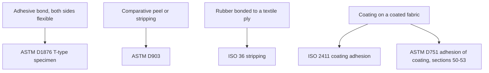
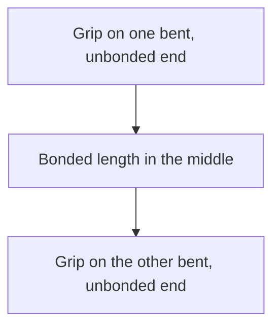
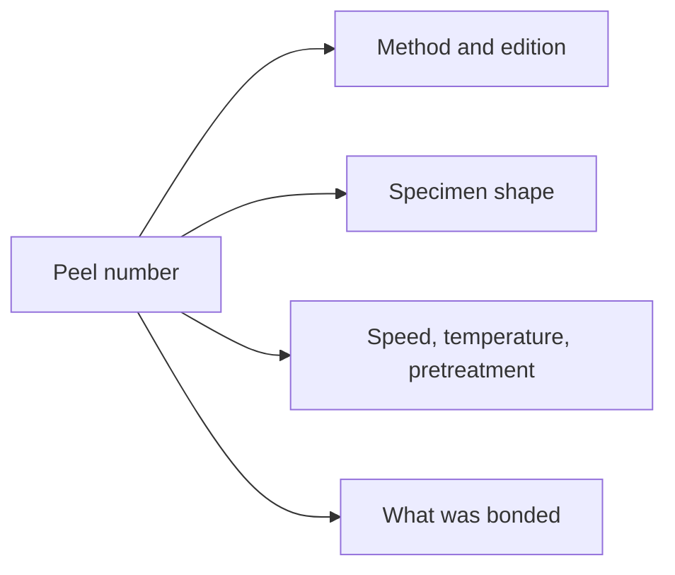

# Adhesion and Peel Test Methods

Human page: /literature-reviews/adhesion-peel-test-methods

## Executive summary

A peel number is the force recorded while a specimen is separated in a named test. ASTM D1876: T-type peel, flexible adherends.[^1] ASTM D903: comparative peel or stripping under defined pretreatment, temperature, and machine speed.[^2] ISO 36: stripping of a rubber–textile ply; coated fabrics are outside it.[^3] ISO 2411: coating adhesion on a coated fabric.[^4] ASTM D751-26: adhesion of coating to fabric is §§50–53 inside a coated-fabrics method book.[^5]

Record edition, specimen shape, and the conditions that method names. A handbook peel figure belongs to the construction in that figure.[^6][^7][^8]

## Which method name matches the specimen?

- D1876 §1.1: relative peel resistance, flexible adherends, T-type specimen. Abstract: bent unbonded ends in the grips; constant head speed; load vs head movement or distance peeled; value after the initial peak over a specified bond length. SI units are the standard. Opened text has no peel angle and no numeric speed.[^1]
- D903 §1.1: comparative peel or stripping, standard-sized specimens, defined pretreatment, temperature, and machine speed. Abstract also names constant rate-of-jaw separation, or an inclination balance, or a pendulum type, plus a conditioning room or desiccator. No peel angle in the opened text. SI units are the standard.[^2]
- ISO 36:2020 abstract: stripping force, two fabric plies bonded with rubber, or a rubber layer and a fabric ply. Plane, or cylinder internal diameter greater than approximately 50 mm. Not sharp bends. Coated fabrics → ISO 2411. Textile conveyor belts → ISO 252 (ISO 252 not opened).[^3]
- ISO 2411:2024 title and introduction: coating to the adjacent layer; weak adhesion can show as delamination. Foreword: failure types moved to clause 9.5. Contents list two preparation methods and a wet preparation. Preparation steps and the 9.5 names were not in the preview.[^4]
- D751-26 §1.1: rubber-coated fabrics (tarpaulins, rainwear, and similar). §1.3 table: Adhesion Coating (to Fabrics) §§50–53. §3.1: methods exist so those products can be tested. §§50–53 not opened: no width, speed, or pass/fail from that method.[^5]

A “180° peel” label is the angle that report used. Vanderbilt uses it as a PSA property name and does not cite ASTM on the pages used here.[^7] *Polymer Latices* Vol 3 captions a duck result as 180° peel and sketches a T.[^6] Those handbook words are not D1876 or D903.

## What do you write next to the number?

D1876 and D903 frame the result as relative or comparative.[^1][^2] *Polymer Latices* Vol 3: an adhesion number has its meaning only with the method.[^6] Static vs dynamic, in that textile chapter, differs by rate of deformation. A static test without prior fatigue is a sorting test only and does not imply tyre performance.[^6]

### Deep dive: Choosing ISO 36 vs ISO 2411 vs ASTM D751 adhesion clauses

Ply stripping (ISO 36) and coating adhesion (ISO 2411, D751 §§50–53) are different constructions. ISO 36 states the exclusion. D751 §1.2 puts each method’s scope in its own section; §§50–53 were not opened.[^3][^4][^5]

### Deep dive: Why PSA / cord peel numbers are not fashion pass/fail

Vanderbilt PSA set: 90° quick stick, 180° peel, Polyken tack, 178° shear.[^7] Foral 85 / carboxylated SBR Latex A: 180° peel in oz/in.[^7] Piccolyte A85, 30–60% resin/rubber: NR latex and solvent essentially matched on quick stick, 180° peel, and Polyken tack; latex higher on 178° shear.[^7] Not a garment overlay grade.

H-test: cord pull-through from a rubber block; geometry is an H, not a peel.[^6]

1997 Fig. 22.1: 180° peel, two duck layers, polychloroprene latex; axis N cm⁻¹; curve starts just above 30 at zero tackifier; caption parts polychloroprene 100, zinc oxide 5, antioxidant 2, sodium alkyl sulphate 1, tackifier variable.[^6] 1966 Fig. XIV.1: duck-to-duck peel, polychloroprene with asphalt; axis lb per inch; 1-part line labeled stabiliser.[^8] Units differ. No conversion. 1966 does not override 1997. Neither cites ASTM or ISO.

## Where the specimen question lives

| Question | Slug or article |
| --- | --- |
| Bought sheet to bought sheet | `sheet-latex-latex-adhesion-testing` |
| Liquid-latex film to liquid-latex film | `liquid-latex-latex-adhesion-testing` |
| Bought sheet to another material | `sheet-latex-substrate-adhesion-testing` |
| Liquid-latex film to another material | `liquid-latex-substrate-adhesion-testing` |
| Which adhesive; air; overlay | Sheet or liquid adhesives and seam integrity |
| Cotton / nylon bond science | Sheet or liquid latex–textile bonding |
| Reading a peeled seam | Sheet or liquid delamination and seam failure |
| Contact with no peel number | Compatibility matrix |

## Sources

- ASTM D1876-08(2023). *Standard Test Method for Peel Resistance of Adhesives (T-Peel Test).* <https://store.astm.org/d1876-08r23.html>
- ASTM D903-98(2025). *Standard Test Method for Peel or Stripping Strength of Adhesive Bonds.* <https://store.astm.org/d0903-98r25.html>
- ISO 36:2020. *Rubber, vulcanized or thermoplastic — Determination of adhesion to textile fabrics.* <https://www.iso.org/standard/74942.html>
- ISO 252:2023. *Conveyor belts — Adhesion between constitutive elements — Test methods.* ISO 36:2020’s abstract names ISO 252 for textile conveyor belts. <https://www.iso.org/standard/84329.html>
- ISO 2411:2024. *Rubber- or plastics-coated fabrics — Determination of coating adhesion.* <https://www.iso.org/standard/86334.html>
- ASTM D751-26. *Standard Test Methods for Coated Fabrics.* <https://store.astm.org/d0751-26.html>
- *Polymer Latices: Science and Technology — Volume 3: Applications of Latices.* 2nd ed. D. C. Blackley. 1997. <https://books.google.com/books?id=Y2VPGj7YbykC>
- *The Vanderbilt Latex Handbook.* 3rd ed. Edited by Robert Francis Mausser. 1987. <https://lccn.loc.gov/92117844>
- *High Polymer Latices: Their Science and Technology.* 2 vols. D. C. Blackley. 1966. <https://lccn.loc.gov/66077950>

## Endnotes

[^1]: ASTM D1876-08(2023), store D1876-08R23. Scope §1.1 and public abstract. T-type, flexible adherends, constant head speed, value after the initial peak. No angle or numeric speed in the opened text.

[^2]: ASTM D903-98(2025), store D0903-98R25. Scope §1.1 and public abstract. Comparative peel or stripping; pretreatment, temperature, machine speed; jaw-separation, inclination, or pendulum machine. No angle in the opened text.

[^3]: ISO 36:2020 abstract, edition 7, confirmed 2025. Stripping of rubber–textile plies. Cylinder limit about 50 mm internal diameter. Coated fabrics excluded (ISO 2411). Conveyor belts named as ISO 252; ISO 252 not opened.

[^4]: ISO 2411:2024 preview (fifth edition, 2024-09). Title, introduction, foreword, contents. Failure-type names and preparation steps not in the extract. ISO HTML product page was bot-walled; catalog URL is the edition’s ISO landing page.

[^5]: ASTM D751-26 store page. §1.1, §1.2, §1.3 table (adhesion of coating §§50–53), §3.1. Adhesion clauses themselves not opened.

[^6]: *Polymer Latices* Vol 3 (1997). Page 498 static vs dynamic and the “method gives the number its meaning” sentence. Page 499 H-test. Page 483 Fig. 22.1 caption and figure axis (N cm⁻¹).

[^7]: Vanderbilt Latex Handbook (1987). Pages 231, 234, and 236. PSA property names; 180° peel in oz/in.; Piccolyte A85 latex vs solvent comparison. No ASTM id on those pages.

[^8]: *High Polymer Latices* (1966). Pages 749–750 and Fig. XIV.1. Duck-to-duck peel, lb per inch, stabiliser on the 1-part line. Tier 4. Not merged with the 1997 figure.
