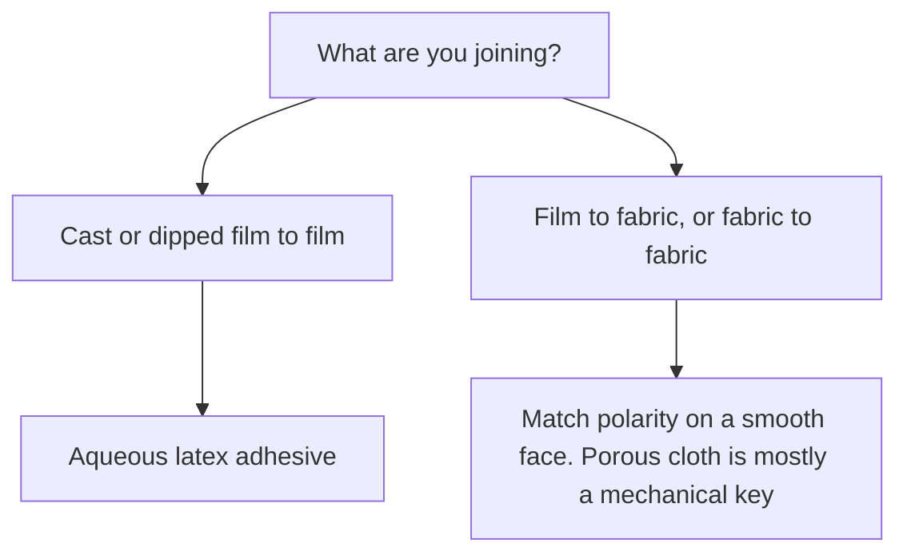
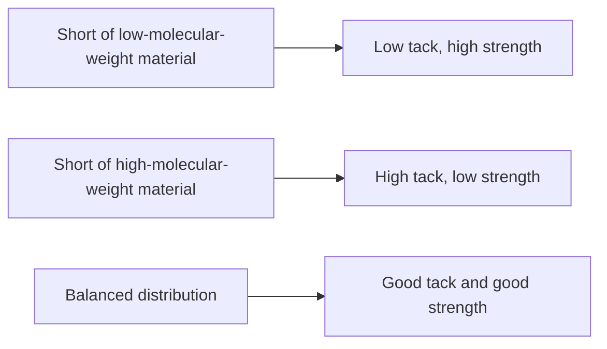
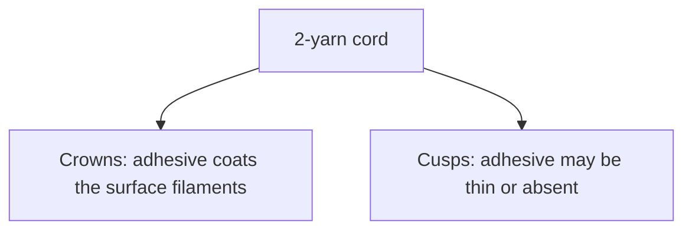
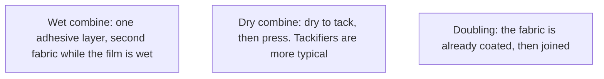
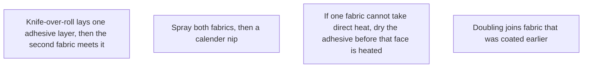

# Liquid Adhesives and Seam Integrity

Human page: /literature-reviews/liquid-adhesives-and-seam-integrity

> **Safety.** Water-based is not harmless. Latex adhesives can freeze, shrink fabrics, and still carry ammonia. Read the product SDS. See [Liquid ventilation and ammonia](/literature-reviews/liquid-ventilation-ammonia).

## Executive summary

Cast or dipped film, and fabric combining, use aqueous latex adhesive against solution adhesives: lower cost, no flammable or toxic solvents, wide solids and viscosity, high molecular weight, tunable wetting of porous substrates.[^2] Latex adhesives can wet faces already wet with water.[^3] Trade-offs: poorer water resistance, freezing, fabric shrink, contamination from some storage and application materials, metal corrosion, slow drying.[^1] Restricted interparticle coalescence may lower strength versus solution films.[^3]

## Questions this article answers

- [Which adhesive fits cast or dipped film?](#which-adhesive)
- [How do I match the adhesive to the face?](#polarity)
- [How do I keep pots, tools, and faces clean?](#contamination)
- [Wet combine or dry combine?](#wet-vs-dry)
- [How do I read a join that peeled?](#reading-a-failed-join)
- [What still needs care with a water-based adhesive?](#safety)

## Which adhesive fits cast or dipped film? {#which-adhesive}

### How

Film to film: aqueous latex adhesive. Prevulcanized latex is a recognized feedstock.[^8]

After you apply adhesive, air it until it is ready to overlay. Solvent systems call that wait flash off. Air off is the same wait. Aqueous latex adhesive is the slow-drying column, so open time is longer.[^1]

A lap is an overlap. Peel starts at the free edge. Static lap versus stretch lap is geometry.

### Why

Comparison pole is solution adhesive: cost, absence of flammable and toxic solvents, TSC and viscosity, high molecular weight, wetting of porous substrates.[^1][^2] Water-wet faces can be combined.[^3] Coalescence can be restricted by surfactants, which may lower adhesive and cohesive strength versus solution films.[^3]

### Detail

Detail: Solvent column versus latex column

Solvent column: water resistance, wide drying rates and open times, early bond strength or tack, wetting of difficult surfaces; explosion, fire, special ventilation, solvent fumes.[^1]

Latex column: lower cost, nonflammable solvents, wide viscosity, high-molecular-weight rubber, variable wetting; poorer water resistance, freezing, fabric shrink, paper wrinkle, contamination, metal corrosion, slow drying.[^1]

PSA tape, not garment film: NR latex retains a high-MW fraction insoluble in solvent. Piccolyte A85: similar tack and peel; aqueous 178° shear above 6,000 minutes versus solvent under 500 minutes.[^1]

Molecular-weight distribution versus tack and strength, pressure-sensitive context.[^1]

Historical dipping: latex needs more dips than cements of rubber with benzene or gasoline because viscosity is lower.[^4]

US Patent 3,755,232 lists adhesives among aqueous prevulcanising uses.[^8]

## How do I match the adhesive to the face? {#polarity}

### How

Smooth face: match polarity. Dipped NR film (low) matches NR or SBR latex adhesive. NR film to slick nylon: more polar latex (NBR, acrylic) or a resin bridge.[^1][^2]

Porous cloth: mechanical key if particles enter pores. Repulsion blocks entry. Extra filler raises viscosity and cuts flow.[^1][^3] See [Liquid latex–textile bonding](/literature-reviews/liquid-latex-textile-bonding).

### Why

Non-porous ladder: high NBR/XNBR/XSBR/PSBR, medium CR/PVC, low NR/SBR/BR/IIR.[^1] Porous: polymer nature less important (mechanical bond). Non-porous: matched polarity.[^2] Mixed polarity: blend or resin bridge.[^3]

### Detail

Detail: Charge, filler, and a textile pretreat

Charge repulsion blocks pore entry.[^1][^3] Thickeners limit aqueous-phase soak-away that weakens the bond and can stain.[^3]

Tire-cord pretreat: non-polar latex plus casein or resorcinol–formaldehyde. Resin holds the fiber; rubber holds the matrix.[^3] Ricobond 7004 is a T-peel example on treated polyester and polyester/nylon to NR/SBR.[^9] Lineage: US 2,128,635 and Solomon’s RFL review. Strategy, not a room-temperature garment mix.[^10]

On a 2-yarn rayon cord, adhesive coats the crowns and may be absent at the cusps.[^3]

Polyester: classic RFL often inadequate. Masked polyisocyanates in latex regenerate on heat, about 220°C in that tyre-cord discussion.[^3]

Cited RFL series: bond strength rises with RF resin level, about 15 newtons per end at 0 parts per hundred rubber toward about 80–91 newtons per end at higher loadings.[^3] That rise is not the tackifier-peel table below.

## How do I keep pots, tools, and faces clean? {#contamination}

### How

Stop and re-prep if the pot, brush, or bond face is fouled. Classes: metal working pails; tools last used with silicone mold-release, silicone dressing, or furniture polish; tubs with oil, wax, or another adhesive in the rim; formers filmed with silicone mold-release. Same class on the face: silicone mold-release, silicone dressing, silicone furniture polish, leftover print adhesive.

### Why

Latex adhesives can be contaminated by some storage and application materials, and they are corrosive to some metals.[^1] A release film blocks wetting. Failure at the face is adhesive failure in peel language.[^2]

## Wet combine or dry combine? {#wet-vs-dry}

### How

Wet combining: apply a thick latex adhesive, press the second face on while the film is wet, then dry. Dry combining: dry each face to tack, then press. Tackifiers are more typical in dry combining.[^1][^3]

Textile combining is continuous coat-and-bond. Textile doubling bonds fabric coated earlier.[^3]

If one fabric cannot take direct heat, dry the adhesive on the stable face first.[^3]

### Why

Wet: high-viscosity compound, laminate, dry on heated cans. Dry: tackified coat, dry, combine through doubling rolls.[^1] Tackifiers are more useful in dry combining.[^3]

### Detail

Detail: Plant layouts and one handbook mix

Caption names: knife-over-roll wet combine, spray before a calender nip, heat-sensitive fabric, textile doubling. The heat-sensitive sequence and the already-coated doubling step are the preceding body text.[^3]

SBR vulcanizing wet-combine example, not a home mix. Dry / wet: 40% SBR 2000 Latex 100/250; 20% rosin acid soap 2/10; 60% zinc oxide 5/8.33; 68% sulfur 2/2.94; 65% VANOX 102 1.5/2.3; SETSIT 51 — / 2.[^1] Thickeners and tackifiers may be added.[^1]

Table 19.2: A is vulcanizable NR wet combining (15 minutes at 100°C for A only). B is non-vulcanizable SBR for both combining and doubling. C is non-vulcanizable CR wet combining; doubling needs an added tackifier. Deposit classes on the process note (non-vulcanizable, vulcanizable, or prevulcanized latex) are not a prevulcanized column.[^3]

Fugitive plasticisers named: benzene, toluene, carbon tetrachloride.[^3] Mineral fillers reduce tack and bond strength above small additions.[^3] Antioxidant: at least 1 part per 100 dry rubber and 1 part per 100 resin.[^1] Sulfur-donor (SULFADS) is the PSA ageing note in the safety section.[^1]

## How do I read a join that peeled? {#reading-a-failed-join}

### How

Adhesive failure: clean face, adhesive on the other piece. Cohesive failure: adhesive split, residue on both. Ply split of a multi-dip stack is [Liquid reinforcement](/literature-reviews/liquid-reinforcement-laminate-zones), not more adhesive. Fabric fuzz: bond beat the cloth. Film torn beside the join: rubber failed first. A notch is a sharp inner corner. More adhesive does not remove it. Atlas sibling: [Liquid delamination](/literature-reviews/liquid-delamination-seam-failure).

### Why

Peel devices judge fracture of bonded structures. Method class, not a garment grade.[^2] Mode can flip with rate: cohesive at low rate, adhesive at high rate, in one system.[^6] Resin level does not move peel the same way in every adhesive.[^1][^3][^5]

### Detail

Detail: Four resin-versus-peel reports

Polychloroprene latex, two layers of duck (Ward and Doherty): tack tends to rise until resin is about 60–70% by mass, then fall. Bond strength in that discussion usually falls as the resin ratio rises. 180° peel at 0 parts per hundred rubber is 31 for asphalt and both rosin esters; at 50 parts the peels are 16, 24, and 28; asphalt continues down toward about 9–10.[^3]

Foral 85 / carboxylated SBR Latex A: 180° peel (oz/in) at 30–70% resin is 8, 2, 10, 85, 32. Peak at 60%.[^1]

Phenolic resin on nylon: optimum near 3 phr in that paper.[^5]

RFL series: bond strength rises with RF level, about 15 newtons per end at 0 parts per hundred rubber toward about 80–91 newtons per end.[^3]

ASTM D1876 is flexible-to-flexible T-peel. ASTM D903 is peel or stripping strength. Method classes.[^11][^12]

## What still needs care with a water-based adhesive? {#safety}

### How

Do not freeze the jug. Do not store the adhesive in a metal pot the handbook flags for corrosion. Ventilate if the odor is ammonia. Read the product SDS. Skin: [Allergy and skin contact](/literature-reviews/allergy-and-skin-contact).

### Why

Latex column: nonflammable, and also freeze, fabric shrink, contamination, metal corrosion.[^1] Ammonia CAS 7664-41-7: PEL 50 ppm, REL 25 ppm, IDLH 300 ppm. Substance limits, not proof a given bottle contains ammonia.[^7]

### Detail

Detail: Crosslinking and tack in water-based PSA

Crosslinking improves temperature, ageing, water, and solvent resistance of the bond.[^2][^3] In water-based PSA, a sulfur-donor ages better than colloidal free sulfur, and vulcanizing the adhesive reduces tack.[^1]

## Endnotes

[^1]: *The Vanderbilt Latex Handbook*. 3rd ed. Edited by Robert Francis Mausser. Norwalk, CT: R.T. Vanderbilt Company, 1987. Solvent versus latex column; polarity ladder; wet and dry combining; SBR wet-combine example; PSA shear, molecular-weight distribution, Foral 85 peel; antioxidant loading; sulfur-donor tack; prevulcanized feedstock context; contamination and metal corrosion.
[^2]: *Practical Guide to Latex Technology*. Rani Joseph. Shawbury: Smithers Rapra Technology, 2013. Latex versus solution adhesives; porous versus non-porous polarity; modifiers and crosslinking; peel as a fracture method class.
[^3]: *Polymer Latices: Science and Technology — Volume 3: Applications of Latices*. 2nd ed. D. C. Blackley. Chapman & Hall / Springer, 1997. Combining versus doubling; wet versus dry; water-wet substrates; restricted coalescence; Table 19.2; plant layouts; tackifier peel on polychloroprene-bonded duck; RFL and casein; cord crowns versus cusps; polyester and blocked isocyanate; RFL resin-level bond strength; fugitive plasticisers; fillers; thickeners.
[^4]: *Letter Circular LC 321: Rubber Latex*. National Bureau of Standards, 1932. Dipping latex versus rubber cements in benzene or gasoline: lower viscosity, more dips.
[^5]: IOP Conference Series: Materials Science and Engineering 526 (2019) 012001. Phenolic resin level and peel of natural-rubber latex adhesive on nylon. Optimum near 3 phr in that system.
[^6]: Poh and Chee, *International Journal of Polymer Science* (2013). Peel mode versus rate in one studied system.
[^7]: OSHA chemical data, ammonia, CAS 7664-41-7. PEL 50 ppm, REL 25 ppm, IDLH 300 ppm.
[^8]: US Patent 3,755,232. Aqueous prevulcanising process. Adhesives among listed uses.
[^9]: Cray Valley. Ricobond 7004 for Textile Treatment. T-peel of treated polyester and polyester/nylon to NR/SBR.
[^10]: US Patent 2,128,635. RFL-class textile pretreat. Solomon, *Rubber Chemistry and Technology* (1985), RFL review.
[^11]: ASTM D1876. T-peel, flexible-to-flexible. Method class.
[^12]: ASTM D903. Peel or stripping strength. Method class.
