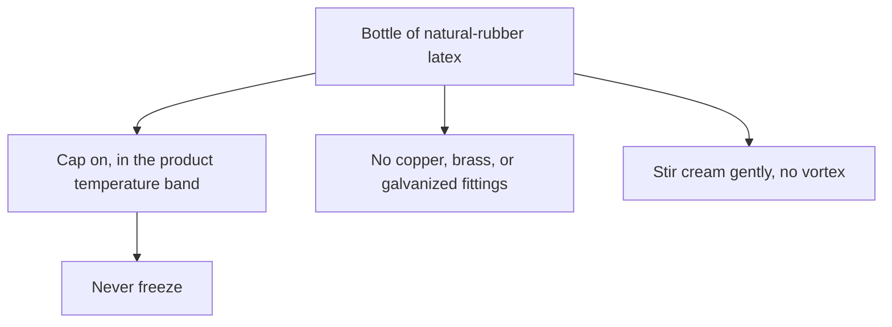
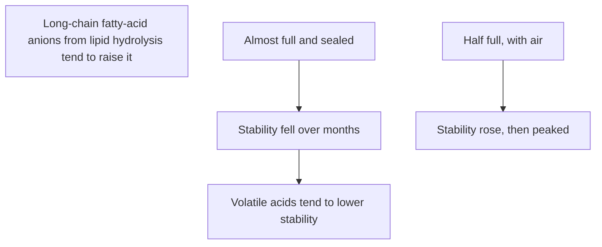
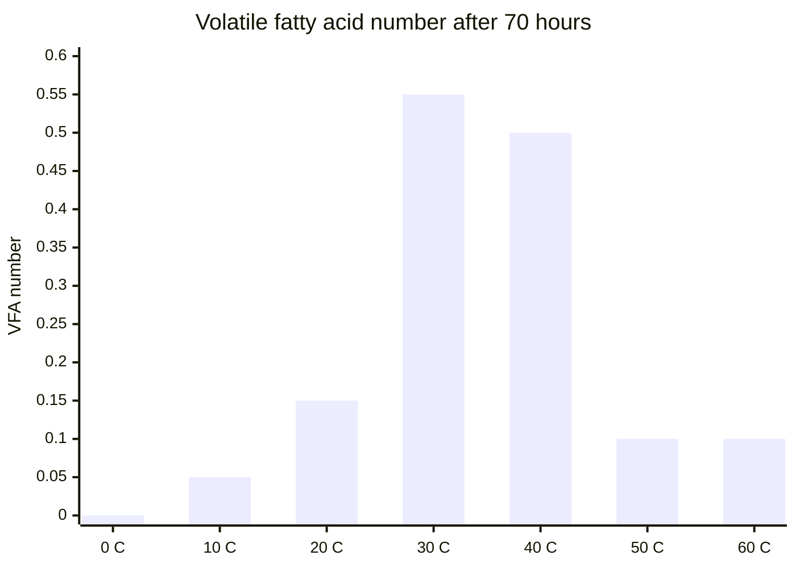
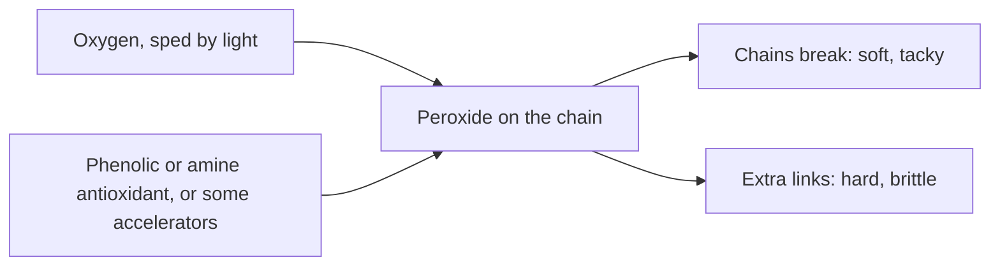

# Liquid Latex Aging, Storage and Care

Human page: /literature-reviews/liquid-aging-storage-and-care

> **Safety.** Concentrate vents ammonia. Open bottles in a ventilated space.[^3] See [Liquid latex ventilation and ammonia](/literature-reviews/liquid-ventilation-ammonia). Freeze wrecks ordinary natural-rubber latex.[^5][^6] Petroleum attacks dried film.[^10][^11] Skin reactions: [Allergy and skin contact](/literature-reviews/allergy-and-skin-contact).

## Executive summary

A bottle of natural-rubber latex and the film cast or dipped from it age differently. Fresh latex without a preservative becomes coagulum in hours.[^3] Preserved concentrate wants a closed cap, a cool band, and fittings that are not copper, brass, or galvanized.[^1][^5] After film exists, leftover coagulant salt and a settled compound change discoloration and aging.[^1]

Labels: [Decoding consumer latex bottle labels](/literature-reviews/liquid-decoding-bottle-labels).

## Questions this article answers

- [How do I store a bottle?](#how-do-i-store-a-bottle)
- [Why does untreated latex spoil?](#why-does-untreated-latex-spoil)
- [What changes after I have film?](#what-changes-after-i-have-film)
- [What should stay off the film?](#what-should-stay-off-the-film)

## How do I store a bottle? {#how-do-i-store-a-bottle}

### How

Keep the cap on. Use the product’s temperature band. Never freeze. One prevulcanized natural-rubber latex sheet: +5 to +35 °C, frost-sensitive, closed, stir cream.[^5] Remix cream gently. No vortex. Do not beat air in.[^1]

No copper, brass, or galvanized fittings. Black iron and stainless are the plant metals named for bulk latex.[^1]

### Why

Fresh plantation latex is not storage-ready until preserved and concentrated.[^3] Brass or copper fittings: serious deterioration of the rubber in the latex. Galvanized fittings: coagulum. Protect bulk latex from hot and cold extremes.[^1]

Copper in the latex speeds oxidative damage. Container copper can leave dark spots on dipped goods. A concentrate table caps copper at 8 ppm of total solids.[^8][^3]

Freeze–thaw destabilizes natural-rubber latex without a special stabilizer.[^6][^7]

*High Polymer Latices* (1966): almost-full sealed storage, mechanical stability falls over months; half-full aerobic storage, stability rises then peaks. Volatile fatty acids lower stability; fatty-acid anions from lipid hydrolysis raise it.[^4] The example product sheet still says keep closed.[^5] Keep the cap on. Neither report cancels the other.

### Detail

Detail: Ammonia bands, tank stirring, and headspace

Ammonia: first and still most popular preservative; effective above 0.35% by weight of latex; long storage often 0.6% to 1.0%. Low-ammonia example: 0.2% ammonia, 0.0125% each TMTD and zinc oxide, 0.05% lauric acid. HA / MA / LA alkalinity as NH₃: min 0.6% / 0.3–0.6% / max 0.3%.[^3]

ISO 2004:2024 specifies centrifuged or creamed, ammonia-preserved concentrate.[^12] ASTM D1076-23 lists alkalinity, mechanical stability, volatile fatty acids, coagulum, sludge, copper, and manganese.[^13]

1932 trade latex: about 3% by weight of concentrated aqueous ammonia, specific gravity 0.882. Different basis from modern 0.6–1.0% NH₃ on latex.[^9]

Plant tanks: about half an hour every three weeks, no vortex, when latex sits for months. Sterilize tanks about twice a year.[^1]

Prevulcanized latex: centrifuge to remove excess sulfur and zinc oxide; antioxidants generally added after.[^1] [Prevulcanized consumer latex](/literature-reviews/liquid-prevulcanized-consumer-latex).

Bulk ammonia-preserved latex only.[^4]

## Why does untreated latex spoil? {#why-does-untreated-latex-spoil}

### How

Do not hold fresh, unpreserved latex overnight. Use preserved concentrate, keep it cool, and keep the supplier’s ammonia system. In the 1966 temperature comparison, those acids were highest near 30–40 °C.[^4]

### Why

Fresh latex coagulates within a few hours; overnight storage can become a solid mass.[^3] Bacteria on serum carbohydrates form formic, acetic, and propionic acids. Ammonia and other bactericidal preservatives retard that formation. Field latex’s volatile-fatty-acid number rose quickly; ammonia-preserved concentrate stayed low for weeks. The temperature table is much higher near 30–40 °C than near 0 °C.[^4]

That temperature comparison is low again at 50 °C and 60 °C. That dip is not a reason to heat a bottle. Keep the latex cool, closed, and preserved.[^3][^5]

### Detail

Detail: Volatile fatty acids and temperature

Printed in *High Polymer Latices* (1966). The book credits earlier laboratory results for the numbers.[^4]

| Days | Field latex | Ammonia-preserved concentrate |
| ---: | ---: | ---: |
| 0 | 0.05 | 0.05 |
| 10 | 0.65 | 0.05 |
| 20 | 0.70 | 0.05 |
| 30 | 0.70 | 0.10 |
| 40 | 0.70 | 0.15 |

| Temperature | VFA number after 44 h | VFA number after 70 h |
| ---: | ---: | ---: |
| 0 °C | 0.00 | 0.00 |
| 10 °C | 0.05 | 0.05 |
| 20 °C | 0.10 | 0.15 |
| 30 °C | 0.35 | 0.55 |
| 40 °C | 0.35 | 0.50 |
| 50 °C | 0.05 | 0.10 |
| 60 °C | 0.05 | 0.10 |

The linear chart grid in the scan is not used as measured data. ISO 2004, ASTM D1076, and the Practical Guide still set the grades you buy.[^12][^13][^3] Volatile-fatty-acid content of ammonia-preserved latex is described as a measure of microbial activity since the latex left the tree.[^4]

## What changes after I have film? {#what-changes-after-i-have-film}

### How

Rinse coagulant-dipped wet film in warm water. Remix a settled compound before you cast or dip. Do not beat air in.[^1] Keep finished film cool and out of strong sun. Thin dipped pieces have high surface for their thickness.[^2]

Coagulant process: [Coagulant dipping for wearable thickness](/literature-reviews/liquid-coagulant-dipping-wearable-thickness).

### Why

Leftover coagulant salt, calcium nitrate as the example, increases discoloration after warm air, gas fumes, or ultraviolet light, and depresses film properties.[^1] Settled compound yields uneven degradation resistance. Coarse antidegradant dispersions protect less uniformly.[^1]

Natural-rubber films from latex have superior ageing resistance versus films from rubber solutions. Thin-walled dipped goods: high surface-area-to-volume, so oxidative ageing is especially important.[^2] The 1966 dipping chapter says solvent dips of masticated rubber in naphtha do not age well, and that latex dips retained properties better during ageing.[^4] The 1997 volume is the later statement. The 1966 sentence is the older wording.

### Detail

Detail: Antioxidants and two warm-air aging directions

phr = parts per hundred rubber. Handbook examples, not a home mix. [Antidegradants in DIY compounds](/literature-reviews/liquid-antidegradants-diy-compounds).

Most latex products: 1–2.0 phr total antioxidant. Copper protection of NR or CR: 2 phr total (1 phr oxidation + 1 phr metal).[^1] Efficient antioxidant typically 0.5–2 parts per hundred rubber, especially thin-walled products.[^2]

Accelerators and phenolic or amine antioxidants retard degradation by eliminating peroxide.[^1]

Phenolics as a group: less discoloring, staining, and effective than amines.[^1] Amines stronger against oxygen, heat, light, and metal catalysis, and they discolor. Phenolics are the usual choice for light goods.[^3][^2]

Two days at 100 °C: free colloidal sulfur film, elongation up, tensile and stress-at-strain down; sulfur-donor film, the reverse.[^1]

1932: rubber from latex aged better than milled crude, with more natural antioxidants from the serum.[^9] Latex vulcanisates age better than masticated, hot-processed dry rubber.[^3]

## What should stay off the film? {#what-should-stay-off-the-film}

### How

Keep petroleum, mineral oil, petrolatum, and oil lotions off dried film.[^10][^11]

### Why

NIOSH 97-135: do not use oil-based hand creams or lotions with latex gloves unless shown to maintain barrier protection.[^10] OSHA, 24 August 1993: significant deterioration of latex gloves with petroleum-based lubricants.[^11] ASTM D471: oils, greases, and fuels on vulcanized rubber.[^14]

### Detail

Detail: Plant mildewcides

Industrial mildewcide dispersions can protect natural-rubber films, including after warm-air cure.[^1] That result is not skin clearance.

## Endnotes

[^1]: *The Vanderbilt Latex Handbook*, 3rd ed., ed. Robert Francis Mausser, 1987 — Ch 15 metals, agitation, hot and cold, tank sterilization; prevulcanized storage; coagulant-salt discoloration; settled compound; peroxide elimination; phenolic versus amine antioxidants; antioxidant phr; sulfur versus sulfur-donor warm-air directions; industrial mildew on NR film (not wearable clearance). <https://lccn.loc.gov/92117844>
[^2]: *Polymer Latices: Science and Technology — Volume 3: Applications of Latices*, 2nd ed., D. C. Blackley, 1997 — latex films versus solution films; thin-wall surface-to-volume; antioxidant 0.5–2 parts per hundred rubber; amine versus phenolic discoloration. <https://books.google.com/books?id=Y2VPGj7YbykC>
[^3]: *Practical Guide to Latex Technology*, Rani Joseph, 2013 — fresh latex coagulation; ammonia as preservative; HA/LA bands; copper cap of total solids; latex vulcanisates versus dry rubber; amine versus phenolic antioxidants. <https://books.google.com/books/about/Practical_Guide_to_Latex_Technology.html?id=NB5AMwEACAAJ>
[^4]: *High Polymer Latices: Their Science and Technology*, 2 vols., D. C. Blackley, 1966 — volatile fatty acids, temperature table after Lowe 1959, full versus half-full mechanical stability, historical solvent-dip ageing sentence. Where this 1966 account and a later handbook or current specification differ, the later source governs modern practice. <https://lccn.loc.gov/66077950>
[^5]: Revultex prevulcanized natural-rubber latex technical data sheet — closed store +5 to +35 °C; frost-sensitive; stir cream. <https://shop.keramik.at/config/produktdokumente/Technisches_Datenblatt_Latex_Revultex.pdf>
[^6]: Hamzah et al., *Polymers* 15(3):698 (2023) — freeze–thaw destabilization of natural-rubber latex without a special stabilizer. <https://doi.org/10.3390/polym15030698>
[^8]: Sudsai et al., *ScienceAsia* 43 (2017) — copper catalysis; dark spots on dipped goods from container copper. <https://doi.org/10.2306/scienceasia1513-1874.2017.43.369>
[^9]: *Letter Circular LC 321: Rubber Latex*, National Bureau of Standards, 25 February 1932 — coagulation after tapping; about 3% concentrated aqueous ammonia on a liquor basis; latex-derived rubber versus milled crude. <https://nvlpubs.nist.gov/nistpubs/Legacy/LC/nbslettercircular321.pdf>
[^10]: NIOSH Publication No. 97-135 (1997) — oil-based hand creams or lotions with latex gloves unless shown to maintain barrier protection. <https://stacks.cdc.gov/view/cdc/21446>
[^11]: OSHA standard interpretation, 24 August 1993 — petroleum-based lubricants and latex-glove deterioration. <https://www.osha.gov/laws-regs/standardinterpretations/1993-08-24>
[^12]: ISO 2004:2024 — ammonia-preserved centrifuged or creamed natural-rubber latex concentrate. <https://www.iso.org/standard/86502.html>
[^13]: ASTM D1076-23 — concentrated, ammonia-stabilized natural latex; alkalinity, mechanical stability, volatile fatty acids, coagulum, sludge, copper, manganese. <https://store.astm.org/d1076-23r26.html>
[^14]: ASTM D471 — effect of liquids on vulcanized rubber (method class). <https://store.astm.org/d0471-16ar21.html>
