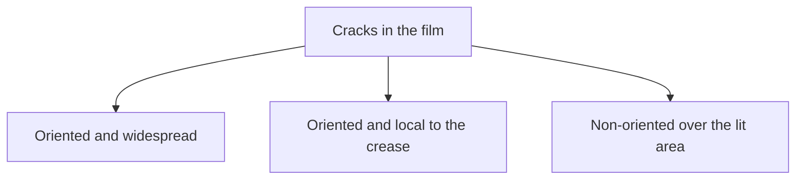
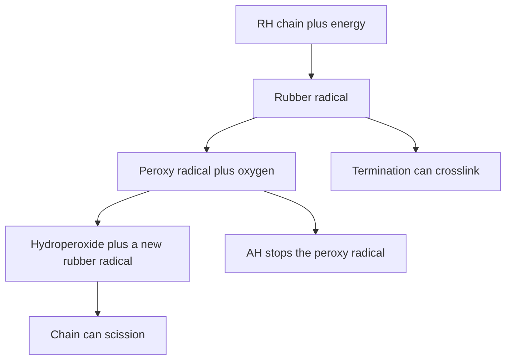
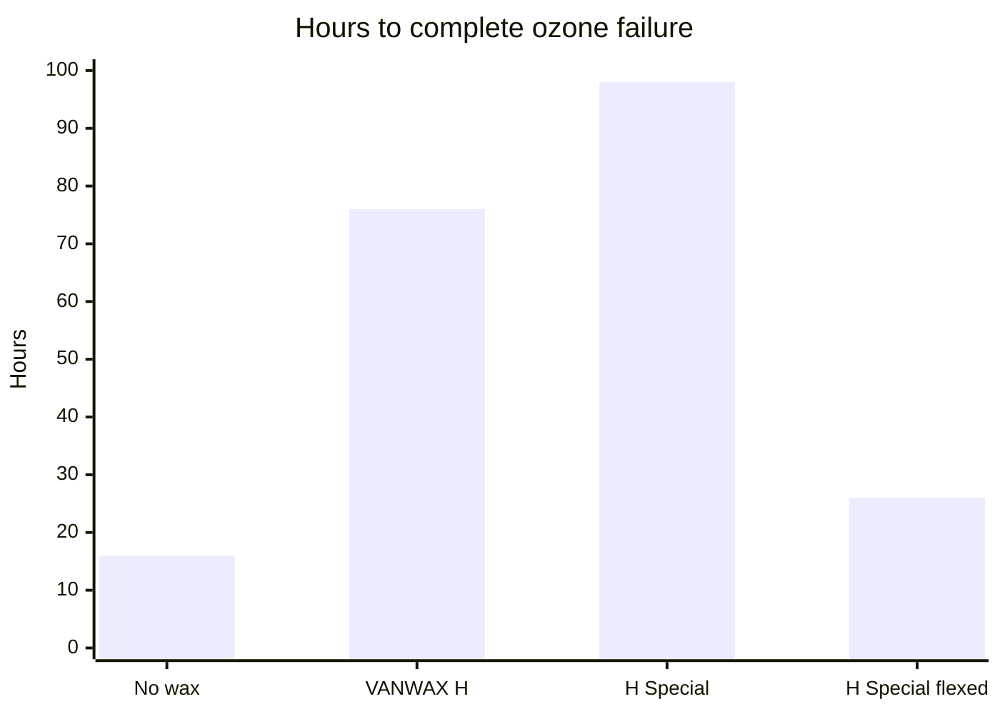

# Antidegradants in DIY Compounds

Human page: /literature-reviews/liquid-antidegradants-diy-compounds

> Certain antioxidants in skin contact may be associated with contact dermatitis. There is a long-standing concern that some antioxidants, or impurities in them, may be carcinogenic.[^1] Compounding literacy only. Skin: [Allergy and Skin Contact](/literature-reviews/allergy-and-skin-contact).

> phr figures are handbook ranges. Extra antioxidant can stain, bloom, or go unused.

## Executive summary

Liquid pathway: compound liquid latex, then dip, cast, or spread a film. Degradation can only be retarded.[^2] Thin goods: typically **0.5–2 phr** antioxidant after counting indigenous and incidental protection.[^3] Many industrial cards: **1–2 phr** total.[^4] Amines protect more and discolor; phenolics stain less and protect less.[^5] [^6]

Storage: [Aging, Storage, and Care](/literature-reviews/liquid-aging-storage-and-care). Pigment metals: [Pigment and Filler Compounding](/literature-reviews/liquid-pigment-filler-decks#metal-impurities).

## Can you stop the film from aging?

Drivers include heat, humidity, ultraviolet light, high-energy radiation, ozone, oxygen, chemicals (acids, bases, oils, solvents, oxidizers, heavy metals), and stress.[^2] Three modes together: chain scission (soft/tack), crosslinking (harden), chemical alteration.[^2]

| Driver | Crack pattern |
| --- | --- |
| Ozone | Oriented, widespread, perpendicular to stress |
| Flex | Oriented, local to the high-strain zone |
| Ultraviolet | Non-oriented over the exposed area |

Ozone about **1–8 pphm**, much more reactive than ~20% oxygen.[^7]

Detail: How oxidation feeds itself

Initiation: RH plus energy → rubber radical. Propagation: radical plus oxygen → peroxy radical; peroxy radical plus RH → hydroperoxide plus a new rubber radical; hydroperoxide breakdown can scission the chain. Termination: radical coupling can crosslink; two peroxy radicals can give stable products. AH interrupts peroxide: ROO• + AH → ROOH + A•, then A• + ROO• → ROOA.[^8]

## How much antioxidant do you add?

**phr** = parts per hundred dry rubber.

Add an efficient antioxidant to most compounds. Thin-walled goods: typically **0.5–2 phr**.[^3] Most latex products in the Vanderbilt chapter: **1–2.0 phr** total.[^4] Bands overlap. Count indigenous natural-rubber antioxidants and incidental activity from zinc dialkyldithiocarbamates (especially zinc diethyldithiocarbamate) and zinc 2-mercaptoimidazolate.[^3]

Agitate stored compound. Settled ingredients give articles that vary in degradation resistance. Fine particle size disperses antidegradant more evenly; a coarse dispersion protects less evenly.[^9] Copper or other metal attack on NR or CR film: **2 phr** total (1 phr oxidation reserve + 1 phr metal reserve; AGERITE WHITE or VANOX 2246 at 2 phr alone, or 1 phr of either in a blend).[^4]

Coagulant dip: leach. Residual salts such as calcium nitrate increase discoloration under warm air, fumes, or ultraviolet light.[^9]

Detail: Free sulfur and a sulfur donor age in opposite directions

Base Compound 1: both sides ZnO 3, BUTYL ZIMATE 1, VANOX GT 1; cure 20 min at 93°C. A = 1 phr sulfur. B = 1 phr SULFADS, no free sulfur. After 2 days at 100°C, A gains elongation and loses tensile and stress; B loses elongation and gains tensile and stress.[^10]

In the handbook drawing, the left panel is compound A (free sulfur) and the right panel is compound B (sulfur donor).

Detail: Antioxidant that stays tied to the network

Network-bound moieties resist extraction, volatilization, and migration into contacting materials. Loss of surface migration is a drawback when surface protection is the point. The chapter says covalent bonding should not itself reduce activity, and that experiments agree, while also noting a bound antioxidant might protect less than small free molecules.[^11] Cain and Saville example as cited: **1 phr** N,N-diethyl-p-nitrosoaniline as a 50% dispersion, then 1 phr sulphur and zinc compounds. Scanned sentence stops at “zinc.”[^11]

## Amine or phenolic?

Phenolic: less discoloration and stain, less protection. Amine: more protection against oxygen, heat, light, and multivalent-metal catalysis; discoloration, described as reddish brown on light goods.[^5] [^6]

Detail: Structures, and why a phenolic can move the pH

Phenyl-2-naphthylamine: effective, discolors, hard to disperse. N,N'-di-2-naphthyl-p-phenylenediamine: strong all-round latex antioxidant, including against metal catalysis.[^6]

2,2'-methylene-bis(4-methyl-6-tert-butylphenol): non-staining; about **2 phr** for polychloroprene. Related: ethyl analogue, 4,4'-butylidene-bis(6-tert-butyl-m-cresol), hydroquinone monobenzyl ether (slight light discoloration).[^12]

Free phenolic OH is acidic: phenolate in alkaline latex, slight pH drop, higher particle charge.[^12]

## Wax or a PPD when ozone is the problem?

Microcrystalline wax **0.5–1.0 phr**: static barrier after continuous bloom; flex or stretch cracks it; fresh film fails chamber tests.[^13] One series, after 3 weeks at 23°C / 50% RH in kraft bags: hours to complete failure **16 / 76 / 98 / 26** (no wax / VANWAX H / H Special / H Special flexed).[^14]

Dialkyl PPDs (ANTOZITE 1 and 2): often **3 phr**; below **2 phr** protection is poor; dark brick-red stain; very dark or black goods.[^13]

Light-colored ozone options: AGERITE DPPD, RESIN D, and MA at **3–5 phr** (RESIN D and MA light enough for light goods; also strong NR heat aging); laboratory blend **3 phr THIATE U + 0.25 phr BUTYL ZIMATE**.[^14]

Ultraviolet: absorbers plus ZnO or TiO₂ need a large bulk loading; UV-absorber packaging film can cost less.[^13]

## What does a hot shelf do?

Warm-month warehouse floor-to-ceiling about **35–60°C**. Rate doubles per **8.3°C**. Ceiling stock can age about **8×** floor stock in that example.[^9] Avoid sharp folds. Ultraviolet through plastic or cellophane discolors the exposed face. Clay-board boxes are not airtight.[^9]

## Endnotes

[^1]: Polymer Latices Vol 3 — contact dermatitis and carcinogenic concern for some antioxidants or impurities.
[^2]: Vanderbilt Latex Handbook — cannot prevent, only retard; driver list; three oxidative modes.
[^3]: Polymer Latices Vol 3 — indigenous NR antioxidants; incidental ZDEC and zinc 2-mercaptoimidazolate; typically 0.5–2 phr, especially thin-walled goods.
[^4]: Vanderbilt Latex Handbook — most latex products 1–2.0 phr total antioxidant; copper protection 2 phr total.
[^5]: Vanderbilt Latex Handbook — phenolics less discoloring, staining, and effective than amines.
[^6]: Polymer Latices Vol 3 — amines more effective and discoloring; phenolics less so; named amine examples.
[^7]: Vanderbilt Latex Handbook — ozone about 1–8 pphm versus about 20% oxygen; crack morphology.
[^8]: Vanderbilt Latex Handbook — autocatalytic oxidation steps; peroxide interruption by AH.
[^9]: Vanderbilt Latex Handbook — settled compound and coarse dispersions; leach salts; warehouse heat stacking; packaging folds and ultraviolet through film.
[^10]: Vanderbilt Latex Handbook — Base Compound 1 sulfur versus SULFADS aging; Figure 2 idealized curves.
[^11]: Polymer Latices Vol 3 — network-bound antioxidants; Cain and Saville 1 phr nitrosoaniline example, formula cut off on the scan.
[^12]: Polymer Latices Vol 3 — phenolic examples including about 2 phr for polychloroprene; phenolic acidity and phenolate.
[^13]: Vanderbilt Latex Handbook — wax 0.5–1.0 phr static ozone; PPD level and brick-red stain; ultraviolet-absorber packaging.
[^14]: Vanderbilt Latex Handbook — ozone hours 16/76/98/26 after the bloom hold; light-colored AGERITE and THIATE U / BUTYL ZIMATE options.

Detail: Hours in that wax series, and light-colored options

The bar chart above is the Vanderbilt wax series after the kraft-bag bloom hold.[^14] Light-colored packages in the same chapter are the 3–5 phr resin antioxidants and the 3 phr THIATE U + 0.25 phr BUTYL ZIMATE laboratory blend.[^14]

Detail: Packaging that still lets aging through

Clay-board boxes are not airtight. Rolled goods in capped tubes avoid sharp edges. Clear plastic and cellophane still pass ultraviolet light to the exposed face.[^9]

