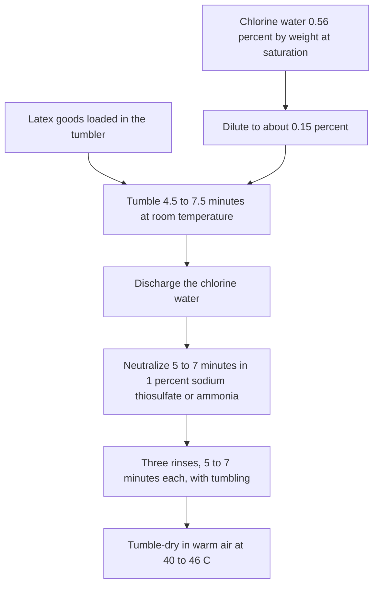

# Chlorination for Tack Control

Human page: /literature-reviews/liquid-chlorination-tack-control

> **Safety.** The bath turns acidic. Neutralize before the water rinses.[^2] No copper or brass in contact with chlorine water or the goods.[^1] Read the product and process SDS. This page is about tack. Protein and allergy classes are in [Allergy and Skin Contact](/literature-reviews/allergy-and-skin-contact).

## Executive summary

Cured dipped film is often tacky. Talc is temporary industrial dusting. Permanent de-tack on dipped goods is aqueous halogenation (chlorine water, sodium hypochlorite, or bromine water) in a tumbler, then neutralize, rinse, and dry warm.[^1] Commercial practice mostly uses aqueous chlorine.[^1]

Liquid pathway only, after the film is cured. Face-finish context: [Liquid Film Surface Finish](/literature-reviews/liquid-surface-finish-literacy).

## When to halogenate

Halogenation (chlorination or bromination) modifies the cured rubber surface so tack stays down.[^1] Talc only dusts the article.[^1]

Grip embossing on a glove former imparts texture. Wet rubber is slippery, so that texture alone does little for wet grasp. The handbook uses chlorine or bromine water for that wet-grip job.[^3]

## Solution choice

| Solution | Tack reduction | Discoloration |
| --- | --- | --- |
| Chlorine water | About the same as bromine water | Least of the three |
| Bromine water | About the same degree as chlorine water | More than chlorine |
| Sodium hypochlorite | Less efficient than chlorine or bromine | About the same as bromine |

[^1]

Bromine is a liquid. Sodium hypochlorite is sold as a solution. Both are less difficult to handle than chlorine gas. Commercial halogenation of finished latex articles still mostly uses aqueous chlorine.[^1]

The Vanderbilt laboratory used sodium hypochlorite purchased under the Chlorox brand and called that method the simplest for them to run.[^1]

## Sulfur vs time

Treatment is 4.5–7.5 minutes at room temperature in about 0.15% chlorine, diluted from saturated stock of 0.56% chlorine by weight.[^1] The range exists because time depends on sulfur in the cured goods. Goods at 1.5–1.75 parts sulfur per hundred rubber need less chlorine time than goods at 0.25–0.35 parts. A stronger chlorine concentration can shorten the time on low-sulfur goods.[^1]

## Process order

Liquor-ratio example: approximately 1.5 ml chlorine water per 2.5 cm² of latex surface. Usually that ratio covers the goods.[^2] Discharge the chlorine water when the treatment ends. Use fresh solution for the next batch.[^2]

Neutralize 5–7 minutes with 1% aqueous sodium thiosulfate or ammonia, then three water rinses with tumbling, then warm-air tumble dry at 40–46°C.[^2] Acidity develops during halogenation. Neutralize and rinse clear that acidity and extraneous chemicals.[^2]

Tanks for chlorine water: glass-lined or stainless steel. No copper or brass on equipment that stores the liquor or touches the goods.[^1]

## Skin contact

The surface change is for tack and drag.[^1] Neutralize and rinse because acidity develops and extraneous chemicals are cleared in that window.[^2] Protein and allergy classes: [Allergy and Skin Contact](/literature-reviews/allergy-and-skin-contact).

## Endnotes

[^1]: Vanderbilt Latex Handbook, 3rd ed., Mausser, 1987 — halogenation of dipped goods: chlorine water, sodium hypochlorite, bromine water; tack and discoloration comparison; commercial aqueous chlorine; Chlorox-brand hypochlorite in that laboratory; saturated stock 0.56% chlorine by weight diluted to about 0.15%; 4.5–7.5 min room-temperature tumble; sulfur 1.5–1.75 phr vs 0.25–0.35 phr; stronger chlorine to shorten low-sulfur treatment; glass-lined or stainless tanks; no copper or brass.
[^2]: Vanderbilt Latex Handbook, 3rd ed., Mausser, 1987 — halogenation of dipped goods: liquor ratio approximately 1.5 ml per 2.5 cm², usually enough to cover the surface; discharge chlorine water; fresh solution for the next batch; acidity; 1% sodium thiosulfate or ammonia for 5–7 min; three water rinses with tumbling; warm-air tumble dry at 40–46°C.
[^3]: Vanderbilt Latex Handbook, 3rd ed., Mausser, 1987 — glove grip: embossed design alone does little on wet rubber; halogenate with chlorine or bromine water.
