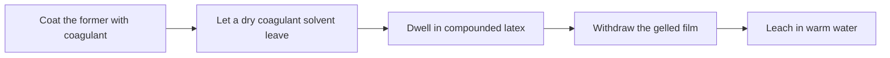
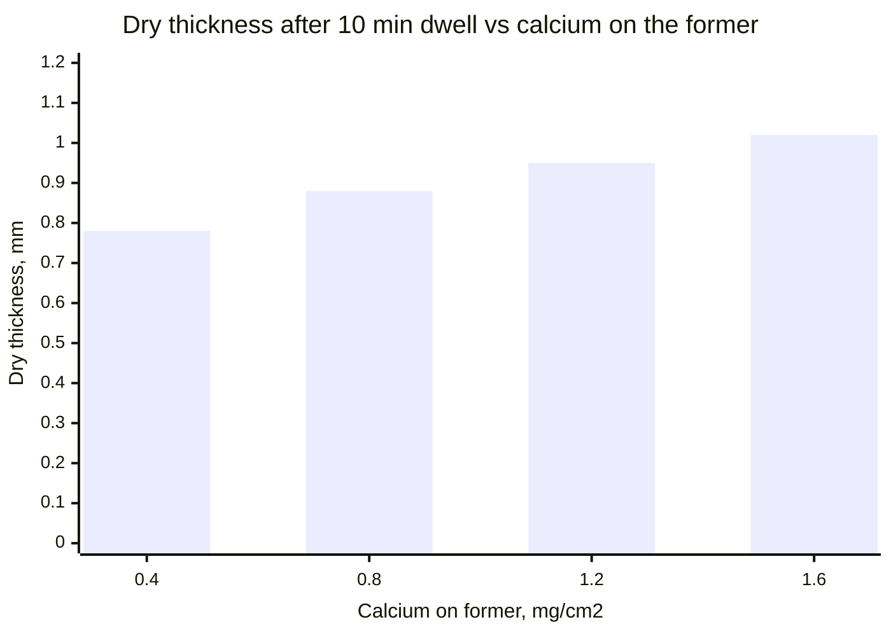
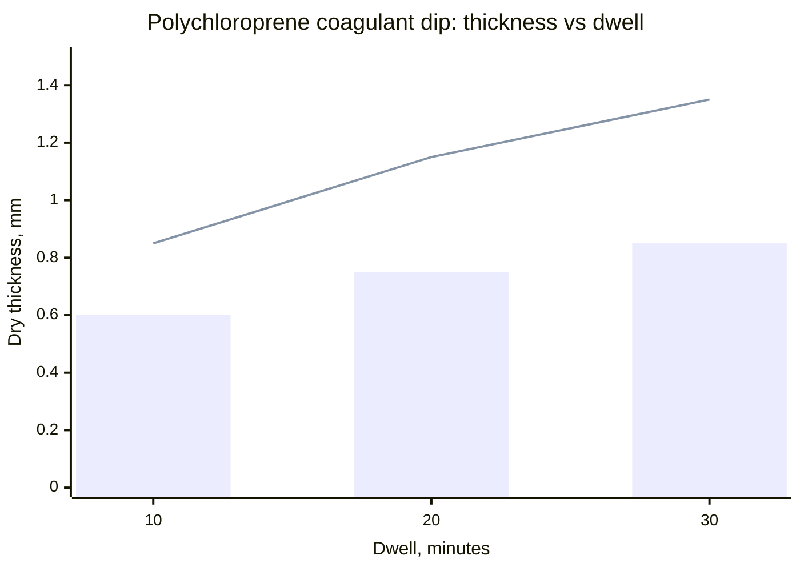

# Coagulant Dipping for Wearable Thickness

Human page: /literature-reviews/liquid-coagulant-dipping-wearable-thickness

> **Safety.** Acetic acid coagulants: add acid to water; goggles and gloves.[^1] Warm-water leach is required for coagulant dips. Water fittings to the leach tank: no copper or brass.[^1] See [Allergy and Skin Contact](/literature-reviews/allergy-and-skin-contact).

## Executive summary

Coagulant dipping: coat the former, dwell in compounded latex, withdraw a gelled film. Typical single-dip dry thickness **0.2–0.8 mm**.[^2] Straight-dip comparison about **0.012–0.044 mm**.[^2] Most dipped articles thicker than **8 mils** dry use coagulant because build is faster.[^1] Levers: coagulant on the former, dwell, viscosity, withdrawal speed; polychloroprene also pH **10.3–10.9**.[^2] Then warm leach and a humidity window of about **20–26 °C**, **45–50% RH**.[^1]

Use after [Former dip, mould cast, and flat spread](/literature-reviews/liquid-former-dip-vs-mould-cast-vs-flat-spread).

## When does a coagulant dip replace another straight dip?

Straight dip, three natural-rubber compounds: dried thickness about 0.012–0.044 mm as viscosity rose.[^2] Coagulant dip typical dry range 0.2–0.8 mm from one dip.[^2] Economics threshold: most dipped articles greater than 8 mils dry.[^1]

Heat-sensitized dipping has a different thickness–dwell curve on ammonia-preserved natural rubber. Bratby: successful baby-feeding teat production requires the latex bath not vary by more than ±1 °C.[^2]

Measured natural-rubber curves with more calcium on the former reach about 1.02 mm at 10 minutes.[^2] The 0.2–0.8 mm sentence is the typical band.

## What do you put on the former first?

Dry coagulants are by far the more widely used. Solvent is evaporated before the latex dip. Calcium chloride is the solid example beside that statement. The calcium salts used most widely are the chloride and the nitrate. Cyclohexylammonium acetate is for thin transparent films and is much less effective than calcium salts.[^2] Wet coagulant example: acetic acid, including fabric-lined chloroprene gloves; add acid to water. Vanderbilt cards include alcoholic calcium nitrate and 20% alcoholic calcium chloride.[^1] Wet films are more liable to slip on a smooth former.[^2]

Calcium on the former versus dry thickness at 10 minutes: 0.4 mg/cm² → 0.78 mm; 0.8 → 0.88; 1.2 → 0.95; 1.6 → 1.02.[^2]

Calcium in the gel is mostly soluble and appears to diffuse toward the gel–latex interface. Insoluble calcium is small and rises somewhat with dwell. The distribution table sits with that statement.[^2]

## How long does the former stay in the latex?

θ′ often follows √t. Viscosity increases the coagulant-attributed deposit.[^2] At higher total solids, thickness still increased after 1 hour of dwell.[^2] At withdrawal the film is usually only partly gelled, outer layer still fluid.[^2] After long dwell the deposit has a strong coherent gel inside and a viscous outer layer that can flow off afterward.[^2]

*High Polymer Latices* (1966), wet-coagulant description: limiting thickness usually after about 5 to 10 minutes.[^3] That scope is the wet process in that book. It does not replace the 1997 hour-scale curves.[^2]

Detail: Square-root plot bend

Replot of the several-total-solids dwell series: θ′ versus √t is two intersecting lines. Steeper slope at shorter dwell. Bend in the region of 5–10 minutes, later at higher total solids. Long-dwell deposit is barely gelled and some flows off. After that lost rubber is added back, the points fall on one straight line of thickness against √t. The “still thickening after 1 hour” sentence is the page-166 measurement, not the uncorrected shallower limb.[^2]

Detail: Square-root equations

θ′ = A + B√t for a given compound and coagulant. With viscosity: θ′ = α + β√t log η. θ′ excludes the straight-dip contribution. Constants are compound-specific.[^2]

## How do you keep the wet gel sound?

Chloroform Coagulant Number about 2–3 for the dip compound.[^1] Below 2: blown gloves from weak wet gel.[^1] Scale: 1 tacky lump, breaks stringy (uncured); 2 tender lump, breaks short; 3 nontacky agglomerates; 4 small dry crumbs (advanced precure). Test is subjective.[^1]

Air in the compound → pinholes → glove reject. Mild vacuum on storage. Do not entrain air when filling the tank. Same Vanderbilt locus as the pinhole sentence.[^1]

Defect names: [Liquid film defects](/literature-reviews/liquid-film-defect-atlas).

Detail: Chloroform rating images

## What do you do after withdrawal?

Warm circulating leach. Do not reuse leach water unless extracted salts are removed. Improves cured properties and discoloration resistance.[^1] Plant window about 20–26 °C and 45–50% RH.[^1] High RH: retained moisture, lower stress and tensile. Low RH: skin-dry surface, poor flock or second-dip bond.[^1] Chloroprene needs more ambient dry time than natural rubber before a second dip.[^1]

Polychloroprene coagulant-dip thickness depends on pH. 1997 factory band **10.3–10.9**.[^2] The 1966 *High Polymer Latices* set, a separate book, prints **10.3–10.8**.[^3] Cite 10.3–10.9.

Detail: Polychloroprene pH versus dwell

pH 12.1 versus 10.7 (0.5 parts glycine per hundred rubber). Thickness in mm at 10, 20, 30 minutes: 0.60 vs 0.85; 0.75 vs 1.15; 0.85 vs 1.35.[^2]

Bars: pH 12.1. Line: pH 10.7.

## How do you choose?

- About 0.2 mm dry in one pass, or a dry film greater than 8 mils: coagulant dip.[^1][^2]
- Above the typical 0.8 mm band: calcium on the former and dwell, on the measured natural-rubber curves only.[^2]
- Fix leach and humidity before raising coagulant strength.[^1]
- Blown gel: chloroform number before more salt.[^1]
- Second dip: avoid a skin-dry first film; more ambient dry for chloroprene than natural rubber.[^1]
- Polychloroprene thickness: pH 10.3–10.9.[^2]

## Endnotes

[^2]: *Polymer Latices: Science and Technology — Volume 3: Applications of Latices*, 2nd ed., D. C. Blackley, 1997 — straight-dip dried thickness about 0.012–0.044 mm versus viscosity in three natural-rubber compounds; typical single coagulant dip 0.2–0.8 mm; dry coagulant by far the more widely used, calcium chloride as the solid example, solvent evaporated before the latex dip; chloride and nitrate the most widely used calcium salts; cyclohexylammonium acetate for thin transparent films and much less effective than calcium salts; wet films more liable to slip; calcium on the former versus thickness at 10 minutes about 0.78–1.02 mm; calcium in the gel mostly soluble and moving toward the gel–latex interface; θ′ = A + B√t and θ′ = α + β√t log η; θ′ versus √t uncorrected bend in the region of 5–10 minutes from flow-off of a barely gelled long-dwell deposit; corrected points fall on one straight line; higher total solids still thickening after 1 hour; film at withdrawal usually only partly gelled; after long dwell, strong inner gel and a viscous outer layer that can flow off; heat-sensitized versus coagulant thickness–dwell curves; Bratby, baby-feeding teats, bath within ±1 °C; polychloroprene factory pH 10.3–10.9; pH 12.1 versus 10.7 (0.5 parts glycine per hundred rubber) thicknesses at 10, 20, and 30 minutes.

[^1]: *The Vanderbilt Latex Handbook*, 3rd ed., Robert Francis Mausser, ed., 1987 — acetic acid added to water, goggles and gloves, fabric-lined chloroprene gloves; alcoholic calcium nitrate and 20% alcoholic calcium chloride; most dipped articles with dry film greater than 8 mils use a coagulant for faster build; chloroform coagulation test ratings 1–4 (tacky stringy lump through small dry crumbs), subjective; dip compound held near chloroform number 2–3; number below 2 associated with blown gloves; air in compound causes pinholes and glove rejects; mild vacuum on the storage container; do not entrain air when filling the tank; warm-water leach required, circulating, not reused unless salts are removed; no copper or brass in fittings that bring water to the leach tank; leach tied to cured properties and discoloration; about 20–26 °C and 45–50% RH; high humidity depresses stress and tensile; low humidity skin-dries and hurts flock or a second dip; chloroprene needs more ambient dry time than natural rubber before a second dip.

[^3]: *High Polymer Latices: Their Science and Technology*, 2 vols., D. C. Blackley, 1966 — wet-coacervant dipping: limiting thickness usually after about 5 to 10 minutes; polychloroprene factory pH printed as 10.3–10.8. Tier 4, legacy-not-primary. Does not override the 1997 loci in [^2] on those two points.
