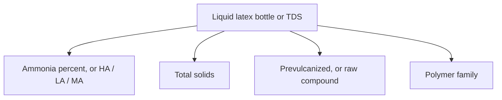
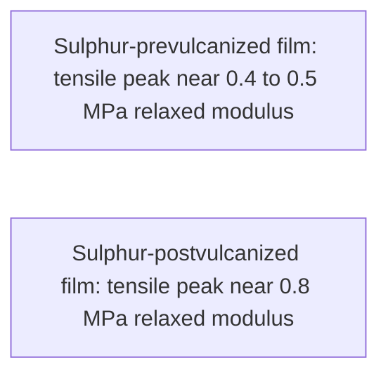

# Decoding Liquid Latex Bottle Labels

Human page: /literature-reviews/liquid-decoding-bottle-labels

> **Label literacy, not medical advice.** Food-contact rubber tables and industrial concentrate specs do not certify fashion-garment wear clearance. See [Allergy and Skin Contact](/literature-reviews/allergy-and-skin-contact).

## Executive summary

Read ammonia, total solids, prevulcanized versus raw, and polymer family. ASTM D1076 covers ammonia-preserved natural rubber concentrate and excludes compounded concentrates.[^1] ISO 2004 specifies ammonia-preserved centrifuged or creamed concentrate, including HA, LA, and MA.[^2] The ISO text used here does not mention hobby bottles.

Use when choosing a bottle or when a seller cites food-contact or medical-device language. Pair with [Forming film from liquid latex](/literature-reviews/liquid-film-pathway) and [Liquid painting vs compounding pigment](/literature-reviews/liquid-painting-vs-compounding-pigment).

## Questions this article answers

- [What should I read on a liquid latex bottle?](#what-to-read)
- [Which marketing words are not concentrate specs?](#marketing-words)

## What should I read on a liquid latex bottle? {#what-to-read}

### How

1. Ammonia percent, or HA / LA / MA.
2. Total solids.
3. Prevulcanized, or raw compound.
4. Polymer family.

Omitted fields mean the bottle is not auditable against those concentrate specs. Tack-free drying does not prove prevulcanization. Prevulcanized dipped gloves need only warm-air drying.[^3] See [Prevulcanized consumer latex](/literature-reviews/liquid-prevulcanized-consumer-latex).

### Why

Fresh latex coagulates within a few hours of leaving the tree.[^4] Ammonia dosages for preservation are in the same book.[^4] ISO 2004 copper and manganese limits are stated for concentrate total solids.[^2]

### Detail

Detail: Ammonia percents, and two tests that are not the same

Joseph 2013: bactericide above 0.35%; effective preservation 0.6% to 1.0% by weight of latex; field latex on ammonia alone 0.4–0.5% for one day and at least 1% for longer storage; low-ammonia package 0.2% ammonia, 0.0125% tetramethylthiuram disulfide (TMTD), 0.0125% zinc oxide, 0.05% lauric acid.[^4]

Blackley 1966, Volume 1, citing Lowe 1960, is a 4-hour field-latex count, not that dosage. Mortality matches growth near 0.1% ammonia on whole latex. At 0.35–0.5% the count is still about 10⁴·¹ per ml.[^5] Joseph’s storage dosages and the ISO type names are the notes to use for a modern concentrate sheet. The 1966 count is a different test.

| Initial ammonia (% on whole latex) | Viable bacteria per ml after 4 hours at 27°C |
| --- | --- |
| 0 | 10⁷ |
| 0.1 | 10⁵ |
| 0.35 | 10⁴·¹ |
| 0.5 | 10⁴·¹ |

Latex pH is lower than water at the same ammonia level because ammonia interacts with proteins.[^5]

Vanderbilt reports ammonia as percent of wet latex, percent of the water phase, or parts on dry rubber. Example: 62% centrifuged latex at 0.65% NH₃ wet.[^6] See [Liquid ventilation and ammonia](/literature-reviews/liquid-ventilation-ammonia).

Detail: Prevulcanized film versus a film vulcanized after drying

Liquid-state vulcanization with moisture retained. Ultra-accelerators work below 100°C. Overcure yields short, weak rubber. Proper prevulcanized latex can approach conventional vulcanizing after the film dries. Centrifuge or decant can remove excess sulfur and zinc oxide.[^7] The 4,000–5,000 psi remark on that page is about vulcanized latex film tensile, not a bottle specification.[^7]

Sulphur-prevulc peak tensile near 0.4–0.5 MPa relaxed modulus. Sulphur-postvulc peak near 0.8 MPa. Prevulc drop at high crosslink is read as limited particle integration.[^8]

Prevulcanized gloves: warm-air drying only.[^3] Cast films in the accelerator section were air-dried, then oven-vulcanized.[^9]

## Which marketing words are not concentrate specs? {#marketing-words}

### How

| Phrase | What the cited rule covers |
| --- | --- |
| “FDA approved” | 21 CFR 177.2600 food-contact rubber tables[^10] |
| “Medical grade” | 21 CFR 801.437 is user labeling for devices that contain natural rubber latex. This article does not place a craft bottle inside that rule.[^11] |
| “Body safe” / “skin safe” | No such grade in the concentrate specs used here |
| “100% latex” | The phrase does not name a polymer. Ask for the polymer family. |

### Why

Food-contact tables and device labels do not clear a garment for wear and do not grade a shop bottle.

### Detail

Detail: Device labeling versus a shop bottle

21 CFR 801.437 is user labeling for devices that contain natural rubber latex.[^11] This article does not place fashion garments or craft liquid latex inside that rule.

## Sources

- *The Vanderbilt Latex Handbook*. 3rd ed. Edited by Robert Francis Mausser. Norwalk, CT: R.T. Vanderbilt Company, 1987. [Library of Congress](https://lccn.loc.gov/92117844)
- *Polymer Latices: Science and Technology — Volume 3: Applications of Latices*. 2nd ed. D. C. Blackley. Chapman & Hall / Springer, 1997. [Google Books](https://books.google.com/books?id=Y2VPGj7YbykC)
- *Practical Guide to Latex Technology*. Rani Joseph. Shawbury: Smithers Rapra Technology, 2013. [Google Books](https://books.google.com/books/about/Practical_Guide_to_Latex_Technology.html?id=NB5AMwEACAAJ)
- *High Polymer Latices: Their Science and Technology*. 2 vols. D. C. Blackley. London: Maclaren; New York: Palmerton, 1966. Volume 1 pages used here include the bacterial counts Blackley attributes to Lowe (1960), and the pH comparison. [Library of Congress](https://lccn.loc.gov/66077950)
- ASTM D1076. Concentrated, ammonia-preserved natural rubber latex. Compounded concentrates are outside the scope used here.
- ISO 2004:2024. Ammonia-preserved centrifuged or creamed natural rubber latex concentrate (HA, LA, MA), with copper and manganese limits on total solids.
- 21 CFR 177.2600. Rubber articles intended for repeated food contact.
- 21 CFR 801.437. User labeling for devices that contain natural rubber latex.

## Endnotes

[^1]: ASTM D1076. Concentrated, ammonia-stabilized natural rubber latex. Does not apply to compounded concentrates.
[^2]: ISO 2004:2024. HA / LA / MA ammonia-preserved centrifuged or creamed concentrate. Copper and manganese caps on total solids.
[^3]: Vanderbilt Latex Handbook. Prevulcanized gloves need only warm-air drying.
[^4]: Practical Guide to Latex Technology. Fresh latex coagulates within a few hours of leaving the tree. Preservation dosages and the low-ammonia TMTD / zinc oxide / lauric acid package.
[^5]: High Polymer Latices (1966), Volume 1. Lowe 4-hour bacterial counts. Latex pH versus aqueous ammonia. A different test from Joseph 2013 storage dosages.
[^6]: Vanderbilt Latex Handbook. Ammonia on wet latex, water phase, or dry rubber. Example 62% latex at 0.65% NH₃ wet.
[^7]: Vanderbilt Latex Handbook. Liquid-state vulcanization, overcure, storage clarification. 4,000–5,000 psi remark on vulcanized film tensile.
[^8]: Polymer Latices Vol 3. Sulphur-prevulc versus postvulc tensile peak versus relaxed modulus.
[^9]: Vanderbilt Latex Handbook. Cast films air-dried, then oven-cured.
[^10]: 21 CFR 177.2600. Food-contact rubber ingredient tables.
[^11]: 21 CFR 801.437. Medical-device natural rubber latex labeling.
