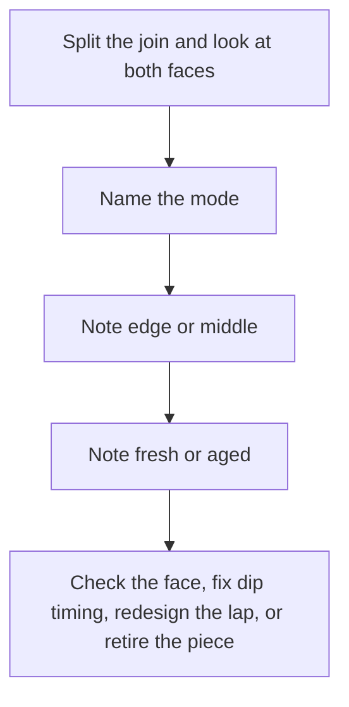
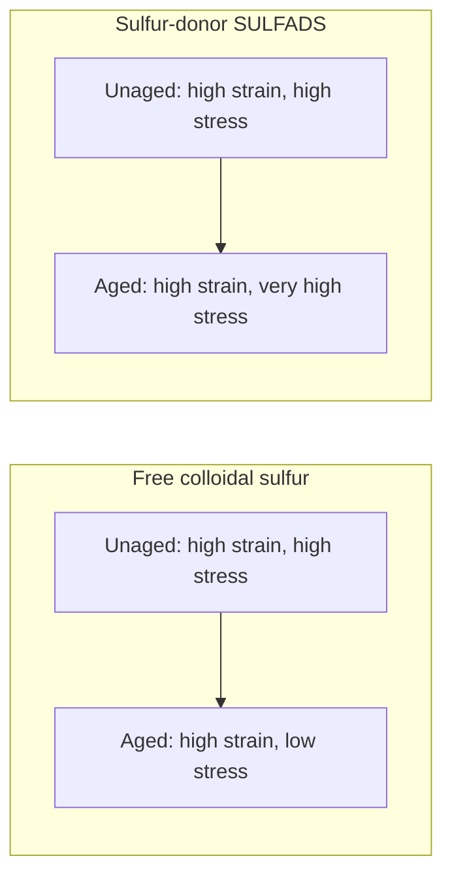
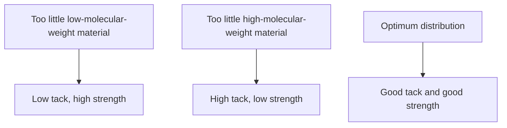

# Liquid Delamination and Seam Failure

Human page: /literature-reviews/liquid-delamination-seam-failure

## Executive summary

Read the broken join before adding latex. Adhesive failure leaves glue on one face. Cohesive failure splits the glue. Delamination between dips is a separate class: first layer dried or leached, or humidity too low for a second dip.[^4][^5]

Pair with [Liquid adhesives](/literature-reviews/liquid-adhesives-and-seam-integrity) and [Liquid reinforcement](/literature-reviews/liquid-reinforcement-laminate-zones). Ammonia: [Liquid ventilation and ammonia](/literature-reviews/liquid-ventilation-ammonia).

## How do I read the two faces?

| Cue | Mode |
| --- | --- |
| Glue on one face only | Adhesive failure (sorting picture) |
| Glue split through its thickness | Cohesive failure (sorting picture) |
| Textile fibers in the glue | Textile side failed |
| Film tears off the join | Film weaker than the bond |
| Dip layers separate, no cement line | Delamination between dips[^5] |

On a non-porous face, latex polarity should match the surfaces. On a porous face, the latex must flow into the pores, impeding electrostatic charges must be absent, and the latex charge must be opposite the substrate or the particles are repulsed. Some storage and application materials contaminate latex adhesive. Latex adhesives are slow drying, poorer in water resistance than solvent adhesives, and can freeze.[^4]

Peel rate can flip mode in one study: NBR/SMR L pressure-sensitive adhesive in toluene; cohesive at low rate, adhesive at high rate; peel strength rises with rate.[^3]

ASTM D903: peel/stripping class. ASTM D1876: T-peel, flexible-to-flexible. Report mode with force.[^1][^2]

## When did the dip layers come apart?

Bond strength between dips falls quickly as the first layer dries; leaching aggravates it. The reported conclusion is to use fresh hydrophilic gel. Potassium caprylate reduces inter-layer bond strength. A continuous second film does not prove wetting if viscosity is high. Different latices raise the risk; the same latex still has it.[^5]

Glove dipping note: ideally 20–26°C and 45–50% relative humidity. Low humidity surface-dries the first dip and impairs second-dip lamination. High humidity retains moisture and depresses cured stress and tensile. Polychloroprene needs more ambient drying than natural rubber.[^4]

Detail: Gazeley factors in Polymer Latices Vol 3

Peel force per unit width on two-layer natural rubber films. Short drying already costs bond strength. Lab sulphur-prevulcanized latex bonded less than unvulcanized post-vulcanizable latex. Industrial sulphur-prevulcanized latices bonded more than those lab prevulcanizates, and bond strength fell as vulcanization increased. Measured factors: drying, leaching, potassium caprylate. Conclusion reported: use the strongly hydrophilic nature of fresh latex gel.[^5]

## What changes as the film or adhesive ages?

Idealized film aging: free colloidal sulfur ages toward high strain and low stress (elongation up, tensile down). Sulfur-donor (SULFADS) ages toward high strain and very high stress (elongation down, tensile up).[^4]

Water-based PSA: sulfur-donor cure ages better than colloidal free sulfur. Cure cuts tack, so curing grades carry more tackifier.[^4]

Oxidation rate of latex film doubles for each 8.3°C rise (warehouse ceiling versus floor).[^4]

NR latex adhesive retains high-molecular-weight rubber that milled solvent rubber loses. In the tape comparison, 178° shear was higher for the latex adhesive across a resin range where quick stick, peel, and Polyken tack were similar.[^4]

## What do I do after I classify the break?

| Mode | Next check |
| --- | --- |
| Adhesive failure | Non-porous face: polarity match. Contamination is a listed family risk[^4] |
| Cohesive failure | Glue film (sorting picture) |
| Textile in the glue | [Liquid latex–textile bonding](/literature-reviews/liquid-latex-textile-bonding) |
| Film tore | Film, not more glue |
| Delamination between dips | Drying, leaching, potassium caprylate, humidity[^4][^5]. Rims: [Liquid edge finishing](/literature-reviews/liquid-edge-finishing-materials) |
| Aged | Free sulfur vs sulfur-donor; storage heat[^4] |

## Endnotes

[^1]: ASTM D903 — peel or stripping method class.
[^2]: ASTM D1876 — T-peel method class for flexible adherends.
[^3]: Poh, B. T., and Lamaming, J. *Journal of Coatings*, 2013. https://doi.org/10.1155/2013/519416 — NBR/SMR L PSA in toluene; peel strength vs rate; cohesive at low rate, adhesive at high rate.
[^4]: *The Vanderbilt Latex Handbook*, 3rd ed., Mausser, 1987 — latex vs solvent adhesive comparison; polarity; contamination; slow dry; PSA sulfur-donor ageing; film aging sketch (free sulfur vs SULFADS); oxidation rate vs temperature; molecular weight and shear; glove humidity and second-dip lamination.
[^5]: Blackley, *Polymer Latices: Science and Technology — Volume 3: Applications of Latices*, 2nd ed., 1997 — multi-dip delamination, wet-gel window, leaching, potassium caprylate, prevulcanization degree, wetting masked by viscosity.
