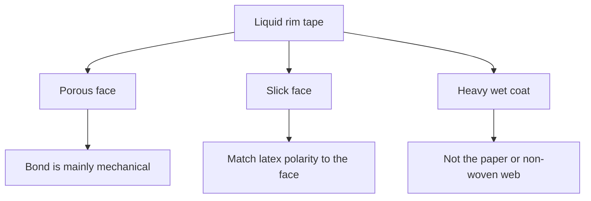
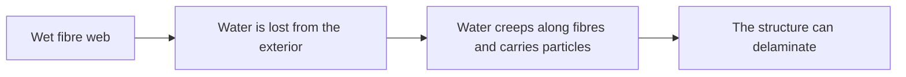

# Liquid Edge Finishing Materials

Human page: /literature-reviews/liquid-edge-finishing-materials

> **Safety.** Aqueous latex adhesive can shrink cloth.[^1][^2] Check the product SDS for ammonia. [Liquid adhesives](/literature-reviews/liquid-adhesives-and-seam-integrity). [Liquid ventilation](/literature-reviews/liquid-ventilation-ammonia).

## Executive summary

Liquid rim: textile tape, aqueous latex adhesive, then combine.[^3] Aqueous adhesive can shrink textiles.[^1][^2] Porous substrate: bond mainly mechanical.[^2] Latex must flow into pores; charge must be opposite the substrate.[^1] Non-porous: match polarity.[^1][^2] Paper saturation and latex-bonded non-woven fabric: particles migrate to the exterior as water leaves; the structure can delaminate.[^3] A heavy wet coat on garment tape is not those webs.

## Questions this article answers

- [Which tape for a liquid rim?](#rim-material)
- [Porous cloth or a slick face?](#face)
- [What if a heavy wet coat dries fast?](#drying)

## Which tape for a liquid rim? {#rim-material}

### How

Name the face. Porous and slick are different jobs. Aqueous latex adhesive can shrink cloth.[^1][^2] Rubberised plant tape: [Liquid latex–textile bonding](/literature-reviews/liquid-latex-textile-bonding).

Lap at the rim is an overlap. Failed rims: [Liquid delamination](/literature-reviews/liquid-delamination-seam-failure). Wet vs dry combine: [Liquid adhesives](/literature-reviews/liquid-adhesives-and-seam-integrity#wet-vs-dry).

### Why

Latex-adhesive disadvantages include “Shrinks fabrics,” freezing, slow drying, poorer water resistance.[^1] Aqueous latices tend to shrink textiles and wrinkle paper.[^2] Porous substrate: bond mainly mechanical.[^2] Non-porous: matched polarity.[^1][^2] Plant combining uses a latex adhesive layer on one fabric or on both, then brings the layers together.[^3]

Detail: Plant combining layouts

Knife-over-roll, one adhesive layer, marriage rollers, heated drum. Spray both faces, then calender nip. Heat-sensitive fabric pressed after the stable face is dried. Dry combine joins pre-coated fabrics. The book calls that doubling. Deposit may be non-vulcanizable, vulcanizable, or from prevulcanized latex.[^3]

## Porous cloth or a slick face? {#face}

### How

Porous tape: latex must flow into pores; charge must be opposite the substrate or particles are repulsed.[^1] Slick tape: match latex polarity to the face.[^1][^2] NR is in the low-polarity group.[^1] Higher filler raises viscosity and reduces flow into pores.[^1]

### Why

Porous bond is mainly mechanical; polymer type matters less. Non-porous polymer should match substrate polarity.[^2] Vanderbilt: polarity match on non-porous surfaces; on porous surfaces, flow into pores and opposite charge.[^1]

Detail: Polarity groups and filler

| Polarity | Lattices |
| --- | --- |
| High | NBR, XNBR, XSBR, PSBR |
| Medium | CR, PVC |
| Low | NR, SBR, BR, IIR |

PVC in this table is a latex polymer class with CR.[^1] Higher filler: higher viscosity, less flow into porous surfaces.[^1]

## What if a heavy wet coat dries fast? {#drying}

### How

Handbook webs: paper, and latex-bonded non-woven fabric. On those webs, solids and drying are set so water does not evaporate too rapidly.[^3] A heavy wet coat on garment tape is not those webs.

### Why

Paper saturation: solids and drying must be adjusted or poor internal strength and a tendency to delaminate follow. Those problems are associated with migration of latex particles to the surface if water evaporates too rapidly. Analog named in that paragraph: latex-bonded non-woven fabric.[^3] Non-woven: the cause appears to be particle migration to the exterior; interior stays wetter; water creeps along fibres and carries particles; the structure can delaminate.[^3]

Detail: Heat-sensitize, solids, and slow heat

Heat-sensitize so the binder gels before particles migrate. Evaporation before gelation still allows migration. If heat-sensitizing is not practicable: raise total solids; raise web temperature slowly.[^3] Paper impregnation: heat-sensitize so gelling or coagulation limits migration of rubber to the surface.[^1]

## Endnotes

[^1]: *The Vanderbilt Latex Handbook*. 3rd ed. Edited by Robert Francis Mausser. Norwalk, CT: R.T. Vanderbilt Company, 1987. https://lccn.loc.gov/92117844 — latex adhesive disadvantages include “Shrinks fabrics”; non-porous polarity match; porous flow and charge; polarity groups; filler reduces porous flow; paper impregnation heat-sensitize limits surface migration.

[^2]: *Practical Guide to Latex Technology*. Rani Joseph. Shawbury: Smithers Rapra Technology, 2013. https://books.google.com/books/about/Practical_Guide_to_Latex_Technology.html?id=NB5AMwEACAAJ — aqueous latices shrink textiles and wrinkle paper; porous bond mainly mechanical; non-porous polymer of matched polarity.

[^3]: *Polymer Latices: Science and Technology — Volume 3: Applications of Latices*. 2nd ed. D. C. Blackley. Chapman & Hall / Springer, 1997. https://books.google.com/books?id=Y2VPGj7YbykC — textile combining and doubling layouts; paper-saturation solids, drying, migration, and delamination; named analog is latex-bonded non-woven fabric; non-woven particle migration along fibres; heat-sensitize only if gelation precedes evaporation; higher solids and slower heating when heat-sensitizing is not used.
