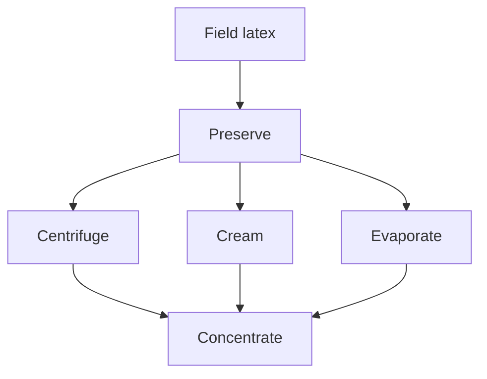

# Field Latex to Marketable Concentrate

Human page: /literature-reviews/liquid-field-latex-to-concentrate

> **Safety.** Ammonia fumes from natural-rubber latex may be a health hazard if breathed over a prolonged period. Switch to a low-ammonia natural latex and ventilate.[^1] Shop air: [Liquid Latex Ventilation and Ammonia](/literature-reviews/liquid-ventilation-ammonia). Skin contact: [Allergy and Skin Contact](/literature-reviews/allergy-and-skin-contact).

## Executive summary

Liquid pathway: field latex, then preserve, then concentrate by centrifuging, creaming, or evaporation, then compound.[^2][^3][^4]

1966 account: field latex 30–40% dry rubber content (average about 33%); normal concentrate about 60% dry rubber content.[^2] 1987 ammonia example: typical 62% centrifuged latex; total solids 62% of wet weight; rubber solids 60% of wet weight (100 parts rubber on 167 wet).[^3] The 1966 figure is dry rubber content. In the 1987 sum, 62% is total solids and 60% is rubber solids.

Bottle storage: [Liquid Latex Aging, Storage and Care](/literature-reviews/liquid-aging-storage-and-care). Labels: [Decoding Liquid Latex Bottle Labels](/literature-reviews/liquid-decoding-bottle-labels). Forming: [Forming Film from Liquid Latex](/literature-reviews/liquid-film-pathway).

## Questions this article answers

- [Why is field latex a different form from concentrate?](#forms)
- [Where does preserve hand off?](#preserve)
- [What do centrifuging, creaming, and evaporation do?](#routes)
- [What does a buyer of concentrate receive?](#buyer)

## Why is field latex a different form from concentrate? {#forms}

Field latex is the liquid that has left the tree and has not yet been concentrated.[^2] Concentrate in the 1966 normal procedure is about 60% dry rubber content.[^2] The 1987 example is a 62% centrifuged latex with rubber solids at 60% of wet weight.[^3] Compound is the addition of ingredients so a film can be manufactured.[^4]

Related questions: `liquid-hevea-rubber-tree`, `liquid-plantation-tapping-field-latex`, `liquid-tree-to-liquid-latex`.

Long-distance shipment of preserved field latex is called uneconomical in the 1966 book. Concentrates there tend to be more uniform because several processes remove some non-rubber.[^2]

### Detail: Four methods named in 1966

Evaporation, creaming, centrifuging, electrodecantation.[^2] Evaporation removes water only. The other three partly remove non-rubber relative to rubber and drop a share of smaller particles.[^2]

Centrifuging called the most important method then. The book reports a Malayan estimate of roughly 88% centrifuging, 6% creaming, and 6% evaporation; electrodecantation amount then negligible.[^5] No method share in the 1987 handbook or in *Polymer Latices* Volume 3 (1997). The 88 / 6 / 6 split stays a 1966 Malayan estimate.

## Where does preserve hand off? {#preserve}

Preserve, then concentrate. Closed-bottle storage, cream remix, and freeze: [Liquid Latex Aging, Storage and Care](/literature-reviews/liquid-aging-storage-and-care).

Coagulation within a few hours; clots and a clear liquid; later putrefaction.[^6] Long-term preservation covers shipment and storage in the consumer country. Anticoagulants are the short-term class.[^6]

About 0.2% ammonia on the whole latex for short-term preservation; about 0.7% for permanent preservation.[^7] Above 0.35% on the whole latex, ammonia is described as a strong bactericide, and the time after the latex leaves the tree matters.[^8]

Low-ammonia means reduced ammonia plus a secondary preservative. 1966 example: 0.2% ammonia plus 0.2% sodium pentachlorophenate.[^9] 1997 example: a low-ammonia preserved natural rubber latex containing a thiuram sulphide or dithiocarbamate as a secondary preservative.[^10] Two dated examples.

### Detail: Ammonia level before the machine

The 1966 centrifuging section says the ammonia level before the machine depends on delay since reception. Creaming section: field latex ammoniated to about 1% by weight; cream then ammoniated to 0.8%.[^11]

Fume warning: low-ammonia natural latex and ventilation.[^1]

## What do centrifuging, creaming, and evaporation do? {#routes}

Centrifuging in the 1966 account is creaming in a centrifugal field. Usual machine named: de Laval. Bowl speed on the order of 6,000 rpm; about 6,160 g at 6 in. from the axis.[^12] Cream-rich fraction inward; dilute fraction outward.

Creaming steps: about 1% ammonia on bulked field latex; creaming agent about 0.1% on the aqueous phase (ammonium alginate typical); stir about 1 hour; stand about 40 hours; run off the dilute layer; ammoniate cream to 0.8%; stir 1–2 days in bulk. Advantages named: simple equipment, small rubber loss in the dilute layer. Disadvantages named: slow, sensitive to field latex, further creaming in storage. Market preference of that book: centrifuged latex.[^11]

1997: water-soluble alginates, mainly sodium and ammonium salts, are creaming agents for natural rubber latex. Plant steps pointed at Volume 2.[^13] The plant steps in this article are the 1966 account.

Evaporation removes water only.[^2] 1966 products: 72–75% solids, potassium hydroxide and a potassium soap (Standard Revertex); ammonia-preserved about 62% total solids (T-Revertex).[^14]

### Detail: Efficiency example and the bowl drawings

Efficiency: fraction of incoming rubber that leaves as concentrate. Worked example: incoming 30% dry rubber content, concentrate 60%, dilute fraction 5%; efficiency about 0.90; about half the incoming weight as concentrate. A figure nearer 0.85 is called more realistic for the industry-wide share of rubber recovered in the concentrate.[^15] Dilute-fraction dry rubber content 2.5–10%, high non-rubber solids.[^16]

Controls named: feed rate, bowl speed, regulating-screw length. Contact parts: tinned steel bowl, distributor, and gullies; stainless discs and orifices.[^15]

Curves: particles at or above a critical size are missing from the dilute fraction; smaller particles can appear in both.[^12] Drawings are from the 1966 book.

### Detail: Electrodecantation in that book

Fourth 1966 method. Negatively charged particles move to a membrane, form loose clusters, and cream. Amount then called negligible.[^5][^17]

## What does a buyer of concentrate receive? {#buyer}

1997 foam chapter: standard natural-rubber concentrates are 60% m/m ammonia-preserved centrifugates, high-ammonia or low-ammonia.[^18] 1987 compounding example: 62% centrifuged latex, rubber solids 60% of wet weight. High-ammonia may be compounded as received or deammoniated. Low-ammonia generally does not need ammonia reduced before compounding.[^3]

### Why

1997 Dunlop section: high-ammonia de-ammoniated, usually by aeration, occasionally formaldehyde. Low-ammonia developed for continuous Dunlop; little or no prior de-ammoniation; not recommended there for batchwise.[^19] Ammonia just before gelation in that section is about 0.15% m/m. That target is after adjustment. It is the gelation step, not the as-received concentrate.

### Detail: Evaporated concentrate beside centrifuged

1997 cement table: 66% m/m ammonia-preserved evaporated latex; 60% m/m ammonia-preserved centrifuged latex. Centrifuged concentrate described as lower in colloid stability than the evaporated concentrate in that comparison, so the centrifuged mix carries an extra stabilizer.[^20]

1966 pair remains Standard Revertex at 72–75% solids with potassium hydroxide, and T-Revertex at about 62% total solids with ammonia.[^14] The 66% row and the 72–75% product are two reports from two books.

First bulk shipment of centrifuged natural rubber latex to the UK recorded as 1931 (Madge, as cited).[^21]

## Sources

- *The Vanderbilt Latex Handbook*. 3rd ed. Edited by Robert Francis Mausser. Norwalk, CT: R.T. Vanderbilt Company, 1987. <https://lccn.loc.gov/92117844>
- *Polymer Latices: Science and Technology — Volume 3: Applications of Latices*. 2nd ed. D. C. Blackley. Chapman & Hall / Springer, 1997. <https://books.google.com/books?id=Y2VPGj7YbykC>
- *High Polymer Latices: Their Science and Technology*. 2 vols. D. C. Blackley. London: Maclaren; New York: Palmerton, 1966. <https://lccn.loc.gov/66077950>

## Endnotes

[^1]: *The Vanderbilt Latex Handbook*, 1987. Ammonia fumes from NR latex may be a health hazard if breathed over a prolonged period. Switch to a low-ammonia natural latex and ventilate.

[^2]: *High Polymer Latices*, 1966. Field latex 30–40% dry rubber content, average about 33%. Concentrate to about 60% dry rubber content. Uniformity from partial removal of non-rubber. Four methods: evaporation (water only), creaming, centrifuging, electrodecantation.

[^3]: *The Vanderbilt Latex Handbook*, 1987. Typical 62% centrifuged latex; 0.65% ammonia on wet weight. Total solids 62% of wet weight; rubber solids 60% of wet weight. High-ammonia compounded as received or deammoniated. Low-ammonia: ammonia generally not reduced before compounding.

[^4]: *The Vanderbilt Latex Handbook*, 1987. Film from raw latex is not yet a saleable article. Compounding adds ingredients that change the film.

[^5]: *High Polymer Latices*, 1966. Centrifuging called the most important method then. Malayan estimate: roughly 88% centrifuging, 6% creaming, 6% evaporation. Electrodecantation amount then negligible.

[^6]: *High Polymer Latices*, 1966. Coagulation within a few hours; clots and a clear liquid; later putrefaction. Long-term preservation versus short-term anticoagulants.

[^7]: *High Polymer Latices*, 1966. About 0.2% ammonia on the whole latex for short-term preservation; about 0.7% for permanent preservation.

[^8]: *High Polymer Latices*, 1966. Ammonia described as a strong bactericide above 0.35% on the whole latex. Timing after the latex leaves the tree matters.

[^9]: *High Polymer Latices*, 1966. Low-ammonia: reduced ammonia plus a secondary preservative. Example: 0.2% ammonia plus 0.2% sodium pentachlorophenate.

[^10]: *Polymer Latices* Volume 3, 1997. Example of low-ammonia preserved natural rubber latex containing a thiuram sulphide or dithiocarbamate as a secondary preservative.

[^11]: *High Polymer Latices*, 1966. Creaming: about 1% ammonia on bulked field latex; creaming agent about 0.1% on the aqueous phase; stir about 1 hour; stand about 40 hours; cream ammoniated to 0.8%; stir 1–2 days. Market preference then: centrifuged latex.

[^12]: *High Polymer Latices*, 1966. de Laval bowl. Order of 6,000 rpm. About 6,160 g at 6 in. from the axis. Particle-size argument: sizes at or above the critical diameter absent from the dilute fraction.

[^13]: *Polymer Latices* Volume 3, 1997. Principal use of water-soluble alginates in latex technology: creaming agents for natural rubber latex. Sodium and ammonium salts mainly. Plant section pointed at Volume 2.

[^14]: *High Polymer Latices*, 1966. Standard Revertex: 72–75% solids, potassium hydroxide and a potassium soap. T-Revertex: ammonia-preserved, about 62% total solids.

[^15]: *High Polymer Latices*, 1966. Efficiency example: 30% in, 60% concentrate, 5% dilute fraction, efficiency about 0.90, about half the weight as concentrate. Industry-wide recovery then nearer 0.85. Feed rate, bowl speed, regulating-screw length. Tinned steel and stainless steel contact parts.

[^16]: *High Polymer Latices*, 1966. Dilute centrifuge fraction: dry rubber content 2.5–10%; high non-rubber solids.

[^17]: *High Polymer Latices*, 1966. Electrodecantation: charged particles move to a membrane, form loose clusters, and cream.

[^18]: *Polymer Latices* Volume 3, 1997. Foam: standard natural-rubber concentrates are 60% m/m ammonia-preserved centrifugates, high-ammonia or low-ammonia.

[^19]: *Polymer Latices* Volume 3, 1997. Dunlop: high-ammonia de-ammoniated, usually by aeration, occasionally formaldehyde. Low-ammonia for continuous process; little or no prior de-ammoniation; not recommended there for batchwise. Ammonia just before gelation about 0.15% m/m.

[^20]: *Polymer Latices* Volume 3, 1997. Cement formulations: 66% m/m ammonia-preserved evaporated latex; 60% m/m ammonia-preserved centrifuged latex. Centrifuged concentrate lower in colloid stability than the evaporated concentrate in that comparison.

[^21]: *Polymer Latices* Volume 3, 1997. Madge, as cited: first bulk shipment of centrifuged natural rubber latex to the United Kingdom in 1931.
