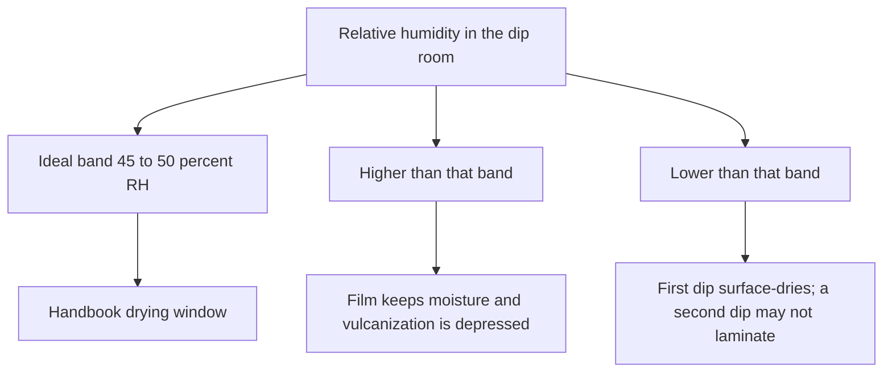
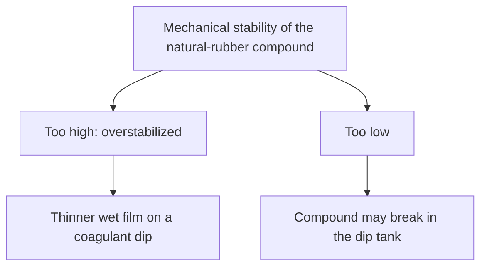

# Liquid Film Defects

Human page: /literature-reviews/liquid-film-defect-atlas

## Executive summary

Liquid-pathway film defects, named from dipped-glove practice: pinholes from entrapped air; blown gel when the chloroform number is less than 2; humidity band 45–50% RH; webbing and dewebbing; discoloration when leach leaves coagulant salts.[^1][^2] The chloroform number is a 1–4 coagulation rating (1 uncured, 4 advanced precure).[^4]

## Symptom map

| What you see | Industrial name | First check |
| --- | --- | --- |
| Pinprick leaks | Pinholes from air | Compound air; tank fill[^1] |
| Soft gel that collapses | Blown gel / weak wet gel | Chloroform number under 2[^1][^4] |
| Sticky threads in a narrow gap | Webbing | Dewebbing mist; octyl alcohol[^1] |
| Second coat will not bond | Surface dried too fast | RH too low; chloroprene needs longer ambient dry[^1] |
| Weak, chalky film after vulcanizing | Vulcanization slowed by leftover moisture | RH too high[^1] |
| Yellow or brown after storage | Leach salts and aging | Warm leach; UV on the package[^2] |
| Compound breaks in the tank, or a suddenly thin deposit | Stability too high or too low | Mechanical stability[^1] |

Glove-line functional list (pinholes, weak spots, tears, bead faults, low tensile, dimensional error, high protein from poor leach) and cause links (coagulant dry, incomplete vulcanization, oven temperature, coagulant strength, total solids) are Partial for a wearable cast.[^3]

## Pinholes

Mild vacuum on the storage container. Do not trap air when filling the dip tank. Pinholes are a glove reject. Higher viscosity makes entrapped air harder to remove.[^1]

## Blown gel

Chloroform number less than 2 can blow gloves on formers because wet-gel strength is weak.[^1] The rating method mixes equal parts compounded latex and chloroform (10 cm³ each), waits 2–3 minutes, and scores 1 (tacky, stringy, uncured) through 4 (small dry crumbs, advanced precure). The test is subjective; solvent swell is more quantitative and slower.[^4]

## Humidity

Ideal plant band: 20–26°C and 45–50% RH.[^1] Higher humidity retains moisture and depresses vulcanization. Lower humidity surface-dries the first dip and hurts second-dip lamination and flock. Chloroprene films need more ambient dry time than natural-rubber films.[^1]

## Webbing

Fine mist of octyl alcohol as the form clears the liquid, or a silicone/oil dewebbing emulsion.[^1] Emulsions that deweb are often slightly unstable and can oil-spot. Octyl alcohol (2-ethylhexanol) at 0.125–0.25 phr reduces oil spotting; wait about 4 hours before use.[^1]

## Discoloration

Incomplete warm leach leaves coagulant salts (calcium nitrate named in the degradation chapter) that increase discoloration after warm air, gas fumes, or ultraviolet light, and that depress film properties.[^2] Thorough leach raises vulcanized-film properties, aging, and resistance to discoloration from heat, light, and NOx.[^1] UV through plastic or cellophane discolors exposed surfaces. Clay-board boxes are not airtight; do not fold goods so the film forms a sharp edge. One plant rolled girdles (no sharp edges) into capped cardboard tubes.[^2] Oxidation rate doubles for each 8.3°C rise; a 35–60°C warehouse is hotter at the ceiling than at the floor.[^2]

## Tank stability

Mechanical stability is resistance to shear. Too high: overstabilized, thinner wet film on a coagulant dip. Too low: the compound may break in the tank.[^1] Gauge also follows total solids, coagulant strength, and dwell; viscosity and withdrawal speed limit gauge scatter.[^1]

## Endnotes

[^1]: *The Vanderbilt Latex Handbook*, 3rd ed. (Mausser, 1987) — dipped-glove process: air and pinholes, chloroform number less than 2, humidity, webbing and octyl alcohol, leach outcomes, mechanical stability.
[^2]: *The Vanderbilt Latex Handbook*, 3rd ed. (Mausser, 1987) — degradation chapter: incomplete leach, calcium nitrate, ultraviolet packaging, warehouse temperature.
[^3]: *Practical Guide to Latex Technology* (Joseph, 2013) — dipped-goods functional defects and cause/remedy matrix.
[^4]: *The Vanderbilt Latex Handbook*, 3rd ed. (Mausser, 1987) — chloroform coagulation rating, stages 1–4, subjectivity versus solvent swell.
