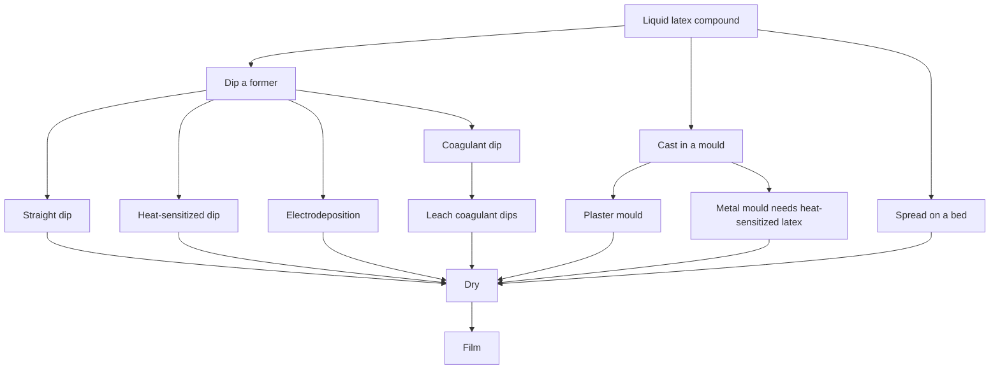

# Forming Film from Liquid Latex

Human page: /literature-reviews/liquid-film-pathway

> **Safety.** Concentrates carry ammonia odor, freeze risk, and metal-fitting hygiene. Coagulant dips use calcium salts as plant tools. Protein and accelerator chemistry can matter for skin contact. See [Allergy and Skin Contact](/literature-reviews/allergy-and-skin-contact) and [Liquid ventilation and ammonia](/literature-reviews/liquid-ventilation-ammonia).

## Executive summary

Liquid pathway: aqueous polymer dispersion → film by dipping, casting, or spreading.[^1] A film from raw latex is not a saleable article until compounded. Elastomeric latex typically includes vulcanization. A vulcanized film is expected to stretch to at least twice its length and recover.[^1]

Forming method: [Former dip, mould cast, and flat spread](/literature-reviews/liquid-former-dip-vs-mould-cast-vs-flat-spread). Bottle fields: [Decoding liquid latex bottle labels](/literature-reviews/liquid-decoding-bottle-labels).

## What is in the bottle?

Read polymer family, solids, and whether the liquid is prevulcanized. A consumer bottle labeled “liquid latex” is not automatically an ISO 2004 concentrate.[^2] ASTM D1076 covers concentrated, ammonia-stabilized natural-rubber latex and does not apply to compounded concentrates.[^3]

ISO 2004 types include HA and LA; the 2024 edition also names MA.[^2]

## How do you form the film?

Dipping: immerse a former, withdraw a deposit, repeat for thickness, then leach, dry, and vulcanize as the process requires. Types: straight, coagulant, heat-sensitized, electrodeposition.[^4][^5]

Straight dip, no coagulant: dry deposit typically about 0.01–0.05 mm per single dip. Multi-dip builds thickness. Holes in one layer are unlikely to align with the next. Condoms are commonly two simple dips.[^5] Thickness rises about linearly with log(viscosity) when solids and viscosity are co-varied by dilution.[^5]

Primary coagulants include acetic and formic acids and calcium nitrate or calcium chloride.[^1] Most dipped articles with dry film thicker than 8 mils use coagulant because the film builds faster.[^1] Warm-water leach is required for coagulant-dipped products.[^1]

Casting: plaster uses water absorption plus calcium ions. Metal moulds need heat-sensitized latex. Slush and rotational moulding are separate.[^4] See [Heat-sensitized gelation](/literature-reviews/liquid-heat-sensitized-gelation).

Lab spreading: compounded latex on glass, wire-wound knife; Anode (coagulant then latex) versus Teague (latex first); leach example 20–30 min at 40–50 °C.[^1] Industrial spreading: vulcanizable latex on a conveyor, including multi-ply; successive coats with drying between.[^6][^7] See [Home-cast latex film](/literature-reviews/liquid-home-cast-film).

1932 process map: spreading, dipping, electrodeposition, chemical deposition, foam. Vulcanized latex: deposit and dry. Natural latex: ordinarily vulcanized after forming.[^8]

1997 survey of non-plaster moulding: Metallgesellschaft delayed salt gel; Kaysam zinc-ammine with ammonium salts; rotational hollow moulds. Adequate leaching is stated for the Kaysam moulding (residual salts, especially ammonium nitrate).[^5]

## What may touch the latex?

Equipment that contacts latex must be free of copper, brass, or galvanized iron. Rotate formers 180–360° after a dip.[^1] Air in the compound produces pinholes (reject). Handbook window about 20–26 °C and 45–50% relative humidity. Former glaze gives a shiny surface; bisque or sandblast gives a dull surface.[^1]

Exam-glove thickness 0.10 mm at the cuff to 0.20 mm at the fingers is glove geometry. Gloves are about half of natural-rubber latex consumption in that dipping chapter.[^4] Wet-gauge levers: percent total solids, coagulant strength, dwell, viscosity, withdrawal speed. Chloroform coagulant number 2–3 is a handbook precure example. A broken web leaves a weak spot.[^1]

## Is the rubber already vulcanized in the liquid?

Prevulcanized latex is vulcanized in the liquid. Gloves from prevulcanized latex need only warm-air drying.[^1] Overcure makes a short, weak deposit. Clarify to remove excess sulfur and zinc oxide.[^1]

Post-form vulcanization of a dried compound is a separate branch. Handbook example: air-dry, then circulating warm air at 93 °C. Sulfur alone is inadequate; zinc oxide and an accelerator are required. After vulcanization: less tack, higher tensile strength, lower solvent solubility, more elasticity.[^1]

See [Prevulcanized consumer latex](/literature-reviews/liquid-prevulcanized-consumer-latex).

**Detail: four strength reports, unresolved.**

- Vanderbilt Latex Handbook (1987): proper prevulc about 4,000–5,000 psi tensile when particles integrate on drying.[^1]
- *Polymer Latices* vol. 3 (1997): sulphur-postvulcanized natural-rubber latex films, tensile maximum near relaxed modulus about 0.8 MPa; sulphur-prevulcanized films near 0.4–0.5 MPa. High-crosslink drop: chain mobility (postvulcanized) versus particle-integration failure (prevulcanized). A separate sentence reports tensile maxima about 30–35 MPa for films prevulcanized by high-energy radiation (carbon–carbon crosslinks), not as the sulphur-curve peak.[^5]

- Practical Guide casting section: strength is always low for film from prevulcanized compound. Prevulcanized latex is preferred there for some solid articles because product vulcanization can be skipped.[^4]
- *High Polymer Latices* (1966): films from prevulcanised latex closely resemble compounded latex films vulcanized after drying. No continued vulcanization on drying: tensile strength of the order of 2,000 psi, elongation 700–800%. Vulcanization continuing during drying (usual in that account): 3,500–4,500 psi, elongation 800–900%. Typical curves show rather lower tensile strength and elongation for prevulcanised films, and rather low modulus when no post-vulcanisation occurs.[^9]

US 3,755,232: hydrogen peroxide and an activator; uses include adhesives, coatings, dips, threads, and foams. Sulfur, zinc oxide, and accelerators may still be added.[^10]

PVultex PVML: low-ammonia prevulcanized natural rubber, dipping uses, total solids about 60%, frost-sensitive.[^11] Revultex distributor sheet: dipped articles and cold casting; example films 0.12–0.15 mm thick (glove-class films).[^12]

## Which polymer is in the tank?

Synthomer SyNovus Plus is coagulant multi-dip nitrile latex.[^13] Hevea natural rubber, prevulcanized natural rubber, and that nitrile compound are different polymers. See [Synthetic lattices](/literature-reviews/liquid-synthetic-lattices).

1932: dipping cements from rubber in benzene or gasoline are a different process from latex dipping. Latex was described as less expedient because low viscosity needs many dips.[^8]

## When does this pathway fit

Use this pathway to form thickness, color, or shape from liquid latex. After the film exists: [Liquid adhesives and seam integrity](/literature-reviews/liquid-adhesives-and-seam-integrity), [Liquid aging, storage, and care](/literature-reviews/liquid-aging-storage-and-care), [Liquid film defects](/literature-reviews/liquid-film-defect-atlas).

## Endnotes

[^1]: *The Vanderbilt Latex Handbook*, 3rd ed., Robert Francis Mausser, ed., 1987 — latex as an aqueous colloidal dispersion; raw film needs compounding; vulcanized film stretches to at least twice its length and recovers; primary coagulants; prevulc in the liquid (about 4,000–5,000 psi; overcure short and weak; clarify excess sulfur and zinc oxide); dipped-goods plant practice (metal hygiene, former rotation, leach for coagulant dips, prevulc gloves warm-air dry, glaze versus bisque, films thicker than 8 mils, humidity window, pinholes, webbing, chloroform number example); lab spreading (Anode versus Teague; leach example); post-form oven example at 93 °C; sulfur with zinc oxide and accelerator.

[^2]: ISO 2004:2024 — ammonia-preserved centrifuged or creamed natural-rubber latex concentrate (HA, LA, MA). Concentrate specification.

[^3]: ASTM D1076 — concentrated, ammonia-stabilized natural-rubber latex categories; does not apply to compounded concentrates.

[^4]: *Practical Guide to Latex Technology*, Rani Joseph, 2013 — dipping classes (straight, coagulant, heat-sensitized, electrodeposition); gloves as a large share of natural-rubber latex; exam-glove thickness as glove geometry; casting (plaster versus metal; slush versus rotational; prevulc film strength always low in that casting section).

[^5]: *Polymer Latices: Science and Technology — Volume 3: Applications of Latices*, 2nd ed., D. C. Blackley, 1997 — principal dipping processes (Gorton single-dip about 0.01–0.05 mm; log viscosity; multi-dip pinhole misalignment; condoms two simple dips); thin-film crosslink versus tensile (sulphur-postvulc about 0.8 MPa; sulphur-prevulc about 0.4–0.5 MPa; particle integration). The 30–35 MPa maxima are for high-energy-radiation prevulcanized films, not the sulphur curve. Historical heat-sensitized moulding (Metallgesellschaft; Kaysam; rotational precursor). Adequate leaching is the Kaysam moulding sentence.

[^6]: US Patent 2,415,028 — spreading vulcanizable latex on a conveyor, including multi-ply.

[^7]: US Patent 2,129,607 — successive latex coats with drying between.

[^8]: *Letter Circular LC 321: Rubber Latex*, National Bureau of Standards, 25 February 1932 — process map; vulcanized latex deposit-and-dry versus natural latex ordinarily vulcanized after forming; cement dipping in benzene or gasoline.

[^9]: *High Polymer Latices: Their Science and Technology*, 2 vols, D. C. Blackley, 1966 — films from prevulcanised latex versus post-vulcanised films; drying-condition split (about 2,000 psi versus 3,500–4,500 psi). Tier 4 historical locus. Does not replace the 1987, 1997, or 2013 reports.

[^10]: US Patent 3,755,232 — hydrogen peroxide and activator prevulc; adhesives, coatings, dips, threads, foams.

[^11]: Corrie MacColl PVultex PVML technical data sheet — low-ammonia prevulcanised natural rubber; dipping; total solids about 60%; frost-sensitive.

[^12]: Revultex prevulcanized natural-rubber latex technical data sheet (distributor PDF) — dipped articles, cold casting; example films 0.12–0.15 mm.

[^13]: Synthomer SyNovus Plus technical data sheet — coagulant multi-dip nitrile latex.
