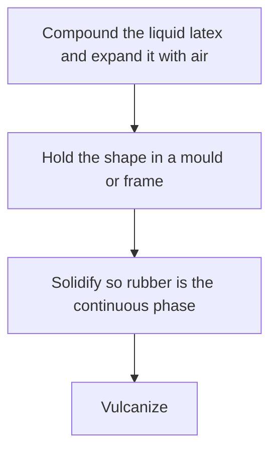
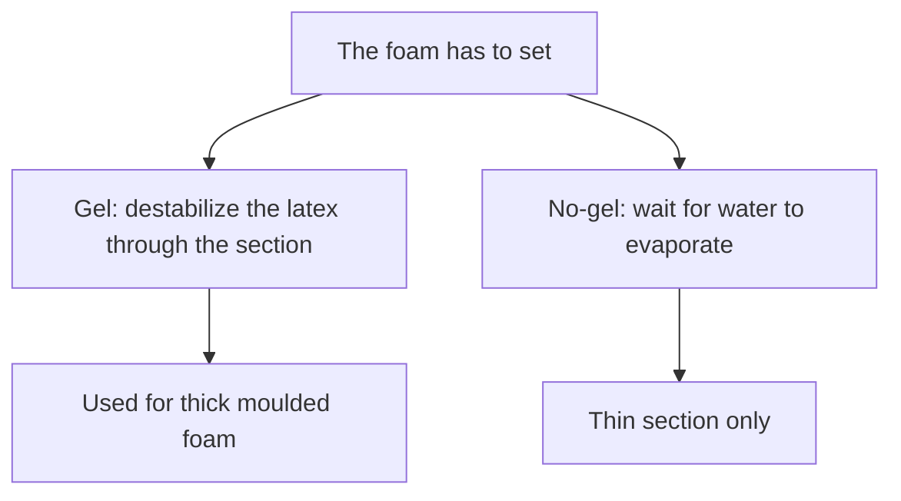

# Latex Foam for Costume Volume

Human page: /literature-reviews/liquid-foam-padding

> **Process hazard.** Foam manufacture uses gelling agents, heat, and fine powders at industrial shop scale. Collapse, shrinkage, and a missed gel time are documented when those controls are missing.

## Executive summary

Costume volume from liquid latex is foam rubber: expand with air, constrain shape, solidify (rubber becomes the continuous phase), vulcanize.[^1] The rubber phase has to lock before the bubbles collapse.[^1]

Use when padded volume is being planned and the process needs a name.

## Questions this article answers

- [What is latex volume padding?](#volume)
- [When does the foam need a gel?](#gel)
- [What changes how the pad feels?](#feel)

## What is latex volume padding? {#volume}

Whipping is step 1 only.[^1]

Foamed latex is rubber particles and air bubbles in water. The rubber–water interface has to destabilize before the air–water interface, or the foam collapses.[^1]

Detail: What gel means in foam

Gel: deliberate colloidal destabilization so rubber particles coalesce while bubbles remain.[^1]

Air–water surface energy rises first → collapse. Rubber–water interface destabilizes first → set, with limited collapse and coarser cells. An air surface that never destabilizes during gelation is described as difficult or impossible in practice.[^1]

Detail: Air cells in the foam

Diagram of foamed latex: air cells in the rubber network.[^1]

## When does the foam need a gel? {#gel}

Gel: destabilize the latex so rubber particles join while the bubbles are still in place.[^1]

Thick section: plan a gel through the section. Dunlop is the named natural-rubber example (delayed gelling agent + zinc oxide). Published doses are a rough guide, checked on a small sample of the batch.[^4]

No-gel (evaporation) is limited to thin section.[^2] Heat-sensitive foam is also a thin-section route.[^3]

Heat-sensitive foam is heated from the outside, so thick mouldings gel in layers and carry load less well than a delayed-gellant foam of the same density.[^3]

Detail: Dunlop doses and example cards

Natural rubber, typical: 1.5 phr sodium silicofluoride + 3–5 phr zinc oxide. Sodium salt preferred for natural rubber. Exclusive styrene–butadiene compounds about 3 phr silicofluoride (higher soap and alkali); blends rise toward that dose. Rough guide only; confirm on a small sample of each batch and formula.[^4]

Ammonia-preserved natural-rubber examples: unfilled high density; lower density with kaolinite clay, ground whiting, or whiting plus wet-ground mica. 30 min at 100°C adequate for thin-section foams from those compounds. Factory mattress and cushion cards.[^5]

phr = parts per hundred rubber. The chapter also writes pphr.[^4]

Detail: One published gel pH

Example after silicofluoride: pH (curve A) falls, viscosity (curve B) rises. Marked gel point about pH 8.6, just under 10 minutes. Example gel point, not a universal target.[^4]

Detail: Why heat-sensitive foam stays thin

Exterior heating. Layer gelation parallel to the mould wall. Cell-wall rupture as internal gas pressure rises. Under cyclic fatigue, weaker perpendicular to the mould wall than parallel to it. Gelation and vulcanization remain distinct even if run in one heating step.[^3]

Solid-film heat gelation: [Liquid heat-sensitized gelation](/literature-reviews/liquid-heat-sensitized-gelation).

Detail: Flame-retardant cushioning foam

Polychloroprene foam as flame-retardant cushioning: mattresses on navy ships, seating for transit vehicles and theaters, mattresses in hospitals and in penal and mental institutions, fabric cushioning including rug underlay. High-solids latex. Medium to high gel, especially with high fire-retardant filler. Aluminum trihydrate is the filler named. Industrial cushion uses.[^8]

## What changes how the pad feels? {#feel}

Mineral oil used to help gel coalescence: up to 5 phr. Higher oil plus high filler gives weaker mechanics.[^6]

Equal outlines can differ in feel when density or cell structure differs. More expansion softens the pad.[^7]

Detail: Gent–Thomas scaling

Highly expanded limit, nodes small relative to threads: E ≈ (E₀ / 6) × (ρ / ρ₀). Predicted Poisson’s ratio 0.25 in small extension. Measured average 0.33 (range 0.28–0.43). The source says the measurements do not conform to the prediction. Scaling picture for highly expanded foam.[^7]

Detail: Softer as the foam is expanded more

Compression curves. Densities A–E: 0.31, 0.21, 0.18, 0.14, 0.10 Mg m⁻³. More expansion reaches a given compression at lower stress. A single compression modulus is a poor comparison when the curve is nonlinear.[^7]

## Endnotes

[^1]: Polymer Latices Vol 3, 2nd ed., 1997 — four-step manufacture; rubber–water interface before the air–water interface; gel vs collapse timings.
[^2]: Polymer Latices Vol 3, 2nd ed., 1997 — no-gel solidification by evaporation, thin section only.
[^3]: Polymer Latices Vol 3, 2nd ed., 1997 — heat-sensitive foam: exterior heating, layer gelation, thin-section spreading and dipping.
[^4]: Polymer Latices Vol 3, 2nd ed., 1997 — Dunlop silicofluoride and zinc oxide rough guide; exclusive styrene–butadiene dose; example gel pH about 8.6 (pH curve A, viscosity curve B).
[^5]: Polymer Latices Vol 3, 2nd ed., 1997 — natural-rubber Dunlop example cards (unfilled; kaolinite; whiting; whiting plus mica); 30 min at 100°C for thin foams.
[^6]: Polymer Latices Vol 3, 2nd ed., 1997 — mineral oil up to 5 phr for gel coalescence; higher oil plus filler weakens mechanics.
[^7]: Polymer Latices Vol 3, 2nd ed., 1997 — Gent–Thomas highly expanded modulus; measured Poisson ratio does not match 0.25; compression softens as expansion increases (five densities).
[^8]: Vanderbilt Latex Handbook, 3rd ed., 1987 — polychloroprene flame-retardant foam cushioning; high solids; medium to high gel; aluminum trihydrate.
