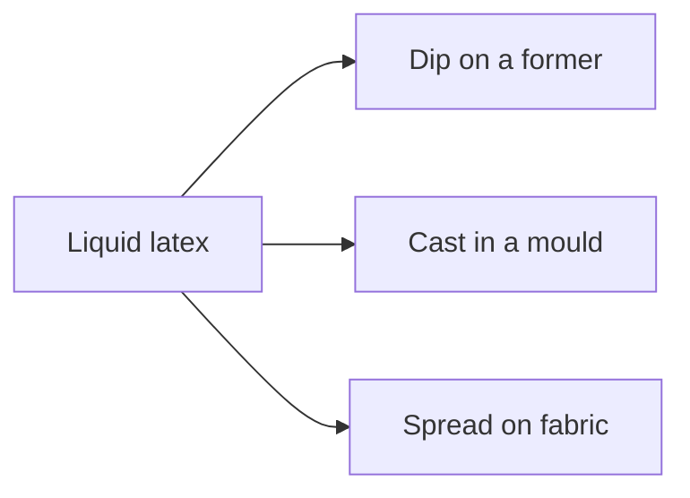
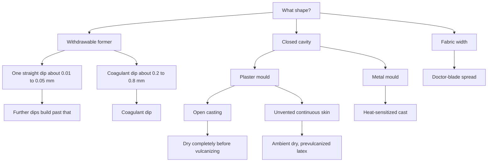

# Former Dip, Mould Cast, and Flat Spread

Human page: /literature-reviews/liquid-former-dip-vs-mould-cast-vs-flat-spread

> **Safety.** Ammonia fumes from natural-rubber latex are a health hazard if breathed for a long time; ventilate.[^1] No copper, brass, or galvanized iron on compounding or processing equipment.[^1] Leach tank follows that metals rule; water fittings must not contain copper or brass.[^1] Brass or copper deteriorates the rubber in the latex; galvanized fittings form coagulum.[^1] Coagulant salts and heat sensitizers are plant chemicals. See [Allergy and Skin Contact](/literature-reviews/allergy-and-skin-contact).

## Executive summary

**Dip** builds film on a former withdrawn from a tank. **Cast** gels film on a mould cavity wall. **Spread** lays film on fabric with a doctor blade.[^2]

Straight dips are about 0.01–0.05 mm dry per pass.[^2] A coagulant dip builds a thicker wall in one pass, and it builds faster.[^1][^2] Heat-sensitized dipping is for thick single dips, up to about 4 mm dry on teats.[^2] Use after [Forming film from liquid latex](/literature-reviews/liquid-film-pathway).

## Which shape uses which process?

Dipping deposits on the outside of a former. Casting copies the cavity interior. Spreading wets moving textile and runs slower than solvent doughs because water dries more slowly.[^2] Letter Circular LC 321 (1932) treats spreading and dipping as separate routes, and fabric impregnation as its own bath step.[^3]

## How do you dip a former?

Straight dip: about 0.01–0.05 mm dry per pass; multi-dip for gauge; later layers offset pinholes.[^2]

Coagulant dip: salt on the former, dwell, withdraw a deposit that is usually only partly gelled. Typical single-dip dry thickness 0.2–0.8 mm.[^2] More calcium salt on the former, thicker deposit at the same dwell.[^2] Dry films thicker than about 0.2 mm (8 mil) usually use coagulant because the wall builds faster.[^1] Warm-water leach, then staged warm-air vulcanizing. Prevulcanized latex gloves may only need warm-air drying.[^1]

Porcelain formers. Mount so immersion does not trap air. Rotate after the dip.[^1]

Heat-sensitized dipping is a former in a tank. One dip can reach about 4 mm dry (teats and soothers).[^2] Thickness–dwell curve differs from coagulant dipping (former 60 °C in the plotted examples). Bath temperature held tight; teat baths cited within ±1 °C.[^2] Separate from the Kaysam closed-mould cycle.

Detail: [Coagulant dipping for wearable thickness](/literature-reviews/liquid-coagulant-dipping-wearable-thickness).

Detail: Viscosity and one straight dip

Dilution that moves solids and viscosity together: dried thickness tracks log(viscosity). Same points on linear and log viscosity scales.[^2]

Detail: Calcium salt on the former

Deposit thickness after a stated dwell rises with calcium salt on the former (coagulant concentration). Plot symbols: circles 0.5 minute, triangles 2 minutes, squares 5 minutes, inverted triangles 10 minutes. Usual order is coagulant then latex. A first latex layer can act as a tie coat for the coagulant and for the next gel, especially on smooth glass or glazed porcelain. Wet coagulant’s lubricity makes the gel more liable to slip off. A final coagulant dip is optional; recommended for polychloroprene.[^2]

Detail: Heat-sensitized dipping

Thickness–dwell curves: A polyvinyl methyl ether, B polypropylene glycol, C coagulant dip (former 60 °C on the heat-sensitized curves). Bath stability is the process limit (±1 °C cited for teat production).[^2]

Detail: Tank flow

Surface circulation about 2–4 feet per minute, adjustable baffle, screen, false bottom so return flow does not pull air. Air-tight covers when idle. Air in the compound produces pinholes.[^1]

## How do you cast in a mould?

Plaster: water absorption plus calcium-ion gel from the mould surface inward; slight erosion especially at sharp edges; cheap, limited life.[^2] Pour plaster slurry onto the master so bubbles leave the future cavity face.[^2] Dry enough in the mould to prevent deformation on removal. Dry completely before vulcanizing or the casting blisters. Only the deformation note places the drying in the mould.[^1]

Closed continuous skin, no vent: dry at ambient temperature. Heating can burst a fragile deposit. Prevulcanized latex is the handbook preference for that skin.[^2] Ambient dry does not replace dry-completely-before-vulcanize on an open plaster casting.[^1][^2]

Heat-sensitized metal (Kaysam class): closed mould, sensitizer just before use, no entrained air, biaxial rotation while heating, cool, leach, supported dry, warm-air vulcanizing.[^1] Rotational plaster moulds are seldom used, if ever (heavy, fragile).[^2]

Slush: fill, dwell, pour out; thickness follows stability and cavity geometry. Rotational: metered mass versus cavity area; more uniform walls; needs a rotation rig.[^2]

Detail: [Heat-sensitized gelation](/literature-reviews/liquid-heat-sensitized-gelation).

Detail: Kaysam timing example

Ammonium nitrate just before use. About 4 minutes at 82 °C to gel. Cool 2–5 minutes at 15 °C. Leach 15–27 °C. Dry 82 °C at least 3 hours, supported. Warm-air vulcanizing 104 °C for 20–60 minutes, thickness-dependent. Handbook example.[^1]

Detail: Plaster deposit and stabilizer

Lower casein, thicker plaster-mould deposit at fixed residence. Higher whiting tracked thicker deposits, confounded with higher total solids.[^2]

## How do you spread on fabric?

Sharp blade, acute angle: thin coat, less strike-through. Blunt blade, perpendicular: thick coat, more penetration. Seal with the sharp blade, then build with the blunt blade, when both thickness and a sealed cloth are required.[^2]

Named layouts: drying chest, heated drum, spreading roller, knife-over-roll, knife-over-blanket, knife-over-diaphragm (delicate fabric).[^2] Aqueous drying is slower than solvent doughs, so the fabric runs slower. No flammable solvent. Fabric may shrink or stain.[^2]

## How do you pick a branch?

Controls: straight dip uses repeats and viscosity; coagulant dip uses dwell and salt on the former; cast uses residence, stability, or metered mass; spread uses blade angle and line speed.[^1][^2]

## Which rule stays with its machine?

Heat-sensitized rotation uses a closed mould.[^1] Doctor-blade angles stay on the fabric line.[^2] Plaster slush dries before vulcanizing.[^1] Dip-tank pinholes are an air-in-compound defect, separate from vulcanizing a wet plaster casting.[^1]

Also: [Liquid reinforcement and laminate zones](/literature-reviews/liquid-reinforcement-laminate-zones), [Liquid ventilation and ammonia](/literature-reviews/liquid-ventilation-ammonia).

## Endnotes

[^1]: *The Vanderbilt Latex Handbook*, 3rd ed., Robert Francis Mausser, ed., 1987 — ammonia fumes as a health hazard if breathed for a long time; dip tanks free of copper, brass, and galvanized iron; brass or copper fittings deteriorate rubber in the latex; galvanized fittings form coagulum; leach tank follows the dip-tank metals rule; water fittings without copper or brass; surface circulation about 2–4 feet per minute; baffle and false bottom; air-tight covers; air in compound causes pinholes; porcelain formers; rotate after dipping; films thicker than 8 mils usually coagulant for faster build; warm-water leach for coagulant dips; prevulcanized gloves may only be warm-air dried; dry enough in the mould to prevent deformation on removal; dry completely before vulcanizing to prevent blistering; Kaysam hollow-mould cycle (ammonium nitrate just before use, about 4 minutes at 82 °C, cool, leach, supported dry, warm-air vulcanizing 20–60 minutes at 104 °C).

[^2]: *Polymer Latices: Science and Technology — Volume 3: Applications of Latices*, 2nd ed., D. C. Blackley, 1997 — straight dip about 0.01–0.05 mm and log-viscosity plot; coagulant dwell, partial gel at withdrawal, typical single-dip dry thickness 0.2–0.8 mm; latex-first tie coat on smooth glass or glazed porcelain; wet-coagulant lubricity and slip; final coagulant dip recommended for polychloroprene; calcium salt on the former versus thickness at fixed dwell; heat-sensitized single dip up to about 4 mm (teats); heat-sensitized versus coagulant thickness–dwell (former 60 °C; bath within ±1 °C in the teat note); moulding copies the cavity interior; plaster absorption plus calcium ions, slight edge erosion, limited life; pour plaster onto the master to avoid pock marks; closed skin dried at ambient because heating can burst it; slush versus rotational thickness; rotational plaster moulds seldom if ever; spreading blade angle and strike-through; spreading layouts; slower aqueous dry versus solvent doughs.

[^3]: *Letter Circular LC 321: Rubber Latex*, National Bureau of Standards, 25 February 1932 — spreading and dipping listed among separate routes; fabric impregnation described as its own bath step.
