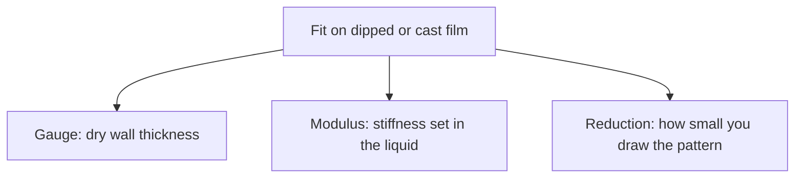
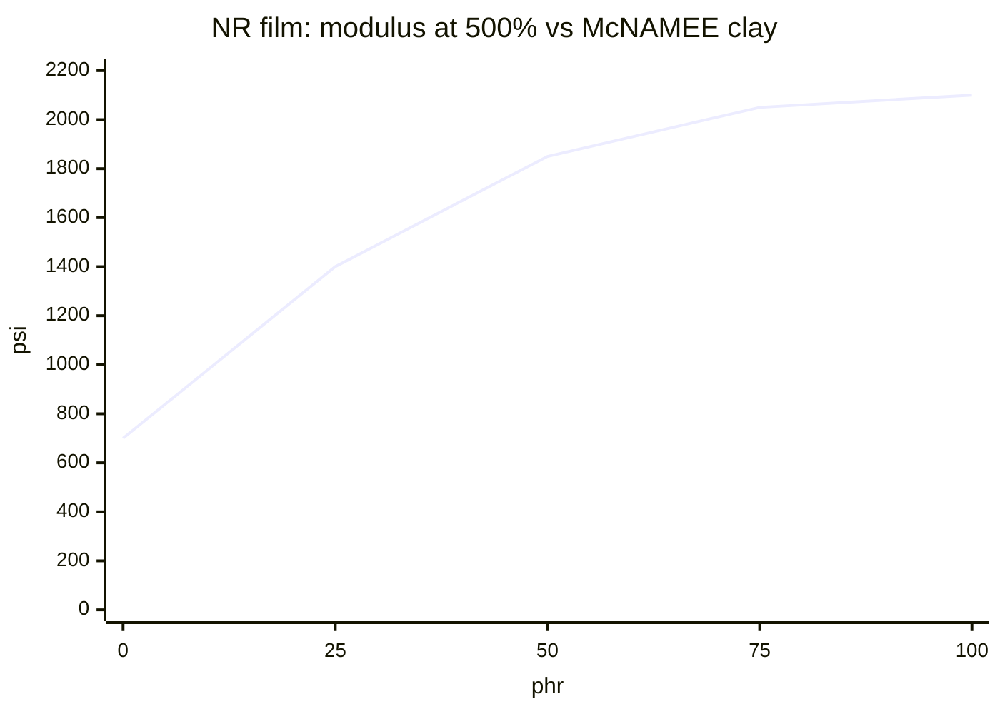
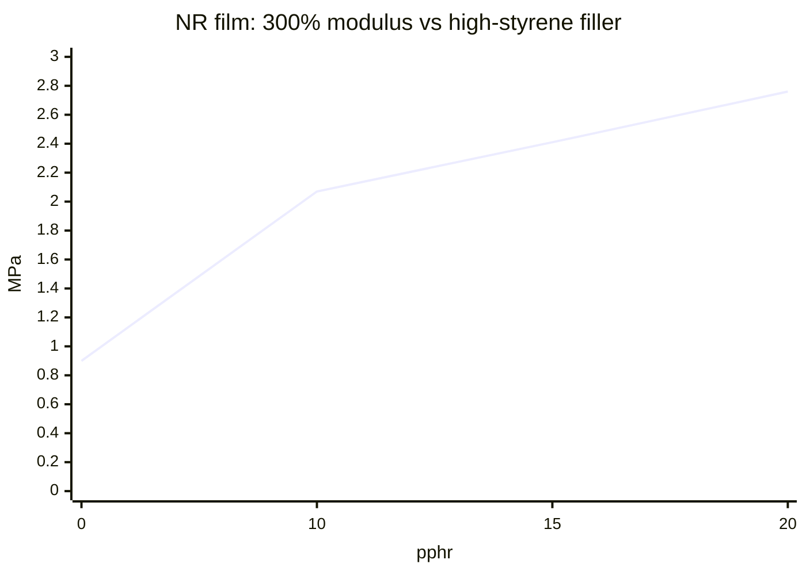
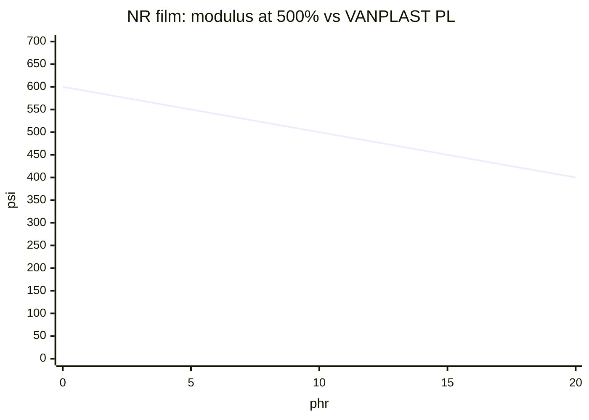

# Gauge, Modulus, and Reduction on Cast or Dipped Film

Human page: /literature-reviews/liquid-gauge-modulus-reduction

## Executive summary

On dipped, cast, or spread film, fit has three levers. Gauge is dry-wall thickness. Modulus is compound stiffness at a stated stretch. Reduction is pattern shrink versus body measurements.

A thicker wall, a stiffer compound, and a smaller pattern are different moves. Use when a piece feels boardy, bags after wear, or a thicker wall is treated as a tighter pattern.

## Gauge is formed-film thickness

Measure the dry wall in millimetres. Change dip, cast, or spread when the wall should change. Forming steps: [Home-cast latex film](/literature-reviews/liquid-home-cast-film) and [Coagulant dipping for wearable thickness](/literature-reviews/liquid-coagulant-dipping-wearable-thickness).

At unchanged modulus, a thicker wall of the same compound takes more force to bend and to reach the same body stretch. Gauge is geometry. The modulus number of the compound can stay the same.

## Modulus is set in the compound

Modulus is stress at fixed extension (MPa at 300%, psi at 500%). Higher modulus is boardier at the same gauge. Set this in the liquid before dip, cast, or spread.

**NR clay.** McNAMEE clay, 0 → 100 phr, modulus at 500% **700 → 2100 psi**, tensile **5000 → 2100 psi**.[^1]

**CR clay.** DIXIE clay, 0 → 50 phr, tensile **3100 → 1500 psi**, stress at 500% **500 → 1100 psi**.[^2]

**High-styrene SBR filler.** At 20 pphr in an NR film series: 300% modulus **0.90 → 2.76 MPa**, crescent tear **1156 → 1769 N/cm**, permanent set **6 → 30%**. The book calls that modulus rise a disadvantage for some latex uses.[^3]

**Plasticizer.** VANPLAST PL, 0 → 20 phr, modulus at 500% **600 → 400 psi**, tensile **4400 → 2800 psi**.[^4]

**MG graft latex.** Methyl-methacrylate-graft NR. MG 30 / MG 49. At ≥0.5 mm dry thickness, the highest graft for a continuous crack-free film is MG 15, for standard polymerization catalysts and concentrated NR latex; blend a high-MG latex with unmodified NR for a higher graft, which also raises tear. Films from MG latexes: higher hardness and modulus, lower tensile, worse tension set. Reinforcer use: high modulus and improved tear. Tubing modulus and household-glove puncture resistance.[^5]

Plant-film examples, not home mixing cards. Dispersion: [Pigment and filler compounding for liquid latex](/literature-reviews/liquid-pigment-filler-decks).

Vulcanized elastomeric film must stretch at least **2×** and return to about its original length.[^6]

## Reduction is pattern geometry

Reduction is negative ease: flat pieces drawn smaller than body measurements so the garment must stretch to close. A higher-modulus compound makes the same reduction feel tighter. High permanent set is less recovery: a snug draft can slump after wear.[^3]

## Which change

- Build thickness with dip, cast, or spread when the wall is too thin or too thick.
- Raise or lower modulus in the compound when gauge is right and hand is wrong. Clay and high-styrene filler stiffen. VANPLAST PL in the handbook series softens. Watch set if the piece must snap back.
- Change the pattern outline for a different shrink.
- Bagging after wear can follow set or aging. [Liquid latex aging, storage, and care](/literature-reviews/liquid-aging-storage-and-care).

## Endnotes

[^1]: Vanderbilt Latex Handbook — McNAMEE clay in an NR spread-film series; modulus at 500% up, tensile down.
[^2]: Vanderbilt Latex Handbook — DIXIE clay in a CR 750 series; tensile down, stress at 500% up.
[^3]: Polymer Latices: Science and Technology — Volume 3: Applications of Latices — high-styrene styrene-butadiene copolymer in NR films (Table 16.12); modulus, tear, and permanent set rise together.
[^4]: Vanderbilt Latex Handbook — VANPLAST PL in an NR spread-film series; modulus at 500% and tensile fall as phr rises.
[^5]: Vanderbilt Latex Handbook — MG latex; MG 30 / MG 49; at 0.5 mm or more, continuous crack-free film is MG 15 for standard-catalyst concentrate unless blended with NR; films from MG latexes have higher hardness and modulus, lower tensile, worse tension set; reinforcer modulus and tear; tubing and household-glove puncture resistance.
[^6]: Vanderbilt Latex Handbook — vulcanized elastomeric film stretches to at least twice its length and returns to about the original length.

Deep dive: McNAMEE clay in natural rubber

NR spread films, warm air 15 minutes at 93 °C.[^1]

| phr clay | Tensile (psi) | Modulus at 500% (psi) |
| --- | --- | --- |
| 0 | 5000 | 700 |
| 25 | 4600 | 1400 |
| 50 | 4000 | 1850 |
| 75 | 3200 | 2050 |
| 100 | 2100 | 2100 |

Deep dive: DIXIE clay

CR 750, warm air 60 minutes at 127 °C.[^2]

| phr clay | Tensile (psi) | Stress at 500% (psi) |
| --- | --- | --- |
| 0 | 3100 | 500 |
| 25 | 1800 | 600 |
| 50 | 1500 | 1100 |

Deep dive: High-styrene filler

NR films, 15 minutes at 93 °C.[^3]

| pphr filler | Modulus at 300% (MPa) | Crescent tear (N/cm) | Permanent set (%) |
| --- | --- | --- | --- |
| 0 | 0.90 | 1156 | 6 |
| 10 | 2.07 | 1489 | 20 |
| 15 | 2.41 | 1664 | 22 |
| 20 | 2.76 | 1769 | 30 |

Deep dive: VANPLAST PL

NR spread films, warm air 20 minutes at 93 °C. Not a garment dose.[^4]

| phr VANPLAST PL | Tensile (psi) | Modulus at 500% (psi) |
| --- | --- | --- |
| 0 | 4400 | 600 |
| 5 | 4200 | 550 |
| 10 | 3800 | 500 |
| 15 | 3300 | 450 |
| 20 | 2800 | 400 |

Deep dive: MG graft latex

MG 30 / MG 49. At ≥0.5 mm, continuous crack-free film stops at MG 15 for standard-catalyst concentrate graft; blend with unmodified NR for a higher graft (tear rises too). Films from MG latexes: higher hardness and modulus, lower tensile, worse tension set. Reinforcer: high modulus and improved tear. Tubing and household-glove puncture resistance.[^5]

