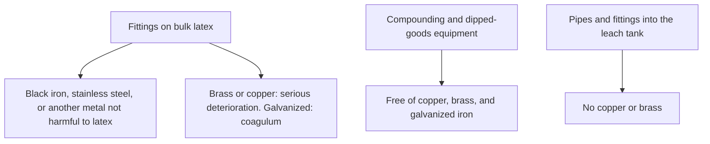
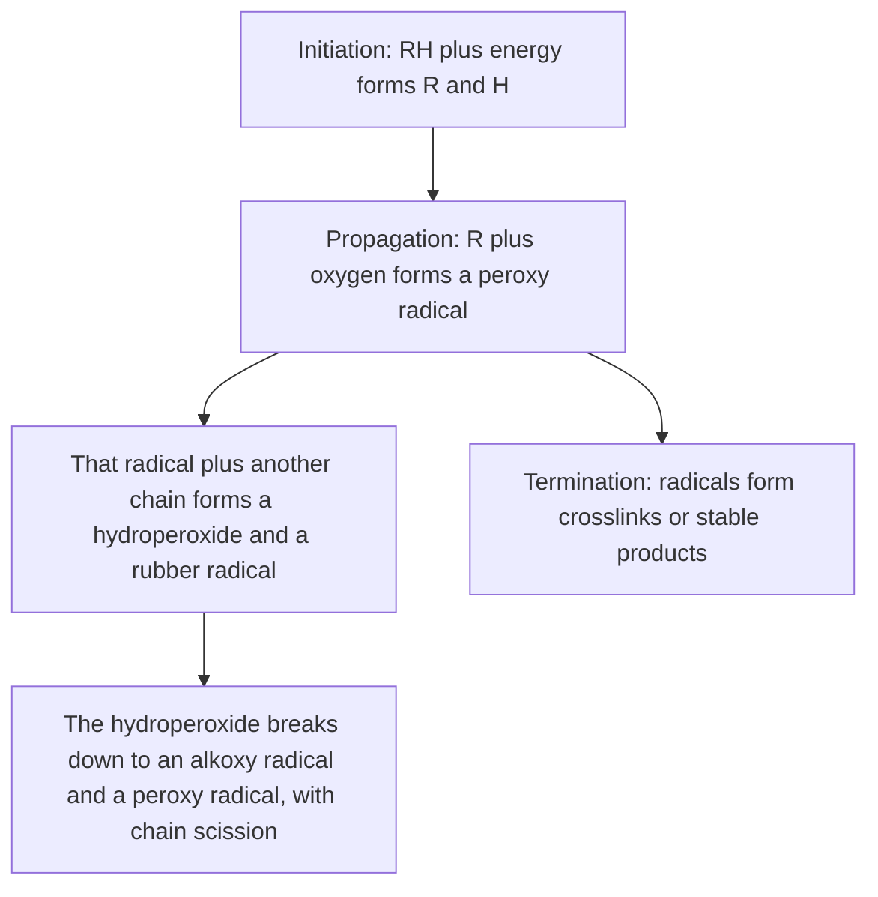

# Liquid Hardware & Metal Contact

Human page: /literature-reviews/liquid-hardware-metal-contact

## Executive summary

Wet latex, leach water, and fresh dipped or cast film: brass and copper fittings deteriorate rubber still in the latex; galvanized iron forms coagulum.[^1][^2] A dithiocarbamate accelerator leaves a wet deposit that stains brown from minute copper.[^5] Dry film: fatty-acid salts of copper, cobalt, manganese, and iron catalyze autocatalytic oxidation.[^3]

Sheet snaps: [Sheet Hardware & Metal Contact](/literature-reviews/sheet-hardware-metal-contact). Contact grid: [Compatibility Matrix](/literature-reviews/compatibility-matrix-metals-oils-plastics).

## Wet latex and leach water

Acceptable metals named for fittings that touch latex: black iron, stainless steel, or another material not harmful to latex. Brass or copper fittings: serious deterioration of the rubber in the latex. Galvanized fittings: coagulum.[^1]

Compounding and process equipment for dipped goods: free of copper, brass, or galvanized iron. The leach tank takes those same metal comments. Fittings and pipes that bring water in must not contain copper or brass. Do not reuse leach water unless leached materials have been removed.[^2]

In coagulant dipping, the leach washes coagulant salt from the gelled film before drying.[^2]

## Copper stain on a fresh deposit

Dithiocarbamate accelerators: deposits become superficially brown from minute traces of copper or copper compounds. Attributed to copper(II) dithiocarbamates. Not-yet-dry deposits are especially prone. Coin-trace copper on hands is enough. Stated remedy: do not use dithiocarbamate accelerators.[^5]

Dipped or cast film. Fasteners on bought sheet: the sheet sibling.

Certain thiazole accelerators, notably MBTS and CHBS, activated by thiourea, are sufficiently active at 100°C to be potentially of interest. The products are less susceptible to copper staining than products that contain dithiocarbamates and thiuram sulphides.[^6]

Deep dive: Latex thread and tap water

Zinc dialkyldithiocarbamates accelerate latex thread and also protect the vulcanizate as antioxidants. They are believed to stain thread in service: dialkyldithiocarbamate moieties plus copper(II) from tap water form highly colored copper(II) dialkyldithiocarbamates. A thiazole (potassium 2-mercaptobenzthiazolate) plus a thiophosphate (zinc dibutylphosphodithioate or sodium di-isopropyldithiophosphate) produced thread of moderate strength and low modulus that did not show copper staining.[^7]

A heat-resistant thread formulation forms further zinc diethyldithiocarbamate from tetramethylthiuram disulphide plus zinc oxide, leaving more dithiocarbamate than is desirable for copper staining in use. Copper-containing textile dyes can aggravate oxidative aging. An antioxidant that protects against trace-metal catalysis is recommended for thread.[^7]

Where dithiocarbamate remains, staining stays a problem. Less-susceptible systems are the 1997 follow-through on leaving the class out.[^5][^6][^7]

Deep dive: 1966 and 1997 on the remedy

*High Polymer Latices* (1966), Vol 1, agrees on brown copper dithiocarbamates, wet deposits, and coin-trace copper, and names Philpott (1962) suggestions without quoting them. The 1997 wording is the remedy this page follows.[^8][^5]

## Dry film

Fatty-acid salts of copper, cobalt, manganese, and iron catalyze autocatalytic oxidation.[^3] Duangthong et al. is a copper spectrophotometry method. Its introduction cites earlier reports for copper oleate catalysis, container dark spots, and a TIS copper cap of ≤8 mg/kg total solids. Those lines are not that paper’s result, and they are not the fatty-acid-salt sentence.[^4]

NR or CR latex film expected to meet copper (or other metal): **2 phr** total antioxidant. 1 phr against oxidation, 1 phr held against copper. Antioxidant is consumed by oxidation; a film that starts with only 1 phr can fail early once copper arrives. AGERITE WHITE or VANOX 2246 alone at 2 phr; in a blend, either of those two at 1 phr.[^3]

Aging morphology: [Liquid Aging, Storage and Care](/literature-reviews/liquid-aging-storage-and-care).

Deep dive: Oxidation chain

Autocatalytic oxidation as drawn for latex film: initiation (RH plus energy forms R and H), propagation (R plus O₂ forms ROO·; ROO· plus RH forms ROOH and a rubber radical), hydroperoxide breakdown to an alkoxy radical and a peroxy radical with chain scission, termination to crosslinks or stable products. Phenolic or amine antioxidants, and some accelerators, remove peroxide in the paragraph after the drawing. The metal salts above catalyze this chain. The scheme is the general path.[^3]

---

## Endnotes

[^1]: *The Vanderbilt Latex Handbook*, 3rd ed., Mausser, 1987. Reception and storage of bulk latex: black iron, stainless steel, or another material not harmful to latex; brass or copper fittings cause serious deterioration; galvanized fittings cause coagulum.
[^2]: *The Vanderbilt Latex Handbook*, 3rd ed., 1987. Dipped-goods equipment free of copper, brass, or galvanized iron. Leach tank: those metal comments apply. Fittings and pipes must not contain copper or brass. Leach water not reused unless leached materials are removed. Leach removes coagulant from gelled film in coagulant dipping.
[^3]: *The Vanderbilt Latex Handbook*, 3rd ed., 1987. Antioxidants: fatty-acid salts of copper, cobalt, manganese, and iron catalyze autocatalytic oxidation; oxidation chain (initiation, propagation, hydroperoxide, scission, termination); 2 phr total antioxidant for copper or other metal degradation of NR or CR film (1 phr oxidation + 1 phr copper reserve); AGERITE WHITE and VANOX 2246.
[^4]: Duangthong, Supunnee, et al. “Simple digestion and visible spectrophotometry for copper determination in natural rubber latex.” *ScienceAsia* 43 (2017): 369–376. https://doi.org/10.2306/scienceasia1513-1874.2017.43.369 Introduction cites earlier reports: CuO and copper oleate; catalysis mainly from copper oleate; container dark spots; TIS copper ≤8 mg/kg total solids. Not this paper’s result.
[^5]: *Polymer Latices: Science and Technology — Volume 3: Applications of Latices*. 2nd ed. D. C. Blackley, 1997. Dithiocarbamate accelerators: superficial brown stain from minute copper; copper(II) dithiocarbamates; wet deposits; coin traces; no obviation other than not using dithiocarbamate accelerators.
[^6]: Blackley, *Polymer Latices* Vol 3, 1997. Certain thiazoles, notably MBTS and CHBS, activated by thiourea, sufficiently active at 100°C to be potentially of interest; products less susceptible to copper staining than dithiocarbamate and thiuram sulphide products.
[^7]: Blackley, *Polymer Latices* Vol 3, 1997. Miscellaneous applications, latex thread: tap-water copper(II) stains residual dialkyldithiocarbamate; thiazole plus thiophosphate threads that did not show the stain; extra dithiocarbamate from tetramethylthiuram disulphide plus zinc oxide higher than desirable; copper-dyed textile fibers; trace-metal antioxidant.
[^8]: *High Polymer Latices: Their Science and Technology*. 2 vols. D. C. Blackley, 1966. Vol 1 dithiocarbamate section: same stain account; Philpott (1962) suggestions not quoted. Legacy. Does not override the 1997 remedy.
