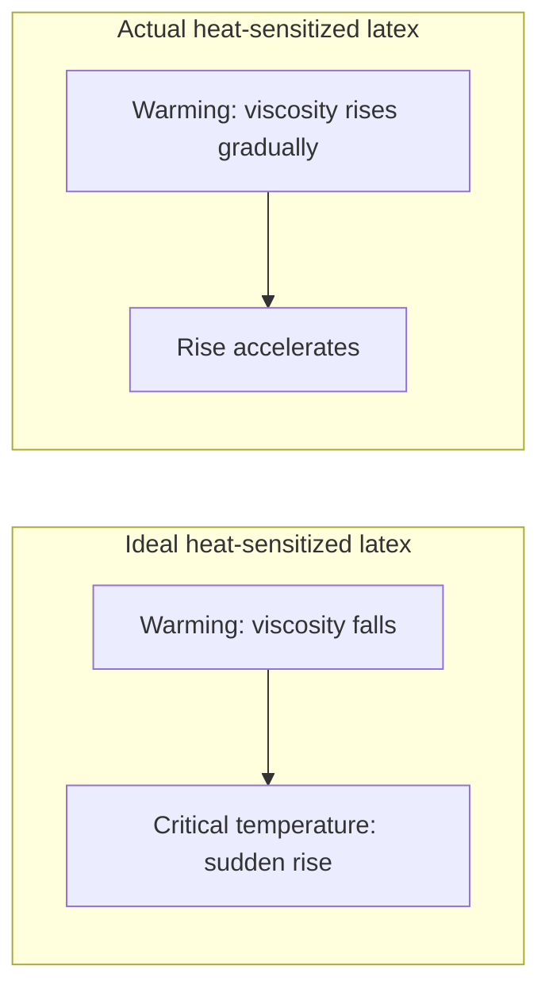
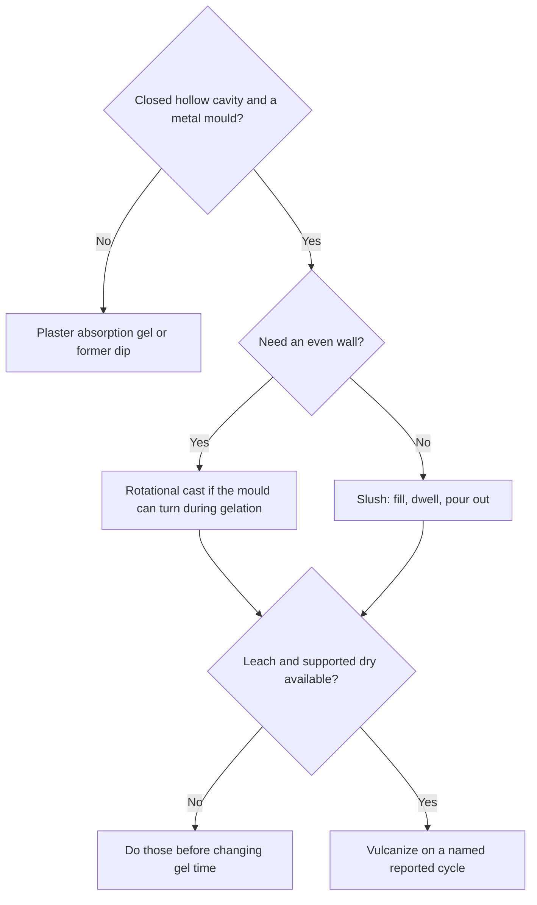
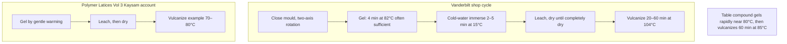

# Heat-Sensitized Gelation

Human page: /literature-reviews/liquid-heat-sensitized-gelation

> **Safety.** Vanderbilt Kaysam cycle: ammonium nitrate just before use; do not entrain air.[^v] De-aerate before the ammonium-salt solution.[^k] Heated closed mould: burn risk.

## Executive summary

Heat-sensitized liquid-latex compound gels from mould heat in a closed metal cavity.[^pl] Slush: fill, dwell, pour out; thickness tracks colloid stability and cavity geometry.[^pl] Rotational: metered compound, multi-axis rotation; thickness tracks compound mass versus cavity area.[^pl] After gel: leach, dry until completely dry, vulcanize. Support through leach, dry, and vulcanize.[^v][^k] Vulcanizing temperature is not a single reported value.[^v][^k][^s] Plaster-mould cast parts blister if vulcanized wet.[^v] Kaysam pages require a complete dry and do not say blister.[^v]

Use after [Former dip, mould cast, and flat spread](/literature-reviews/liquid-former-dip-vs-mould-cast-vs-flat-spread). Former dipping is a different operation: [Coagulant dipping](/literature-reviews/liquid-coagulant-dipping-wearable-thickness).

## When do you cast with a heat-sensitized compound?

Heat-sensitized cast: sensitizer in the compound, heat from a closed metal mould.[^pl] Plaster: water absorption plus calcium-ion diffusion; deposit grows from the mould face; surface erodes; short runs.[^pl] Light-alloy moulds with heat-sensitive compounds suit long runs. Deposit rate depends on mould temperature, heat capacity, and degree of heat sensitivity.[^pl] Rotational casting in plaster is seldom used (mass and fragility).[^pl] Moulded latex is meant to copy the cavity interior. Dipped latex copies the former; the exterior is a blurred replica unless the article is turned inside out.[^pl]

Sensitizer families:

- Kaysam patents: ammonium chloride, nitrate, carbonate, or acetate, plus insoluble zinc (zinc carbonate or zinc oxide) and at least 0.5% free fixed alkali.[^k] Vanderbilt shop cycle: 20% ammonium nitrate just before use.[^v]
- Slush pair: zinc-ammine versus polyvinyl methyl ether.[^s]
- International Latex: preformed zinc-ammine in ammonia-preserved natural rubber; shelf life about 7 days unless a small ethoxylate stabilizer is added.[^o]
- Chassaing: after maturation, 2–4 parts zinc oxide per hundred rubber; gel about 85°C; slush or rotational heated metal moulds.[^o]

Ideal versus actual curve is High Polymer Latices (1966).[^h] It does not set gel time or vulcanizing temperature. On process numbers, Vanderbilt (1987) and Polymer Latices Vol 3 (1997) outrank it.[^h]

## How do you choose slush or rotational casting?

Slush thickness control is poorer within and between articles. Returned compound is slightly destabilized on each pass; cavity geometry can build deposit faster in some regions.[^pl] Cool excess compound before returning it to the bulk.[^s] Metal slush, Table 23.5 class: mould 90–100°C, gel 2–5 minutes by desired thickness; Formulation A zinc-ammine, Formulation B polyvinyl methyl ether.[^s]

Rotational: only enough compound to form the article; rotate about several axes; all of it gels as a more uniform layer. Thickness is set by quantity versus cavity area, provided a deposit can form.[^pl] Used where uniformity matters. Balloon example: pure magnesium moulds, chosen over aluminium for alkaline corrosion resistance, plus lightness, conductivity, strength, and resistance to distortion.[^pl]

Hollow-article patent: non-porous mould, two-axis rotation, ammonium-salt sensitizer, gel during rotation.[^k] Footwear patent: heated shell, unheated core; dry and vulcanize on the core to limit shrinkage.[^k]

## How do you run a heated closed-mould cycle?

Vanderbilt Kaysam: ammonium nitrate just before use, no entrained air; close mould; biaxial rotation; 4 minutes at 82°C often sufficient; immerse the mould in cold water 2–5 minutes at 15°C; remove wet gel.[^v] De-aerate before the ammonium-salt solution.[^k] The 4 minutes at 82°C step is this Vanderbilt cycle only.

Vulcanizing reports, unresolved (same industrial-handbook tier for Vanderbilt and Polymer Latices Vol 3):

| Report | Scope | Temperature |
| --- | --- | --- |
| Vanderbilt Latex Handbook | Kaysam shop cycle | 20–60 min at 104°C, by wall thickness[^v] |
| Polymer Latices Vol 3 | Kaysam patents | example 70–80°C[^k] |
| Polymer Latices Vol 3 | Kaysam formulation table | 60 min at 85°C[^k] |
| Polymer Latices Vol 3 | Metal slush alternative finish | appropriate period at 100°C after dry at 40–50°C and a cold wash[^s] |

“Just before use” is the Vanderbilt ammonium-nitrate step.[^v] International Latex preformed zinc-ammine is the about-7-day shelf life, extended with ethoxylate.[^o]

Kaysam patent compound: pour before thickening; gentle warm gel; heavy filler allowed; extra water for pourability and de-aeration.[^k] A much higher ammonium nitrate level can gel the compound in about 10 minutes at ambient. That level is past the heat-triggered working point.[^k]

## What do you do after the gel forms?

Leach. Vanderbilt: running water 15–27°C, time by gel gauge.[^v] Reason: residual salts, especially ammonium nitrate, age the rubber badly.[^k]

Dry completely before vulcanizing on the Kaysam cycle.[^v] The blister sentence is the plaster-mould cast-part note in the same moulded-goods chapter, not a Kaysam wording.[^v] Vanderbilt dry: 82°C for three or more hours, until completely dry. Support during leach, dry, and vulcanize.[^v] Slush alternative: dry 40–50°C, then cold wash, then vulcanize at 100°C.[^s]

Post-gel shrinkage up to 25% in one direction; may be anisotropic, especially during drying. Reduce with maximum filler, minimum water, and controlled gel, dry, and vulcanize. Drying and vulcanizing on a core is one patent control.[^k]

Ethoxylates limit ambient thickening of zinc oxide / ammonia / ammonium-salt slush compounds and still allow heat gel, because stabilization falls as temperature rises. They also limit premature gelation from returned warm excess. Cool the excess as well.[^s]

## Endnotes

[^v]: Vanderbilt Latex Handbook (1987, Mausser, 3rd ed.) — moulded-goods chapter: plaster-mould cast parts dried completely before vulcanizing to prevent blistering; Kaysam process for non-porous moulds (ammonium nitrate just before use, biaxial rotation, gel, cold-water cool, leach, dry until completely dry, support during leach dry and vulcanize, warm-air vulcanize). Kaysam pages do not say blister.
[^pl]: Polymer Latices Vol 3 (Blackley, 2nd ed., 1997) — latex moulding and casting: plaster versus light-alloy moulds; slush versus rotational classification; rotational balloon moulds and the rotation-equipment schematic.
[^s]: Polymer Latices Vol 3 (1997) — metal-mould slush, including the two heat-sensitized formulations (zinc-ammine and polyvinyl methyl ether), ethoxylate note, and the dry-then-wash-then-vulcanize finish.
[^k]: Polymer Latices Vol 3 (1997) — Kaysam process: patent family, leach and residual ammonium nitrate, shrinkage, two-axis hollow articles, dry-on-core footwear variant, de-aeration before the ammonium salt, formulation-table vulcanizing line.
[^o]: Polymer Latices Vol 3 (1997) — International Latex Processes (preformed zinc-ammine shelf life) and the Chassaing process (zinc oxide after maturation).
[^h]: High Polymer Latices (Blackley, 1966, 2 vols; legacy-not-primary) — heat-sensitising coacervants: ideal versus actual viscosity against temperature. Does not override 1987 or 1997 process numbers.
