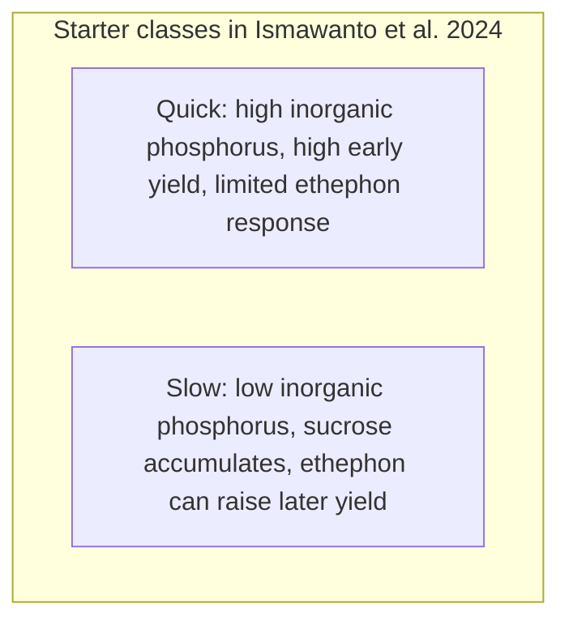
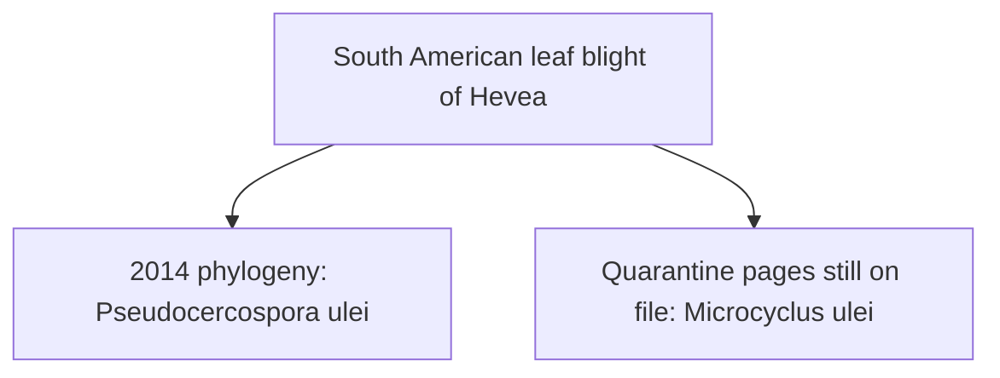

# The Hevea Rubber Tree

Human page: /literature-reviews/liquid-hevea-rubber-tree

> **Safety.** Seeds are poisonous until processed to remove cyanic poisons.[^2] Tree literacy for liquid latex. Not a food guide, planting manual, or medical advice.

## Executive summary

Natural-rubber liquid on the liquid pathway is from *Hevea brasiliensis*.[^1] [^3] Planted trees are usually bud-grafted clones from Wickham-derived germplasm.[^3] South American leaf blight constrained production in the neotropical centre of origin; Southeast Asian plantations carry most of the supply in that 2014 account.[^6] Asia–Pacific quarantine still files the fungus under *Microcyclus ulei*.[^7] [^8]

Related questions only: `liquid-plantation-tapping-field-latex`, `liquid-field-latex-to-concentrate`, `liquid-tree-to-liquid-latex`.

## Identity

- Accepted name: *Hevea brasiliensis* (Willd. ex A.Juss.) Müll.Arg., Euphorbiaceae, *Linnaea* 34: 204 (1865). WCSP data supplied 2024-06-04. Life form: tree. IUCN on that record: Least Concern.[^1]
- Milky juice / white latex in the bark; leaflets 3.[^1] [^2]
- Latex = cytoplasm of laticifer cells, about 30–40% cis-1,4-polyisoprene. Rings differentiate from the vascular cambium. NLR treated as positively correlated with rubber yield.[^3]
- This species reported as more than 98% of world natural-rubber production. About 2000 other rubber-producing plants named as context, including *Parthenium argentatum*, *Taraxacum kok-saghyz*, *Eucommia ulmoides*.[^3]
- Indigenous to the Amazon basin.[^3]

### Height (do not collapse)

| Source | Statement |
| --- | --- |
| Agroforestree 2009 | Plantations rarely exceed 25 m; wild trees over 40 m recorded[^2] |
| WFO, Flora of China text | Up to 30 m[^1] |
| WFO, Flora de Nicaragua text | To 20 m or more[^1] |
| WFO, Costa Rica manual text | 10–30 m[^1] |

### Flowers (do not collapse)

- WFO flora texts (Nicaragua, Costa Rica): monoecious.[^1]
- Agroforestree botanic paragraph: “dioecious.”[^2]
- Agroforestree biology: male and female flowers on the same inflorescence, ratio about 1:60–80; insect pollination; explosive dehiscence; example scatter 33 m.[^2]
- WFO, Brazilian Flora 2020 morphology: explosive fruit dehiscence.[^1]

Use monoecious / same-inflorescence for the tree. Keep the word dioecious visible as the conflicting botanic label.

### Native list (do not collapse)

- WFO native: northern and western South America, including French Guiana.[^1]
- Agroforestree native line: Bolivia, Brazil, Colombia, Peru, Venezuela.[^2]

### Climate (Agroforestree only; internal tension)

Humid lowlands roughly 15° N to 10° S. Prose: planting above 400–500 m not recommended. Biophysical line: altitude 300–500 m; 23–35°C; rainfall 1500–3000 mm (max 4000 mm). pH 4–8, better in acid soils; lime harmful. Drought tolerance 2–3 months in some areas.[^2]

### Diversity note

Cultivar π 5.61 × 10⁻³ versus wild 5.70 × 10⁻³ to 7.13 × 10⁻³; bud grafting cited as the main reason diversity held. Assembly clone CATAS8-79, 1.58 Gb.[^3]

## Clones

- Wickham seed from Boim, Brazil; Kew introduction 1876; most cultivars from Wickham collections. Bud grafting retains a selected tree. Sexual cycle >20–25 years. Fewer than four guided sexual recombinations in about 150 years.[^3]
- Yield summary in that paper: 650 kg rubber ha⁻¹ (1920s haphazard selections) to 2500 kg ha⁻¹ (elite cultivars by the 1990s). That is Chao et al.’s breeding-history summary.[^3]

Starter classes, Ismawanto et al. 2024:[^4]

| Class | What that paper states |
| --- | --- |
| Quick | High Pi, high early tapping yield, sucrose over-consumed, low long-term potential, limited ethephon response. Example parent: PB 260 |
| Slow | Low Pi, low initial yield, high sucrose, higher long-term potential if ethephon activates metabolism |
| Medium | Label for SP 217 in the PB 260 × SP 217 cross. Pi/Suc pair for “medium” is not defined in that definition passage |

Within-family genomic selection, Cros et al. 2019, **CIRAD notice abstract only** (journal PDF not opened):[^5]

- Cross PB 260 × RRIM 600; trials in Côte d’Ivoire (189 and 143 clones).
- Between-site accuracy 0.53 (all markers, all training clones); 0.56 with the 125–200 highest-heterozygosity markers.
- Simulation: +10.3% selection response on 3000 seedlings of that cross.
- Notice: further crosses, traits, and environments still required.

## South American leaf blight

- 2014 phylogeny: *Pseudocercospora ulei* (Henn.) Hora Junior & Mizubuti. Basionym *Microcyclus ulei*. Family Mycosphaerellaceae. Pycnidial morph described as spermatial.[^6]
- Main constraint in the neotropical centre of origin; world supply in that paper highly dependent on Southeast Asian plantations. Fordlandia cited as the historical plantation failure.[^6]
- APPPC RSPM No. 7 annex: *Microcyclus ulei*; “most destructive disease of rubber”; major constraint in South America; great economic damage if introduced to Asia–Pacific rubber countries. Appendix 2: 21 endemic countries, Belize through Venezuela, all Americas or Caribbean, including Brazil. Quarantine guideline, not a spray schedule.[^8]
- IPPC SGP-01/4 (Singapore only; updated 2021-01-05): pest name *Microcyclus ulei*. ISPM 8 (2021) line: “Absent: pest not recorded.” 2017–2020 summary: “Absent: no pest record (confirmed by survey).” 2005–2010: 1,208 leaf samples, no SALB. Do not extend the status beyond Singapore.[^7]

## Check rule

Height, the word dioecious, native-country lines, and the fungus genus stay qualified in the tables above. Quote the locus you use.

## Endnotes

[^1]: World Flora Online. *Hevea brasiliensis* taxon wfo-0000982080. WCSP data supplied 2024-06-04. https://www.worldfloraonline.org/taxon/wfo-0000982080

[^2]: Orwa et al. 2009. Agroforestree Database 4.0. *Hevea brasiliensis*. https://apps.worldagroforestry.org/treedb/AFTPDFS/Hevea_brasiliensis.PDF

[^3]: Chao et al. 2023. *Nature Communications*. https://doi.org/10.1038/s41467-023-40304-y

[^4]: Ismawanto et al. 2024. *Heliyon*. https://doi.org/10.1016/j.heliyon.2024.e33421

[^5]: Cros et al. 2019. *Industrial Crops and Products* 138. Locus used: CIRAD notice https://publications.cirad.fr/une_notice.php?dk=592947

[^6]: Hora Júnior et al. 2014. *PLOS ONE* 9(8): e104750. https://doi.org/10.1371/journal.pone.0104750

[^7]: IPPC. Official pest report SGP-01/4. Singapore. Last updated 2021-01-05. https://www.ippc.int/en/countries/singapore/pestreports/2012/09/south-american-leaf-blight-in-singapore/

[^8]: APPPC RSPM No. 7, Annex IV. http://assets.apppc.fao.org.s3-eu-west-1.amazonaws.com/public/1258605952394_26th_APPPC___Annex_IV_RSPM_No7_0.pdf
