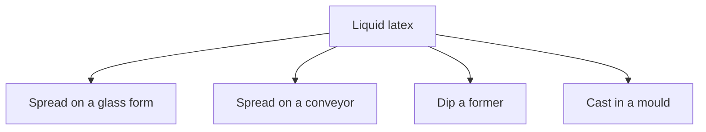

# Home-Cast Latex Film

Human page: /literature-reviews/liquid-home-cast-film

> **Safety.** Ammonia, coagulant salts, metal hygiene. No copper, brass, or galvanized iron on latex-contact equipment.[^1]

## Executive summary

Liquid pathway: form film from liquid latex by spreading on a glass form, spreading on a conveyor, dipping a former, or casting in a mould. Thickness is a process result.[^2][^3]

Pathway primer: [Forming film from liquid latex](/literature-reviews/liquid-film-pathway). Geometry: [Former dip, mould cast, and flat spread](/literature-reviews/liquid-former-dip-vs-mould-cast-vs-flat-spread).

## Glass-form spread

Routine comparison films: spread compounded latex in a glass form. Stainless-steel wire on a stainless-steel knife sets thickness. A 0.040 in wire gives about 0.015–0.020 in film at 40–60% total solids. Dry 16–25 h at 23 ± 2 °C and 50 ± 5% RH, dust with talc, lift from the glass.[^2]

Laboratory comparison method. The 50 ± 5% RH is this film’s dry, separate from the glove-plant band.[^2][^4]

## Anode and Teague

Dip-evaluation films use aluminum, glass, or glazed porcelain formers. Anode: coagulant then latex. Teague: latex first. Dwell sets thickness. Natural-latex coagulant example: 20% ethyl alcohol solution of calcium nitrate. Leach before vulcanizing: changing water bath, 20–30 min at 40–50 °C.[^3]

The handbook states the two orders. It does not state a gel-structure difference.

## Conveyor sheet

US 2,415,028: spread prepared latex on an endless conveyor; gel, vulcanize, and dry; later passes can add plies.[^5]

US 2,129,607: spread latex on a belt; each coat dried before the next coat; thin coats dry more readily and localize defects.[^6]

## Coagulant dip

Most dipped articles with dry film thicker than 8 mils use coagulant because build is faster.[^4]

Wet gel gauge: % total solids, coagulant strength, dwell. Viscosity and withdrawal speed limit variation. Air in the compound produces pinholes (glove reject). Glove plant: 20–26 °C and 45–50% RH. High RH retains moisture and retards vulcanization. Low RH surface-dries the first dip and hurts second-dip lamination.[^4]

See [Coagulant dipping for wearable thickness](/literature-reviews/liquid-coagulant-dipping-wearable-thickness).

## Cavity cast

Moulding and casting: latex gels in a cavity; exterior copies the cavity; practice is mostly hollow articles because thick deposits are hard to dry; primarily natural rubber latex.[^7]

Plaster: water absorption plus calcium ions; mould erodes, short runs. Light alloy (aluminum or magnesium) with heat-sensitive compound; rate depends on mould temperature, heat capacity, and heat sensitivity; long runs.[^7]

See [Heat-sensitized gelation](/literature-reviews/liquid-heat-sensitized-gelation).

Plaster-mould series, fixed residence time: casein held at 0.5 parts per hundred rubber, thickness 1.05 mm at 0 whiting and 2.4 mm at 300 parts whiting. Variable-casein series (casein below 0.5 at low whiting, up to 0.5 at 300): 1.3 mm at 0 whiting and 2.4 mm at 300. Total solids rose with whiting, so filler and solids are not separated.[^8]

Slush moulding (fill, dwell, pour out fluid latex) controls thickness less tightly than rotational casting.[^7]

Defects: [Liquid film defects](/literature-reviews/liquid-film-defect-atlas).

## Endnotes

[^1]: Vanderbilt Latex Handbook, 3rd ed. (1987) — compounding and processing equipment free of copper, brass, or galvanized iron.
[^2]: Vanderbilt Latex Handbook, 3rd ed. (1987) — laboratory procedures: glass-form spread, wire on the knife, dry conditions.
[^3]: Vanderbilt Latex Handbook, 3rd ed. (1987) — dip-evaluation films: Anode, Teague, calcium nitrate coagulant, leach.
[^4]: Vanderbilt Latex Handbook, 3rd ed. (1987) — dipped gloves: coagulant above 8 mils, wet-gauge levers, pinholes, 45–50% RH.
[^5]: US Patent 2,415,028. Firestone Tire & Rubber Company. Method of making sheet material (1947).
[^6]: US Patent 2,129,607. Mishawaka Rubber and Woolen Manufacturing Company. Method of making rubber articles (1938).
[^7]: *Polymer Latices: Science and Technology — Volume 3: Applications of Latices*. 2nd ed. D. C. Blackley (1997) — latex moulding and casting; plaster versus light-alloy moulds; slush versus rotational casting.
[^8]: *Polymer Latices* Volume 3 (1997) — plaster-mould deposit thickness versus whiting and casein, with the total-solids confound.
