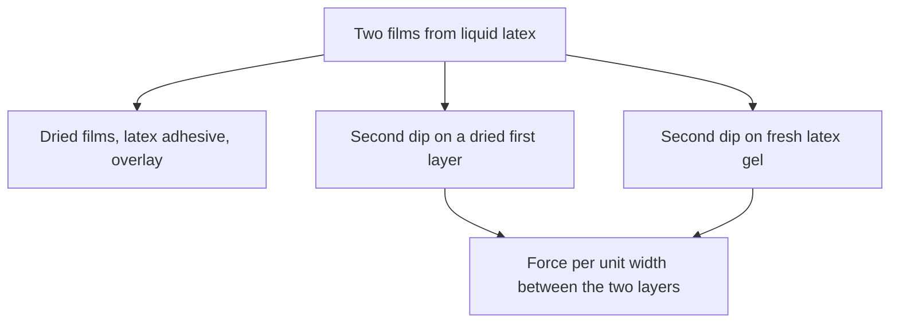

# Liquid Latex–Latex Adhesion Testing

Human page: /literature-reviews/liquid-latex-latex-adhesion-testing

> **Safety.** Ammonia-preserved natural rubber latex has a powerful odour.[^8] Read the product SDS. See [Liquid ventilation and ammonia](/literature-reviews/liquid-ventilation-ammonia).

## Executive summary

Two films from liquid latex (dip, cast, or spread). Record the coupon class with the peel. The verified multi-dip measure is force per unit width between successive natural-rubber layers.[^1] Dry time, leach, carboxylate soap, and prevulcanization travel with that number.[^1] Glove-room temperature and humidity are a separate lamination sentence.[^2] Angle, speed, and specimen width are named on [Peel test methods](/literature-reviews/adhesion-peel-test-methods). Bought-sheet cement is [Sheet latex–latex adhesion testing](/literature-reviews/sheet-latex-latex-adhesion-testing).

## Questions this article answers

- [Which coupon am I peeling?](#coupon)
- [What has to travel with a multi-dip peel?](#conditions)
- [Which sentence owns this number?](#sentence)

## Which coupon am I peeling? {#coupon}

### How

Three coupons:

1. Dried films, latex adhesive, overlay. Family choice: [Liquid adhesives](/literature-reviews/liquid-adhesives-and-seam-integrity). Shoe and foxing tables are mixing recipes.[^12] The reported film peel is the two-layer dip.[^1]
2. Second dip on a dried first layer.
3. Second dip on fresh latex gel.

Coupons 2 and 3 are the Gazeley set Blackley reports: successive natural-rubber dips, including straight and coagulant combinations, unvulcanized and sulphur-prevulcanized. Assessment: force per unit width to peel one layer from the other. The page does not print a separate value per combination.[^1]

### Why

Bond strength fell rapidly as the first layer dried. Leaching aggravated that. Risk is greater with latices of different types and is still present with a single type. The reported close is the strongly hydrophilic fresh latex gel.[^1]

### Detail: What the peel sentence contains

Detail: Force per unit width, and what sits on other pages

Page 210 states force per unit width. It does not state angle, speed, specimen width, or a pass/fail value. Method names: [Peel test methods](/literature-reviews/adhesion-peel-test-methods).

Mud-cracking is the deposit cracking as it dries when the wet-gel strength of that layer is too low to resist contraction.[^3] Lower tensile, extension at break, and tear of highly prevulcanized deposits are film strength.[^4] Laboratory sulphur-prevulcanized latex bonded less well than unvulcanized postvulcanizable latex. Industrial sulphur-prevulcanized latices bonded more strongly than those laboratory prevulcanizates, and that bond fell as vulcanization increased.[^1] A continuous film during dipping did not necessarily show that the first layer was well wetted. High viscosity can mask poor wetting.[^1]

## What has to travel with a multi-dip peel? {#conditions}

### How

With a two-layer dip peel, record first-layer dry time, whether that layer was leached, potassium caprylate or another carboxylate soap, and laboratory versus industrial sulphur-prevulcanization.[^1] A short dry was enough for a significant loss.[^1]

Dipped gloves: ideally 20–26°C and 45–50% relative humidity. Low humidity can surface-dry the first dip and spoil lamination of a second compound. Polychloroprene needs more ambient dry time than natural rubber.[^2] Room band, not a peel pass/fail.

Adhesive joins: wet combine (faces meet while the latex adhesive is wet) or dry combine (adhesive film dries on each face first).[^5]

### Why

The dip peel and the glove humidity sentence answer different questions. One is force per unit width after a stated first-layer history.[^1] The other is whether the first dip’s surface dried before the second compound.[^2]

### Detail: Wet combine, dry combine, and the duck peel

Detail: The peel beside the combining definition

Tackifiers show more advantage in dry combining.[^5] The 180° peel in that discussion is two layers of duck with polychloroprene latex.[^6] Vanderbilt wet combining and dry combining formulas there are fabric layers.[^7] Sol polychloroprene adhesive films tend to higher tear and peel strength than gel polymers, from higher extension at break.[^8] That grade sentence is not the natural-rubber dip peel.

## Which sentence owns this number? {#sentence}

### How

| Measurement | Sentence |
| --- | --- |
| Two natural-rubber dip layers | Force per unit width, multi-dip delamination[^1] |
| Glove-room second-dip lamination | Ideally 20–26°C and 45–50% relative humidity[^2] |
| Wet combine or dry combine | When the faces meet the adhesive film[^5] |

Also: [Peel test methods](/literature-reviews/adhesion-peel-test-methods), [Liquid reinforcement](/literature-reviews/liquid-reinforcement-laminate-zones), [Liquid delamination](/literature-reviews/liquid-delamination-seam-failure), [Liquid latex–substrate adhesion testing](/literature-reviews/liquid-latex-substrate-adhesion-testing), [Sheet latex–latex adhesion testing](/literature-reviews/sheet-latex-latex-adhesion-testing).

### Why

The duck peel and the rayon-cord sentences stay on those joints.[^6][^9][^10]

### Detail: Two handbook disagreements that stay open

Detail: Casein wording and the 1966 duck peel

1997: latex-casein abrasive, high-tenacity rayon (Gardner, Herbert and Wake).[^9] 1966: latex-casein adhesive, same observation.[^10] Neither wording wins. The joint is cord.

1966 Fig. XIV.1: duck-to-duck peel, polychloroprene with asphalt, one curve.[^11] 1997 Fig. 22.1: 180° peel, two layers of duck, three tackifiers.[^6] 1966 magnitudes do not override 1997. Keep each curve on its own page, and keep both off the dip peel.[^1]

## Sources

- *The Vanderbilt Latex Handbook*. 3rd ed. Edited by Robert Francis Mausser. Norwalk, CT: R.T. Vanderbilt Company, 1987. https://lccn.loc.gov/92117844
- *Polymer Latices: Science and Technology — Volume 3: Applications of Latices*. 2nd ed. D. C. Blackley. Chapman & Hall / Springer, 1997. https://books.google.com/books?id=Y2VPGj7YbykC
- *High Polymer Latices: Their Science and Technology*. 2 vols. D. C. Blackley. London: Maclaren; New York: Palmerton, 1966. https://lccn.loc.gov/66077950

## Endnotes

[^1]: Blackley, *Polymer Latices: Science and Technology — Volume 3: Applications of Latices*, 2nd ed., 1997. Multi-dip delamination: Gazeley, force per unit width, dry, leach, potassium caprylate, prevulcanization, wetting masked by viscosity. Auditor: `research/draft.auditor.md`.

[^2]: Mausser, ed., *The Vanderbilt Latex Handbook*, 3rd ed., 1987. Dipped-glove plant temperature and humidity; second-dip lamination; polychloroprene ambient dry time.

[^3]: Blackley, *Polymer Latices* Volume 3, 1997. Mud-cracking and wet-gel strength of one deposit.

[^4]: Blackley, *Polymer Latices* Volume 3, 1997. Tensile, extension at break, and tear of highly prevulcanized deposits; blend wet-gel strength.

[^5]: Blackley, *Polymer Latices* Volume 3, 1997. Dry combining and wet combining definitions.

[^6]: Blackley, *Polymer Latices* Volume 3, 1997. Figure 22.1: 180° peel, two layers of duck, polychloroprene latex, three tackifiers.

[^7]: Mausser, ed., *The Vanderbilt Latex Handbook*, 3rd ed., 1987. Wet combining and dry combining of fabric layers.

[^8]: Blackley, *Polymer Latices* Volume 3, 1997. Sol versus gel polychloroprene: tear and peel strength of the adhesive film. Same chapter: ammonia-preserved natural rubber latex gives adhesives a powerful odour.

[^9]: Blackley, *Polymer Latices* Volume 3, 1997. Latex-casein abrasive, high-tenacity rayon.

[^10]: Blackley, *High Polymer Latices: Their Science and Technology*, 2 vols., 1966. Latex-casein adhesive, same rayon observation. Legacy. Does not override 1997 on the wording.

[^11]: Blackley, *High Polymer Latices*, 1966. Duck-to-duck peel, polychloroprene with asphalt. Magnitudes do not override the 1997 duck table.

[^12]: Mausser, ed., *The Vanderbilt Latex Handbook*, 3rd ed., 1987. Shoe adhesives and translucent foxing cement: mixing tables, no peel result.
