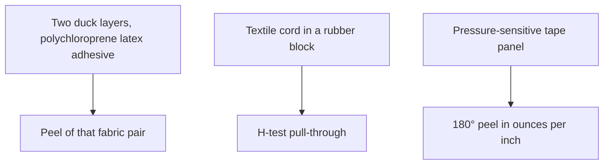
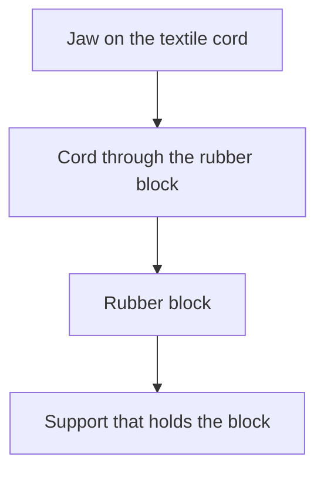
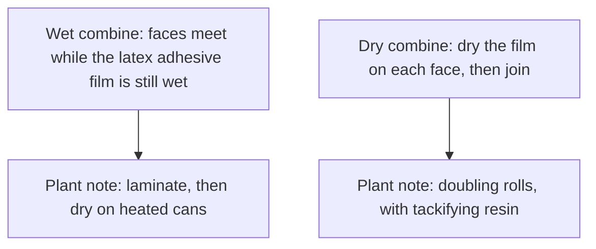

# Liquid Latex–Substrate Adhesion Testing

Human page: /literature-reviews/liquid-latex-substrate-adhesion-testing

## Executive summary

Liquid pathway. An adhesion number belongs to the liquid-latex film or the latex adhesive and to the substrate in that test.[^1][^2][^3]

Duck, 1997: 180° peel, two layers of duck, polychloroprene latex adhesive, axis N cm⁻¹.[^1] Duck, 1966: duck-to-duck peel, polychloroprene with asphalt, axis lb per inch. That sentence does not print a degree.[^2] Units stay separate. 1966 does not override 1997.

H-test: pull-through of a textile cord from a rubber block.[^1] Vanderbilt 180° peel: pressure-sensitive tape panel, oz/in.[^3]

Angle, speed, width, and failure-type names: `adhesion-peel-test-methods`. Those clauses were not opened here.

## What is this number attached to?

- 1997 caption: 180° peel, two duck layers, polychloroprene latex. Dry parts: polychloroprene 100, zinc oxide 5, antioxidant 2, sodium alkyl sulphate 1, tackifier variable. Curves: asphalt; rosin ester m.pt. 56°C; rosin ester m.pt. 83°C. Zero-tackifier table cells 31, 31, 31. Figure axis N cm⁻¹. T-shaped inset.[^1]
- 1966: peeling of a duck-to-duck combination, polychloroprene with asphalt. Table header lb wgt in.⁻¹; 0 parts asphalt = 16. Figure line: stabiliser 1. T-shaped inset. No “180°” in that sentence.[^2]
- Both attribute the figure to Ward and Doherty (1954). 1997 bibliography: Report No. 54-3.[^1][^4] Report not opened. Prints disagree. No conversion.

- H-test: force to extract a textile cord from a rubber block; geometry is an H. Comparisons of cords belong inside one block (between-slab variance dominated).[^1]
- Vanderbilt: 90° quick stick, 180° peel, Polyken tack, 178° shear. Tape sentence. 180° peel in oz/in. Face under the tape not named.[^3]
- Metals, glass, plastics: use list; extent unclear. No peel number on that page.[^1]
- Leather table: dry-combining shoe recipe; heat about 30 min at 100°C. Paper tables: wet combining, no tackifying resin.[^1]

### Detail: Cord pull-through

1966: static adhesion of latex-RF adhesives, example method the H-test, rises rapidly from 0 to 15 parts resin per 100 dry rubber, then changes little. Adjacent table has no unit in the text. Cells not quoted.[^2]

## Wet combine or dry combine?

Wet combine and dry combine definitions agree across the 1997 and 1966 adhesives chapters.[^1][^2] Vanderbilt plant sequences: heated cans for wet combining; doubling rolls and tackifying resin for dry combining.[^3] Duck figures are tackifier illustrations, not a labeled wet-versus-dry pair.[^1][^2] Tackifier advantage is described as clearer for dry combine.[^1][^2]

Shrink of textiles and wrinkle of paper: disadvantage list versus solvent adhesives.[^1] Spread coat: ribbing from uneven shrinkage; tension on a steam-heated drum.[^1] No percent for apparel cloth.

## When the number is only a sort

Adhesion number has its meaning only with the method.[^1] Static vs dynamic: rate of deformation. Static tests without prior fatigue are sorting tests. A pass does not imply tyre performance.[^1][^2]

Named dynamic procedures: Dunlop belt, Goodyear hose, Goodrich disc, Avon piece in a Goodrich Flexometer. Belt result is cord tensile loss; chapter calls it an indirect adhesion assessment and reports a tyre-fibre correlation.[^1]

Rayon: abrasion improves static adhesion; dynamic improvement needs a dip after abrasion. 1997 noun: latex-casein abrasive. 1966 noun: latex-casein adhesive. Neither noun wins.[^1][^2]

## Where the other question lives

| Question | Slug or article |
| --- | --- |
| Angle, speed, width, failure type | `adhesion-peel-test-methods` |
| Liquid-latex film to liquid-latex film | `liquid-latex-latex-adhesion-testing` |
| Bought sheet to another material, including solvent rubber cement | `sheet-latex-substrate-adhesion-testing` |
| Bought sheet to bought sheet | `sheet-latex-latex-adhesion-testing` |
| Cotton / filament bond science | Liquid latex–textile bonding |
| Adhesive choice, air, overlay | Liquid adhesives and seam integrity |
| A seam that has already peeled | Liquid delamination and seam failure |
| Contact with no peel number | Compatibility matrix |

## Sources

- *Polymer Latices: Science and Technology — Volume 3: Applications of Latices.* 2nd ed. D. C. Blackley. Chapman & Hall / Springer, 1997. <https://books.google.com/books?id=Y2VPGj7YbykC>
- *High Polymer Latices: Their Science and Technology.* 2 vols. D. C. Blackley. London: Maclaren; New York: Palmerton, 1966. <https://lccn.loc.gov/66077950>
- *The Vanderbilt Latex Handbook.* 3rd ed. Edited by Robert Francis Mausser. Norwalk, CT: R.T. Vanderbilt Company, 1987. <https://lccn.loc.gov/92117844>
- Ward, R. W. and Doherty, F. W. (1954). *Neoprene Latex Adhesives*, Report No. 54-3. E. I. du Pont de Nemours & Co. (Inc.), Wilmington, Delaware. Cited in *Polymer Latices* Volume 3. Report not opened.

## Endnotes

[^1]: *Polymer Latices* Volume 3 (1997), adhesives and spreading chapters: duck figure, wet/dry definitions, H-test, static sort, shrink and ribbing, leather and paper tables, rigid-adherend list, Ward and Doherty bibliography line.
[^2]: *High Polymer Latices* (1966): duck-to-duck peel in lb per inch; wet/dry definitions; latex-casein adhesive; latex-RF static adhesion by the H-test.
[^3]: Vanderbilt Latex Handbook (1987), adhesives chapter: wet and dry combining sequences; pressure-sensitive tape properties, 180° peel in oz/in.
[^4]: Ward and Doherty, Report No. 54-3 (1954), as named in the 1997 bibliography. Handbook prints of that figure disagree. Report not opened.
