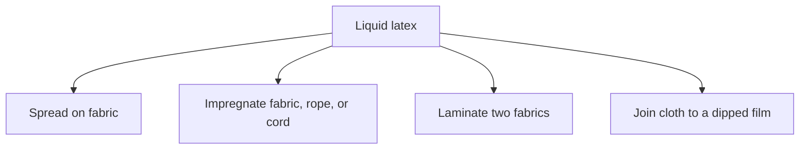
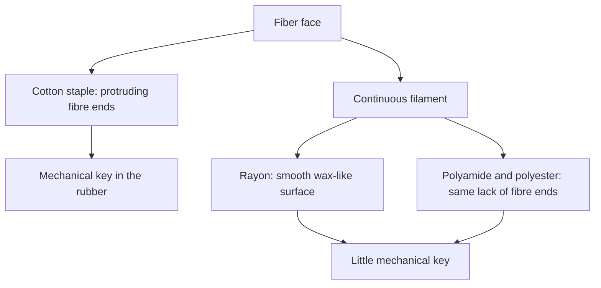
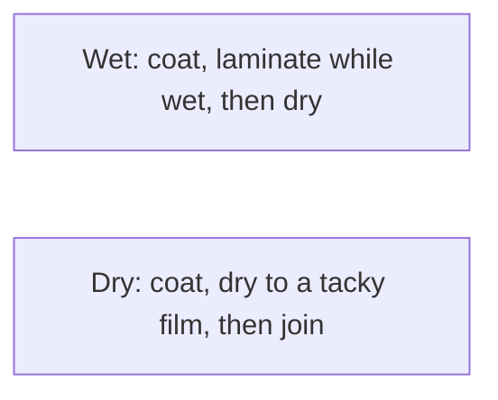
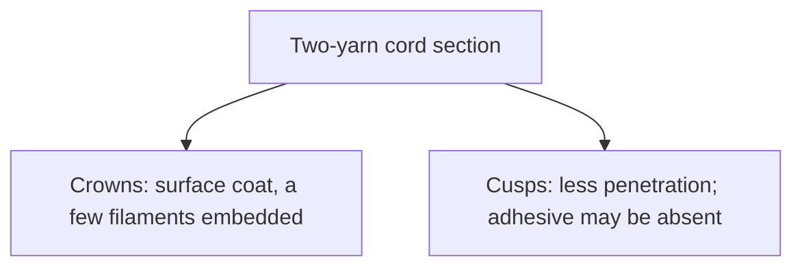

# Liquid Latex–Textile Bonding

Human page: /literature-reviews/liquid-latex-textile-bonding

> **Safety.** Water-based latex adhesives can freeze and shrink fabrics.[^1][^3] Ammonia exposure limits are substance data; whether a given bottle contains ammonia is a product SDS question.[^4] Skin: [Allergy and skin contact](/literature-reviews/allergy-and-skin-contact). Glue family: [Liquid adhesives](/literature-reviews/liquid-adhesives-and-seam-integrity).

## Executive summary

Liquid latex as adhesive, coating, or impregnant on cloth, or a dipped film joined to fabric. Cotton locks through protruding fibre ends; rayon, polyamide, and polyester are smooth filaments with a weak mechanical key.[^2][^5] Aqueous latices shrink textiles.[^1][^3] Wet and dry combining are plant operations.[^1]

## Questions this article answers

- [What are you doing with the liquid?](#job)
- [Cotton or a smooth filament?](#fiber)
- [Wet combine or dry combine?](#combine)
- [How do you read a lift?](#peel)
- [What is the factory pretreat?](#pretreat)

## What are you doing with the liquid? {#job}

### How

Spread on fabric, impregnate fabric or cord, laminate two fabrics with latex adhesive, or join cloth to a dipped film.[^6]

### Why

Compounded latexes for wet and dry combining.[^1] Latex adhesives: low cost, no flammable or toxic solvents, wetting of porous substrates; shrink textiles, freeze, poorer water resistance.[^3] Spreading and impregnation on the 1932 process map; vulcanized latex where heat or vulcanizing materials would injure fabric or color.[^6]

Detail: Already-wet surfaces

For paper and leather, latex adhesives can wet surfaces already wet with water.[^2][^5] Rubber-to-textile systems, stated separately: latex–casein or latex–resorcinol–formaldehyde.[^5]

## Cotton or a smooth filament? {#fiber}

### How

Cotton: mechanical key from fibre ends, plus shrink risk. Rayon, polyamide (nylon), polyester: weak mechanical key; match polarity on a slick face. NR is low polarity.[^1] Unknown finish: classify the face first.

| Cue | Cotton | Nylon / polyamide |
| --- | --- | --- |
| Face | Staple; protruding ends | Continuous filament |
| Bond idea | Mechanical embed | Weak key; polarity or chemical bridge |
| Aqueous | Pore entry; shrink | Same shrink class; slick face |

### Why

1997: cotton fibre ends protrude and bond mechanically when rubber is vulcanized against the textile; rayon is continuous-filament with a smooth, wax-like surface; polyamide and polyester likewise. The word nylon is absent on that page.[^2] 1966: same mechanism; polyamide named as nylon; polyester as Terylene or Dacron; “smooth, waxlike surface which does not present opportunity for mechanical bonding.”[^5] Porous: mechanical bond. Non-porous: matched polarity.[^3] Vanderbilt high polarity: NBR, XNBR, XSBR, PSBR. Low: NR, SBR, BR, IIR.[^1]

Detail: Abrasion on high-tenacity rayon

Prior abrasion improves static adhesion of rubber to high-tenacity rayon. Dynamic adhesion is weaker unless the cord is dipped after abrasion. Abrasion plus a latex–casein adhesive beats either step alone. 1966 says adhesive. The 1997 OCR token “abrasive” is not used as a second chemical.[^2][^5]

Detail: Charge, filler, and a dipped glove

Charge must be opposite the substrate or particles are repulsed. Higher filler cuts porous flow.[^1] Fabric-lined gloves: less stretch than unsupported gloves; tear-stop of the film.[^1]

Detail: A modulus bridge on tire cord

RFL film modulus about 2.3×10⁶ g·cm⁻², extensibility about 16%, between rubber skim and nylon tire cord.[^7]

## Wet combine or dry combine? {#combine}

### How

Wet: thick compound on one face, laminate while wet, dry. Dry: coat, dry to tack, then join; tackifiers show more clearly here.[^1][^5]

### Why

Knife-over-roll, marriage rolls, heated drum; light spray on both faces before a calender nip (waterproof yet air-permeable in that account); heat-sensitive face dried on the stable layer first; doubling of pre-coated textiles.[^2][^5] “Shrinks fabrics,” slow dry, poorer water resistance, freezing.[^1][^3]

Detail: Handbook example cards

phr = parts per hundred rubber. Plant examples.

Vanderbilt SBR vulcanizing wet-combine: 40% SBR 2000 100 dry / 250 wet; rosin acid soap 2/10; ZnO 5/8.33; sulfur 2/2.94; VANOX 102 1.5/2.3; SETSIT 51 — / 2.[^1]

1997 Table 19.2: A NR wet-combining vulcanizable (water-soluble accelerator diethylammonium diethyldithiocarbamate, not a zinc salt; lithopone; 54.7% TSC; 15 min at 100°C); B SBR non-vulcanizable, for combining and doubling (kaolin; 42% TSC); C CR wet combining (47.5% TSC; the following page calls it pure-gum and points to a tackifying-resin section for doubling).[^2] Fugitive plasticisers; excess filler cuts tack and bond strength.[^5]

Detail: Duck peel and tackifier level

1997: 180° peel of duck bonded with a polychloroprene latex adhesive versus asphalt and two rosin-ester tackifiers, citing Ward and Doherty.[^2] 1966 uses duck-to-duck peel to illustrate resin loading.[^5] Vanderbilt Piccolyte A85 PSA: NR latex vs solvent NR, similar tack and peel, much higher 178° shear for the latex (high-MW fraction retained). Tape study.[^1]

## How do you read a lift? {#peel}

### How

| What you see | Label |
| --- | --- |
| Clean lift; adhesive on one side | Adhesive (interface) |
| Residue on both | Cohesive |
| Fibres pull out | Fibre pull |
| Rubber tears | Rubber tear |
| Edge lifts in a stretch zone | Edge lift |
| Dip plies separate | Ply split — [Liquid delamination](/literature-reviews/liquid-delamination-seam-failure) |

### Why

Peel: fracture of a thin layer on a thick substrate, or of two bonded layers.[^3] Static tests without prior fatiguing are preliminary sorting tests only. A satisfactory static result does not necessarily mean satisfactory performance in a tyre.[^2][^5] The 1966 account describes the Dunlop belt test as an indirect assessment of adhesion under dynamic conditions, with a correlation to tyre performance of similar fibres.[^5] A number needs its method.[^2] Cohesive failure at low rate can become adhesive failure at high rate in an NBR/SMR L PSA in toluene.[^8]

Detail: Which standard family

ASTM D751 and ISO 2411: coated-fabric adhesion.[^9][^10] ISO 36: ply stripping; does not apply to coated fabrics.[^11] ASTM D1876 T-peel; ASTM D903 peel/stripping.[^12][^13]

## What is the factory pretreat? {#pretreat}

### How

Latex–casein, or latex plus partly condensed resorcinol–formaldehyde (RFL). Stain and stiffening are part of that class. Polyester in this literature uses a heat-activated isocyanate step. Room-temperature garment cement is a different job.

### Why

1966: RFL-class adhesives the most important rubber-to-textile group then; reddish-brown discoloration on that page; stiffening continues on the next page.[^5] 1997: stiffening and dry pick-up about 5% m/m on cord; rayon and polyamide succeed; polyester does not, without masked polyisocyanates that regenerate near 220°C.[^2]

Detail: Resin level, ratio, pH, and wetting agents

Adhesion rises rapidly from 0 to about 15 pphr of resin, then changes little. About 15 pphr is described as probably typical. Formaldehyde/resorcinol about 2/1–4/1, higher for polyamide than rayon. pH about 8–9. Wetting agents in latex–casein can hurt adhesion after fatigue. Cord section: crowns coated, cusps may lack adhesive.[^2]

Detail: Lineage, still industrial

US 2,128,635; Solomon 1985; Lattimer two-step dips; US 2,314,998; Ricobond 7004 T-peel of treated polyester and polyester/nylon to NR/SBR.[^14][^15]

## Endnotes

[^1]: *The Vanderbilt Latex Handbook*. 3rd ed. Edited by Robert Francis Mausser. Norwalk, CT: R.T. Vanderbilt Company, 1987. https://lccn.loc.gov/92117844 — polarity columns; wet and dry combining; shrinks fabrics; filler and charge; SBR wet-combine example; fabric-lined glove; Piccolyte A85 NR latex vs solvent shear.

[^2]: *Polymer Latices: Science and Technology — Volume 3: Applications of Latices*. 2nd ed. D. C. Blackley. Chapman & Hall / Springer, 1997. https://books.google.com/books?id=Y2VPGj7YbykC — cotton fibre ends vs polyamide and polyester; combining layouts; Table 19.2; duck 180° peel versus tackifier (Ward and Doherty, as cited); abrasion and latex–casein; RFL pick-up, resin, F/R, pH, cord section, polyester blocked isocyanate; method literacy.

[^3]: *Practical Guide to Latex Technology*. Rani Joseph. Shawbury: Smithers Rapra Technology, 2013. https://books.google.com/books/about/Practical_Guide_to_Latex_Technology.html?id=NB5AMwEACAAJ — latex vs solution adhesives; shrink, freeze, water resistance; porous vs polarity; peel method class.

[^4]: OSHA. Ammonia, CAS 7664-41-7. Occupational exposure limits as substance data.

[^5]: *High Polymer Latices: Their Science and Technology*. 2 vols. D. C. Blackley. London: Maclaren; New York: Palmerton, 1966. https://lccn.loc.gov/66077950 — wet surfaces; latex–casein and latex–RF; nylon wording for the filament claim; wet vs dry combining; duck-to-duck peel; plant combining; fugitive plasticisers; static sorting tests; RFL class and discoloration.

[^6]: *Letter Circular LC 321: Rubber Latex*. U.S. Department of Commerce, National Bureau of Standards, 25 February 1932. https://nvlpubs.nist.gov/nistpubs/Legacy/LC/nbslettercircular321.pdf — spreading, impregnation; vulcanized latex for rubber–textile combinations.

[^7]: Raumann, G. *Textile Research Journal* 38(6), 1968. RFL film modulus and extensibility; tire-cord geometry.

[^8]: Poh, B. T., and Lamaming, J. *Journal of Coatings*, 2013. https://doi.org/10.1155/2013/519416 — peel mode vs rate.

[^9]: ASTM D751. Coated fabrics; coating-adhesion family.

[^10]: ISO 2411. Coating adhesion of rubber- or plastics-coated fabrics.

[^11]: ISO 36. Adhesion of rubber to textile fabrics; does not apply to coated fabrics.

[^12]: ASTM D1876. T-peel.

[^13]: ASTM D903. Peel or stripping.

[^14]: Charch and Maney, US 2,128,635 (1938). https://patents.google.com/patent/US2128635A/en — Solomon, *Rubber Chemistry and Technology* 58, 561 (1985) — Lattimer, Weber, and Hardt, RFL / two-step dips — B.F. Goodrich, US 2,314,998 (1943). https://patents.google.com/patent/US2314998A/en

[^15]: Cray Valley. *Ricobond 7004 for Textile Treatment*. Technical update. T-peel of treated polyester and polyester/nylon to NR/SBR.
