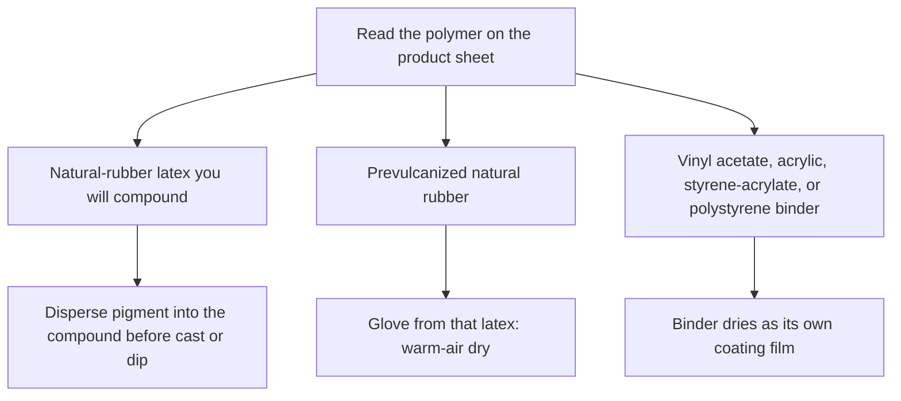

# Painting vs Compounding Pigment

Human page: /literature-reviews/liquid-painting-vs-compounding-pigment

> **Safety.** Read TDS and SDS for ammonia, solvents, and pigments. A food-contact colorant list is not a wear clearance.

## Executive summary

On the liquid pathway, optional dyes and pigments go into the natural-rubber compound before the film forms.[^1] Film from raw latex is not suited to usable or saleable articles until that latex is compounded.[^2] Handbook latex paint is a synthetic binder blended with a pigment dispersion; that polymer binds the pigment into its own coating film.[^5]

Use when choosing a tint method or reading a product sheet. Compound prep: [Pigment and Filler Compounding](/literature-reviews/liquid-pigment-filler-decks). Label fields: [Decoding Consumer Latex Bottle Labels](/literature-reviews/liquid-decoding-bottle-labels).

## Which color method

| Sheet says | Action |
| --- | --- |
| NR latex to cast or dip; color in that film | Disperse pigment into the compound before forming[^1] |
| Prevulcanized NR | Liquid-state vulcanization. A glove from that latex needs only warm-air drying[^4] |
| Vinyl acetate, acrylic, styrene-acrylate, or polystyrene paint binder | Coating with its own film[^5] |

Film from raw latex is not suited to usable or saleable articles until compounded.[^2] A vulcanized film from an elastomeric latex must stretch to at least twice its length and return to about its original length. That rule is the film, not a coating on the film.[^2]

Detail: Dyes on the use table

Class 3 roster: sulfur, zinc oxide, organic accelerators, antidegradants, clays, other loading materials, softeners, reodorants. Dyes and pigments are optional on the NR use table under that section. They are not a roster row.[^1]

## Compound tint

For most latex applications, dispersion particle size should be below 5 microns.[^3] Hegman draw-down on a fresh dispersion; remix before weigh.[^3]

Water-immiscible liquids and low-melting water-insoluble solids are emulsified before they are added to latex. Examples: antioxidant, tackifying resin, wax. A poor-quality emulsion added to the compound can leave oil spots.[^3] Shaking dry craft pigment into the bottle skips the dispersion step.

Buckets: [Pigment and Filler Compounding](/literature-reviews/liquid-pigment-filler-decks#identity-buckets).

Detail: Emulsion checks

Drop-on-water test. Casein swollen in warm water, 54–71°C, at least ten minutes, with stirring. Above 74°C the protein can be damaged. Homogenize at or below 38°C.[^3]

## Latex paint in the handbooks

UK name **emulsion paint** records replacement of oil-bound washable distempers (true oil-in-water emulsions). Elsewhere: **dispersion paint**. The binder set is synthetic.[^5]

Detail: Four binders and the coating film

Vinyl acetate polymers and copolymers; styrene-butadiene copolymers; acrylate ester polymers and copolymers, including styrene-acrylate; polystyrene. Styrene-butadiene and polystyrene are no longer of significant industrial interest in that application. Coatings are almost entirely synthetic latices.[^5]

Internally or externally plasticized polymer dispersion blended with a pigment dispersion. On drying, the polymer binds the pigment into a coherent film by loss of water and particle integration. Worked example is vinyl acetate; the same broad principles apply to the other latex types.[^5]

Detail: Prevulcanized liquid

Liquid-state vulcanization: sulfur or SULFADS, zinc oxide, an accelerator, and heat, with moisture loss prevented. Overcure: short, weak deposit. Gloves from prevulcanized latex need only warm-air drying.[^4] See [Prevulcanized Consumer Latex](/literature-reviews/liquid-prevulcanized-consumer-latex).

## Endnotes

[^1]: Vanderbilt Latex Handbook, 3rd ed., Mausser, 1987 — elastomer phase modifiers. Class 3 roster is sulfur, zinc oxide, organic accelerators, antidegradants, clays, other loading materials, softeners, reodorants. Use table marks dyes and pigments optional for NR.
[^2]: Vanderbilt Latex Handbook, 3rd ed., Mausser, 1987 — film from raw latex is not suited to usable or saleable articles until compounded. A vulcanized film from an elastomeric latex must stretch to at least twice its length and return to about its original length.
[^3]: Vanderbilt Latex Handbook, 3rd ed., Mausser, 1987 — for most latex applications, dispersion particle size below 5 microns; Hegman draw-down; remix before weigh. Water-immiscible liquids and low-melting solids emulsified before addition; examples antioxidant, tackifying resin, wax. Poor emulsion can leave oil spots. Drop-on-water test; casein swell 54–71°C at least ten minutes; damage above 74°C; homogenize at or below 38°C.
[^4]: Vanderbilt Latex Handbook, 3rd ed., Mausser, 1987 — prevulcanized latex is liquid-state vulcanization. Gloves produced from prevulcanized latex need only warm-air drying. Not a cite for a decorative coat on an existing film.
[^5]: Polymer Latices: Science and Technology — Volume 3: Applications of Latices, 2nd ed., Blackley, 1997 — latex-based surface coatings almost entirely synthetic; four binder types (vinyl acetate; styrene-butadiene; acrylate / styrene-acrylate; polystyrene), with styrene-butadiene and polystyrene no longer of significant industrial interest; UK “emulsion paints” vs “dispersion paints”; a coating is plasticized polymer blended with pigment dispersion, and the polymer binds the pigment into its own film. Worked example is vinyl acetate; broad principles apply to other latex types.
