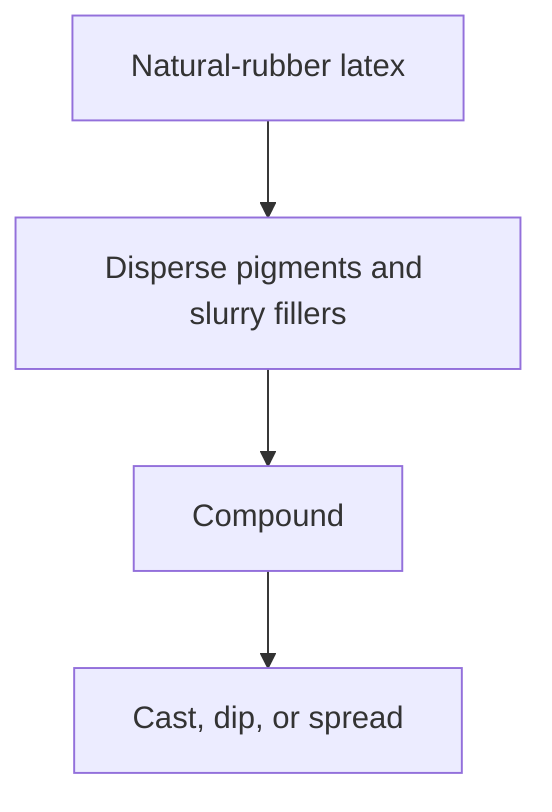
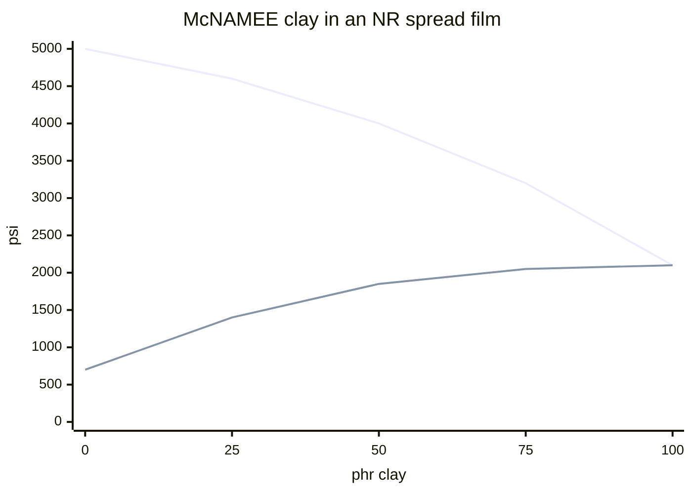

# Pigment and Filler Compounding for Liquid Latex

Human page: /literature-reviews/liquid-pigment-filler-decks

> **Safety.** Pigments and fillers change skin-contact extractables and aging. Copper and manganese consume antioxidant.[^10] Food-contact colorant lists (21 CFR 178.3297, rubber entries tied to 21 CFR 177.2600) cover food-contact rubber.[^12] Skin-wear clearance is outside that list. Compounding literacy, not a home recipe card.

## Executive summary

Color and opacity in cast, dipped, or spread natural-rubber film enter in the liquid, before the film forms.[^1] Insoluble solids and immiscible liquids are dispersed or emulsified first or the colloid is upset.[^1][^2][^3] Fillers raise modulus. In some small-particle, low rubber-hydrocarbon latexes, 10–25 phr clay permits a continuous film; heavier clay still stiffens the film and lowers tensile strength.[^5] Copper and manganese shorten service life. The handbook’s named routes are the rubber itself, dyes in fabrics, and trace impurities in mineral fillers.[^10][^14]

Use when tinting a batch, chasing opacity, or evaluating dry powder stirred into latex. Surface paint: [Painting vs Compounding Pigment](/literature-reviews/liquid-painting-vs-compounding-pigment). Fit stiffness: [Gauge, Modulus, and Reduction](/literature-reviews/liquid-gauge-modulus-reduction).

## Color before the film forms

Liquid pathway only: compound, then cast, dip, or spread. Dyes and pigments are optional Class 3 elastomer-phase modifiers with sulfur, zinc oxide, accelerators, clays, and antidegradants.[^1] A film from raw latex still needs that package before it is a finished article.[^1]

A water-insoluble pigment is added as an aqueous dispersion, after the cure package is stable.[^2]

## Prep buckets

| Bucket | Prep | Failure if skipped |
| --- | --- | --- |
| Aqueous pigment dispersion | Add when the compound is stable[^2] | Pre-ground pigment in water |
| Dry pigment powder | Dispersion under 5 µm before latex[^2] | Undispersed powder shocks the colloid |
| Oil-phase colorant | Oil-in-water emulsion first[^3] | Oil spots on the film |
| Mineral filler (clay, whiting, talc) | Slurry in water plus dispersant[^4] | Modulus up |
| Polymeric filler (high-styrene SBR latex) | Add as a latex. Some covulcanization is probable if butadiene is not too low; extent unclear[^7] | Tear, modulus, and set up |

Dispersion target under 5 µm (many industrial dispersions 90% at or under 2 µm). Hegman draw-down around 30% total solids. Remix before weigh-up. Overgrind can agglomerate.[^2] Emulsion: drop test on water; homogenize at or below 38°C; casein swell window about 54–71°C.[^3]

phr = parts per hundred rubber. pphr is the same idea. pphp = parts per hundred polymer.

Oil spots, grit, or a suddenly thick compound: remake the prep.[^2][^3]

Detail: Mill and emulsion practice

Anionic or nonionic DARVAN-class aids. Pebble mill about 50% media charge. Remix before every weigh-up.[^2] Emulsions: in-situ soaps or DARVAN ME / WAQ; 2–10% extra oil in the oil phase often helps stability; a 65% antioxidant emulsion example uses phase inversion, then homogenize at or below 38°C, then a drop test.[^3]

## Filler load

Slurry mineral fillers before they meet the latex.[^4]

**Continuous film.** Certain small-particle, low rubber-hydrocarbon latexes: 10–25 phr clay permits a continuous film. McNAMEE and DIXIE clays are named as suitable for natural-rubber and synthetic latex compounds.[^5]

**Natural-rubber clay (1987, preferred numbers).** McNAMEE clay in an air-dried NR spread film, 15 minutes at 93°C. Tensile and modulus at 500%, psi: 0 phr 5000 / 700; 25 phr 4600 / 1400; 50 phr 4000 / 1850; 75 phr 3200 / 2050; 100 phr 2100 / 2100. No elongation column.[^5]

**Polychloroprene comparison.** DIXIE clay in CR 750, 60 minutes at 127°C: tensile 3100 / 1800 / 1500 psi and stress at 500% 500 / 600 / 1100 psi at 0 / 25 / 50 phr.[^6] Same direction, different polymer. NR numbers stay with McNAMEE.[^5]

**1954 elongation, different compound.** High Polymer Latices (1966) reprints Vanderbilt Co (1954) kaolinite curves for NR deposits: 0 phr elongation 1200%, tensile 6000 psi, modulus at 500% 400 psi; 20 phr 750%, 3500 psi, 650 psi.[^13] Direction matches 1987 (modulus up, tensile down) plus an elongation drop the 1987 table does not report. Absolute psi differ. Prefer 1987 for NR clay modulus and tensile. The 1954 rows are only that older elongation report. Tier 4, legacy-not-primary.[^13]

**Whiting and zinc oxide in NR films.** Polymer Latices Vol 3 tensile strength, MPa, at 0 / 10 / 20 / 30 / 35 pphr. Whiting 33 / 28 / 26 / 24 / 23. Zinc oxide 33 / 30 / 28 / 26 / 24. High-styrene copolymer 90/10: 33 / 33 / 32 / 28 / 25. Resorcinol-formaldehyde resin: 33 / 43 / 45 / 32 / 26. Recipe: rubber 100, sulphur 2, zinc diethyldithiocarbamate 1, zinc oxide 3, 60 minutes at 100°C. Not the tear table.[^8]

**High-styrene tear table (1997, preferred numbers).** NR films, 15 minutes at 93°C. At 20 pphr: modulus at 300% 2.76 MPa (from 0.90), tensile 26.9 MPa (peak 30.7 at 15 pphr, from 28.6), extension 730% (from 880%), crescent tear 1769 N/cm (from 1156), permanent set 30% (from 6%).[^7] The book calls the modulus and hardness rise a serious disadvantage for some latex applications.[^7] The same page calls extension little affected while the table falls 880% to 730%. Both stand.[^7]

**1954 high-styrene curves.** 1966 reprint of Vanderbilt 1954, NR, 0 to 30 parts resin: tensile 4200 psi, peaks 4400 at 10 parts, 3200 at 30; elongation 950% to 700%; modulus at 500% 800 to 1800 psi; Shore 35 to 80.[^13] Direction matches 1997. Magnitudes differ. Prefer the 1997 table.[^7][^13]

**Adhesive band.** Mineral fillers in latex adhesives raise stiffness and reduce extensibility. They tend to reduce tack and bond strength; the effect is marked when the amount is no longer small.[^9] Up to 100 pphp can be added; more usually 0–30 pphp.[^9] Adhesive chapter. Stiffness direction matches the film fillers.

Detail: High-styrene filler table

NR 100, KOH 0.5, sulphur 1, activated dithiocarbamate 3, zinc oxide 5, octylated diphenylamines 1, high-styrene SBR copolymer latex 0 / 10 / 15 / 20 pphr, 15 minutes at 93°C.[^7]

| phr filler | Modulus 300% (MPa) | Tensile (MPa) | Extension (%) | Tear (N/cm) | Set (%) |
| --- | --- | --- | --- | --- | --- |
| 0 | 0.90 | 28.6 | 880 | 1156 | 6 |
| 10 | 2.07 | 30.0 | 800 | 1489 | 20 |
| 15 | 2.41 | 30.7 | 760 | 1664 | 22 |
| 20 | 2.76 | 26.9 | 730 | 1769 | 30 |

## Pigment metals

Copper protection, when needed: 2 phr total antioxidant (one part against oxidation, one against the metal). Coarse or settled dispersions leave uneven protection.[^10]

ISO 2004:2017 Table 1: copper and manganese, each max 8 mg/kg of total solids, on the ammonia-preserved centrifuged or creamed types in that table. Read from the 2017 preview. The 2024 PDF was not read.[^11]

Copper and manganese in natural rubber or neoprene shorten service life unless AGERITE WHITE is in the compound. They may be in the elastomer, introduced as dyes in fabrics, or present as trace impurities in mineral fillers.[^14] That sentence does not name pigments.

Related: [Antidegradants in DIY Compounds](/literature-reviews/liquid-antidegradants-diy-compounds). [Aging, Storage, and Care](/literature-reviews/liquid-aging-storage-and-care).

## Endnotes

[^1]: Vanderbilt Latex Handbook, 3rd ed., Mausser, 1987 — Introduction: dyes and pigments are optional Class 3 elastomer-phase modifiers with sulfur, zinc oxide, accelerators, clays, and antidegradants. A film from raw latex needs compounding before it is a finished article. Insoluble solids and immiscible liquids are prepared before they meet the latex.
[^2]: Vanderbilt Latex Handbook, 3rd ed., Mausser, 1987 — Dispersions: anionic or nonionic aids, pebble mill about 50% media, target under 5 µm with many dispersions 90% at or under 2 µm, Hegman draw-down around 30% total solids, remix before weigh-up, overgrind can agglomerate.
[^3]: Vanderbilt Latex Handbook, 3rd ed., Mausser, 1987 — Emulsions: oil-in-water prep, poor emulsion leaves oil spots, drop test on water, homogenize at or below 38°C, casein swell window about 54–71°C, 2–10% extra oil in the oil phase, 65% antioxidant emulsion by phase inversion.
[^4]: Vanderbilt Latex Handbook, 3rd ed., Mausser, 1987 — Slurries: mineral fillers prepared in water plus dispersant before latex addition.
[^5]: Vanderbilt Latex Handbook, 3rd ed., Mausser, 1987 — Clays: 10–25 phr clay can permit a continuous film from certain small-particle, low rubber-hydrocarbon latexes. McNAMEE and DIXIE suitable for NR and synthetic. McNAMEE in an NR spread film (15 min at 93°C): tensile / modulus at 500% psi = 0 phr 5000/700, 25 phr 4600/1400, 50 phr 4000/1850, 75 phr 3200/2050, 100 phr 2100/2100. No elongation column.
[^6]: Vanderbilt Latex Handbook, 3rd ed., Mausser, 1987 — DIXIE clay in CR 750 (60 min at 127°C): tensile 3100/1800/1500 psi and stress at 500% 500/600/1100 psi at 0/25/50 phr. Polychloroprene comparison, not the NR ladder.
[^7]: Polymer Latices: Science and Technology — Volume 3: Applications of Latices, 2nd ed., Blackley, 1997 — high-styrene styrene-butadiene copolymer as filler in sulphur-postvulcanized NR films (15 min at 93°C). At 20 pphr: modulus at 300% 2.76 MPa, tensile 26.9 MPa, extension 730%, crescent tear 1769 N/cm, permanent set 30%. Tensile peaks then falls. Modulus and hardness increase called a serious disadvantage for some applications. Prose calls extension little affected; the table falls from 880% to 730%.
[^8]: Polymer Latices Vol 3, 2nd ed., Blackley, 1997 — tensile strength (MPa) vs filler level in postvulcanized NR films (rubber 100, sulphur 2, ZDEC 1, zinc oxide 3, 60 min at 100°C). Whiting and zinc oxide fall; 90/10 high-styrene copolymer nearly flat then falls; resorcinol-formaldehyde resin rises then falls. Different recipe from the tear table.
[^9]: Polymer Latices Vol 3, 2nd ed., Blackley, 1997 — mineral fillers in latex adhesives increase stiffness and reduce extensibility, and tend to reduce tack and bond strength (marked when other than small amounts). Up to 100 pphp; more usually 0–30 pphp.
[^10]: Vanderbilt Latex Handbook, 3rd ed., Mausser, 1987 — copper (or other metal) protection: 2 phr total antioxidant; coarse or settled dispersions give uneven protection.
[^11]: ISO 2004:2017 Table 1, sixth edition preview — copper content max 8 mg/kg of total solids and manganese content max 8 mg/kg of total solids, each, for types HA, LA, XA, HA creamed, and LA creamed. 2024 PDF not read. https://cdn.standards.iteh.ai/samples/70281/23b5bedd95e1478c978169e9039b7eb2/ISO-2004-2017.pdf
[^12]: 21 CFR 178.3297 colorants for polymers; rubber entries point at 21 CFR 177.2600 food-contact rubber articles. Food-contact inventory. https://www.law.cornell.edu/cfr/text/21/178.3297 https://www.law.cornell.edu/cfr/text/21/177.2600
[^13]: High Polymer Latices: Their Science and Technology, 2 vols., Blackley, 1966 — FIG. II.7(a) kaolinite in NR deposits and FIG. II.8(a) high-styrene resin in NR deposits, both curves from Vanderbilt Co (1954). Clay: 0 phr elongation 1200%, tensile 6000 psi, modulus at 500% 400 psi; 20 phr 750%, 3500 psi, 650 psi. Resin 0 to 30 parts: elongation 950% to 700%, modulus at 500% 800 to 1800 psi, tensile peaks then falls. Legacy-not-primary. Prefer 1987 McNAMEE and 1997 Table 16.12 where magnitudes differ.
[^14]: Vanderbilt Latex Handbook, 3rd ed., Mausser, 1987 — Tests for Copper and Manganese: these impurities in natural rubber or neoprene shorten service life unless AGERITE WHITE is present. They may be in the elastomer itself, introduced as dyes in fabrics, or present as trace impurities in mineral fillers. Pigments are not named.
