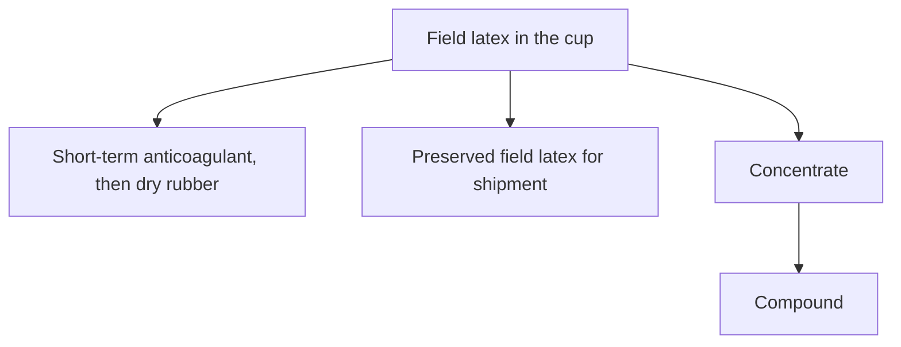
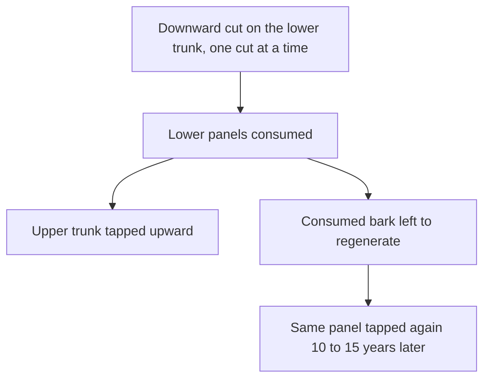
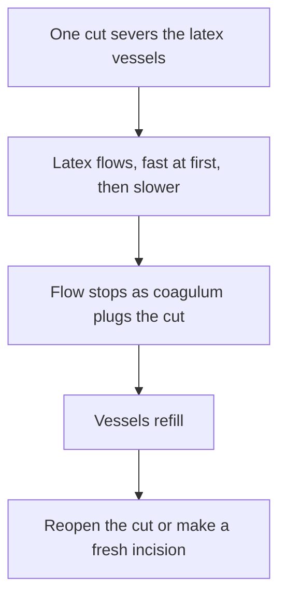

# Plantation Tapping and Field Latex

Human page: /literature-reviews/liquid-plantation-tapping-field-latex

## Executive summary

**Field latex** is the liquid that runs from a tapped *Hevea* tree into the cup. On the liquid pathway it is the feedstock a factory later preserves, or turns into **concentrate** and then **compound**.[^5][^7]

Tap frequency, cut length, and ethephon change grams per tap and virgin-bark use.[^1][^2] A 1966 handbook describes the flow-and-plug cycle of one cut and names older stimulants.[^7] Those stimulants are a different generation from ethephon.[^1][^7]

Bottle ammonia storage: [Liquid Latex Aging, Storage and Care](/literature-reviews/liquid-aging-storage-and-care).

## Field latex

**Field latex** is cup liquid. **Concentrate** is marketable high-dry-rubber latex after the factory raises dry-rubber content. **Compound** is latex after formulation.[^5][^7]

Bottier 2020 chapter abstract: fresh latex about 60% water, 35% cis-1,4-polyisoprene, 5% non-isoprenes (proteins, lipids, carbohydrates, minerals), unevenly distributed. Rubber particles and lutoids in C-serum. Rubber fraction largest, then C-serum, then lutoids.[^5]

*High Polymer Latices* (1966): exudate dry rubber content 30–40%, average about 33%; usual concentration target about 60% dry rubber content; some methods remove non-rubber and make concentrates more uniform than field latices.[^7]

Solids reports stay separate:

- Bottier abstract: ~60 / 35 / 5 as above.[^5]
- Liengprayoon et al. 2017: non-isoprenes ~10% of latex dry matter or ~5% of raw dry natural rubber. Fresh-weight fraction averages: RRIM600 cream 35.9% and skim 8.8%; PB235 cream 49.5% and skim 11.8%. Dry basis: skim twice cream in lipids and proteins. Lutoids richest in lipids, protein, minerals (mainly K and Mg). Serum high protein and minerals, negligible lipid. Cream remains the main lipid location by mass share.[^6]
- Rukkhun et al. 2020, 2009 hillside RRIM 600, system named 1/3S 3d/4: fresh 0.12–0.14 kg/tree/tap, dry 0.035–0.044 kg, described as about 67–71% water.[^3]
- Lacote et al. 2019, Thepa, RRIM600, three years: total solids about 52.7–55.2%, not different among five systems.[^1]

## Tapping codes

Lacote et al. 2019 glosses used here:[^1]

- S/2 d2 — half spiral downward, alternate days.
- S/3 d1 2d/3 — third spiral downward, two days tapping and one day rest.
- S/2 d3 ET 2.5% Pa1(1) 8/y — half spiral, every third day, ethephon 2.5% active ingredient, 1 g on a 1 cm panel band, 8 applications/year.
- S/2 d4 — half spiral, fourth-day frequency.
- BO-1 / BO-2 downward virgin bark; B1-1 renewed bark; HO-1 upward virgin bark; U marks upward (S/2U, S/4U).

Their tapping-intensity column is attributed by them to a 2009 notation paper. That notation text is not quoted on this page.[^1]

Michels et al. 2012: downward cut on the lower trunk; one cut at a time; upward on the upper trunk after lower panels are consumed; consumed bark tapped again 10–15 years later. CDC model in the study area: downward S/2 opened at 1.50 m, frequency d3, later upward S/2. HVC model: opened at 1.20 m, upward S/3, frequency d5 then d4 with stimulation. Several cuts without a frequency change lead to bark dryness.[^2]

Second diagram: 1966 one-incision account.[^7] Lacote et al. 2019 discussion: ethephon delays coagulation (water import and lutoid stabilization) and activates latex-cell metabolism, so a longer rest still exports more latex per tap.[^1]

Michels et al. 2012, 25 Cameroon smallholdings: virgin-bark consumption 3.9–7.6% per tapping year. Shaving thickness ~28% of that variation, tapping frequency ~27%, number of cuts ~20%, combined R² 75.6%. Remaining-year comparisons used 2 mm shaving thickness. Bark limits in the study: 0.15 m to 2.10 m. Low-frequency combination M1 about 5 years longer on virgin bark than the local model; high-frequency M3 about 4.5 years shorter. Abstract: diagnosis as a decision-support tool can increase remaining tapping years by 33% to 355%.[^2]

Rukkhun et al. 2020 name 1/3S 3d/4. Day grid: three tap days, one rest. Table note “three days in tapping followed by one day of tapping rest” matches the grid. The same note says “third daily tapping.” Methods parenthetical says “three half spiral cut tapped every four days.” Those phrases disagree with the grid. Grid and three-on/one-off clause kept; conflicting phrases not overwritten.[^3]

Malaysian Rubber Board 2009 contents: Chapter 9 headings include tapping, exploitation symbols, ethephon stimulants (MORTEX, REACTORRIM, RRIMFLOW), controlled upward tapping, tapping systems, tapping management. The Board unit page describes work on harvesting, physiology, latex biosynthesis, and mechanization.[^8][^9]

## Frequency, yield, bark

Thepa, RRIM600, three years (Lacote et al. 2019):[^1]

| System | g/tree/tap | kg/tree/year | taps/year |
| --- | --- | --- | --- |
| S/3 d1 2d/3 | 46.57 | 7.2 | 155 |
| S/2 d2 | 62.88 | 7.1 | 113 |
| S/2 d3 ET 2.5% 8/y | 78.32 | 7.1 | 91 |
| S/3 d2 ET 2.5% 4/y | 61.22 | 6.9 | 113 |
| S/3 d3 ET 2.5% 12/y | 71.31 | 6.5 | 91 |

S/2 d3 stimulated: 168% of T1 grams per tap, kilograms per tree almost unchanged. S/3 d3 with 12 stimulations/year: 90.5% of T1 cumulative yield. Bark over 3 years highest on T1 (42.0 cm). Rainy days skipped, so tap counts sit below calendar frequency.[^1]

On-farm RRIM600: d2 to d3, 10 years downward virgin bark, cumulative kg/tree about −3%, grams per tap about +30%. Over 11 years, d4 about −10% cumulative vs d2; grams per tap about +37% (d3) and +69% (d4). Virgin bark out-yielded renewed bark in that sequence. Year 12 upward HO-1: kilograms per tree held at d3 and d4; grams per tap about +49% to +72%.[^1]

RRIT 251, eight years: d3 and d4 cumulative yield 108% and 91% of d2; grams per tap +38% and +48%.[^1]

Rukkhun et al. 2020: one system (1/3S 3d/4) on three hillside sites, young RRIM 600, no lower-frequency arm. Frequency vs fresh and dry yield R² > 0.75. Bark about 1.8–3 cm by site. Tapping-panel-dryness rate not significantly different among sites. Authors conclude the system increased bark use, stimulated panel dryness, and left relatively unhealthy latex-diagnosis values.[^3]

Lacote et al. 2004 CIRAD abstract: nine years, Côte d’Ivoire, four panel strategies, clones PB 260, GT 1, PB 217, AF 261. Annual yield strongly affected. After nine years cumulative yield did not vary with strategy for PB 260, GT 1, PB 217. AF 261 differed (low-yielding, not recommended for planting in that abstract). Girth unaffected except GT 1, where no panel change favored girth. Latex diagnosis proposed to decide a panel change under stress.[^4] Thai on-farm yield did move with virgin vs renewed bark.[^1] Separate trials.

Thepa biochemistry: sucrose 10.9 mM on S/3 d1 2d/3 and 7.7 mM on stimulated S/2 d3; inorganic phosphorus 20.9 mM and reduced thiols 0.17 mM on that stimulated system. Total solids did not separate systems.[^1]

Rukkhun Table 3: sucrose 6.43–13.06 mM, inorganic phosphorus 7.76–18.99 mM, thiols 0.23–0.56 mM.[^3]

Michels et al. 2012: immature period about 7 years; tapping life 15–30 years or more.[^2]

## Cup, before the factory

*High Polymer Latices* (1966): latex coagulates within a few hours (temperature and stability). Clots plus clear serum; later putrefaction. Short-term preservatives (anticoagulants) hold field latex liquid for hours or days before dry rubber. Long-term preserve is shipment and storage. Spontaneous-coagulation account favored there: fatty-acid anions plus calcium and magnesium, not microbial acidity. Cited facts include pH staying about 6.0–6.3 in spontaneous coagulation, versus acid coagulation below pH 5.[^7]

One-incision cycle: flow fast then slow; coagulum plugs the cut; vessels refill.[^7]

1966 stimulants in that chapter: copper-sulphate injection (yield rise, then decline over about 6 months; copper risk blocked commercial use) and phenoxyacetic derivatives, especially 2,4-D and 2,4,5-T, on or above the panel; clone-dependent; later effect is longer flow.[^7] Ethephon schedules are the 2019 codes.[^1]

Liengprayoon et al. 2017 collection for fractionation: tap 5 a.m., about one hour, clean cup on ice, held cold until centrifugation.[^6]

Ammonia bottle storage: [Liquid Latex Aging, Storage and Care](/literature-reviews/liquid-aging-storage-and-care).

## Neighbor pages

- [The Hevea Rubber Tree](/literature-reviews/liquid-hevea-rubber-tree)
- [From the Rubber Tree to Liquid Latex](/literature-reviews/liquid-tree-to-liquid-latex)
- [Liquid Latex Aging, Storage and Care](/literature-reviews/liquid-aging-storage-and-care)
- Concentrate process: `liquid-field-latex-to-concentrate`

## Endnotes

[^1]: Lacote R, Sainoi T, Sdoodee S, et al. “Performance of Different Latex Harvesting Systems to Increase the Labor Productivity of Rubber Plantations in Thailand.” IRRDB International Rubber Conference 2019. Agritrop PDF. Tables 1–5, on-farm section, discussion. https://agritrop.cirad.fr/593888/1/Lacote%20et%20al.%202019.pdf

[^2]: Michels T, Eschbach J-M, Lacote R, Benneveau A, Papy F. “Tapping panel diagnosis, an innovative on-farm decision support system for rubber tree tapping.” *Agronomy for Sustainable Development* 32 (2012): 791–801. https://doi.org/10.1007/s13593-011-0069-2 · https://hal.science/hal-00930546v1/document

[^3]: Rukkhun R, Iamsaard K, Sdoodee S, Mawan N, Khongdee N. *Notulae Botanicae Horti Agrobotanici Cluj-Napoca* 48, no. 4 (2020): 2359–2367. https://doi.org/10.15835/48412045

[^4]: Lacote R, Obouayeba S, Clément-Demange A, Dian K, Gnagne M.Y., Gohet E. *Journal of Rubber Research* 7, no. 3 (2004): 199–217. CIRAD notice abstract only. https://publications.cirad.fr/une_notice.php?dk=525247

[^5]: Bottier C. In Nawrot R, ed. *Advances in Botanical Research* 93 (2020): 201–237. CIRAD notice abstract. https://publications.cirad.fr/une_notice.php?dk=594602 · https://doi.org/10.1016/bs.abr.2019.11.003

[^6]: Liengprayoon S, et al. IRRDB 2017 fractionation paper (i). Agritrop PDF. https://agritrop.cirad.fr/586132/1/full%20paper%20IRRDB2017_Liengprayoon%20%28i%29.pdf

[^7]: Blackley DC. *High Polymer Latices: Their Science and Technology*. 2 vols. London: Maclaren; New York: Palmerton, 1966. Tapping incision, phenoxyacetic stimulants, preservation, concentration. https://lccn.loc.gov/66077950

[^8]: Malaysian Rubber Board. *Rubber Plantation and Processing Technologies*. 1st ed. 2009. Contents and front matter only. https://vitaldoc2.lgm.gov.my/vital/access/services/Download/vital1:78304/ATTACHMENT01

[^9]: Malaysian Rubber Board. “Latex Harvesting Technology & Physiology.” https://www.lgm.gov.my/webv2/coreActivities/latexHarvesting/(physiology:functions)
