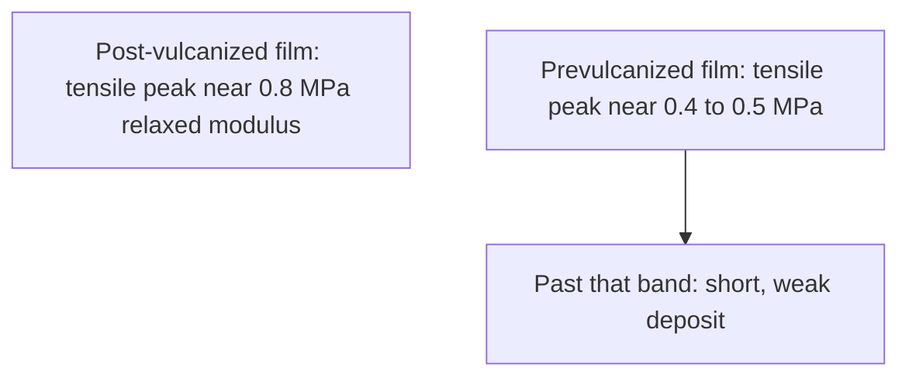

# Prevulcanized Consumer Latex

Human page: /literature-reviews/liquid-prevulcanized-consumer-latex

> **Safety.** Prevulcanization is a factory liquid-state cure with curatives. Skipping a later oven does not make the liquid safer. Ammonia and accelerators remain.[^1] The chloroform coagulation test is a solvent exposure, not a home method.[^2] Skin and allergy classes: [Allergy and Skin Contact](/literature-reviews/allergy-and-skin-contact).

## Executive summary

Prevulcanized latex is natural-rubber latex cross-linked in the liquid. On the liquid pathway, a film from that liquid can finish by drying if the tank cure stayed at a low combined-sulfur figure. Past that figure the deposit is short and weak.[^1] Gloves from prevulcanized latex need only warm-air drying.[^1]

A consumer label that only says “liquid latex” does not establish prevulcanized natural rubber. Read the product sheet. Acrylic theatrical dispersions are another polymer.[^1]

## When drying is enough

| Feedstock | Finish |
| --- | --- |
| Prevulcanized natural-rubber compound, cure held in band | Warm-air dry[^1] |
| Raw or under-compounded natural-rubber latex | Dry, then vulcanize the film |
| Unknown consumer bottle | Do not treat as prevulcanized |

Liquid pathway only (cast, dip, or spread). Bottle reading: [Decoding liquid latex bottle labels](/literature-reviews/liquid-decoding-bottle-labels). Film forming: [Forming film from liquid latex](/literature-reviews/liquid-film-pathway).

Raw concentrate is not a saleable film without compounding.[^1]

## Plant check on the liquid

Plants use the Chloroform Coagulation Test or the Modified Swollen Diameter Test.[^1] The chloroform rating is subjective. Solvent swell is more quantitative and slower.[^2]

[^2]

## Strength reports (do not collapse)

- Vanderbilt 1987: a properly vulcanized liquid can approach conventional post-dry cure, about 4,000–5,000 psi. Beyond a low combined-sulfur figure the deposit is short and weak.[^1]
- Polymer Latices Vol 3, 1997: sulphur-prevulcanized tensile peak near relaxed modulus 0.4–0.5 MPa; post-vulcanized peak near 0.8 MPa (about 5 × 10⁻² mol dm⁻³). Wong and Loo: sulphur-prevulcanized maximum at about 1–2 × 10⁻² mol dm⁻³. Sulphur-prevulcanized points on that page reach 30 MPa. The 30–35 MPa sentence is radiation prevulcanization (carbon-carbon), not that sulphur peak. High-crosslink drop attributed to particle-integration interference.[^3]
- Same book, dipping chapter: high prevulcanization tends to lower tensile strength, extension at break, and tear versus post-deposition vulcanization; hydrocarbon oil and grease resistance is inferior. Partial prevulcanization plus postvulcanization after drying mitigates. Thicker articles tolerate more prevulcanization.[^3]
- Practical Guide, 2013, casting section: prevulcanised latex preferred for solid articles because product vulcanisation can be skipped; strength is always low for film from that compound. Scope stays in that section.[^4]
- High Polymer Latices, 1966: typical prevulcanized curves show lower tensile and elongation than post-vulcanized films, and low flat modulus if post-form vulcanization is excluded. Tier 4. Later handbooks lead where they conflict on modern film performance. The 1966 curves remain what that book shows.[^5]

1966 only (not the 1997 oil sentence): a prevulcanized film ruptures more readily if solvent touches it while extended. Equilibrium swelling in benzene is less sensitive to combined sulphur.[^5]

Mechanisms stay separate.[^1][^3][^5]

- 1997: high-crosslink tensile drop from poor particle integration on drying.
- Vanderbilt, hedged: some investigators think residual active sulfur forms primary interparticle links on drying.
- 1966: non-rubber cement theory rejected (creaming plus alcohol extraction still left a normal prevulcanized film strength).

## Storage

Centrifuge or decant unreacted sulfur and zinc oxide after the heat step so cure does not continue in storage. Antioxidants are generally added after clarifying.[^1]

Detail: Tank outline

Ultra-accelerators: about one hour at 79°C, atmospheric pressure. Plant card: 32–38°C, add dispersions, hold 70–80°C with stirring, cool to about 30°C, then after about 24 hours centrifuge or decant.[^1]

## Endnotes

[^1]: Vanderbilt Latex Handbook, 3rd ed., Mausser, 1987 — prevulcanized natural-rubber compound: liquid-state vulcanization, about 4,000–5,000 psi when properly held, short and weak past a low combined-sulfur figure, glove lines need only warm-air drying, chloroform or swollen-diameter test named, centrifuge or decant then antioxidants, raw latex not a saleable film without compounding, hedged residual-sulfur interparticle links.
[^2]: Vanderbilt Latex Handbook, 3rd ed., Mausser, 1987 — chloroform coagulation ratings: No. 1 tacky and stringy (uncured) through No. 4 small dry crumbs (advanced precure). Subjective. Solvent swell is more quantitative and slower.
[^3]: Polymer Latices: Science and Technology — Volume 3: Applications of Latices, 2nd ed., Blackley, 1997 — post-vulcanized peak near 0.8 MPa relaxed modulus (about 5 × 10⁻² mol dm⁻³); sulphur-prevulcanized peak near 0.4–0.5 MPa; Wong and Loo 1–2 × 10⁻² mol dm⁻³; sulphur-prevulc points reach 30 MPa; 30–35 MPa is radiation prevulcanization, not that sulphur peak; high-crosslink drop as particle-integration interference. Dipping chapter: high prevulcanization lowers tensile, extension at break, and tear, and hydrocarbon oil and grease resistance is inferior; partial prevulcanization plus later postvulcanization mitigates; thicker articles tolerate more prevulcanization.
[^4]: Practical Guide to Latex Technology, Joseph, 2013 — casting section: prevulcanised latex preferred for solid articles; product vulcanisation can be skipped; strength always low for film from pre-vulcanised latex compound.
[^5]: High Polymer Latices: Their Science and Technology, 2 vols., Blackley, 1966 — typical prevulcanized load-extension curves lower in tensile and elongation than post-vulcanized films; solvent-while-extended rupture; swelling vs combined sulphur; cement theory rejected. Oil-and-grease inferiority is also in Polymer Latices Vol 3 (endnote 3). Legacy-not-primary relative to the 1987, 1997, and 2013 handbooks.
