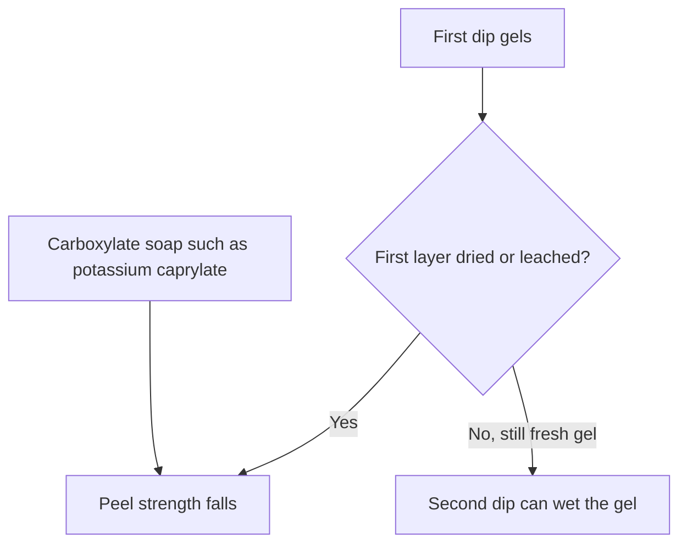
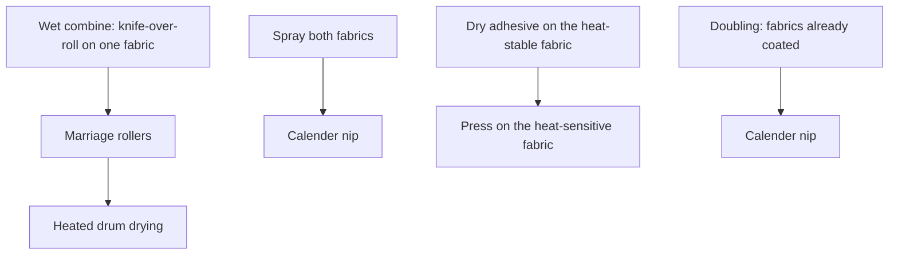
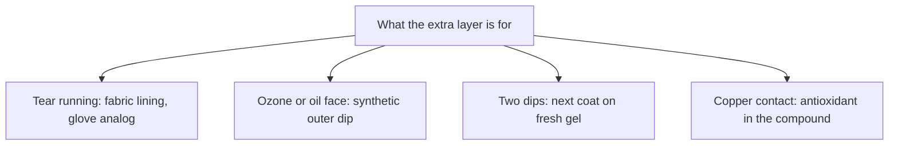

# Liquid Reinforcement and Laminate Zones

Human page: /literature-reviews/liquid-reinforcement-laminate-zones

Latex adhesives: nonflammable side of the solvent-cement comparison. Solvent cements need explosion-proof ventilation. Latex adhesives in that comparison are subject to freezing.[^9] Glue: [Liquid adhesives and seam integrity](/literature-reviews/liquid-adhesives-and-seam-integrity).

## Executive summary

Liquid builds put extra strength in the film stack: another coat, natural-rubber inner plus synthetic outer, or cloth joined in the stack. Inter-coat bond depends on timing. Use when a multi-coat piece splits, or when a plant combining layout is about to be copied as a home mix.

## When do you add another coat or a cloth layer?

### How

Next dip while the first coat is still fresh gel. Dried and leached underlayer → weak join.[^2]

Outer face: natural rubber first, then polychloroprene (ozone and hydrocarbon oil or grease) or carboxylated acrylonitrile-butadiene (high oil and grease; higher wet and dry strength than non-carboxylated).[^3]

Porous face: the bond is mainly mechanical.[^7] Aqueous adhesive shrinks cloth.[^8] Plant wet combining joins cloth while the adhesive is still wet. Plant layouts are not bench recipes.[^4] See [Liquid latex–textile bonding](/literature-reviews/liquid-latex-textile-bonding).

### Why

Peel strength between successive natural-rubber dips falls rapidly as the first layer dries; leaching aggravates it. Risk is higher with different latices and still present with one latex.[^2]

Fabric-lined gloves stretch less than unsupported gloves and stop tear propagation. Supported-glove analog for a tear-stop layer.[^1]

Low relative humidity can surface-dry the first dip and spoil second-compound lamination.[^5]

Detail: Wet gel, soaps, and mud-cracking

Gazeley, peel force per unit width: bond falls as the first layer dries; leaching aggravates; short drying can matter. Potassium caprylate markedly reduces bond. Laboratory sulphur-prevulcanized latex gave lower bond strength than unvulcanized postvulcanizable latex. Industrially prepared sulphur-prevulcanized latices gave higher bond strengths, which fell as the degree of vulcanization increased. Conclusion: use the hydrophilic character of fresh latex gel.[^2]

Mud-cracking: wet-gel strength too low for drying contraction. Especially a blend of highly sulphur-prevulcanized and unvulcanized natural rubber, or natural rubber with styrene-butadiene latex.[^2]

High relative humidity retains moisture and can depress glove-film cure.[^5]

Detail: Natural-rubber inner, synthetic outer

Natural rubber dominates dipping. Synthetic latices often have inferior wet-gel strength and weaker dry film. Laminate: inner natural-rubber dip, then synthetic. Polychloroprene: ozone and hydrocarbon oils and greases. Carboxylated acrylonitrile-butadiene preferred for high oil and grease resistance (higher wet and dry strength; good abrasion resistance). A fabric lining may also provide the strength. Successive dips still risk delamination.[^3]

Detail: Plant combining layouts

Four arrangements.[^4]

- Wet combine: knife-over-roll on one fabric, marriage rollers (mild pressure), heated drum at fabric speed.
- Spray both fabrics, then calender nip. Recorded claim only: a light spray can be waterproof and still air-permeable.
- Heat-sensitive cloth: coat and dry the heat-stable fabric, press the sensitive fabric on, gentle final heat.
- Doubling: fabrics already coated. Pressure-sensitive adhesive may need one coated face; otherwise both. Calender nip.

Example compounds in that chapter are plant examples, not a home mix.

## Which extra layer matches the job?

| Job | What the build uses |
| --- | --- |
| Tear running through the film | Fabric lining, supported-glove analog: less stretch, tear stops[^1] |
| Ozone or oil outer face | Natural rubber inner, then polychloroprene or carboxylated acrylonitrile-butadiene[^3] |
| Two dips that must stay together | Next dip on fresh gel[^2] |
| Film that will meet copper | Antioxidant level in the compound[^6]. See [Compatibility of metals, oils, and plastics](/literature-reviews/compatibility-matrix-metals-oils-plastics) |

A fabric-lined glove is the Vanderbilt result for a lined glove.[^1] Fatty acid salts of copper, cobalt, manganese, and iron catalyze oxygen degradation.[^6]

## What does a split between coats usually mean?

| Observation | Class | Next |
| --- | --- | --- |
| Plies of a dipped piece separate | First coat dried, leached, dry air, or carboxylate soap[^2][^5] | Wet-gel detail |
| Cloth bond | Separate job from a ply split | [Liquid latex–textile bonding](/literature-reviews/liquid-latex-textile-bonding) |
| Copper contact | Antioxidant in the compound[^6] | [Liquid aging, storage, and care](/literature-reviews/liquid-aging-storage-and-care) |

Failed-join names: [Liquid delamination and seam failure](/literature-reviews/liquid-delamination-seam-failure).

Delamination can still show up when the coats look wet. The close in that account is to dip while the gel is still fresh.[^2]

Detail: Humidity on both sides

Low relative humidity: first dip surface-dries; second compound laminates poorly. High relative humidity: retained moisture retards glove-film cure and depresses stress and tensile properties. Chloroprene films in that note need more ambient drying.[^5]

## Endnotes

[^1]: *The Vanderbilt Latex Handbook*, 3rd ed., Mausser, 1987 — fabric-lined gloves stretch less and stop tear propagation.
[^2]: Blackley, *Polymer Latices: Science and Technology — Volume 3: Applications of Latices*, 2nd ed., 1997 — multi-dip delamination, Gazeley peel, potassium caprylate, prevulcanized comparison, fresh-gel wetting, mud-cracking.
[^3]: Blackley, *Polymer Latices* Vol 3, 1997 — natural-rubber inner with polychloroprene or carboxylated acrylonitrile-butadiene outer; fabric lining as strength; delamination caution.
[^4]: Blackley, *Polymer Latices* Vol 3, 1997 — textile combining and doubling layouts; example compounds are plant examples.
[^5]: *The Vanderbilt Latex Handbook*, 1987 — low relative humidity and poor second-dip lamination; high relative humidity, retained moisture, and depressed glove-film cure.
[^6]: *The Vanderbilt Latex Handbook*, 1987 — fatty acid salts of copper, cobalt, manganese, and iron catalyze oxygen degradation; copper (or other metal) degradation of NR or CR film is limited by antioxidant level in the compound.
[^7]: Joseph, *Practical Guide to Latex Technology*, 2013 — porous face, mechanical bond.
[^8]: Joseph, *Practical Guide to Latex Technology*, 2013 — aqueous adhesive shrinks textiles.
[^9]: *The Vanderbilt Latex Handbook*, 1987 — latex adhesives nonflammable and subject to freezing, beside solvent cements that need explosion-proof ventilation.
