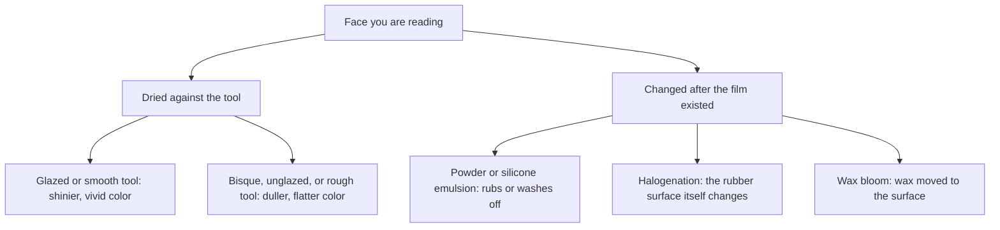
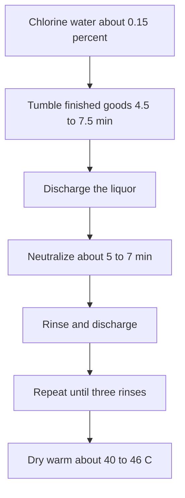

# Liquid Film Surface Finish

Human page: /literature-reviews/liquid-surface-finish-literacy

> **Safety.** Halogenation uses corrosive oxidizers. Parameters below are industrial vocabulary. Process: [Chlorination for Tack Control](/literature-reviews/liquid-chlorination-tack-control).

## Executive summary

Gloss and matte on dipped or cast film usually come from the tool face the film dried against. Glazed former: shiny face, vivid color. Bisque or sandblasted former: dull, flat color.[^1] Tack may be cut for a while with powder or a silicone emulsion, or changed by halogenation.[^2][^3] Bloom is wax that migrated to the surface.[^4][^5] Grasping a wet object and damp-hand donning are different jobs.[^6][^3]

Use this when [forming film](/literature-reviews/liquid-former-dip-vs-mould-cast-vs-flat-spread) and reading the face, or when stored film looks powdery. Storage: [Aging, Storage and Care](/literature-reviews/liquid-aging-storage-and-care).

## Questions this article answers

- [What makes the film glossy or dull?](#gloss)
- [What cuts tack, and what only lasts until you rub it?](#tack)
- [What is the powder after storage?](#bloom)

---

## What makes the film glossy or dull? {#gloss}

### How

The contacting face copies the tool. Glazed or polished former: shinier film, vivid color. Bisque, sandblast, or rough former: duller, flatter color.[^1] On a cast or spread, the same bench reading applies: a polished bed leaves a glossier contacting face than a rough bed. That is an analogy to dip formers. The handbooks describe formers.

Forming: [Former Dip vs Mould Cast vs Flat Spread](/literature-reviews/liquid-former-dip-vs-mould-cast-vs-flat-spread). Bulk color: [Pigment and Filler Decks](/literature-reviews/liquid-pigment-filler-decks).

### Why

Smooth glaze reflects light; a rough surface scatters it.[^1] Unglazed porcelain absorbs coagulant into pores. Glazed porcelain gives a smoother deposit, easier stripping after drying and vulcanizing, and easier cleaning.[^7] The outer surface on the former is a blurred copy of the tool. Sharp outside emboss needs the article turned inside out. An embossed former puts a roughened palm on the finished glove after that inversion.[^8] Vanderbilt also assigns the desired finish to the inside of the dipped article.[^1] Identify the tool-contact face, then whether stripping inverted the article.

### Detail

Detail: Glaze, unglazed porcelain, and grit

Grit on the former is another way to raise coagulant and latex pickup.[^7]

---

## What cuts tack, and what only lasts until you rub it? {#tack}

### How

Talc and other powders, and silicone emulsions, are temporary slip layers. Rubbing and washing remove them.[^3] Lasting change is aqueous halogenation, then neutralize, rinse, and warm dry.[^2] Steps: [Chlorination for Tack Control](/literature-reviews/liquid-chlorination-tack-control).

- Wet grasp of slippery objects: embossed grip alone does little; halogenation with chlorine or bromine water is the named treatment.[^6]
- Damp-hand donning of surgeons’ gloves: chlorination alone gives adequate dry lubricity and inadequate damp-hand lubricity.[^3]

### Why

Lubricant powders in this class include talc, mica, zinc stearate, and starch, plus silicone-oil emulsions. They have tended to be used on disposable goods; halogenation on household gloves.[^3] Vanderbilt: chlorine water and bromine water reduce tack to a similar degree; chlorine discolors least; sodium hypochlorite is less efficient and discolors more than chlorine water.[^2] Polymer Latices Vol 3, summarizing a dry-friction study: iodination and bromination had little effect; chlorination’s effect was much larger and increased with treatment extent; a hydrophilic-polymer treatment gave the greatest reduction in that set; starch dusting was about as effective as short chlorination.[^9] Tack and that dry-friction test are different measures. Chlorinated glove surfaces show an identifiable chlorine modification.[^10]

### Detail

Detail: One chlorine-water window

Saturated chlorine water is 0.56% chlorine by weight, diluted to about 0.15% for treatment. Tumble about 4.5–7.5 minutes at room temperature. Higher-sulfur goods need less time. Neutralize, triple rinse, dry about 40–46°C. No copper or brass in contact with the liquor.[^2]

Detail: Other liquors are not the same numbers

Three surface-chlorination routes: chlorine water; sodium hypochlorite acidified with hydrochloric acid; an organic N-chloro donor, of which sodium dichloroisocyanurate is described as the most used on dipped goods. A cited hypochlorite mix is 7.5% m/m sodium hypochlorite plus 1% m/m concentrated hydrochloric acid. That is not the 0.15% chlorine-water example. A neutralizing rinse in this account is 1% m/m sodium thiosulphate or ammonia.[^11]

Halogenation is intended as a surface layer. Very thin film or prolonged treatment can affect the bulk. Excess treatment can discolor the article and can destroy surface dithiocarbamate and thiuram accelerators, which also act as antioxidants, so oxidative aging can worsen. Halogenated natural rubber is harder and has a lower coefficient of friction; the surface has been called microtextured.[^12] In the dry-friction summary, concentrated sulphuric acid sat between starch dusting and bromination or iodination.[^9]

---

## What is the powder after storage? {#bloom}

### How

Powder after storage: wax bloom, a migrating antiozonant wax, until a test says otherwise.[^4] Flexing and stretching crack the barrier. Wiping can return tack if bloom was the only ozone shield. Compounding: [Antidegradants in DIY Compounds](/literature-reviews/liquid-antidegradants-diy-compounds).

### Why

Ozone attacks diene double bonds. A continuous wax bloom blocks static ozone. Fresh film that has not bloomed does not show the same chamber resistance. Example hold: three weeks at 23°C and 50% relative humidity in kraft.[^4] Science Diliman treats NR wax bloom as a migrating layer, distinct from leftover dust.[^5] PPD antiozonants are the flexing, dark-staining class.[^4]

### Detail

Detail: Wax level and a laboratory hours comparison

Microcrystalline wax emulsion at 0.5–1.0 phr. phr is parts per hundred rubber. The bloom must be continuous. Flex cracks it, so the class is for static storage.[^4]

Vanderbilt laboratory hours to complete ozone failure for named waxes:[^13]

| Wax in the film | Hours to complete failure |
| --- | --- |
| No wax | 16 |
| VANWAX H | 76 |
| VANWAX H SPECIAL | 98 |
| VANWAX H SPECIAL, film flexed | 26 |

Product comparison, not a universal lifetime.

---

## Endnotes

[^1]: Vanderbilt Latex Handbook, 3rd ed. (Mausser, 1987) — glazed former: shiny, vibrant color; bisque or sandblast: dull, flat color; form imparts the desired finish to the inside of the dipped article.
[^2]: Vanderbilt Latex Handbook — aqueous chlorine water, sodium hypochlorite, or bromine water; chlorine least discoloring and similar tack reduction to bromine water; hypochlorite less efficient; about 0.15% chlorine, 4.5–7.5 min, room temperature; neutralize; triple rinse; dry 40–46°C; no copper or brass; saturated chlorine water 0.56% chlorine by weight.
[^3]: Polymer Latices Vol 3, 2nd ed. (Blackley, 1997) — powders and silicone emulsions are temporary lubricants lost by rubbing or washing; halogenation is a permanent chemical surface change; disposable goods vs household gloves; surgeons’ gloves: chlorination adequate for dry donning lubricity, inadequate for damp hands.
[^4]: Vanderbilt Latex Handbook — microcrystalline wax 0.5–1.0 phr; continuous bloom for static ozone; flex breaks the barrier; example bloom hold three weeks at 23°C / 50% RH in kraft; PPD antiozonants stain and serve dynamic use.
[^5]: Science Diliman — wax bloom in vulcanized NR as a migrating layer, distinct from dust.
[^6]: Vanderbilt Latex Handbook — embossed grip alone does little for grasping wet slippery objects; halogenation with chlorine or bromine water is the named treatment.
[^7]: Polymer Latices Vol 3 — glazed porcelain: smoother deposit, easier removal and cleaning; unglazed porcelain absorbs coagulant; grit coating can raise pickup.
[^8]: Polymer Latices Vol 3 — deposit exterior on the former is a blurred copy; sharp outside emboss needs inversion; stripping usually turns the article inside out; embossed former can texture the finished palm.
[^9]: Polymer Latices Vol 3 — summary of a dry-friction study (Roberts and Brackley): iodination and bromination little effect; chlorination much more, increasing with extent; hydrophilic polymer greatest reduction in the set; starch about like short chlorination; sulphuric acid between starch and bromine/iodine.
[^10]: Asrar et al., 2001, *Journal of Applied Polymer Science* — chlorinated commercial latex gloves; identifiable chlorine surface modification.
[^11]: Polymer Latices Vol 3 — three chlorinating liquors (chlorine water, acidified hypochlorite, organic N-chloro / sodium dichloroisocyanurate); Pendle and Gorton mix 7.5% m/m hypochlorite + 1% m/m concentrated HCl is not the 0.15% chlorine-water example; 1% m/m thiosulphate or ammonia neutralizing rinse.
[^12]: Polymer Latices Vol 3 — surface-limited intention; thin film or prolonged treatment can affect bulk; excess discolors; surface dithiocarbamate and thiuram loss can hurt oxidative aging; harder, lower-friction, microtextured skin.
[^13]: Vanderbilt Latex Handbook — laboratory hours to complete ozone failure: no wax 16; VANWAX H 76; VANWAX H SPECIAL 98; VANWAX H SPECIAL flexed 26.
