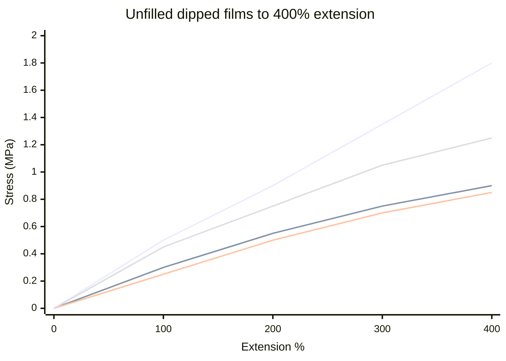
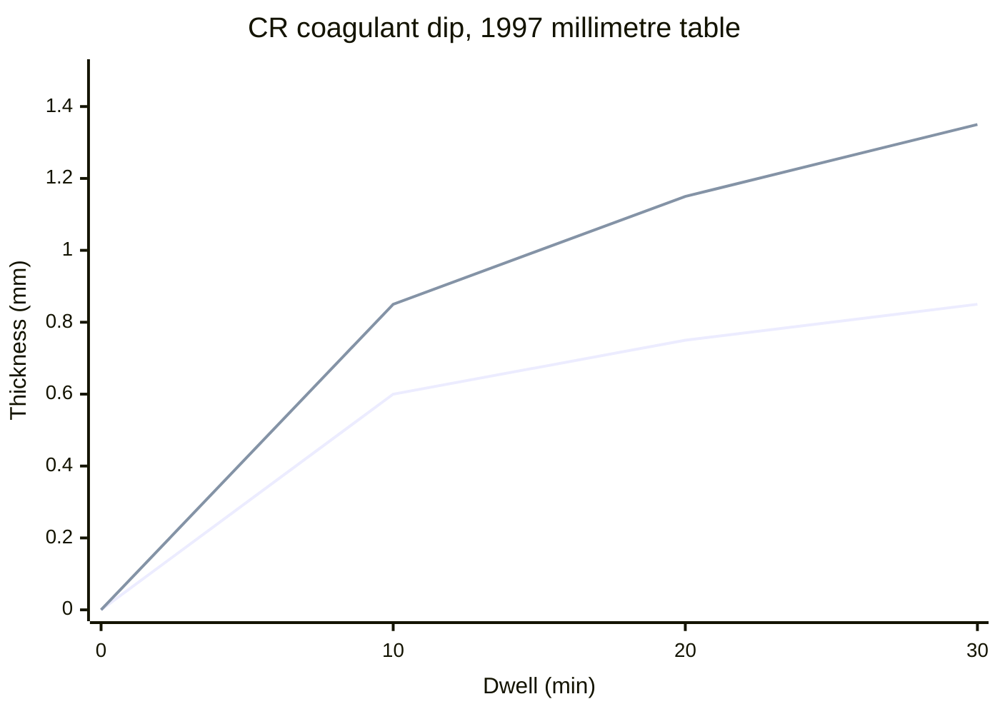

# Synthetic Lattices: CR, NBR, and SBR

Human page: /literature-reviews/liquid-synthetic-lattices

Skin and allergy questions: [Allergy and Skin Contact](/literature-reviews/allergy-and-skin-contact). This page does not restate that literature.

## Executive summary

Liquid pathway. Dip a former. Most dipping still uses natural rubber latex.[^2] Sun, ozone, and solvent resistance point at polychloroprene, which is also of interest for gloves that resist ozone and hydrocarbon oils and greases.[^1][^2] A high level of hydrocarbon-oil and grease resistance points at acrylonitrile–butadiene latex, preferably carboxylated, which is also the grade preferred for wet-gel strength.[^2][^4] The mixed nitrile compound ages in the pot.[^4] Polychloroprene compounds need zinc oxide and an antioxidant.[^3] Plain SBR latex is almost excluded from latex dipping.[^2]

Oils on a finished film: [Compatibility Matrix](/literature-reviews/compatibility-matrix-metals-oils-plastics). Joins: [Adhesives and Seam Integrity](/literature-reviews/liquid-adhesives-and-seam-integrity).

## Which latex do you dip?

Polychloroprene: sunlight, ozone, heat aging, solvent, abrasion, burning, gas and liquid penetration; often ahead of natural rubber for those uses. First latex use was industrial gloves in oils, greases, and solvents.[^1]

Synthetics are used less in dipping. Inferior wet-gel strength is common. Dried vulcanized films are low in strength in many cases. For gloves, the inner dip can be natural rubber and the outer dip a synthetic, so the inner layer carries strength.[^2] Delamination care on that page is for a carboxylated-nitrile coating over a natural-rubber lining.[^2]

SBR: no special dipping properties; almost completely excluded from latex dipping.[^2] On the non-porous polarity table it still sits with natural rubber on the low side.[^5]

Carboxylated nitrile: dipped so hydrocarbon oils and greases swell the film less. Higher acrylonitrile ratio, more oil resistance. Preferred over non-carboxylated nitrile for wet-gel strength and for dry strength and abrasion resistance.[^2][^4]

Two polychloroprene grades, unfilled vulcanized dipped films, compared with a natural-rubber band through 400% extension. Not breaking points.[^6]

## Polychloroprene compound

At least 5 parts zinc oxide and 2 parts antioxidant per 100 parts dry polychloroprene, fully dispersed.[^3]

Usually 5 parts zinc oxide. Up to 15 parts sometimes, where the polychloroprene is in intimate contact with acid-sensitive materials and/or sees long sun or elevated temperature. Usually omit zinc oxide only where the predominant constituent is itself the acid acceptor (chrysotile asbestos gaskets; hydraulic cement in elasticized concrete).[^7]

Photosensitive.[^7] Coatings section: usually light colors are not practical, and excellent outdoor aging is obtained only in dark carbon black or iron oxide red.[^8]

Neoprene Latex 571 example: every column has DARVAN SMO 3, DARVAN WAQ 1, zinc oxide 5, antioxidant 2. Column B adds McNAMEE clay 10. Columns C and D keep that clay. Column C adds BUTYL NAMATE 1 and ETHYL TUADS 1. Column D adds thiocarbanilide 2. Coagulant dipped, leached, dried, then vulcanized. Uncured tensile about 14 MPa (13.8–14.8). Uncured elongation 840–950%. Column C (clay plus ETHYL TUADS plus BUTYL NAMATE) after 60 min at 141°C: 25.0 MPa. ASTM Oil No. 3, 22 h at 100°C: that column still about 120% volume increase after that vulcanization.[^9] Factory example.

Polymer Latices Vol 3: a factory pH window of 10.3–10.9 has been recommended. Glycine 0.5 phr cuts pH from 12.1 to 10.7 and thickens the deposit. Chart is the 1997 millimetre table only. Compound behind it: polychloroprene 100, zinc oxide 5, kaolinite 10, phenyl-2-naphthylamine 2.[^10]

High Polymer Latices prints 10.3–10.8. Thickness columns are 0.5% glycine versus no glycine (0.035 vs 0.020 inches at 10 minutes). Direction matches. Those inch readings stay off the 1997 millimetre chart.[^11]

## Nitrile pot

Wet-gel strength falls as the compound ages (prevulcanization). Mud-cracking on dry. Replenish with fresh compound. 2 phr di-n-dibutyl phthalate promotes film integration, with little modulus effect. Limit drying temperature: low water-vapour permeability.[^4]

Table 17.7 dry parts on 100 rubber: ammonia 0.5, maleic anhydride–styrene copolymer 0.5, ammonium caseinate 0.015, sulphur 1.5, zinc diethyldithiocarbamate 2, zinc oxide 2.5, titanium dioxide 2, pigment as required. Antioxidant called unnecessary for that household-glove application.[^12] Do not copy the polychloroprene 5 phr zinc oxide floor or the 2 phr antioxidant rule onto this example.

## Polarity

Non-porous faces: match latex polarity to the surfaces joined. High: NBR, XNBR, XSBR, PSBR. Medium: CR, PVC. Low: NR, SBR, BR, IIR.[^5] Plain SBR is low. XSBR is high.

Porous faces on the same page: latex must flow into the pores; impeding electrostatic charge absent; latex charge opposite the substrate.[^5]

## Endnotes

[^1]: Vanderbilt Latex Handbook, 3rd ed. (1987). Polychloroprene latex properties and the industrial-glove lineage.
[^2]: Polymer Latices Vol 3, 2nd ed. (1997). Most dipping still uses natural rubber. Weak wet gel, low strength of many dried vulcanized films, natural-rubber inner plus synthetic outer, polychloroprene for oil-and-ozone gloves, acrylonitrile–butadiene for a high level of oil and grease resistance, SBR almost excluded, carboxylated nitrile preferred.
[^3]: Vanderbilt Latex Handbook. At least five parts zinc oxide and two parts antioxidant, fully dispersed.
[^4]: Polymer Latices Vol 3. Carboxylated nitrile wet gel, pot age, mud-cracking, di-n-dibutyl phthalate, drying temperature.
[^5]: Vanderbilt Latex Handbook. Non-porous polarity columns; porous faces use flow and opposite charge.
[^6]: Polymer Latices Vol 3. Unfilled dipped-film stress–strain for two polychloroprene grades versus a natural-rubber band, through 400% extension.
[^7]: Vanderbilt Latex Handbook. Zinc oxide sometimes up to 15 parts; usually omitted only when the predominant constituent is the acid acceptor. Photosensitive is stated here; the light-color rule is the coatings sentence.
[^8]: Vanderbilt Latex Handbook, coatings. Photosensitive; usually light colors are not practical; excellent outdoor aging only in dark carbon black or iron oxide red.
[^9]: Vanderbilt Latex Handbook. Neoprene 571 dipped-film example and ASTM Oil No. 3 volume increase.
[^10]: Polymer Latices Vol 3. Coagulant-dip pH window 10.3–10.9 and the 1997 millimetre thickness table.
[^11]: High Polymer Latices (1966), 2 vols. Same pH–thickness comparison; window 10.3–10.8; glycine versus no-glycine columns; axis in inches; inch readings not merged with the 1997 millimetre chart.
[^12]: Polymer Latices Vol 3. Carboxylated-nitrile household-glove example: zinc oxide 2.5 parts; antioxidant unnecessary for that application.

## Sources

- *The Vanderbilt Latex Handbook*. 3rd ed. Edited by Robert Francis Mausser. Norwalk, CT: R.T. Vanderbilt Company, 1987. https://lccn.loc.gov/92117844
- *Polymer Latices: Science and Technology — Volume 3: Applications of Latices*. 2nd ed. D. C. Blackley. Chapman & Hall / Springer, 1997. https://books.google.com/books?id=Y2VPGj7YbykC
- *High Polymer Latices: Their Science and Technology*. 2 vols. D. C. Blackley. London: Maclaren; New York: Palmerton, 1966. https://lccn.loc.gov/66077950
