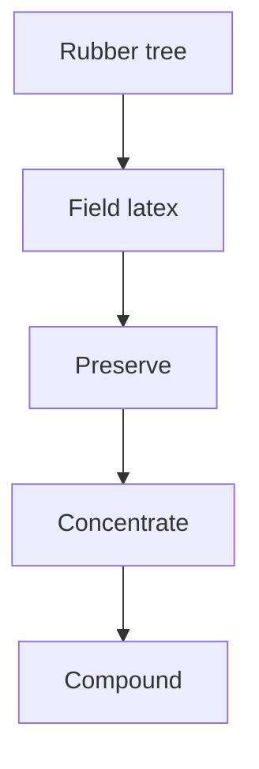

# From the Rubber Tree to Liquid Latex

Human page: /literature-reviews/liquid-tree-to-liquid-latex

> **Safety.** Ammonia fumes from natural-rubber latex may be a health hazard if breathed over a prolonged period. Switch to low-ammonia natural latex and ventilate.[^1] Shop air: [Liquid Latex Ventilation and Ammonia](/literature-reviews/liquid-ventilation-ammonia). Skin contact: [Allergy and Skin Contact](/literature-reviews/allergy-and-skin-contact).

## Executive summary

Liquid pathway: field latex from the tree, then preserve, then concentrate, then compound, then dip, cast, or spread.[^2][^3][^4]

1966 account: exudate dry rubber content 30–40% (average about 33%); concentrate about 60% dry rubber content.[^4] 1987 ammonia example: a typical 62% centrifuged latex; the sum sets total solids at 62% of wet weight and rubber solids at 60% of wet weight (100 parts rubber on 167 wet).[^5][^6] High-ammonia preserved natural latex may be compounded as received or deammoniated. Low-ammonia natural-rubber latex generally does not need its ammonia reduced before compounding.[^6] The 1966 concentrate figure is dry rubber content, about 60%. In the 1987 sum, 62% is total solids and 60% is rubber solids.

Bottle storage: [Liquid Latex Aging, Storage and Care](/literature-reviews/liquid-aging-storage-and-care). Labels: [Decoding Liquid Latex Bottle Labels](/literature-reviews/liquid-decoding-bottle-labels). Forming: [Forming Film from Liquid Latex](/literature-reviews/liquid-film-pathway).

## Questions this article answers

- [What is the chain from the tree to concentrate?](#chain)
- [Where do compound and film forming start?](#forming)
- [Where are storage and bottle labels?](#storage)

## What is the chain from the tree to concentrate? {#chain}

Related questions: `liquid-hevea-rubber-tree`, `liquid-plantation-tapping-field-latex`, `liquid-field-latex-to-concentrate`.

Vanderbilt (1987): natural rubber latex is found in *Hevea brasiliensis* and the guayule plant.[^2] *High Polymer Latices* (1966): world's supply of natural rubber and natural rubber latex obtained almost exclusively from *Hevea brasiliensis* (Euphorbiaceae), as of that book.[^7] “Found in” and “world supply in 1966” are different claims. Both stand.

Tapping in that 1966 book: sever the vessels; latex exudes spontaneously.[^8]

Coagulation within a few hours of leaving the tree; clots and clear serum; later putrefaction. Preserve prevents both.[^3] Long-term preservation covers shipment and storage in the consumer country. Anticoagulants are the short-term class: hours or days before dry rubber.[^3]

Concentrate uniformity in that account: several concentration processes remove some non-rubber constituents.[^4]

### Detail: Four ways to concentrate, in the 1966 book

Methods named: evaporation, creaming, centrifuging, electrodecantation.[^4] Evaporation removes water only (non-rubber ratio, other than water, and particle-size distribution stay). The other three partly remove non-rubber relative to rubber and eliminate a share of smaller particles.[^4]

1966 creaming section: market preference then was centrifuged latex.[^9] The 1987 ammonia example is centrifuged latex.[^5]

### Detail: Field latex, concentrate, and compound

Field latex: liquid from the tree before concentration.[^4] Concentrate: about 60% dry rubber content in the 1966 normal procedure.[^4] The 1987 example is a 62% centrifuged latex with rubber solids at 60% of wet weight.[^5][^6] Compound: latex plus ingredients so the film can be manufactured.[^2]

Latex definition used here: colloidal dispersion of a polymeric material in a mostly aqueous liquid, natural or synthetic.[^2]

### Detail: What the 1966 tree chapter is for

1966 cultivation chapter: *Hevea brasiliensis*, Euphorbiaceae, plus tapping, preservation, and concentration for that date.[^7][^8][^3][^4] Vanderbilt 1987 names *Hevea* and guayule.[^2] Current yield, clones, and disease belong with `liquid-hevea-rubber-tree`.

## Where do compound and film forming start? {#forming}

After concentrate: compound, then dip, cast, or spread. Forming: [Forming Film from Liquid Latex](/literature-reviews/liquid-film-pathway).

Film from raw latex is not a usable or saleable article until the latex is compounded.[^2]

## Where are storage and bottle labels? {#storage}

Storage: [Liquid Latex Aging, Storage and Care](/literature-reviews/liquid-aging-storage-and-care). Labels: [Decoding Liquid Latex Bottle Labels](/literature-reviews/liquid-decoding-bottle-labels). Ammonia in air: [Liquid Latex Ventilation and Ammonia](/literature-reviews/liquid-ventilation-ammonia).

A concentrate bottle on this pathway is long-term preservation, not the anticoagulant class used for a few hours or days before dry rubber.[^3] Fume control: low-ammonia natural latex and ventilation.[^1]

## Endnotes

[^1]: *The Vanderbilt Latex Handbook*. 3rd ed. Edited by Robert Francis Mausser. Norwalk, CT: R.T. Vanderbilt Company, 1987. Ammonia fumes from NR latex may be a health hazard if breathed over a prolonged period; switch to low-ammonia natural latex and ventilate. <https://lccn.loc.gov/92117844>

[^2]: *The Vanderbilt Latex Handbook*, 1987. Natural rubber latex found in *Hevea brasiliensis* and guayule. Latex: colloidal dispersion of a polymeric material in a mostly aqueous liquid. Film from raw latex is not usable or saleable until compounded.

[^3]: *High Polymer Latices: Their Science and Technology*. 2 vols. D. C. Blackley. London: Maclaren; New York: Palmerton, 1966. Coagulates within a few hours of leaving the tree; clots and clear serum; later putrefaction. Long-term preservation versus anticoagulants (hours or days before dry rubber). <https://lccn.loc.gov/66077950>

[^4]: *High Polymer Latices*, 1966. Exudate dry rubber content 30–40%, average about 33%. Normal procedure: concentrate to about 60% dry rubber content. Concentrates more uniform because several processes remove some non-rubber. Four methods: evaporation, creaming, centrifuging, electrodecantation.

[^5]: *The Vanderbilt Latex Handbook*, 1987. Typical 62% centrifuged latex; 0.65% ammonia on wet weight. Following sum: total solids 62% of wet weight (167 × 0.62); rubber solids 60% of wet weight (167 × 0.60 = 100).

[^6]: *The Vanderbilt Latex Handbook*, 1987. High-ammonia preserved natural latex compounded as received or deammoniated. Low-ammonia natural-rubber latex: ammonia generally not reduced before compounding. Example continues from 0.65% ammonia wet toward 0.10%.

[^7]: *High Polymer Latices*, 1966. *Hevea brasiliensis*, Euphorbiaceae. World's supply of natural rubber and natural rubber latex obtained almost exclusively from that species, as of the book.

[^8]: *High Polymer Latices*, 1966. Tapping: sever the vessels; latex exudes spontaneously.

[^9]: *High Polymer Latices*, 1966. Creaming section: market preference of that time was centrifuged latex.

## Sources

- *The Vanderbilt Latex Handbook*. 3rd ed. Edited by Robert Francis Mausser. Norwalk, CT: R.T. Vanderbilt Company, 1987. <https://lccn.loc.gov/92117844>
- *High Polymer Latices: Their Science and Technology*. 2 vols. D. C. Blackley. London: Maclaren; New York: Palmerton, 1966. <https://lccn.loc.gov/66077950>
