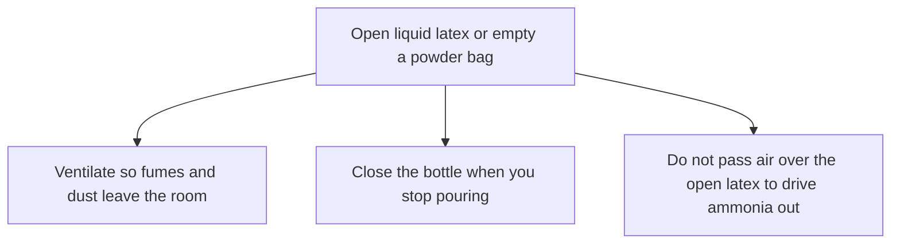

# Liquid Latex Ventilation and Ammonia

Human page: /literature-reviews/liquid-ventilation-ammonia

> **Safety.** Ammonia and rubber chemicals can irritate or sensitize. If you feel dizzy, nauseated, or get a new rash or breathing trouble, stop and get fresh air. Shop hygiene. A clinician handles diagnosis. Your local authority handles the building.

## Executive summary

Liquid latex here is ammonia-preserved. Compounding adds dry powders. Documented shop hazards: prolonged ammonia fumes, powder dust, and acid or alkali burns.[^1][^2]

Labels: [Decoding consumer latex bottle labels](/literature-reviews/liquid-decoding-bottle-labels). Skin-reaction classes: [Allergy and Skin Contact](/literature-reviews/allergy-and-skin-contact). Closed-bottle storage: [Liquid latex aging, storage and care](/literature-reviews/liquid-aging-storage-and-care).

## What do I do when the bottle is open?

### How

1. Read the supplier materials-and-handling sheet (safety data sheet) for the latex and each powder.[^1]
2. Open the bottle where air leaves the room. Close it when you stop pouring.[^2][^3]
3. If fumes will be breathed over a prolonged period, use low-ammonia latex and ventilate.[^2]
4. Emptying bags of zinc oxide, sulfur, antioxidant, or accelerator: respirator and protective clothing; wash skin; launder work clothes.[^2][^4]
5. Add acid or alkali to water. Goggles, rubber gloves, apron. Do not combine a strong acid with a strong alkali.[^2]
6. Do not pass air over an open surface of latex to drive the smell out. The 1966 method is warm air over gently agitated latex, sweeping ammonia into the air stream. It is not air bubbled through the liquid.[^5]

### Why

Workplace should be well ventilated. Ammonia fumes from NR latex may be a health hazard over a prolonged period. Switch to low-ammonia natural latex and ventilate the use area.[^2]

Pungent odor, especially above 0.3% ammonia, causes human discomfort. Ammonia is described as generally non-toxic. Skin-reaction classes are in [Allergy and Skin Contact](/literature-reviews/allergy-and-skin-contact).[^3] High ammonia during centrifuging: a larger quantity escapes into the atmosphere and causes human discomfort.[^3]

### Detail: Workplace ammonia limits

Detail: Workplace ammonia limits

CAS 7664-41-7. OSHA PEL 50 ppm (35 mg/m³) 8-hour TWA.[^6] NIOSH REL 25 ppm (18 mg/m³) TWA; STEL 35 ppm (27 mg/m³); IDLH 300 ppm. The OSHA table prints that IDLH in the NIOSH column. Pocket guide also restates OSHA PEL 50 ppm.[^7] Workplace shift numbers.

### Detail: Plant aeration vessel

Detail: Plant equipment that strips ammonia from the latex

1966 partial deammoniation before sodium silicofluoride foam gelation. Warm air over gently agitated latex; ammonia swept into the air stream.[^5] Tier 4 monograph. Vanderbilt 1987 and Practical Guide 2013 still govern shop practice.[^2][^3]

### Detail: Lab compounding order

Detail: Lab compounding order

Incoming QC: total solids ASTM D1076, viscosity, pH, mechanical stability, KOH/VFA, metals ASTM D1278, ammonia titration with the sample restoppered so ammonia is not lost.[^4] Addition order while stirring, no vortex: stabilizers, then zinc oxide / sulfur / antioxidant / accelerators, then fillers, colors, plasticizers, then thickeners.[^4] Leach-before-cure films: changing water bath 20–30 min at 40–50 °C, then air dry.[^4]

## Which metals stay off the liquid?

Factory paragraph: copper or its alloys never; galvanized fittings cause coagulation. Transfer lines: flanged black iron or stainless; glass-lined equipment also used. The jar paragraph above that states no metal ban. A home bottle uses that factory rule as craft translation.[^8] Storage: [Liquid latex aging, storage and care](/literature-reviews/liquid-aging-storage-and-care).

## Endnotes

[^1]: *The Vanderbilt Latex Handbook*, 3rd ed. (1987), laboratory health section — obtain materials-and-handling information from suppliers.
[^2]: Same, health and safety — workplace should be well ventilated; prolonged ammonia fumes; switch to low-ammonia latex and ventilate; add acid or alkali to water; do not add strong acids and bases together; goggles, rubber gloves, apron; respirators and protective clothing when emptying bags; wash skin; sensitization; launder work clothes.
[^3]: *Practical Guide to Latex Technology* (2013) — pungent odor especially above 0.3% causes human discomfort, ammonia generally considered non-toxic; high ammonia during centrifuging escapes into the atmosphere and causes human discomfort.
[^4]: *The Vanderbilt Latex Handbook*, laboratory procedures — incoming QC including ammonia titration; addition order; leach 20–30 min at 40–50 °C then air dry.
[^5]: *High Polymer Latices* (1966), Vol. 1 — partial deammoniation before sodium silicofluoride foam. A stream of warm air passes over the surface of gently agitated latex; the ammonia is swept away by the air stream. Not a sparger. Legacy monograph; does not override [^2] or [^3].
[^6]: OSHA chemical data, ammonia CAS 7664-41-7 — PEL 50 ppm (35 mg/m³) 8-hour TWA. The page’s IDLH cell is in the NIOSH column.
[^7]: NIOSH Pocket Guide, ammonia — REL 25 ppm (18 mg/m³) TWA; STEL 35 ppm (27 mg/m³); IDLH 300 ppm; OSHA PEL restated as 50 ppm.
[^8]: *The Vanderbilt Latex Handbook*, factory tank and transfer-line paragraph — never copper or its alloys; galvanized fittings cause coagulation; flanged black iron or stainless; glass-lined equipment also used. The laboratory jar paragraph above it states no metal ban. Home-bottle use is craft translation of the factory sentences.

## Sources

- *The Vanderbilt Latex Handbook*. 3rd ed. Edited by Robert Francis Mausser. Norwalk, CT: R.T. Vanderbilt Company, 1987. <https://lccn.loc.gov/92117844>
- *Practical Guide to Latex Technology*. Rani Joseph. Shawbury: Smithers Rapra Technology, 2013. <https://books.google.com/books/about/Practical_Guide_to_Latex_Technology.html?id=NB5AMwEACAAJ>
- *High Polymer Latices: Their Science and Technology*. 2 vols. D. C. Blackley. London: Maclaren; New York: Palmerton, 1966. <https://lccn.loc.gov/66077950>
- OSHA. Chemical data: Ammonia (CAS 7664-41-7). <https://www.osha.gov/chemicaldata/623>
- NIOSH Pocket Guide to Chemical Hazards: Ammonia. Centers for Disease Control and Prevention. <https://www.cdc.gov/niosh/npg/npgd0028.html>
