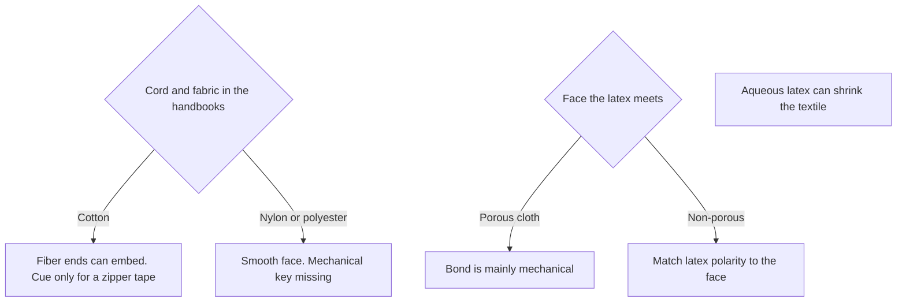

# Liquid Zipper Closure Compatibility

Human page: /literature-reviews/liquid-zipper-closure-compatibility

> **Safety.** Latex adhesive: subject to freezing; corrosive to some metals.[^1] Wet metal: [Liquid hardware](/literature-reviews/liquid-hardware-metal-contact), [compatibility matrix](/literature-reviews/compatibility-matrix-metals-oils-plastics).

## Executive summary

Aqueous latex on zipper tape. Latex adhesives shrink fabrics and can freeze; some metals corrode in the wet adhesive.[^1] Aqueous lattices tend to shrink textiles.[^4] Non-porous faces: match latex polarity to the surface.[^1] Continuous-filament polyamide and polyester lack the cotton fiber-end mechanical key on cord and fabric.[^2][^3] Bought sheet and solvent cement: [Sheet zipper closure compatibility](/literature-reviews/sheet-zipper-closure-compatibility).

## Questions this article answers

- [Which zipper parts meet the liquid latex?](#which-parts)
- [What does a latex adhesive do to the tape?](#shrink)
- [Cotton tape, or a slick nylon or polyester tape?](#fiber)
- [What does ASTM D2054 test?](#d2054)

## Which zipper parts meet the liquid latex? {#which-parts}

### How

| Part | Question |
| --- | --- |
| Woven tape | Cotton, nylon, or polyester |
| Coil or teeth | Nylon, or metal in the wet latex → [Liquid hardware](/literature-reviews/liquid-hardware-metal-contact) |
| Stops and pull | Whether they sit in the wet adhesive |

Cloth: [Liquid latex–textile bonding](/literature-reviews/liquid-latex-textile-bonding). Adhesive families: [Liquid adhesives](/literature-reviews/liquid-adhesives-and-seam-integrity).

### Why

The wetted face is the tape. Coil and stops are separate materials. Metal in wet latex is the hardware article.[^1]

## What does a latex adhesive do to the tape? {#shrink}

### How

Treat shrink, freezing, and corrosion of some metals as listed disadvantages of a latex adhesive.[^1][^4] Do not freeze the latex. Wet metal: hardware article above.

### Why

“Shrinks fabrics.” Also: subject to freezing; corrosive to some metals.[^1] “The tendency of aqueous lattices to shrink textiles and to wrinkle paper.”[^4] Those sentences are about latex adhesives.

### Detail

Detail: Other latex-adhesive disadvantages on the same page

Vanderbilt latex column also: poorer water resistance; wrinkles or curls paper; contamination by some materials used for storage and application; slow drying; poorer electrical properties.[^1] Solvent column on that page: fire and fume class. Bought-sheet article.

## Cotton tape, or a slick nylon or polyester tape? {#fiber}

### How

NR is in the low-polarity band. On a non-porous face, latex polarity should match the face.[^1] Factory cord dips: [Liquid latex–textile bonding](/literature-reviews/liquid-latex-textile-bonding).

### Why

Cotton: protruding fibre ends embed in the rubber. Rayon, polyamide, and polyester: continuous filament, smooth wax-like surface, mechanical key missing. Cord and fabric, not a zipper SKU.[^2] 1966 set: same limit; names nylon, Terylene, Dacron.[^3]

Porous substrate: bond mainly mechanical. Non-porous: matched polarity.[^4]

### Detail

Detail: Abrasion, and one word the two Blackley books do not share

High-tenacity rayon cord. Prior abrasion improves static adhesion. Dynamic improvement is not so marked unless a dip follows. Combined effect greater than either step alone.[^2][^3]

1997 page text: latex-casein abrasive.[^2] 1966 page text: latex-casein adhesive.[^3] Same report otherwise. No silent winner. Tire cord, not zipper tape.

Detail: Polarity bands for a non-porous face

Non-porous: polarity of the latex should match the surfaces to be joined. High: NBR, XNBR, XSBR, PSBR. Medium: CR, PVC. Low: NR, SBR, BR, IIR.[^1]

Porous: latex must flow into the pores; charge must be opposite the substrate or particles are repulsed.[^1]

Porous: mainly mechanical. Non-porous: matched polarity. Non-polar: polyisoprene or SBR. High polarity: acrylonitrile–butadiene, acrylics, styrene–vinylpyridine–butadiene, or carboxylated polymers.[^4]

## What does ASTM D2054 test? {#d2054}

### How

ASTM D2054: colorfastness of zipper tapes to crocking. Not a bond test for a latex film.[^5]

### Why

Subject is color rub-off from the textile tape.[^5]

## Endnotes

[^1]: *The Vanderbilt Latex Handbook*. 3rd ed. Edited by Robert Francis Mausser. Norwalk, CT: R.T. Vanderbilt Company, 1987. https://lccn.loc.gov/92117844 Latex-adhesive disadvantages include “Shrinks fabrics,” subject to freezing, and corrosive to some metals. Also poorer water resistance, wrinkles or curls paper, contamination by some storage and application materials, slow drying, poorer electrical properties. Non-porous: polarity of the latex should match the surfaces to be joined. High: NBR, XNBR, XSBR, PSBR. Medium: CR, PVC. Low: NR, SBR, BR, IIR. Porous: flow into pores; opposite charge or particles are repulsed.

[^2]: *Polymer Latices: Science and Technology — Volume 3: Applications of Latices*. 2nd ed. D. C. Blackley. Chapman & Hall / Springer, 1997. https://books.google.com/books?id=Y2VPGj7YbykC Cotton staple fibre ends embed in rubber. Continuous-filament rayon, polyamide, and polyester have a smooth, wax-like surface and lack that mechanical key. Abrasion of high-tenacity rayon improves static adhesion; dynamic gain needs a following treatment. Page text: “latex-casein abrasive.”

[^3]: *High Polymer Latices: Their Science and Technology*. 2 vols. D. C. Blackley. London: Maclaren; New York: Palmerton, 1966. https://lccn.loc.gov/66077950 Same mechanical-key limit for rayon, polyamide (“nylon”), and polyester (“Terylene” or “Dacron”). Same abrasion report; page text: “latex-casein adhesive.” Tier 4 corroboration. Do not cite this set as Polymer Latices Volume 3.

[^4]: *Practical Guide to Latex Technology*. Rani Joseph. Shawbury: Smithers Rapra Technology, 2013. https://books.google.com/books/about/Practical_Guide_to_Latex_Technology.html?id=NB5AMwEACAAJ “The tendency of aqueous lattices to shrink textiles and to wrinkle paper.” Porous substrates: bond mainly mechanical; polymer nature less important. Non-porous: matched polarity. Non-polar: polyisoprene or SBR. High polarity: acrylonitrile–butadiene, acrylics, styrene–vinylpyridine–butadiene, or carboxylated polymers.

[^5]: ASTM D2054. Colorfastness of zipper tapes to crocking. Scope boundary: textile tape, not a natural-rubber film bond test. No URL recorded.
