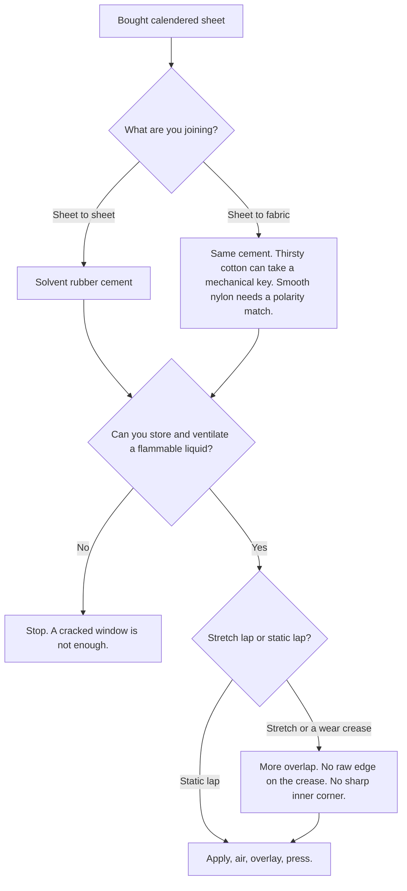
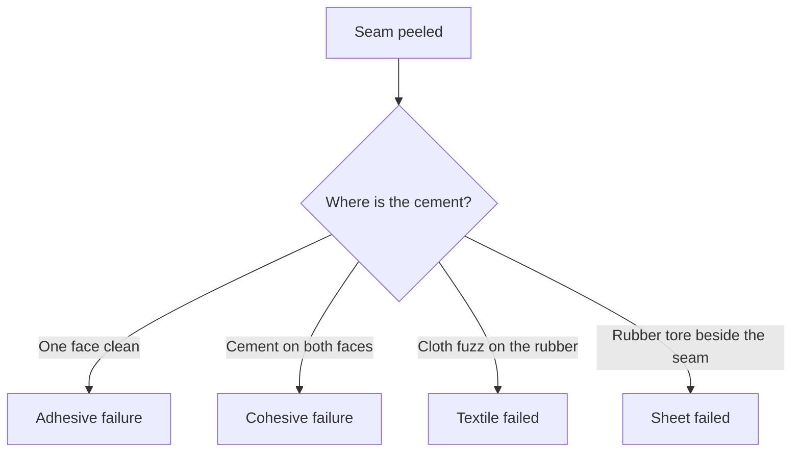

# Sheet Adhesives and Seam Integrity

Human page: /literature-reviews/sheet-adhesives-and-seam-integrity

> **Safety.** Solvent rubber cement is a flammable liquid. Fire, explosion, and fumes are handbook disadvantages.[^1] Read the product SDS. Keep cans closed, away from heat and sparks. Workplace flammable-liquid storage: OSHA 29 CFR 1910.106.[^7] n-Heptane exposure card: NIOSH Pocket Guide.[^8]

## Executive summary

Commercial (usually calendered) sheet uses **solvent rubber cement**: rubber in a flammable solvent. Apply, air until tacky, overlay, press. Solvent systems are the industrial comparison pole for water resistance, open time, early tack, wetting of difficult surfaces, and fire / explosion / fume / ventilation burden.[^1] Use this when joining sheet to sheet, joining sheet to fabric, or reading a peeled cement seam.

## Questions this article answers

- [Which adhesive for bought sheet?](#which-adhesive)
- [How long do I wait after I apply it?](#air-the-coat)
- [Does the cement match the sheet?](#match-the-sheet)
- [What is a peeled seam telling me?](#peeled-seam)
- [What are the safety rules?](#safety)

## Which adhesive for bought sheet? {#which-adhesive}

### How

Solvent rubber cement on both faces of the lap. Air. Overlay. Press.

**Lap:** overlap join. **Static lap:** sits still. **Stretch lap:** crease, strap root, crotch, elbow. Sheet–fabric: cotton may key mechanically; smooth nylon is closer to a non-porous face.[^1][^3] Textile article: [Sheet latex–textile bonding](/literature-reviews/sheet-latex-textile-bonding).

### Why

Vanderbilt solvent column: water resistant; wide drying rates and open times; high early bond strength and/or tack; wets some difficult surfaces.[^1] Latex-adhesive column (not this how-to): poorer water resistance, freezing, fabric shrink, slow drying.[^1]

### Detail

Detail: Solvent column and latex column

Solvent disadvantages: explosion hazard; fire hazard; explosion-proof ventilation; solvent fumes.[^1] Latex column also lists contamination by some storage and application materials.[^1]

Practical Guide: latex vs solution adhesives — cost, absence of flammable/toxic solvents, solids/viscosity, high molecular weight, porous wet-out.[^3] Restricted interparticle coalescence plus surfactants may lower latex-film strength versus solution films.[^4] That locus is latex adhesive, not a sheet-cement drying schedule.

## How long do I wait after I apply it? {#air-the-coat}

### How

**Flash off** until the coat is tacky, not wet, and not dead. Synonym **air off** (one mention). Operation: **air** the adhesive until it is ready to overlay.

**Open time** is the length of that tacky window. Heat, a thin coat, and a draft shorten it. A thick coat and a cold room lengthen it. No garment-gauge minute count in the handbook.[^1]

### Why

The solvent column is specified on a wide range of drying rates and open times and on high early bond strength.[^1] Overlay while tack remains.

### Detail

Detail: What the handbooks do not time

Vanderbilt states the range. It does not publish a reactivation window for fashion-sheet gauges.[^1] Plant combining schedules are a different process.[^1][^4]

## Does the cement match the sheet? {#match-the-sheet}

### How

Fashion NR sheet: smooth, low-polarity face. NR or SBR solvent cement matches. High-polarity nitrile adhesive is the mismatch.[^1] Porous cotton: mechanical key if cement enters the weave. Smooth nylon: closer to non-porous.[^3]

### Why

Non-porous: match polarity. Low: NR, SBR, BR, IIR. Medium: CR, PVC. High: NBR, XNBR, XSBR, PSBR.[^1] Practical Guide: porous → polymer less important (mechanical); non-porous → matched polarity; non-polar → polyisoprene or SBR; high polarity → NBR, acrylics, styrene–vinylpyridine–butadiene, carboxylated types.[^3] Calendered fashion sheet is smooth; apply the non-porous rule. No fashion-sheet porosity measurement is in these handbooks.

### Detail

Detail: Polarity ladder

| Rung | Polymers | Smooth-face example |
| --- | --- | --- |
| High | NBR, XNBR, XSBR, PSBR | Polar plastics; nitrile rubber |
| Medium | CR, PVC | Chloroprene or PVC |
| Low | NR, SBR, BR, IIR | Fashion NR sheet; NR or SBR solvent cement |

Mixed polarity: blend or resin bridge.[^4] Rubber-to-textile form of that bridge: non-polar latex plus casein or resorcinol-formaldehyde resin.[^4] Industrial, not a hobby bottle.

## What is a peeled seam telling me? {#peeled-seam}

### How

| Cue | Next category |
| --- | --- |
| Clean face, cement on the other piece | Bare face, polarity, or never wetted |
| Cement split, both faces dirty | Film strength |
| Cloth fuzz | Textile failed |
| Rubber tore beside the seam | Sheet or shape |
| Edge always starts | Lap geometry |
| Still tacky days later | Open time, cold room, or wrong family |

**Notch:** sharp inner corner or slit. Tear specimens start at a cut.[^11] Extra cement does not remove the corner. See [Sheet delamination and seam failure](/literature-reviews/sheet-delamination-seam-failure).

### Why

**Adhesive failure:** separation at the cement–substrate interface. **Cohesive failure:** split through the cement. In one studied system, slow peel was cohesive and fast peel was adhesive.[^12] Not a garment pass/fail. Edge start is peel leverage at the free edge of the lap.

### Detail

Detail: Peel method classes

ASTM D1876: T-peel, flexible–flexible.[^9] ASTM D903: peel/stripping.[^10] Method classes, not garment grades. ASTM D412 / D624: tensile and tear of vulcanized rubber, film and tear-start, not a seam grade.[^11] Practical Guide: fracture devices include peel tests.[^3]

## What are the safety rules? {#safety}

### How

Closed, labeled containers. Away from heat and sparks. Product SDS. No food tubs. If ventilation and flammable-liquid storage are not available, postpone. Not medical advice: [Allergy and skin contact](/literature-reviews/allergy-and-skin-contact).

### Why

Explosion hazard, fire hazard, special ventilation, solvent fumes.[^1] OSHA 29 CFR 1910.106.[^7] NIOSH Pocket Guide — n-heptane for flash point and explosive limits when that is the solvent.[^8]

## Endnotes

[^1]: *The Vanderbilt Latex Handbook*. 3rd ed. Edited by Robert Francis Mausser. Norwalk, CT: R.T. Vanderbilt Company, 1987. https://lccn.loc.gov/92117844 — Ch 21 solvent vs latex columns; polarity ladder; open time.
[^3]: *Practical Guide to Latex Technology*. Rani Joseph. Shawbury: Smithers Rapra Technology, 2013. https://books.google.com/books/about/Practical_Guide_to_Latex_Technology.html?id=NB5AMwEACAAJ — latex vs solution adhesives; porous vs non-porous polarity; peel as a fracture method.
[^4]: *Polymer Latices: Science and Technology — Volume 3: Applications of Latices*. 2nd ed. D. C. Blackley. Chapman & Hall / Springer, 1997. https://books.google.com/books?id=Y2VPGj7YbykC — restricted interparticle coalescence; non-porous polarity and mixed-polarity resin bridge; casein / resorcinol-formaldehyde textile adhesives.
[^7]: OSHA 29 CFR 1910.106 — flammable liquids. https://www.osha.gov/laws-regs/regulations/standardnumber/1910/1910.106
[^8]: NIOSH Pocket Guide to Chemical Hazards — n-heptane. https://www.cdc.gov/niosh/npg/npgd0312.html
[^9]: ASTM D1876 — T-peel (flexible–flexible). Method class, not a garment grade.
[^10]: ASTM D903 — peel or stripping strength. Method class, not a garment grade.
[^11]: ASTM D412 and ASTM D624 — tensile and tear of vulcanized rubber. Not a seam grade.
[^12]: Poh, B. T., and Chee, C. L. *International Journal of Polymer Science* (2013) — peel mode versus rate in the system they tested.
