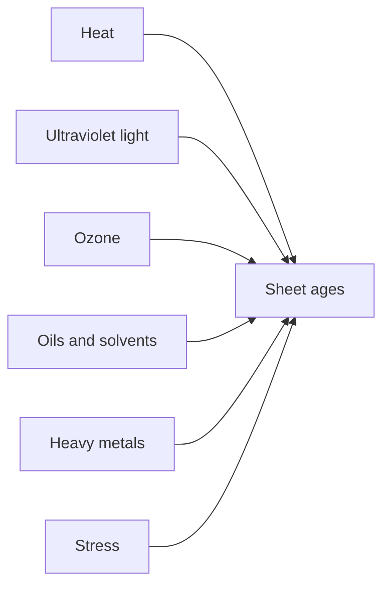
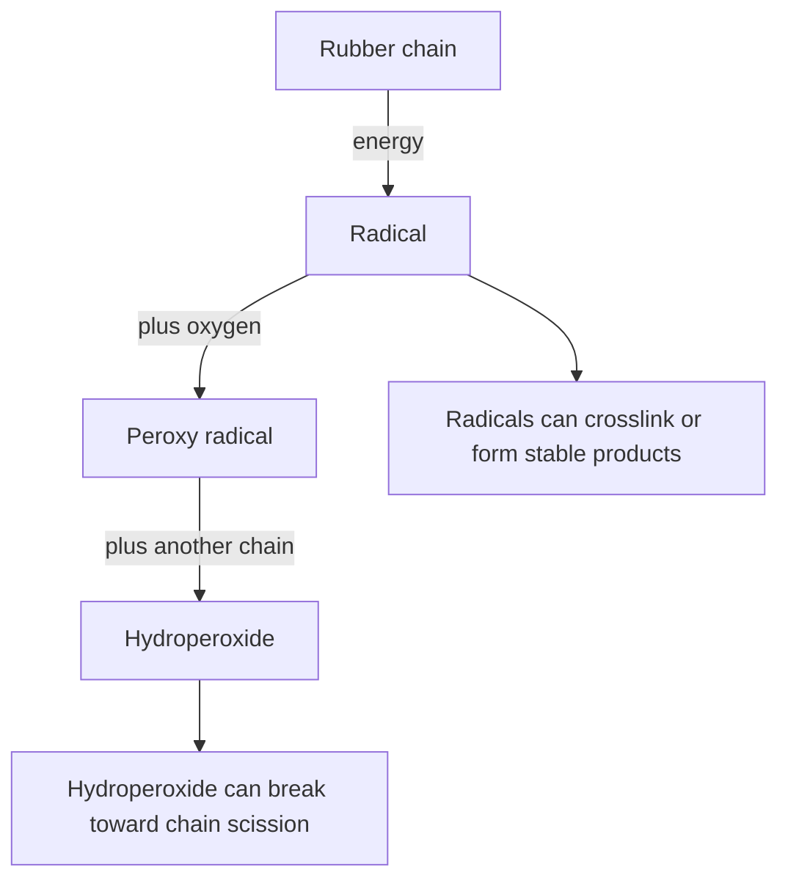
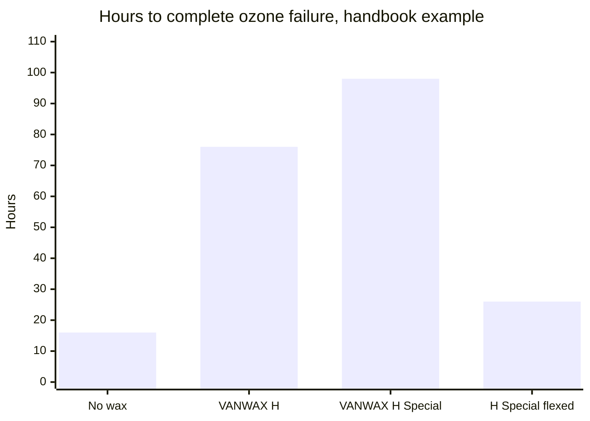

# Sheet Aging, Storage and Care

Human page: /literature-reviews/sheet-aging-storage-and-care

Petroleum products attack natural-rubber sheet. Solvent-cement patches are flammable liquids (closed container, away from heat and sparks; product SDS).[^15] Skin reactions: [Allergy and skin contact](/literature-reviews/allergy-and-skin-contact).

## Executive summary

Heat, light, ozone, oils, and a crease under stress age calendered sheet. Storage retards degradation. The handbook states that degradation of latex articles cannot be prevented, only retarded.[^1]

Use this for unused commercial sheet and finished garments.

## Questions this article answers

- [Why does bought sheet age?](#why-does-bought-sheet-age)
- [How should I store sheet and garments?](#how-should-i-store-sheet-and-garments)
- [What do the marks mean?](#what-do-the-marks-mean)
- [What should stay off the sheet?](#what-should-stay-off-the-sheet)

## Why does bought sheet age? {#why-does-bought-sheet-age}

### How

Cool, dark, ozone-aware storage. Keep petroleum, mineral oil, and oil lotions off the sheet. Do not leave a knife-edge fold under stress for months.[^1]

| Driver | What you may notice | Storage change |
| --- | --- | --- |
| Heat | Faster tack or hardening | Cool room; keep stock off ceiling heat and radiators[^1] |
| Ultraviolet light | Dull, discolored, or crazed face | Dark storage[^1] |
| Ozone | Fine cracks across a stressed area, often perpendicular to stretch | Keep fluorescent/mercury lamps, high-voltage gear, motors, and sparking equipment out of the room[^3] |
| Oxygen | Slow aging in the dark | Retard; the handbook does not claim a stop[^1] |
| Oils and solvents | Swell, softness, loss of strength | Keep petroleum off the sheet[^4][^10][^11] |
| Crease under stress | Crease that becomes a crack line | Avoid sharp film edges[^1] |

### Why

Handbook drivers: heat, humidity, ultraviolet light, high-energy radiation, ozone, oxygen, chemicals (acids, bases, oils, solvents, oxidizers, heavy metals), and stress.[^1]

Three oxidative modes at once: chain scission (soft, tacky surface), crosslinking (harden/embrittle), chemical alteration (solubility change). Autocatalytic; light accelerates.[^1]

Ozone forms from electrical discharge (motors, lightning) and from ultraviolet light plus nitrogen oxide in urban air. Ozone cracks run perpendicular to film stress over a wide area. Flex cracks stay in the strained zone. Ultraviolet damage is non-oriented and crazes the exposed face.[^1] Fatty-acid salts of copper, cobalt, manganese, and iron catalyze oxidation.[^1] Oils, greases, and fuels deteriorate vulcanized rubber (swell, tensile, hardness) as a method class.[^4]

### Detail

Detail: How oxygen attacks the sheet

Handbook scheme: energy splits an elastomer chain; oxygen builds a peroxy radical and a hydroperoxide; chain scission can follow; termination can crosslink or yield stable products. Phenolic or amine antioxidants retard degradation by eliminating peroxide.[^1] Plant compounding, not a garment coating.

The handbook calls the rubber a diene elastomer. Ozone attacks the double bond. Ambient ozone in the handbook discussion is about 1–8 pphm.[^1] ASTM D1149: ozone under static or dynamic surface tensile strain; sunlight excluded; chamber results may not correlate with outdoor service.[^5]

Detail: Crack direction

| Mode | Orientation |
| --- | --- |
| Ozone | Perpendicular to film stress; wide area[^1] |
| Flex | Confined to the greatest strain[^1] |
| Ultraviolet | Non-oriented surface crazing[^1] |

## How should I store sheet and garments? {#how-should-i-store-sheet-and-garments}

### How

Cool, dark, ozone-aware. Out of sun, away from motors and fluorescent or mercury lamps, no knife-edge crease left for months.[^1][^3] Freudenberg card (vendor, not the standard): below 25 °C, no sun, ozone-aware, store without tensile stress.[^12]

### Why

ISO 2230:2026: inspection, recording, packaging, and storage of vulcanized or thermoplastic rubber products. Not raw bale or liquid rubber.[^2]

ISO 2230:1973 / 2002 sample text: protect from circulating air when possible; storage rooms must not contain ozone-generating equipment (fluorescent and mercury lamps, high-voltage gear, electric motors, sparking equipment); exclude combustion gases and organic vapours that form ozone in light.[^3]

Ultraviolet-exposed faces of goods in plastic or cellophane discolor. Clay-board boxes are not airtight. Do not fold so the film has sharp edges. Handbook example: latex girdles rolled into cardboard tubes.[^1]

### Detail

Detail: Ceiling heat and the doubling rule

Non-air-conditioned warehouse air can run 35–60 °C from floor to ceiling. Oxidation rate of latex film doubles per 8.3 °C rise. Ceiling stock can oxidize about eight times as fast as floor-level stock.[^1]

Ultraviolet-absorber packaging film may cost less than absorbers loaded into the bulk compound.[^1] ISO sample: limit heat, light, ozone, oxygen, and humidity; avoid continuous deformation.[^3] Freudenberg card: polyethylene or aluminum packaging cues; below 25 °C.[^12]

## What do the marks mean? {#what-do-the-marks-mean}

### How

| Class | Cues | Action |
| --- | --- | --- |
| Bloom | Haze or film from wax or other additive at the surface | Monitor. Do not scrape as a clean.[^8] |
| Sticky tack | Soft, tacky face from chain scission[^1] | Reduce heat and light. Oil is the wrong family. |
| Ozone crack | Cracks perpendicular to stress, often widespread[^1] | Stop stretching the damaged zone. A polish leaves the crack open. Patch vs retire: [Sheet adhesives and seam integrity](/literature-reviews/sheet-adhesives-and-seam-integrity). |
| Ultraviolet dull or crazing | Non-oriented crazing; discolor on packaged faces that saw ultraviolet[^1] | Dark storage from here on. |

### Why

Wax bloom is additive migration; the surface layer can impede other migrants.[^8] ASTM D925 distinguishes stain and migration from crack morphology at method-class level.[^6] ASTM D573 is an air-oven method class for comparative heat aging of vulcanized rubber.[^7]

### Detail

Detail: Wax, antioxidants, and a handbook ozone clock

phr = parts per hundred rubber. Handbook examples, not garment treatments.

Vanderbilt: most latex products 1–2.0 phr total antioxidant; copper or other metal protection of NR, 2 phr total (1 phr oxidation + 1 phr copper).[^1] Blackley, *Applications of Latices* (1997): efficient antioxidant typically 0.5–2 phr, especially when thin-walled products of high quality are being manufactured.[^14] Bands overlap. Neither overrides the other.

Wax emulsion 0.5–1.0 phr: static ozone barrier after a continuous bloom forms. Flexing or stretching cracks the bloom; the wax then no longer protects the film. Handbook example hours to complete failure: no wax 16; VANWAX H 76; VANWAX H Special 98; VANWAX H Special, film flexed 26 (98 hours for that wax unflexed).[^1]

PPDs for dynamic ozone: dark brick-red stain; very dark or black goods; below 2 phr poor protection; 3 phr often used.[^1]

Amine antioxidants discolor as ageing proceeds and are generally more effective against oxygen, heat, light, and metal catalysis. Phenolics discolor less and are preferred for light goods. Practical Guide and Blackley 1997 agree; no conflict to resolve.[^13][^14]

Detail: Factory chlorination and tack

Chlorination as lasting tack reduction versus powder on commercial latex gloves.[^9] That finish is applied at the factory.

## What should stay off the sheet? {#what-should-stay-off-the-sheet}

### How

Keep petroleum, mineral oil, petrolatum, and oil lotions off the sheet.[^10][^11] Patch versus retire is an adhesives question: [Sheet adhesives and seam integrity](/literature-reviews/sheet-adhesives-and-seam-integrity). Solvent cement: ventilate, no sparks, product SDS.[^15] Shop vapor: [Sheet ventilation and solvent exposure](/literature-reviews/sheet-ventilation-solvent-exposure).

### Why

NIOSH 97-135: do not use oil-based hand creams or lotions with latex gloves unless shown to maintain barrier protection.[^10] OSHA, 24 August 1993: significant deterioration of latex gloves with petroleum-based lubricants.[^11] ASTM D471: oils, greases, and fuels on vulcanized rubber.[^4] Glove and coupon evidence applied to bought sheet as the same oil family.

Representative heptane or light-aliphatic rubber cement: GHS H225; store closed, away from heat and sparks.[^15]

### Detail

Detail: Mildew chemicals and skin

Industrial mildewcides can protect NR films, including after warm-air cure.[^1] That efficacy is not wearable skin clearance. [Allergy and skin contact](/literature-reviews/allergy-and-skin-contact).

## Endnotes

[^1]: *The Vanderbilt Latex Handbook*, 3rd ed., ed. Robert Francis Mausser, 1987 — film degradation drivers; oxidative triad; ozone, flex, and ultraviolet morphology; metal-soap catalysis; autocatalytic oxidation scheme; packaging ultraviolet; warehouse heat doubling; clay-board fold example; antioxidant phr; wax and PPD ozone examples; industrial mildew on NR film (not wearable clearance). <https://lccn.loc.gov/92117844>
[^2]: ISO 2230:2026 — storage framework for vulcanized or thermoplastic rubber products; not raw bale or liquid. <https://www.iso.org/standard/89162.html>
[^3]: ISO 2230:2002 and ISO 2230:1973 sample excerpts — ozone-generating equipment; circulating air; vapours; heat, light, ozone, oxygen, humidity; continuous deformation.
[^4]: ASTM D471 — oils, greases, and fuels versus vulcanized rubber (method class).
[^5]: ASTM D1149-18(2025) — ozone cracking under surface tensile strain; chamber method; not an outdoor-life prediction.
[^6]: ASTM D925 — stain, migration, and diffusion versus crack morphology (method class).
[^7]: ASTM D573 — air-oven heat aging (method class).
[^8]: Science Diliman paper on ingredient loading and surface migration kinetics of additives in vulcanized natural rubber — wax bloom as additive migration; bloom can impede other migrants.
[^9]: Asrar et al., *Journal of Applied Polymer Science* 82:672–682 (2001) — chlorination as tack reduction on commercial latex gloves (not a home recipe). <https://doi.org/10.1002/app.1895>
[^10]: NIOSH Publication 97-135 (1997) — oil-based hand creams and lotions with latex gloves unless shown to maintain barrier. <https://stacks.cdc.gov/view/cdc/21446>
[^11]: OSHA standard interpretation, 24 August 1993 — petroleum-based lubricants and latex-glove deterioration. <https://www.osha.gov/laws-regs/standardinterpretations/1993-08-24>
[^12]: Freudenberg Process Seals, *Elastomer Storage Guidelines* — vendor card aligned with ISO 2230; below 25 °C; polyethylene or aluminum packaging cues. Not the standard.
[^13]: *Practical Guide to Latex Technology*, Rani Joseph, 2013 — amine antioxidants stain; phenolics are the common latex choice when color matters.
[^14]: *Polymer Latices: Science and Technology — Volume 3: Applications of Latices*, 2nd ed., D. C. Blackley, 1997 — efficient antioxidant typically 0.5–2 phr, especially when thin-walled products of high quality are being manufactured; amines more effective and discoloring; phenolics avoid serious discoloration on light goods.
[^15]: Representative rubber-cement safety data sheet (heptane or light aliphatic solvent) — GHS H225; closed, away from heat and sparks. Use the sheet for the can in hand.
