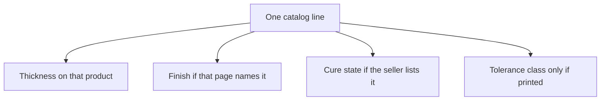

# Calendered Latex Sheet

Human page: /literature-reviews/sheet-calendered-sheet

## Executive summary

Calendered sheet is already-formed roll goods. The millimetre is that product's thickness. A tolerance class counts only when the seller prints one.[^1]

Buying primer: [Buying Formed Latex Sheet](/literature-reviews/sheet-film-pathway).

## What calendered means on a product page

Treat the roll as finished sheet. Cut it. Apply adhesive. The sheet arrives formed.

ISO 3302-1:2014 sets dimensional tolerances for moulded, extruded, and calendered solid rubber. Calendered sheet is one part of that standard. Rubber-coated fabrics sit outside that scope. White Cross Rubber Products uses that product class on its natural-rubber sheeting page.[^1][^2]

## How to read one catalog line

Read thickness, finish, and cure state from that product line. Keep a tolerance class with the millimetre only when that line prints one. The thickness on a page belongs to that page.

White Cross Rubber Products: calendered natural rubber from 300 µm; smooth or cloth finish; fully, semi, or uncured. That page only.[^2]

Elastomade Accessories latex sheeting chart: about 0.25–1.05 mm; polishable upper face; roughened underside. That chart only.[^3]

EMI Seals *Manufacturing Tolerances* v3.0, aligned to ISO 3302-1: 0–1 mm at ST1 as ±0.15 mm. That figure is the EMI table.[^4]

Fit after gauge choice: [Gauge, Modulus, and Reduction on Bought Sheet](/literature-reviews/sheet-gauge-modulus-reduction).

## Why buy the mill's sheet

Buy when you want a thickness you can cut today. The mill's sheet is the repeatable piece. You inherit the thickness, finish, and cure state printed on that line.

Shop culture on bought sheet is solvent rubber cement. Join steps: [Sheet Adhesives and Seam Integrity](/literature-reviews/sheet-adhesives-and-seam-integrity). Buyer checks: [Sheet Garment Selection QA](/literature-reviews/sheet-garment-selection-qa).

## Endnotes

[^1]: ISO 3302-1:2014. *Rubber — Tolerances for products — Part 1: Dimensional tolerances.* Scope includes calendered sheet. Tolerance framework for solid rubber. https://www.iso.org/standard/62492.html
[^2]: White Cross Rubber Products. Natural rubber sheeting. Calendered natural rubber from 300 µm; smooth or cloth finish; fully, semi, or uncured. Product-scoped. https://www.wcrp.uk.com/product/natural-rubber-sheet/
[^3]: Elastomade Accessories. Latex sheeting chart. About 0.25–1.05 mm; polishable upper face; roughened underside. Product-scoped. https://elastomade.com/latex-sheet/
[^4]: EMI Seals. *Manufacturing Tolerances* v3.0. Tables aligned to ISO 3302-1. Example: 0–1 mm ST1 ±0.15 mm. Vendor table. https://emiseals.com/wp-content/uploads/2023/12/EMI-Manufacturing-Tolerances-v3.0.pdf
