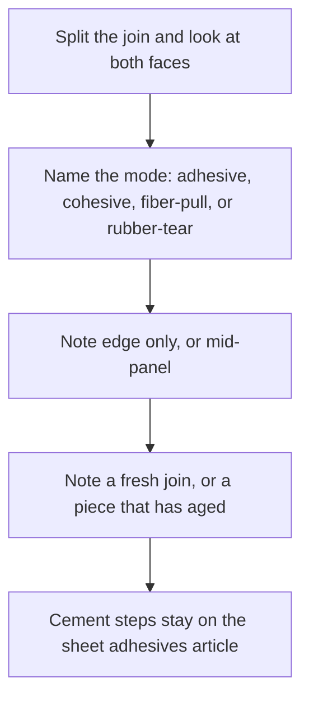
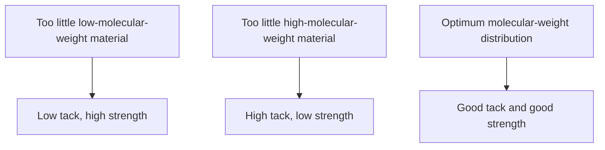

# Sheet Delamination and Seam Failure

Human page: /literature-reviews/sheet-delamination-seam-failure

> **Safety.** Sheet pathway only. Solvent rubber cement is in the solvent-adhesive column: fire hazard, explosion hazard, solvent fumes.[^9] Storage and fumes: [Sheet ventilation and solvent exposure](/literature-reviews/sheet-ventilation-solvent-exposure).

## Executive summary

Bought sheet. Read both faces before applying more adhesive. Cement on one face only: adhesive failure. Cement split through the layer, residue on both faces: cohesive failure. Fibers in the cement: fiber-pull. Sheet torn beside the join: rubber-tear. ASTM D903 and ASTM D1876 are peel method classes, not a garment grade.[^6][^7]

Pair with [Sheet adhesives](/literature-reviews/sheet-adhesives-and-seam-integrity) and [Sheet latex–textile bonding](/literature-reviews/sheet-latex-textile-bonding).

## Questions this article answers

- [What do the two faces show?](#faces)
- [Why is smooth filament cloth a weaker mechanical lock?](#filament)
- [What do heat and age do to the film?](#age)
- [When is a hand peel different from a lab peel?](#lab-peel)

## What do the two faces show? {#faces}

### How

Split the join. Record mode, and whether lift started at the edge or mid-panel.

| What you see | Mode |
| --- | --- |
| Cement on one piece only | Adhesive failure |
| Cement split through the layer; residue both faces | Cohesive failure |
| Textile fibers in the cement | Fiber-pull |
| Sheet tore beside the join | Rubber-tear |

Cement application and lap geometry: [Sheet adhesives](/literature-reviews/sheet-adhesives-and-seam-integrity).

### Why

Adhesive failure is the bond leaving a face. Cohesive failure is the cement tearing inside itself. Edge versus mid-panel is an observation.

### Detail

Detail: Molecular weight, tack, and strength

Natural rubber latex adhesive kept a high-molecular-weight fraction milled solvent rubber lost. Over resin/rubber 30–60%, 90° quick stick, 180° peel, and Polyken tack were essentially the same; 178° shear adhesion was higher for the latex adhesive. Tape-industrial, not fashion-sheet head-to-head.[^1]

One carboxylated SBR pressure-sensitive adhesive: 180° peel versus resin percent is not monotonic; printed peak at 60% resin. Separate schematic on page 236: too little low-molecular-weight material → low tack, high strength; too little high-molecular-weight material → high tack, low strength; optimum distribution → good tack and good strength. Not the latex-versus-milled comparison on pages 234–235.[^1]

## Why is smooth filament cloth a weaker mechanical lock? {#filament}

### How

Smooth filament linings (polyamide / nylon, polyester) do not get the mechanical lock staple cotton can get from protruding fiber ends. Textile bond science: [Sheet latex–textile bonding](/literature-reviews/sheet-latex-textile-bonding).

### Why

Industrial claim, heavy-duty rubber and textile (tyre cord class), not a garment cement photograph. Cotton staple: fiber ends embed in the rubber. Continuous-filament rayon, polyamide, and polyester: smooth surface, that mechanical key missing. Usual weak link in those combinations: bond between rubber and the adhesive film.[^2]

### Detail

Detail: Abrasion of rayon cord

Static adhesion of rubber to high-tenacity rayon improved after abrasion of the cord. Dynamic adhesion improved less unless the cord was also dipped. Tyre-cord practice, not a nylon-lining step.[^2]

## What do heat and age do to the film? {#age}

### How

Record age separately from a fresh miss. Heat speeds oxidation of latex film. Soft tacky film and hard brittle film are both listed symptoms.[^3] Storage: [Sheet aging, storage, and care](/literature-reviews/sheet-aging-storage-and-care). Oils and metals: [Compatibility matrix](/literature-reviews/compatibility-matrix-metals-oils-plastics).

### Why

Scope is latex film and latex articles, not a measured solvent-rubber-cement line on fashion sheet. Oxidation rate of latex film doubles per 8.3°C. Oxidative symptoms include hardening or embrittlement, softening, and tackiness. Chain scission: surface soft and tacky.[^3]

### Detail

Detail: Cure system and antioxidant in latex adhesives

Sulfur-donor cure pressure-sensitive latex adhesives age better than similar adhesives with colloidal free sulfur. Cure destroys some tack, so the curing type often carries more tackifying resin.[^4]

Latex adhesives: at least 1 part antioxidant per 100 parts dry rubber and 1 part per 100 parts resin. Copper (or other metal) degradation of natural rubber or polychloroprene film: 2 parts total antioxidant per 100, split between oxidation and metal. Film compounding, not a garment-face diagnosis.[^4]

## When is a hand peel different from a lab peel? {#lab-peel}

### How

A hand peel at wear speed is not the fast lab peel. In one NBR/SMR L pressure-sensitive adhesive in toluene, rate changed the failure mode.[^5] Name the speed when comparing them.

### Why

Peel strength rose with testing rate. Cohesive failure at low rate could become adhesive failure at high rate. Coumarone-indene resin. Not a catsuit pass mark.[^5]

ASTM D903: peel or stripping of adhesive bonds. ASTM D1876: T-peel, flexible-to-flexible. Method classes only.[^6][^7]

### Detail

Detail: Tackifier level and 180° peel

1997 handbook: two layers of duck, polychloroprene latex adhesive. Prose: bond strength usually decreases as tackifier rises (asphalt or either of two rosin esters). Printed series is not strictly monotonic at the last step. Tack of polymer–resin films can peak near 60–70% resin.[^2]

1966 handbook reprints that study with different asphalt peel magnitudes. Direction agrees. Magnitudes do not. Neither series is a solvent-rubber-cement value for fashion sheet.[^8]

## Sources

- *The Vanderbilt Latex Handbook*. 3rd ed. Edited by Robert Francis Mausser. Norwalk, CT: R.T. Vanderbilt Company, 1987. https://lccn.loc.gov/92117844
- *Polymer Latices: Science and Technology — Volume 3: Applications of Latices*. 2nd ed. D. C. Blackley. Chapman & Hall / Springer, 1997. https://books.google.com/books?id=Y2VPGj7YbykC
- *High Polymer Latices: Their Science and Technology*. 2 vols. D. C. Blackley. London: Maclaren; New York: Palmerton, 1966. https://lccn.loc.gov/66077950
- Poh, B. T., and Lamaming, J. *Journal of Coatings* (2013). https://doi.org/10.1155/2013/519416
- ASTM D903. Standard test method for peel or stripping strength of adhesive bonds.
- ASTM D1876. Standard test method for peel resistance of adhesives (T-peel test).

[^1]: Vanderbilt Latex Handbook (1987). NR latex vs milled solvent adhesive (178° shear higher for latex; 90° quick stick / 180° peel / Polyken tack similar over 30–60% resin/rubber). Separate MWD schematic on the next page: low tack/high strength, high tack/low strength, optimum distribution with good tack and good strength. One carboxylated SBR PSA whose 180° peel peaks at 60% resin.
[^2]: Polymer Latices Vol 3 (1997). Cotton fiber ends vs continuous-filament rayon, polyamide, polyester; weak link often rubber-to-adhesive film; rayon-cord abrasion (following page). Duck + polychloroprene latex adhesive: prose says bond strength usually decreases as tackifier rises; printed series not strictly monotonic at the last step.
[^3]: Vanderbilt Latex Handbook (1987). Oxidative film symptoms (harden/embrittle, soften, tacky). Chain scission → soft tacky surface. Crosslinking → hardening or embrittlement. Oxidation rate of latex film doubles per 8.3°C. Scope is latex film, not a measured fashion-sheet cement line.
[^4]: Vanderbilt Latex Handbook (1987). Sulfur-donor PSA ages better than colloidal free sulfur. Latex adhesives: antioxidant on rubber and on resin. Copper/metal film note: 2 parts antioxidant per 100, split oxidation vs metal.
[^5]: Poh and Lamaming, *Journal of Coatings* (2013). NBR/SMR L pressure-sensitive adhesive in toluene, coumarone-indene resin. Peel strength rises with testing rate; cohesive at low rate, adhesive failure at high rate. DOI 10.1155/2013/519416.
[^6]: ASTM D903. Peel or stripping strength of adhesive bonds. Method class.
[^7]: ASTM D1876. T-peel of flexible-to-flexible bonds. Method class.
[^8]: High Polymer Latices (1966). Same named tackifier study as the 1997 duck peel reprint, with different asphalt peel magnitudes. Direction shared. Do not prefer these magnitudes over the 1997 reprint, and do not use either as a sheet-cement number.
[^9]: Vanderbilt Latex Handbook (1987). Solvent adhesives: explosion hazard, fire hazard, special ventilation, solvent fumes. The latex-adhesive column in that comparison is marked nonflammable.
