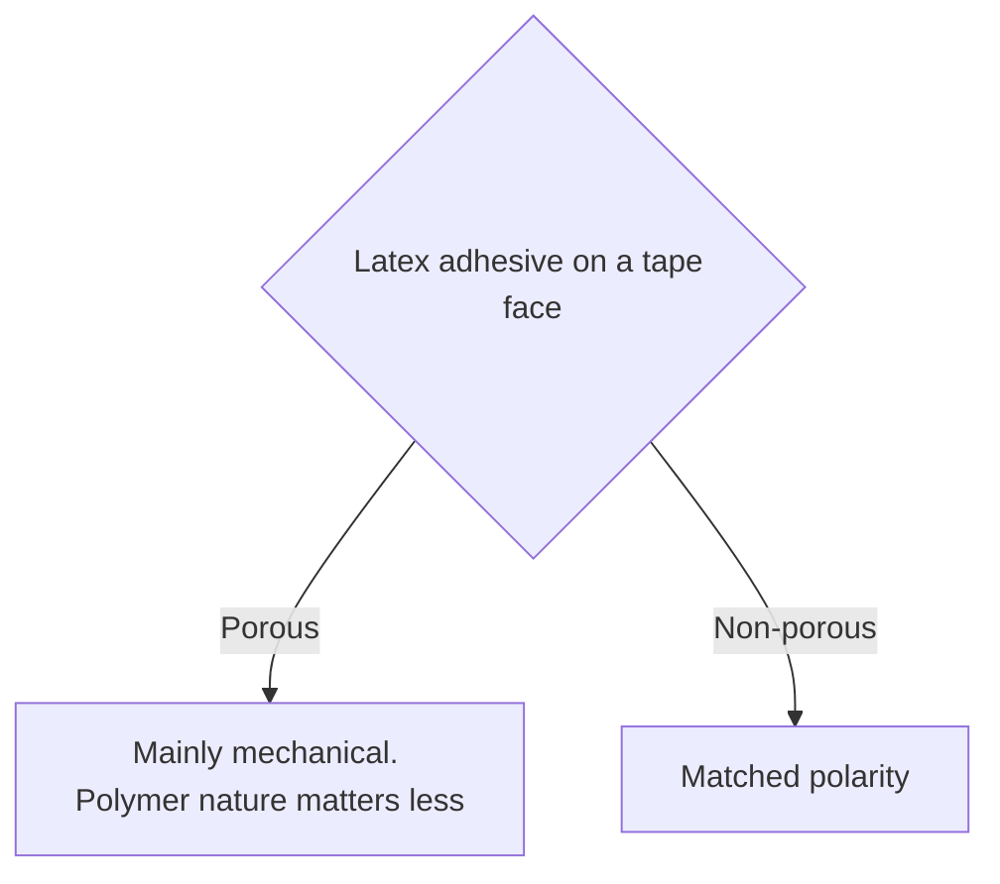

# Sheet Edge Finishing Materials

Human page: /literature-reviews/sheet-edge-finishing-materials

> **Safety.** Solvent rubber cement on a tube, strip, or tape: fire and fume class.[^1] Product SDS. [Sheet adhesives](/literature-reviews/sheet-adhesives-and-seam-integrity). [Sheet ventilation](/literature-reviews/sheet-ventilation-solvent-exposure).

## Executive summary

Bought sheet. Rim piece: natural-rubber tube or strip, or a textile tape. Adhesive culture: solvent rubber cement. Latex adhesive can shrink fabric.[^1][^4] Porous versus slick faces below are latex-adhesive rules, not a cement specification.[^2][^4]

## Questions this article answers

- [Which piece finishes the edge?](#which-piece)
- [Cotton binding or a slick tape?](#cotton-or-slick)
- [What are the safety rules?](#safety)

## Which piece finishes the edge? {#which-piece}

### How

Solvent rubber cement culture on bought sheet. Apply steps, flash off, and open time: [Sheet adhesives](/literature-reviews/sheet-adhesives-and-seam-integrity#air-the-coat).

| Family | What it is | Watch |
| --- | --- | --- |
| NR tube or strip | Smooth rubber rim piece | Cement steps on the adhesives page |
| Rubberised textile tape | Cloth with a rubber face | Cloth prep: [Sheet latex–textile bonding](/literature-reviews/sheet-latex-textile-bonding#pretreat) |
| Woven cotton binding | Absorbent cloth tape | Latex adhesive can shrink the cloth[^1] |
| Smooth filament tape | Slick face (nylon) | Latex polarity rules for that face are in Detail[^2] |

### Why

Solvent adhesives: water resistant; wide range of drying rates and open times. Disadvantages: fire hazard, explosion hazard, solvent fumes.[^1] Latex-adhesive disadvantages include “Shrinks fabrics.”[^1]

### Detail

Detail: Solvent column and fabric shrink

Latex column also: freezing, slow drying, poorer water resistance, “Shrinks fabrics.”[^1] “The tendency of aqueous lattices to shrink textiles and to wrinkle paper.”[^4]

## Cotton binding or a slick tape? {#cotton-or-slick}

### How

Name the face. Woven cotton: porous. Slick filament such as nylon: non-porous. Handbook sentences for those faces are latex-adhesive rules (Detail). Bought-sheet lap: solvent rubber cement. [Sheet adhesives](/literature-reviews/sheet-adhesives-and-seam-integrity#match-the-sheet). Fibre ends versus smooth filament: [Sheet latex–textile bonding](/literature-reviews/sheet-latex-textile-bonding#cotton-or-nylon).

### Why

Porous substrate: bond mainly mechanical; polymer nature less important. Non-porous substrate: matched polarity.[^4] Those sentences describe latex adhesives. The bought-sheet lap uses solvent rubber cement.

### Detail

Detail: Latex polarity, charge, and filler

Non-porous: polarity of the latex should match the surfaces to be joined. High: NBR, XNBR, XSBR, PSBR. Medium: CR, PVC. Low: NR, SBR, BR, IIR. The low column is NR latex.[^2] Porous, Vanderbilt: flow into pores; charge opposite the substrate or particles are repulsed.[^2] Higher filler raises viscosity and decreases flow into porous surfaces.[^3] Practical Guide split: porous, mainly mechanical, polymer nature less important; non-porous, matched polarity.[^4] The opposite-charge rule above is Vanderbilt’s.[^2] Non-polar: polyisoprene or SBR. High polarity: acrylonitrile-butadiene, acrylics, styrene–vinylpyridine–butadiene, or carboxylated polymers.[^4]

## What are the safety rules? {#safety}

### How

Cement closed, labeled, away from heat and sparks. SDS for the can. Postpone if you cannot ventilate a flammable liquid. [Sheet ventilation](/literature-reviews/sheet-ventilation-solvent-exposure).

### Why

Fire hazard, explosion hazard, solvent fumes.[^1]

## Endnotes

[^1]: *The Vanderbilt Latex Handbook*. 3rd ed. Edited by Robert Francis Mausser. Norwalk, CT: R.T. Vanderbilt Company, 1987. Solvent versus latex adhesive columns: water resistance, drying rates and open times; latex disadvantages include “Shrinks fabrics,” freezing, slow drying, poorer water resistance; solvent disadvantages include fire, explosion, and solvent fumes.

[^2]: Same handbook. Non-porous: polarity of the latex should match the surfaces to be joined (high NBR, XNBR, XSBR, PSBR; medium CR, PVC; low NR, SBR, BR, IIR). Porous: flow into pores; opposite charge or particles are repulsed. The low column is NR latex.

[^3]: Same handbook. Higher filler raises adhesive viscosity and decreases flow into porous surfaces.

[^4]: *Practical Guide to Latex Technology*. Rani Joseph. Shawbury: Smithers Rapra Technology, 2013. “The tendency of aqueous lattices to shrink textiles and to wrinkle paper.” Porous substrates: bond mainly mechanical; polymer nature less important. Non-porous: matched polarity. Non-polar lattices: polyisoprene or SBR. High polarity: acrylonitrile-butadiene, acrylics, styrene–vinylpyridine–butadiene, or carboxylated polymers. Opposite charge is the Vanderbilt porous rule.
