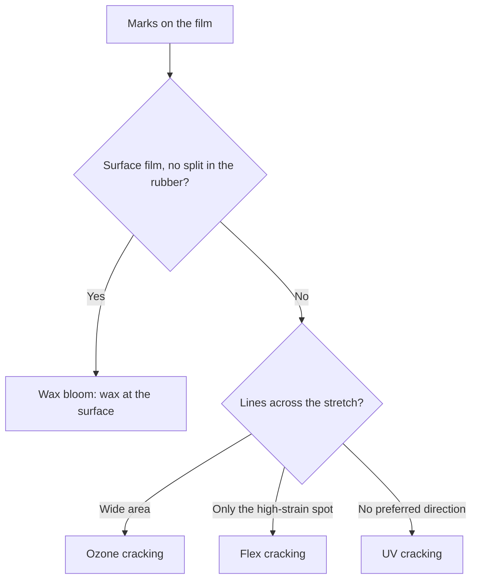

# Sheet Garment Selection QA

Human page: /literature-reviews/sheet-garment-selection-qa

> **Not medical advice.** Pre-wear checks are literacy, not allergy testing or device certification.

## Executive summary

Before wear or resale of a bought sheet garment, ASTM D3578 supplies words for holes, powder, and protein on examination gloves. Fashion sheet is not that glove.[^1] Odor masking and wax bloom are handbook words.[^5][^13] NIOSH separates irritant, delayed chemical, and immediate protein reaction patterns for workplace natural-rubber products.[^2]

Use when buying secondhand sheet, inspecting a custom commission, or deciding first-wear go or no-go. Reaction classes: [Allergy and Skin Contact](/literature-reviews/allergy-and-skin-contact).

## Questions this article answers

- [What should I check before I wear bought sheet?](#pre-wear-checks)
- [How do I tell bloom from a crack?](#bloom-or-crack)

## What should I check before I wear bought sheet? {#pre-wear-checks}

### How

1. Light and stretch each panel. A bright speck is a through-hole for this inspection, not a D5151 result.[^3] Air trapped in dipping, or a web, leaves part of a dipped film thinner than the rest.[^12]
2. Powder or talc in a crotch or underarm: soil, not a protein number. Powdered surgeon’s gloves, powdered patient-exam gloves, and absorbable lubricating powder were banned as an unreasonable and substantial risk.[^4] Workplace framing: powder can carry natural-rubber allergens.[^2]
3. Odor: cure, putrefaction, or microbial smell is a pause. Reodorants mask those classes. A sniff is not a protein assay.[^5]
4. Bloom versus crack: next section. Care actions: [Sheet Aging, Storage and Care](/literature-reviews/sheet-aging-storage-and-care).
5. New rash or breathing symptoms: stop wear. [Allergy and Skin Contact](/literature-reviews/allergy-and-skin-contact).

Hardware stains: [Sheet Hardware and Metal Contact](/literature-reviews/sheet-hardware-metal-contact).

### Why

ASTM D3578 is the product standard for dipped natural-rubber examination gloves (holes, powder, protein, tensile).[^1] ASTM D5151 detects water-leak holes in medical gloves and does not determine the smallest hole.[^3] Transfer to fashion sheet is analogy. No ASTM or ISO fashion-garment inspection standard is cited here.

21 CFR 801.437 applies to devices that contain natural rubber and contact humans. Natural rubber latex in that class carries an allergy caution. Dry natural rubber carries a different statement. The section forbids “hypoallergenic” on that class.[^6] Retail fashion sheet usually has no equivalent label. Absence of the label is not a protein result.

### Detail

Detail: Dipped-goods defect names

Entrapped air produces pinholes; a pinhole rejects a glove. Chloroform number under 2 can blow a glove because the wet gel is weak. Webbing leaves a weak spot when the web breaks.[^7] Shorter leach leaves coagulant salt and more discoloration under heat, fumes, or ultraviolet light.[^8] Borrowed names for looking at bought sheet, not a catsuit reject standard.

Detail: Reodorant scope

Reodorants mask odors from cure chemistry, putrefied latex, bacterial or fungal attack, or residual-monomer hydrolysis, at 1/4 to 1/2 phr. Changing the compound until the odor is gone is not always feasible. The handbook does not treat a sniff as the cause finder or as a protein assay.[^5]

Detail: Protein assay methods

ASTM D5712: total aqueous extractable protein in natural-rubber products (µg/dm²); residual-protein testing, not wearer diagnosis.[^9]

ASTM D6499: immunological measurement of antigenic protein; not a measure of allergenic proteins; correlation not fully established.[^10]

ISO 12243: assay method for water-extractable protein in natural-rubber medical gloves; not sampling, safety limits, or labelling.[^11]

## How do I tell bloom from a crack? {#bloom-or-crack}

### How

Wax at the surface, with no split in the rubber: bloom. Lines across the stretch over a wide area: ozone-type. Same direction, confined to the high-strain zone: flex-type. No preferred direction on the exposed face: ultraviolet-type. Soft tack and hard brittle are separate symptom classes.[^12]

### Why

Service-life symptoms include hardening, softening, tackiness, oriented cracking, and non-oriented cracking. Chain scission: soft, tacky face and tensile loss. Crosslinking: hardening or embrittlement. Average atmospheric ozone is in the range of 1–8 pphm. Ozone cracks are perpendicular to stress and usually widespread. Flex cracks are perpendicular to stress and local. Ultraviolet cracks are non-oriented.[^12]

Microcrystalline wax blocks ozone only after a continuous bloom. Flex or stretch cracks that wax film, so the handbook uses it mainly for static storage.[^13]

### Detail

Detail: Leach salts and wax dose

Incomplete leach leaves coagulant salts such as calcium nitrate and greater discoloration under warm air, fumes, or ultraviolet light.[^8] Handbook wax example: 0.5–1.0 phr microcrystalline wax emulsion. Fresh film in a test chamber is not protected until the bloom is continuous. A hours-to-failure table of wax grades is a lab comparison, not a garment wear limit.[^13]

## Endnotes

[^1]: ASTM D3578. Standard specification for rubber examination gloves.
[^2]: National Institute for Occupational Safety and Health. *Preventing Allergic Reactions to Natural Rubber Latex in the Workplace.* DHHS (NIOSH) Publication No. 97-135, June 1997. https://stacks.cdc.gov/view/cdc/21446
[^3]: ASTM D5151. Standard test method for detection of holes in medical gloves.
[^4]: Food and Drug Administration. Banned devices: powdered surgeon’s gloves, powdered patient examination gloves, and absorbable powder. 81 FR 91722, 19 December 2016. https://www.federalregister.gov/documents/2016/12/19/2016-30382/banned-devices-powdered-surgeons-gloves-powdered-patient-examination-gloves-and-absorbable-powder
[^5]: *The Vanderbilt Latex Handbook.* 3rd ed. Edited by Robert Francis Mausser. Norwalk, CT: R.T. Vanderbilt Company, 1987. Reodorants. https://lccn.loc.gov/92117844
[^6]: 21 CFR 801.437. User labeling for devices that contain natural rubber. https://www.ecfr.gov/current/title-21/chapter-I/subchapter-H/part-801/subpart-H/section-801.437
[^7]: *The Vanderbilt Latex Handbook.* 3rd ed. Robert Francis Mausser, ed. 1987. Dipped-goods pinholes, wet-gel strength, webbing.
[^8]: *The Vanderbilt Latex Handbook.* 3rd ed. 1987. Incomplete leach, coagulant salts, discoloration.
[^9]: ASTM D5712-15(2020). Aqueous extractable protein in natural rubber and its products.
[^10]: ASTM D6499-24. Immunological measurement of antigenic protein in natural rubber and its products.
[^11]: ISO 12243:2003. Medical gloves made from natural rubber latex. Determination of water-extractable protein.
[^12]: *The Vanderbilt Latex Handbook.* 3rd ed. 1987. Degradation symptoms, chain scission, crosslinking, ozone, flex, and ultraviolet crack direction. Air entrapment or webbing leaves thinner gauge.
[^13]: *The Vanderbilt Latex Handbook.* 3rd ed. 1987. Microcrystalline wax bloom as a static ozone barrier.
