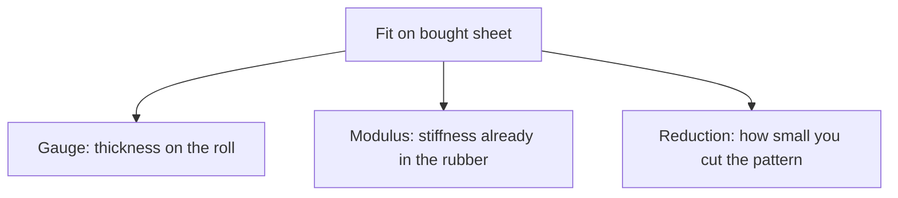

# Gauge, Modulus, and Reduction on Bought Sheet

Human page: /literature-reviews/sheet-gauge-modulus-reduction

## Executive summary

On bought calendered sheet, fit has three levers. Gauge is roll thickness. Modulus is stiffness at a stated stretch, already set in the mill compound. Reduction is pattern shrink versus body measurements.

Thinner, softer, and a smaller pattern are different moves. Use when picking a catalog millimetre, or when two rolls of the same printed thickness feel different.

## How do you read gauge on a roll?

Gauge is thickness. Read the millimetres on the product line. A tolerance class, when printed, stays with that number.[^1]

Retail garment-sheet charts are seller lists. The Elastomade chart runs about 0.25–1.05 mm. That range is that chart.[^2]

Menu language: [Calendered latex sheet](/literature-reviews/sheet-calendered-sheet).

## What does modulus mean on sheet you bought?

Modulus is stress at a stated extension (force per area). Higher modulus is boardier at the same gauge.

The roll is already compounded. Same printed thickness can still differ in the hand when the compound differs. Filler and color: [Colored sheet: pigment and filler effects](/literature-reviews/sheet-pigment-filler-decks).

At an unchanged modulus, a thicker piece of the same rubber takes more total force to bend and to reach the same stretch. Wall thickness changed. The stress number did not.

## What is reduction?

Reduction is negative ease. Flat pieces are drawn smaller than body measurements so the garment must stretch to close. Catalog thickness changes the wall.

## Which change actually changes the fit?

- Catalog millimetre when wall thickness should change. Read the seller spec.[^2]
- Same-gauge rolls that feel different are different compounds. Bagging after wear can follow set or aging. [Sheet aging, storage, and care](/literature-reviews/sheet-aging-storage-and-care).
- Pattern outline when negative ease should change.

## Endnotes

[^1]: ISO 3302-1:2014. *Rubber — Tolerances for products — Part 1: Dimensional tolerances.* Scope includes calendered sheet. Tolerance framework, not a garment pattern chapter.
[^2]: Elastomade Accessories latex sheeting chart. Product-scoped thickness menu, about 0.25–1.05 mm.
