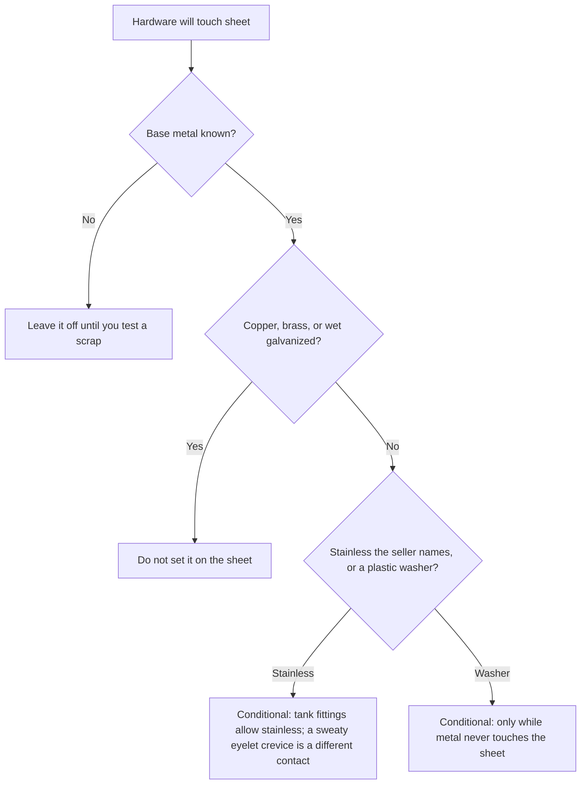

# Sheet Hardware & Metal Contact

Human page: /literature-reviews/sheet-hardware-metal-contact

## Executive summary

A snap, eyelet, or D-ring on cut sheet is lasting metal-to-rubber contact. Copper, brass, and wet galvanized steel are the harmful classes in the handbooks.[^1][^2] A finish name does not state the base metal. Inspect for a brown or dark ring and a stiff patch; replace the hardware if the ring grows. A plastic washer helps only while it keeps metal off the sheet.

Grid: [Compatibility Matrix](/literature-reviews/compatibility-matrix-metals-oils-plastics). Aged sheet: [Sheet Aging, Storage and Care](/literature-reviews/sheet-aging-storage-and-care).

## Why the metal matters

Oxygen degradation of the rubber is autocatalytic. Fatty-acid salts of copper, cobalt, manganese, and iron catalyze it.[^1] Duangthong et al. measure copper in latex. Their introduction, citing earlier reports, says copper oleate can catalyse oxidative degradation and that container copper can leave dark spots on gloves.[^3] Brass or copper fittings cause serious deterioration of rubber in latex; galvanized fittings form coagulum.[^2] Those fitting sentences are plant latex. On sheet they name the metals to keep off the garment.

Aluminium slush-mould alloys should be free of copper, manganese, and cobalt traces: discoloration, and catalyzed oxidative degradation of diene rubbers.[^4] Mould scope, not a snap trial.

Factory NR or CR film: 2 phr total antioxidant against copper (or other metal) degradation. One part covers ordinary oxidation. The other protects against copper degradation.[^1]

## Which hardware

| Hardware | Contact | Refuse |
| --- | --- | --- |
| Press snap | Punched disk stack | Unknown brass core |
| Eyelet / grommet | Crimped barrel | Copper or brass; wet galvanized |
| D-ring / buckle | Metal face under load | Galvanized steel |
| Corset busk | Broad steel face | Iron salts catalyze oxidation of film |

Acceptable plant fittings: black iron, stainless steel, or another material not harmful to latex. Ruled out: brass or copper fittings, and galvanized fittings.[^2] On a garment, the seller has to name the alloy. “Stainless” on a packet is a label.

## Finish name

Gunmetal, antique brass, and nickel finish are labels. Ask for the base metal. Test one snap on a scrap of the same sheet before a waistband.

Dithiocarbamate-cured deposits turn superficially brown in minute copper, including coin traces on hands; attributed to copper(II) dithiocarbamates. The deposits chapter says the remedy is to omit dithiocarbamate accelerators.[^5] Vanderbilt: for maximum copper-stain resistance, propyl zithate with Zetax or Morfax, and no dithiocarbamates in that compound.[^1] Thread chapter: a reduced dithiocarbamate stays because vulcanization rate requires it.[^5] Different scope. Bought sheet does not disclose the accelerator.

## Inspection

- Brown or dark ring around the fastener
- Stiff patch: hardening or embrittlement is a crosslinking symptom[^7]
- Crack from the punched hole: sharp-edged objects degrade sooner than rounded ones. That sentence is about the shape of the goods. A fastener hole is that shape note applied to a snap[^7]
- Patch bends differently from adjacent sheet

ASTM D925 names contact, migration, and diffusion staining. The method text flags heat, pressure, or sunlight. Method class for a halo, not a garment pass/fail.[^6]

Buyer checks: [Sheet Garment Selection QA](/literature-reviews/sheet-garment-selection-qa). Metal coil: [Sheet Zipper Closure Compatibility](/literature-reviews/sheet-zipper-closure-compatibility).

## Endnotes

[^1]: *The Vanderbilt Latex Handbook*. 3rd ed. Edited by Robert Francis Mausser. Norwalk, CT: R.T. Vanderbilt Company, 1987. Fatty-acid salts of Cu, Co, Mn, and Fe catalyze autocatalytic oxygen degradation; 2 phr antioxidant split for copper-exposed NR or CR film; propyl zithate plus Zetax or Morfax when copper-stain resistance is the goal. <https://lccn.loc.gov/92117844>
[^2]: Vanderbilt Latex Handbook, 1987. Brass or copper fittings cause serious deterioration of rubber in latex; galvanized fittings form coagulum; black iron or stainless steel are the allowed fitting metals; leach fittings free of copper and brass.
[^3]: Duangthong, Supunnee, et al. “Simple digestion and visible spectrophotometry for copper determination in natural rubber latex.” *ScienceAsia* 43 (2017): 369–376. Introduction cites earlier reports on copper oleate catalysis and container dark spots. Those lines are not the spectrophotometry result. <https://doi.org/10.2306/scienceasia1513-1874.2017.43.369>
[^7]: Vanderbilt Latex Handbook, 1987. Crosslinking symptoms include hardening or embrittlement. Sharp-edged objects are generally more prone to degradation than rounded ones. That sentence is about the shape of the goods.
[^4]: *Polymer Latices: Science and Technology — Volume 3: Applications of Latices*. 2nd ed. D. C. Blackley. Chapman & Hall / Springer, 1997. Slush-mould aluminium alloy free of Cu, Mn, and Co traces. <https://books.google.com/books?id=Y2VPGj7YbykC>
[^5]: Polymer Latices Vol 3, 1997. Dithiocarbamate copper staining of deposits, remedy stated as omitting those accelerators; thread formulations keep a reduced dithiocarbamate for vulcanization rate.
[^6]: ASTM D925. *Standard Test Methods for Rubber Property—Staining of Surfaces (Contact, Migration, and Diffusion)*. Contact, migration, and diffusion staining. <https://store.astm.org/d0925-14r25.html>
