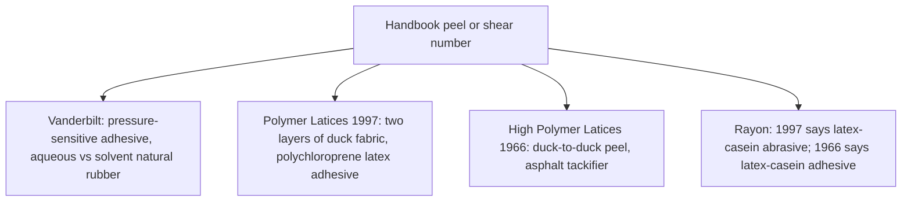

# Sheet Latex–Latex Adhesion Testing

Human page: /literature-reviews/sheet-latex-latex-adhesion-testing

> **Safety.** Solvent rubber cement is rubber in solvent. Flammable and toxic solvents are hazards of polymer-solution adhesives.[^1]

## Executive summary

Bought sheet. This page attaches a handbook peel or shear number to the specimen in its sentence, and asks which sentences are two latex sheets joined with solvent rubber cement. Family choice: Sheet adhesives and seam integrity. Method name (angle, speed, width, what the number is not): `adhesion-peel-test-methods`.

## Questions this article answers

- [What is the peel number attached to?](#what-the-number-is)
- [Which sentences are a sheet-cement test?](#sheet-cement)
- [Where do the neighboring questions live?](#neighbors)

## What is the peel number attached to? {#what-the-number-is}

### How

Read the specimen in the same sentence as the number.

### Why

The number is the separation force for the specimen named with it.[^2][^3][^4][^5][^6] The 1997 and 1966 wordings for the rayon treatment both stand.[^5][^6]

Detail: Pressure-sensitive comparison and the duck numbers

Vanderbilt, Piccolyte A85, resin/rubber 30–60%: quick stick, peel, and Polyken tack essentially the same for aqueous and solvent natural rubber; shear significantly higher for the latex system. Solvent natural rubber milled to Mooney viscosity 75 or below for solubility at 10% solids. High molecular weight portion insoluble in solvents.[^2]

PSA performance heading, aqueous versus solvent. Peel column labeled 180° peel adhesion (oz/in). Aqueous 178° shear above 6000 minutes and solvent shear below 500 minutes at 30, 40, 50, and 60% resin.[^7] Angle, speed, and width: `adhesion-peel-test-methods`.

Polymer Latices 1997: tack peak near 60–70% m/m resin, then a fall; adhesive bond strength usually decreases as resin/polymer ratio rises. Example: 180° peel of two layers of duck fabric, polychloroprene latex adhesive. Dry parts: polychloroprene rubber 100, zinc oxide 5, antioxidant 2, sodium alkyl sulphate 1, tackifier variable. Columns: asphalt, rosin ester m.pt. 56°C, rosin ester m.pt. 83°C. No-tackifier cell 31. No unit printed in the cells.[^3]

High Polymer Latices 1966: tack peak near 60 to 70% resin. Duck-to-duck peel, polychloroprene with asphalt. 0 parts asphalt: 16 lb wgt in.⁻¹.[^4] That magnitude does not override the 1997 cell.[^3] Both are duck fabric with a latex adhesive.

Detail: Casein wording on rayon

1997: static adhesion of rubber to high-tenacity rayon improves with prior abrasion; abrasion plus a latex-casein abrasive beats either treatment alone.[^5] 1966: the same observation worded latex-casein adhesive.[^6] Neither wording wins.

A 1966 cord-dip recipe also says latex-casein adhesive. Specimen is rayon cord. It does not settle the pair above.[^8]

1997: static vs dynamic adhesion tests differ by rate of deformation. Static tests without prior fatigue are preliminary sorting tests only, in the rubber-to-textile section.[^5]

## Which sentences are a sheet-cement test? {#sheet-cement}

### How

The join is two latex sheets with solvent rubber cement between them.

A sheet-cement sentence names that pair. The checked peel sentences name a pressure-sensitive adhesive comparison, duck fabric, or rayon cord.[^2][^3][^4][^5][^6]

### Why

This page's join uses solvent rubber cement between two latex sheets. Latex adhesives wet dry hydrophobic surfaces with difficulty, especially greasy ones. Latex-film strength may be lower than polymer-solution strength.[^1] Those sentences compare latex adhesives with solvent-based adhesives in general. The peel numbers above belong to the specimens named with them.[^2][^3][^4]

Detail: Greasy surfaces

Disadvantage of latex-based adhesives relative to solvent-based adhesives: difficulty wetting dry hydrophobic surfaces, especially if greasy. Adhesive and cohesive strengths from latex films may be lower than from polymer solutions because of restricted interparticle coalescence and surface-active substances. Flammable and toxic solvents are hazards of polymer-solution adhesives.[^1] A polish or silicone coupon on fashion sheet is a separate question from that wetting sentence.

## Where do the neighboring questions live? {#neighbors}

### How

- Angle, speed, width, and what a peel number is not: `adhesion-peel-test-methods`.
- Successive-dip layers: `liquid-latex-latex-adhesion-testing`.
- Other substrates: `sheet-latex-substrate-adhesion-testing`, `liquid-latex-substrate-adhesion-testing`.
- Family choice: Sheet adhesives and seam integrity.
- An opened seam: Sheet delamination and seam failure.

### Why

This page keeps each handbook number with the specimen in its sentence.

## Sources

- [*The Vanderbilt Latex Handbook*](https://lccn.loc.gov/92117844). 3rd ed. Edited by Robert Francis Mausser. Norwalk, CT: R.T. Vanderbilt Company, 1987.
- [*Polymer Latices: Science and Technology — Volume 3: Applications of Latices*](https://books.google.com/books?id=Y2VPGj7YbykC). 2nd ed. D. C. Blackley. Chapman & Hall / Springer, 1997.
- [*High Polymer Latices: Their Science and Technology*](https://lccn.loc.gov/66077950). 2 vols. D. C. Blackley. London: Maclaren; New York: Palmerton, 1966.

## Endnotes

[^1]: Polymer Latices Vol 3 (1997). Latex-based adhesives compared with solvent-based adhesives: wetting of dry hydrophobic and greasy surfaces; coalescence and surface-active substances; flammable and toxic solvents.
[^2]: Vanderbilt Latex Handbook (1987). Natural rubber solution vs latex adhesives. Piccolyte A85. Pressure-sensitive properties. Mooney solubility note.
[^3]: Polymer Latices Vol 3 (1997). Tack peak and bond strength. 180° peel of two layers of duck fabric. Polychloroprene latex adhesive. Ward and Doherty. No-tackifier cell 31. No unit in the cells.
[^4]: High Polymer Latices (1966). Duck-to-duck peel. Polychloroprene with asphalt. Ward and Doherty (1954). No-asphalt row 16 lb wgt in.⁻¹. Does not override the 1997 table.
[^5]: Polymer Latices Vol 3 (1997). Latex-casein abrasive. Gardner, Herbert and Wake. High-tenacity rayon. Static vs dynamic = rate of deformation. Preliminary sorting tests for rubber-to-textile adhesion.
[^6]: High Polymer Latices (1966). Same observation worded latex-casein adhesive. Gardner, Herbert and Wake (1954). Neither wording wins over [^5].
[^7]: Vanderbilt Latex Handbook (1987). PSA performance of Piccolyte A85 / natural rubber, aqueous vs solvent. 180° peel column in oz/in. Shear minutes: aqueous above 6000, solvent below 500.
[^8]: High Polymer Latices (1966). Latex-protein cord-dip recipe worded latex-casein adhesive. Rayon cord. Does not settle [^5] vs [^6].
