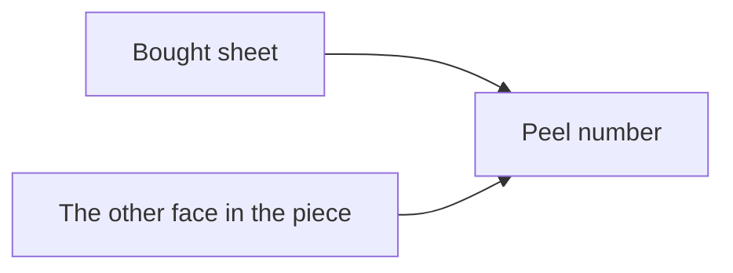
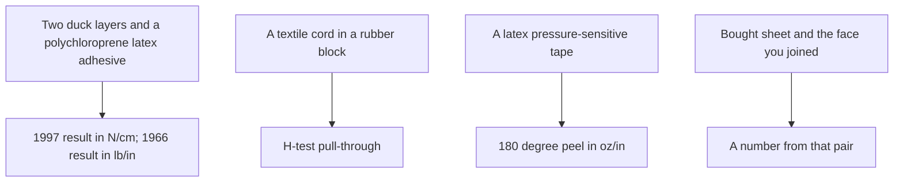

# Sheet Latex–Substrate Adhesion Testing

Human page: /literature-reviews/sheet-latex-substrate-adhesion-testing

Skin contact is a labeling topic, not a peel face on this page. Solvent rubber cement needs ventilation. Those banners are on the human page.

## Executive summary

A peel number for bought sheet against a non-latex face belongs to those two faces.[^1] Handbook peel figures stay with the pair in the figure.

1997: 180° peel, two duck layers, polychloroprene latex adhesive, axis N cm⁻¹.[^2] 1966: duck-to-duck peel, polychloroprene with asphalt, axis lb per inch. Older set. Does not override 1997. Units not converted.[^3] H-test: cord pull-through from a rubber block.[^4] Vanderbilt 180° peel: pressure-sensitive latex, oz/in, tape and label rows. No metal or plastic panel named on the opened pages.[^5]

Method class names: adhesion-peel-test-methods. Textile science: sheet latex–textile bonding. Liquid film to a non-latex face: `liquid-latex-substrate-adhesion-testing`.

## What faces does the number belong to?

An adhesion number has its meaning only with the method.[^1] 1997 caption 1-part line: sodium alkyl sulphate. 1966 figure 1-part line: stabiliser. 1997 caption says 180°. The 1966 sentence does not. Neither page cites ASTM or ISO.[^2][^3] Conflict left unresolved.

The duck crops include a T-shaped inset. That inset is the handbook sketch of the duck layers.[^2][^3]

## What do you write for sheet against a textile?

Record method and edition, specimen shape, the conditions that edition defines, and both faces. Class names for a rubber layer against a textile ply (ISO 36) and for a coating on a coated fabric (ISO 2411, ASTM D751 adhesion sections) are on adhesion-peel-test-methods. Width, speed, pass/fail, and failure-type names were not opened on this slug.

Static vs dynamic, in the textile chapter, is rate of deformation. A static test without prior fatigue is a sorting test. The service example is a tyre.[^1] A stretch-and-wash sheet piece is outside that sentence.

Solvent rubber cement, when that was the adhesive family, is written as that family. The duck result is a latex adhesive.[^2]

## What about leather, metal, plastic, and skin?

Vanderbilt p. 227: compounded latexes for wet combining and dry combining of fabric, and for adhering fabrics to paper or leather. No peel number. Latex adhesive use, including can sealing, foil laminating, and shoe adhesives.[^5] Sheet–leather and sheet–paper peel numbers were not on that page. Aqueous combine: `liquid-latex-substrate-adhesion-testing`.

Sheet–metal and sheet–plastic peel numbers were not on the opened pages. 180° peel in oz/in stays with the PSA tape rows. Pages used do not name the panel. Piccolyte A85, 30–60% resin/rubber: NR latex and solvent essentially the same 180° peel; latex higher on 178° shear. That comparison stays with those mixes.[^5] Contact without a peel number: compatibility matrix.

Skin: not a peel face here.

## Where does rubberise sit?

If the textile was rubberised, write that pretreat with the number. Opened effect: prior abrasion of high-tenacity rayon improves static adhesion; abrasion plus a latex-casein treatment is greater than either alone.[^1] That sentence is cord. Shop rubberise steps for a fashion piece were not in the opened pages.

## Where the other question lives

| Question | Where it goes |
| --- | --- |
| Method class, speed, shape | adhesion-peel-test-methods |
| Bought sheet to bought sheet | `sheet-latex-latex-adhesion-testing` |
| Liquid-latex film to liquid-latex film | `liquid-latex-latex-adhesion-testing` |
| Liquid-latex film to another substrate | `liquid-latex-substrate-adhesion-testing` |
| Adhesive family; air; overlay | Sheet adhesives and seam integrity |
| Cotton / nylon bond science | Sheet latex–textile bonding |
| A seam that has already peeled | Sheet delamination and seam failure |
| Contact with no peel number | Compatibility matrix |

## Sources

- *Polymer Latices: Science and Technology — Volume 3: Applications of Latices.* 2nd ed. D. C. Blackley. 1997. <https://books.google.com/books?id=Y2VPGj7YbykC>
- *High Polymer Latices: Their Science and Technology.* 2 vols. D. C. Blackley. 1966. <https://lccn.loc.gov/66077950>
- *The Vanderbilt Latex Handbook.* 3rd ed. Edited by Robert Francis Mausser. 1987. <https://lccn.loc.gov/92117844>
- ISO 36:2020. *Rubber, vulcanized or thermoplastic — Determination of adhesion to textile fabrics.* Class name only. <https://www.iso.org/standard/74942.html>
- ISO 2411:2024. *Rubber- or plastics-coated fabrics — Determination of coating adhesion.* Class name only. <https://www.iso.org/standard/86334.html>
- ASTM D751-26. *Standard Test Methods for Coated Fabrics.* Coated-fabric family name only. <https://store.astm.org/d0751-26.html>

## Endnotes

[^1]: *Polymer Latices* Vol 3 (1997), p. 498. Method stays with the number. Static vs dynamic is rate of deformation. Static test without fatigue is a sorting test; tyre is the service example. High-tenacity rayon: abrasion, and abrasion plus latex-casein, on static adhesion.

[^2]: *Polymer Latices* Vol 3 (1997), p. 483 and Fig. 22.1. 180° peel, two duck layers, polychloroprene latex adhesive. Axis N cm⁻¹. Caption parts: polychloroprene 100, zinc oxide 5, antioxidant 2, sodium alkyl sulphate 1, tackifier variable. T-shaped inset. No ASTM/ISO id.

[^3]: *High Polymer Latices* (1966), pp. 749–750 and Fig. XIV.1. Duck-to-duck peel, polychloroprene with asphalt. Axis lb wgt in.⁻¹. 1-part line: stabiliser. Tier 4. Does not override 1997. Intercept not pinned. No ASTM/ISO id. The 180° word is not in the p. 749 sentence.

[^4]: *Polymer Latices* Vol 3 (1997), p. 499. H-test: cord extracted from a rubber block; assembly looks like the letter H. Not described there as a sheet peel. Block dimensions not copied.

[^5]: Vanderbilt Latex Handbook (1987). P. 227: latex adhesives for fabric combining and for fabrics to paper or leather; no peel number. Pp. 231, 236: 180° peel among PSA properties; Foral 85 panel header in oz/in. P. 232: pressure to the tape. P. 234: Piccolyte A85, 30–60% resin/rubber, NR latex vs solvent on quick stick, 180° peel, and Polyken tack; latex higher on 178° shear. P. 235: tape and label rows with 180 Peel in oz/in. No metal or plastic panel named. No ASTM id.
