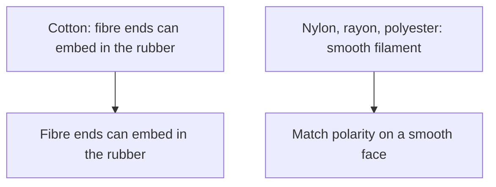
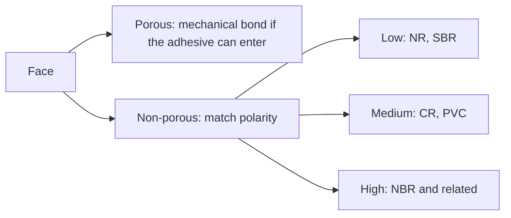
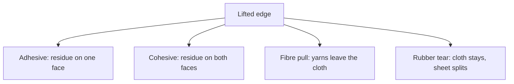

# Sheet Latex–Textile Bonding

Human page: /literature-reviews/sheet-latex-textile-bonding

> **Safety.** Solvent rubber cement: fire, explosion, fumes. Product SDS. Ventilate. Closed can, away from heat and sparks.[^1][^2] Skin literacy: [Allergy and skin contact](/literature-reviews/allergy-and-skin-contact). Adhesive family: [Sheet adhesives](/literature-reviews/sheet-adhesives-and-seam-integrity).

## Executive summary

Commercial sheet plus lining, panel, or trim. Cotton can lock through protruding fibre ends. Nylon, rayon, and polyester are smooth filaments with little mechanical key.[^3] On a non-porous face, match polarity. On a porous face, the bond is mostly mechanical if the adhesive can enter.[^1][^4][^3] In heavy-duty rubber–textile goods the elastomer is readily deformable and the fibre is stiff.[^3]

## Questions this article answers

- [Cotton or nylon on the sheet?](#cotton-or-nylon)
- [What happens when the lap stretches?](#stretch-lap)
- [What is a lifted edge telling me?](#lifted-edge)
- [Do I pretreat the cloth?](#pretreat)
- [What are the safety rules?](#safety)

## Cotton or nylon on the sheet? {#cotton-or-nylon}

### How

Name the fibre. Cotton fibre ends can embed in the rubber. Smooth nylon, rayon, or polyester lacks those ends. Unknown blend, coat, or print: stop.

Contact bond: apply solvent rubber cement, [flash off](/literature-reviews/sheet-adhesives-and-seam-integrity#flash-off), press.[^1]

### Why

Cotton staple: numerous fibre ends protrude and can embed in rubber. Rayon lacks those ends (smooth, wax-like). The same is true of polyamide and polyester.[^3] Porous: mechanical bond if particles can enter. Same-sign charge can block entry.[^3][^1] Non-porous: matched polarity.[^4][^3] Polyisoprene and SBR are relatively non-polar; NBR, acrylics, styrene–vinylpyridine–butadiene, and carboxylated polymers are higher; CR and PVAc are intermediate in the 1997 list.[^3] Vanderbilt columns: high NBR/XNBR/XSBR/PSBR, medium CR/PVC, low NR/SBR/BR/IIR.[^1]

Aqueous latices tend to shrink textiles.[^1][^4][^3] In a latex adhesive, higher filler raises viscosity and cuts flow into pores.[^1]

### Detail

Detail: Polarity on a lining face

Mixed polarity (NR sheet against nylon): blend of latices, or latex plus a resin matched to the other face.[^3]

## What happens when the lap stretches? {#stretch-lap}

### How

A lap is an overlap. Peel starts at the free edge. Static lap sits. Stretch lap rides a crease, opening, or strap root. Inspect the moving edge after wear.

### Why

In heavy-duty rubber–textile goods the elastomer is readily deformable and the fibre is stiff.[^3] The weak link in that account is often the bond between the rubber phase and the adhesive film.[^3] Fabric-lined gloves stretch less than unsupported gloves and stop tear propagation in the film.[^1]

### Detail

Detail: What a one-pull lab test leaves out

Static adhesion tests without prior fatigue are preliminary sorting tests. A pass does not imply tyre service.[^3]

Raumann: RFL film modulus about 2.3×10⁶ g·cm⁻², extensibility about 16%, between rubber skim and nylon tire cord.[^5]

## What is a lifted edge telling me? {#lifted-edge}

### How

| What you see | Label |
| --- | --- |
| Adhesive on one face | Adhesive failure |
| Residue on both faces | Cohesive failure |
| Yarns out of the cloth | Fibre pull |
| Sheet torn, cloth stuck | Rubber tear |
| Lift only where the body moves | Stretch at the lap |

Sheet-to-sheet seam vocabulary: [Sheet delamination](/literature-reviews/sheet-delamination-seam-failure).

### Why

Peel: thin layer on a thick substrate, or two bonded layers.[^4] Coated-fabric adhesion (ASTM D751, ISO 2411) is a different family from rubber–textile ply stripping. ISO 36 does not apply to coated fabrics.[^6][^7][^8] ASTM D1876 and ASTM D903 are method classes.[^9][^10]

Poh and Lamaming: cohesive failure at low peel rate, adhesive failure at high rate, in an NBR/SMR L PSA in toluene.[^11]

### Detail

Detail: Method names

Coating on cloth: ASTM D751, ISO 2411.[^6][^7] Ply adhesion: ISO 36, with coated fabrics excluded.[^8] T-peel: ASTM D1876.[^9] Stripping: ASTM D903.[^10]

## Do I pretreat the cloth? {#pretreat}

### How

Bought sheet: solvent cement contact bond. Factory pretreat: [Liquid latex–textile bonding](/literature-reviews/liquid-latex-textile-bonding).

### Why

Rubber-to-textile bonding agents include latex–casein and resorcinol–formaldehyde–latex.[^3] The RFL class is a heat-cure plant dip. Solvent cement on a table is a contact bond.[^1]

### Detail

Detail: What the factory dip does to the fibre

RFL: reddish-brown discoloration and fibre stiffening; dry pick-up on cord about 5% m/m in the handbook account.[^3] Rayon and polyamide: RFL can work. Polyester: RFL not satisfactory; masked polyisocyanates regenerate on heating around a 220°C heat-set.[^3] Wetting agents in latex–casein can hurt cord adhesion after fatigue.[^3]

## What are the safety rules? {#safety}

### How

Closed, labeled cans. Away from heat and sparks. Product SDS. Ventilate or postpone. [Sheet ventilation](/literature-reviews/sheet-ventilation-solvent-exposure).

### Why

Solvent column: fire and explosion hazard.[^1][^2] Aqueous latex: freeze, slower dry, shrinks textiles, poorer water resistance.[^1][^4][^3] OSHA ammonia limits (CAS 7664-41-7) describe the substance.[^12] They do not prove a given adhesive contains ammonia.

## Endnotes

[^1]: *The Vanderbilt Latex Handbook*. 3rd ed. Edited by Robert Francis Mausser. Norwalk, CT: R.T. Vanderbilt Company, 1987. Solvent vs latex column; polarity ladder; filler vs porous flow; fabric-lined glove analog; aqueous shrink.
[^2]: Representative rubber cement SDS (heptane / light aliphatic). Flammable-liquid class. Product SDS governs the can in hand.
[^3]: *Polymer Latices: Science and Technology — Volume 3: Applications of Latices*. 2nd ed. D. C. Blackley. Chapman & Hall / Springer, 1997. Cotton fibre ends vs smooth rayon, polyamide, and polyester; elastomer deformable vs fibre stiff; porous mechanical bond vs matched polarity; static tests as sorting only; latex–casein and RFL class, including discoloration, stiffening, polyester isocyanate route, and wetting-agent caution. Already-wet examples on the adhesives chapter name paper and leather; the textile-bonding-agent sentence is the rubber-to-textile section.
[^4]: *Practical Guide to Latex Technology*. Rani Joseph. Shawbury: Smithers Rapra Technology, 2013. Porous mechanical bond vs non-porous polarity; aqueous shrink of textiles; peel as a fracture-test class.
[^5]: Raumann, *Textile Research Journal* 38, no. 6 (1968). RFL film modulus and extensibility between rubber skim and nylon tire cord. First name not in this pack; do not invent one.
[^6]: ASTM D751. Coated fabrics; coating-adhesion family.
[^7]: ISO 2411. Coating adhesion of rubber- or plastics-coated fabrics.
[^8]: ISO 36. Adhesion of rubber to textile fabrics; does not apply to coated fabrics.
[^9]: ASTM D1876. T-peel of adhesives. Method class.
[^10]: ASTM D903. Peel or stripping strength. Method class.
[^11]: Poh and Lamaming. *Journal of Coatings* (2013). DOI 10.1155/2013/519416. Peel mode vs rate in an NBR/SMR L PSA in toluene.
[^12]: OSHA chemical data, ammonia, CAS 7664-41-7. Exposure limits for the substance. Not proof a given latex adhesive contains ammonia.

## Sources

- *The Vanderbilt Latex Handbook*. 3rd ed. Edited by Robert Francis Mausser. Norwalk, CT: R.T. Vanderbilt Company, 1987. https://lccn.loc.gov/92117844
- *Practical Guide to Latex Technology*. Rani Joseph. Shawbury: Smithers Rapra Technology, 2013. https://books.google.com/books/about/Practical_Guide_to_Latex_Technology.html?id=NB5AMwEACAAJ
- *Polymer Latices: Science and Technology — Volume 3: Applications of Latices*. 2nd ed. D. C. Blackley. Chapman & Hall / Springer, 1997. https://books.google.com/books?id=Y2VPGj7YbykC
- Raumann. *Textile Research Journal* 38, no. 6 (1968).
- Poh and Lamaming. *Journal of Coatings* (2013). https://doi.org/10.1155/2013/519416
- ASTM D751. Standard test methods for coated fabrics.
- ISO 2411. Rubber- or plastics-coated fabrics — determination of coating adhesion.
- ISO 36. Rubber, vulcanized or thermoplastic — determination of adhesion to textile fabrics.
- ASTM D1876. Standard test method for peel resistance of adhesives (T-peel test).
- ASTM D903. Standard test method for peel or stripping strength of adhesive bonds.
- Representative rubber cement SDS (heptane / light aliphatic).
- OSHA chemical data, ammonia, CAS 7664-41-7.
