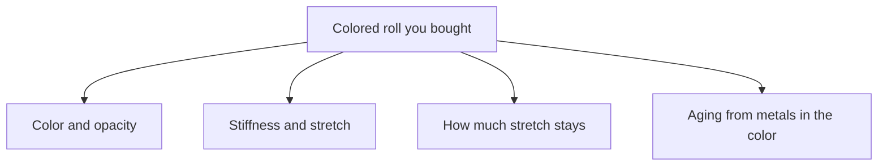

# Colored Sheet: Pigment and Filler Effects

Human page: /literature-reviews/sheet-pigment-filler-decks

> **Safety.** Colorants and fillers change skin-contact extractables and aging chemistry. Food-contact colorant lists are not wear certificates. Copper and manganese consume antioxidant capacity. Literacy about sheet already purchased, not a mixing card.

## Executive summary

Pre-colored calendered NR sheet ships with the mill’s pigment and filler already in the film. The buyer inherits opacity, modulus, permanent set, and the aging package as sold. McNAMEE clay in an NR film raises modulus at 500% and cuts tensile. A separate kaolinite series cuts elongation. High-styrene styrene-butadiene filler raises tear and permanent set. Whiting and zinc oxide used as fillers lower tensile. Pigments can carry copper and manganese.

Use when choosing catalog color, comparing a clear roll to an opaque one, or reading why two “same thickness” blacks feel different. Surface graphics: [Printing and Surface Decoration](/literature-reviews/sheet-printing-surface-decoration). Fit stiffness: [Gauge, Modulus, and Reduction](/literature-reviews/sheet-gauge-modulus-reduction).

## What the roll already contains

Calendered fashion NR sheet may ship in standard colors. Dyes and pigments sit with clays and fillers as elastomer-phase modifiers. The mill compounded and formed the film.[^1] A catalog black and a clear roll are different compounds. A color chip does not list pigment type or filler phr. Repeatability is the shipped lot.

## Filler effects in the bought film

**NR clay.** McNAMEE clay in air-dried NR spread films (15 min at 93°C): tensile **5000 psi** and modulus at 500% **700 psi** at 0 phr; **2100 psi** and **2100 psi** at 100 phr.[^2]

**Elongation, separate series.** Kaolinite on NR latex deposits (60 min at 93°C), printed in *High Polymer Latices* (1966) and credited there to a 1954 Vanderbilt handbook: elongation at break **1200%** at 0 phr clay to **400%** at 100 phr, with tensile down and modulus at 500% up through 60 phr (blank once elongation is below 500%).[^3] Different zinc oxide, sulfur, and cure from the 1987 McNAMEE compound. Do not merge the psi columns.

**CR comparison.** DIXIE clay at 0 / 25 / 50 phr in CR 750 (60 min at 127°C): tensile **3100 / 1800 / 1500 psi**; stress at 500% **500 / 600 / 1100 psi**.[^2] Same direction. Not an NR recipe.

**High-styrene filler.** In NR films, 20 phr high-styrene styrene-butadiene copolymer: 300% modulus **0.90 → 2.76 MPa**, 500% modulus **1.79 → 8.62 MPa**, tensile **28.6 → 26.9 MPa** (peak 30.7 at 15 phr), extension at break **880 → 730%**, crescent tear **1156 → 1769 N/cm**, permanent set **6 → 30%**.[^4] The chapter calls the modulus and hardness increase a serious disadvantage for some latex applications.[^4]

**Inorganic whites.** On a different postvulcanized NR film, whiting and zinc oxide lower tensile strength (MPa) as filler level rises. A 90/10 high-styrene copolymer stays near the unfilled tensile through about 20 phr, then declines.[^4]

**Unresolved number conflicts.** A 1966 high-styrene graph prints 800 psi modulus at 500% and 0 phr. Table values in the 1997 book are 1.79 MPa for that cell. Use the 1997 table.[^4][^5] A 1966 resin-versus-whiting graph peaks near 10 parts of filler. The 1997 tensile graph is still high around 20 parts. Do not state a single peak.[^4][^5]

Plant-film examples of what filler already in a film does to wear feel. Not a vendor recipe for a retail roll.

## Metal impurities

Copper or other metal protection, when needed, is budgeted as **2 phr total** antioxidant. Coarse or settled dispersions leave that protection uneven.[^6] Pigments and fillers can put copper or manganese into the film the mill sold you. Storage: [Aging, Storage, and Care](/literature-reviews/sheet-aging-storage-and-care).

## Decision cues

- Buy colored sheet when catalog color is needed now and the mill package (opacity, stiffness, aging) is acceptable.
- Compare lots by hand (stretch a scrap, recover, feel set), not by color name.
- Request polymer family and filler or color information when life or sun exposure matters.

## Endnotes

[^1]: Vanderbilt Latex Handbook, 3rd ed. (1987) — dyes and pigments as Class 3 elastomer-phase modifiers with clays and fillers; the mill compounded the film before sale.
[^2]: Vanderbilt Latex Handbook, 3rd ed. (1987) — McNAMEE clay in an NR spread film; DIXIE clay in a CR 750 compound.
[^3]: High Polymer Latices (1966), 2 vols. — kaolinite on NR latex deposits; elongation series credited in that book to the 1954 Vanderbilt handbook. Separate recipe from the 1987 McNAMEE table.
[^4]: Polymer Latices Vol 3, *Applications of Latices*, 2nd ed. (1997) — high-styrene styrene-butadiene filler in NR films, and tensile comparison with whiting and zinc oxide. Not the 1966 set.
[^5]: High Polymer Latices (1966) — high-styrene modulus cell and resorcinol-formaldehyde peak loading that disagree with the 1997 printing. Qualified; 1997 numbers used where they conflict.
[^6]: Vanderbilt Latex Handbook, 3rd ed. (1987) — 2 phr total antioxidant when copper or other metal protection is needed; coarse or settled dispersions leave uneven protection.

Detail: McNAMEE clay in an NR film

| phr McNAMEE clay | Tensile (psi) | Modulus at 500% (psi) |
| --- | --- | --- |
| 0 | 5000 | 700 |
| 25 | 4600 | 1400 |
| 50 | 4000 | 1850 |
| 75 | 3200 | 2050 |
| 100 | 2100 | 2100 |

Detail: Kaolinite elongation on NR deposits

| phr clay | Elongation at break (%) | Tensile (psi) | Modulus at 500% (psi) |
| --- | --- | --- | --- |
| 0 | 1200 | 6000 | 400 |
| 20 | 750 | 3500 | 650 |
| 40 | 600 | 2500 | 900 |
| 60 | 500 | 1900 | 1150 |
| 80 | 450 | 1600 | |
| 100 | 400 | 1400 | |

Detail: High-styrene filler numbers

| phr filler | Modulus 300% (MPa) | Modulus 500% (MPa) | Tensile (MPa) | Eb (%) | Tear (N/cm) | Set (%) |
| --- | --- | --- | --- | --- | --- | --- |
| 0 | 0.90 | 1.79 | 28.6 | 880 | 1156 | 6 |
| 10 | 2.07 | 5.58 | 30.0 | 800 | 1489 | 20 |
| 15 | 2.41 | 6.89 | 30.7 | 760 | 1664 | 22 |
| 20 | 2.76 | 8.62 | 26.9 | 730 | 1769 | 30 |

