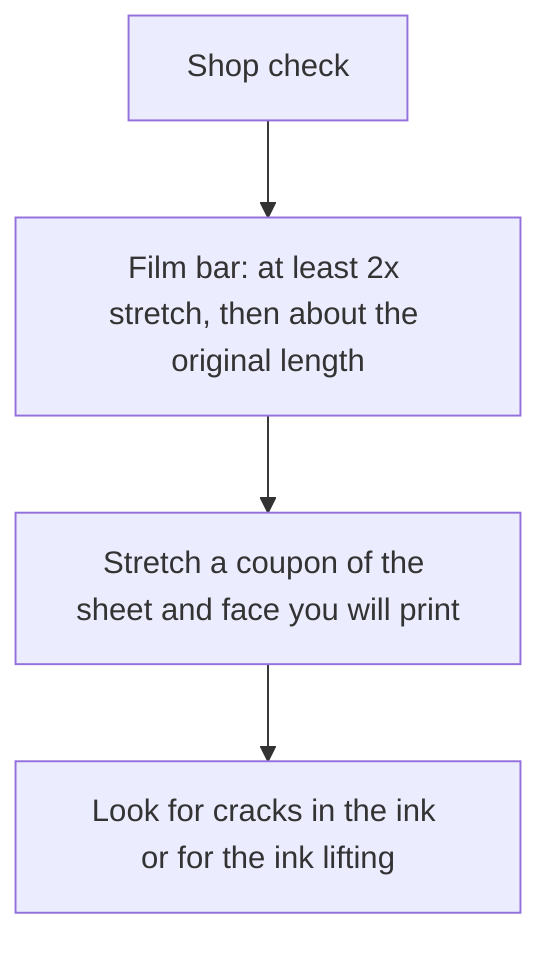
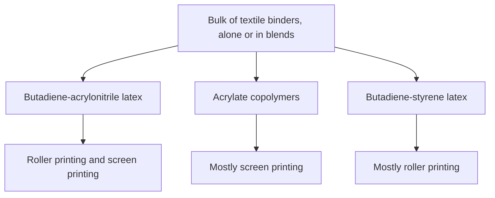

# Printing on Latex Sheet

Human page: /literature-reviews/sheet-printing-surface-decoration

> **Safety.** Solvent inks belong in a ventilated shop, with the PPE on the product SDS. This page states the industrial bar a print has to survive.

## Executive summary

Bought sheet latex stretches like rubber. A graphic made for cotton still has to survive that stretch on the sheet you bought. Industrial stretch inks use a polyurethane and polyester elastomer vehicle, plus pigment, on latex rubber.[^2]

Use this when judging an ink or a transfer for bought sheet, or when a product photo stands in for a stretch number. The face you print is the mill face. Finish literacy: [Sheet Surface Finish](/literature-reviews/sheet-surface-finish-literacy). Bulk color instead of a surface graphic: [Pigment and Filler Decks](/literature-reviews/sheet-pigment-filler-decks).

## What stretch does bought sheet have to survive?

Vulcanized elastomeric latex film must stretch, under stress, to at least twice its original length, then return to approximately its original length.[^1] An ink sold for cotton or for rigid plastisol has not met that bar until a coupon says so.

Shop check: coupon from the same sheet and face, stretched to at least twice its length, inspected for cracks or lift. Treat a cotton or rigid-plastisol ink as the wrong class until that coupon stays intact.

## What ink is built for rubber that stretches?

US10487228B2 describes an aqueous stretchable ink: polyester, a polyurethane elastomer, a pigment dispersion, and surfactants, aimed at stretchable latex rubber.[^2] The vehicle has to be an elastomer. Adding pigment to a craft acrylic leaves the acrylic as it was. If the seller will not state elongation on a rubber-like substrate, there is no spec.

Detail: What the patent claims for elongation

Patent examples describe images stretching to roughly 110–500% without visible cracks or delamination over many cycles.[^2] That range is a patent embodiment. The coupon on the bought sheet is still the check.

Detail: Textile printing binders

The Vanderbilt Latex Handbook says the bulk of textile printing binders fall into three types, used alone or in blends.[^6] On sheet latex they are fastness vocabulary. The coupon remains the test.

Butadiene-acrylonitrile: roller and screen; better dry crock than acrylates; better cyclic aging and solvent resistance than styrene binders. Acrylate copolymers: almost only screen; aging and screen runnability. Butadiene-styrene: almost only roller; lower cost; better dry crock than acrylates; rarely screen, because of running problems. Ideal textile fastness in that chapter: dry crock, wet crock, washing, dry cleaning, light, cyclic aging, scrubbing.[^6]

## What do adhesion tests measure?

ASTM D751, ASTM D3389, and ASTM D1876 describe coated fabrics and flexible bonds.[^3][^4][^5] A thin ink film is only an analogy to a coating. A coated-fabric grade does not certify a fashion garment. Shop check: the stretch coupon, plus a peel or a cross-cut. Seam peel vocabulary: [Adhesives and Seam Integrity](/literature-reviews/sheet-adhesives-and-seam-integrity).

| Standard | What it measures |
| --- | --- |
| ASTM D751 | Coating-to-fabric adhesion[^3] |
| ASTM D3389 | Abrasion of a coated fabric, by mass loss or by cycles[^4] |
| ASTM D1876 | T-peel of a bond between flexible layers[^5] |

## Which face do you print?

Print the test on the gloss or matte side you will show. Calendered sheet latex is pressed between heated rollers. Both faces are the mill's. Laminating a new film is how you get a different face. Shine alone does not name the print side. Vendor-face reading: [Sheet Surface Finish](/literature-reviews/sheet-surface-finish-literacy).

## Endnotes

[^1]: *The Vanderbilt Latex Handbook*, 3rd ed., R.T. Vanderbilt Company, 1987. Elastomeric latex film stretches to at least twice its length under stress and returns to approximately its original length. https://lccn.loc.gov/92117844
[^2]: US10487228B2, Stretchable ink composition (2019). Aqueous ink: polyester, polyurethane elastomer, pigment dispersion, surfactants; substrate class includes stretchable latex rubber; embodiments about 110–500% without visible cracks or delamination. https://patents.google.com/patent/US10487228B2/en
[^3]: ASTM D751, Standard Test Methods for Coated Fabrics. Adhesion of coating to fabric. https://store.astm.org/d0751-26.html
[^4]: ASTM D3389, coated-fabric abrasion (rotary platform). https://store.astm.org/d3389-21.html
[^5]: ASTM D1876, T-peel resistance of adhesive bonds between flexible adherends. https://store.astm.org/d1876-00.html
[^6]: *The Vanderbilt Latex Handbook*, 3rd ed., 1987. Textile printing binders: butadiene-acrylonitrile (roller and screen), acrylate copolymers (mostly screen), butadiene-styrene (mostly roller); fastness to crock, wash, dry cleaning, light, cyclic aging, and scrubbing.
