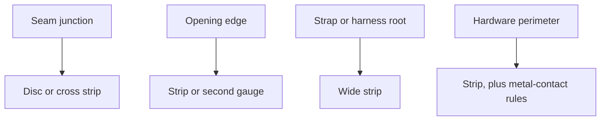
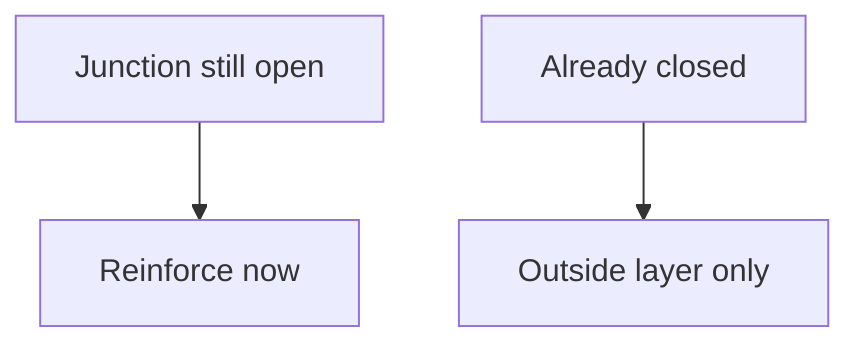

# Sheet Reinforcement Zones

Human page: /literature-reviews/sheet-reinforcement-laminate-zones

## Executive summary

On commercial sheet, reinforcement is added sheet at a stress concentrator: a disc at a seam junction, a strip at a strap root, doubled gauge at an opening. Add it before close-out traps the junction. Fabric-lined gloves stretch less than unsupported gloves and stop tear propagation of the film.[^1] Glue family: [Sheet adhesives](/literature-reviews/sheet-adhesives-and-seam-integrity).

## Where the extra sheet goes

Reinforce = disc or strip at a stress concentration. Laminate = bond rubber layers over an area. Overlay = place one adhesive-coated edge on the other ([Sheet adhesives](/literature-reviews/sheet-adhesives-and-seam-integrity)).

| Zone | Sheet cue |
| --- | --- |
| Seam junction (3+ panels) | Disc or cross strip |
| Opening edge | Strip or doubled gauge |
| Strap / harness root | Wide strip |
| Hardware perimeter | Strip; copper ageing of NR or CR film[^3] — [Sheet hardware](/literature-reviews/sheet-hardware-metal-contact), [Compatibility matrix](/literature-reviews/compatibility-matrix-metals-oils-plastics) |

Fabric-lined (supported) gloves: less stretch than unsupported gloves; liner stops tear propagation; more durable; harder don/doff; some less comfortable than flocked unsupported gloves.[^1] Oil-resistance order of those glove films: NR, then CR, then XNBR (NR least oil-resistant; CR slightly less than XNBR).[^2] Copper degradation of NR or CR latex film: 2 phr total antioxidant, about 1 phr oxidation and 1 phr copper.[^3] Hardware contact and ageing: [Sheet hardware](/literature-reviews/sheet-hardware-metal-contact), [Sheet aging](/literature-reviews/sheet-aging-storage-and-care).

## When to add it

Apply adhesive, air, reinforce, press, while the junction is open. Closed garment: outside layer only; trapped corner unchanged. Cloth layer: [Sheet latex–textile bonding](/literature-reviews/sheet-latex-textile-bonding).

## Failed junction

| Observation | Next |
| --- | --- |
| Tear at junction | Zone map above |
| Stiff ring at metal, then crack | [Sheet aging](/literature-reviews/sheet-aging-storage-and-care), [Sheet hardware](/literature-reviews/sheet-hardware-metal-contact) |
| Lining edge lift | [Sheet latex–textile bonding](/literature-reviews/sheet-latex-textile-bonding), [Sheet delamination](/literature-reviews/sheet-delamination-seam-failure) |

## Safety

Solvent adhesives: fire hazard, explosion hazard, explosion-proof and ventilating equipment, solvent fumes as a health hazard.[^4] See [Sheet ventilation](/literature-reviews/sheet-ventilation-solvent-exposure).

---

## Endnotes

[^1]: *The Vanderbilt Latex Handbook*, 3rd ed. (Mausser, 1987) — fabric-lined gloves: less stretch, tear-stop, durability, don/doff.
[^2]: *The Vanderbilt Latex Handbook*, 3rd ed. (Mausser, 1987) — glove-film oil resistance: NR, then CR, then XNBR.
[^3]: *The Vanderbilt Latex Handbook*, 3rd ed. (Mausser, 1987) — 2 phr antioxidant reserve against copper degradation of NR or CR film.
[^4]: *The Vanderbilt Latex Handbook*, 3rd ed. (Mausser, 1987) — solvent adhesives: fire, explosion, ventilation, fumes.
