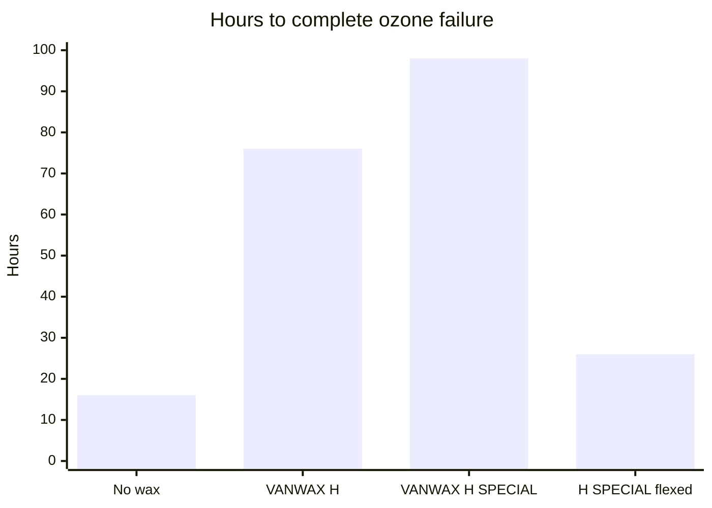

# Sheet Surface Finish

Human page: /literature-reviews/sheet-surface-finish-literacy

## Executive summary

Bought calendered sheet can show a light powder after storage. Treat that powder as possible wax bloom. The industrial mechanism is a migrating wax film that can shield static ozone and cracks when the film flexes.[^1] A Science Diliman study treats wax bloom as additive migration. It does not identify powder on a bought roll.[^2]

Use this when stored sheet looks dusty, before [print](/literature-reviews/sheet-printing-surface-decoration) or a join. Storage: [Aging, Storage and Care](/literature-reviews/sheet-aging-storage-and-care).

## Questions this article answers

- [How do I choose a face to join?](#faces)
- [What should I do with powder on stored sheet?](#bloom)

## How do I choose a face to join? {#faces}

**How.** Make a bond coupon on the face you will join ([Adhesives and Seam Integrity](/literature-reviews/sheet-adhesives-and-seam-integrity)).

**Why.** A bought roll has two faces. The coupon shows which face will hold a join. Calendered sheet is pressed to gauge between heated rollers ([Calendered Sheet](/literature-reviews/sheet-calendered-sheet)).

## What should I do with powder on stored sheet? {#bloom}

**How.** Treat a light powder on stored sheet as possible wax bloom. Leave it when the sheet will sit still. Remove it before adhesive or print. If that powder is a wax film, removing it takes off the static ozone shield that film provided.

**Why.** Microcrystalline wax at 0.5–1.0 phr can migrate to a continuous surface film that protects against static ozone. Flex and stretch crack that film.[^1] Ozone (O₃) cracks diene rubber. Science Diliman treats wax bloom as additive migration out of vulcanized natural rubber.[^2]

Detail: Wax loading, bloom time, and one ozone comparison

phr = parts per hundred rubber.

Handbook example: films packaged in kraft and held 3 weeks at 23°C / 50% relative humidity so wax can bloom before ozone exposure.[^1]

Named-wax hours to complete ozone failure in that chapter (one lab comparison, not a universal constant): no wax 16; VANWAX H 76; VANWAX H SPECIAL 98; VANWAX H SPECIAL with the film flexed 26.[^1]

p-Phenylenediamine antiozonants stain and are the class used for dynamic ozone protection on dark goods. That stain is a different finish class from wax bloom.[^1]

## Endnotes

[^1]: *The Vanderbilt Latex Handbook*, 3rd ed., ed. Robert Francis Mausser, R.T. Vanderbilt Company, 1987. Ultraviolet-light and antiozonant chapter: microcrystalline wax 0.5–1.0 phr; continuous bloom required for static ozone protection; flex and stretch crack the film; bloom-time example of 3 weeks at 23°C / 50% RH in kraft; named-wax ozone-failure hours (no wax 16, VANWAX H 76, VANWAX H SPECIAL 98, VANWAX H SPECIAL flexed 26); p-phenylenediamine antiozonants for dynamic protection on dark goods. This note does not identify powder on a bought roll.

[^2]: “Effect of Ingredient Loading on Surface Migration Kinetics of Additives in Vulcanized Natural Rubber Compounds.” *Science Diliman*. Wax bloom as additive migration to the surface. No talc comparison and no bought-roll identification.
