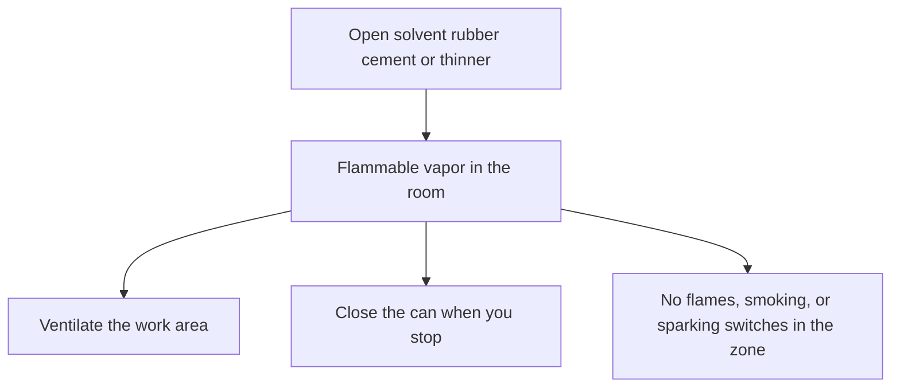

# Sheet Ventilation and Solvent Exposure

Human page: /literature-reviews/sheet-ventilation-solvent-exposure

> **Safety.** Solvent rubber cement and thinner give off flammable vapor. Dizziness or nausea: stop and get fresh air. Dwelling storage limits come from the local fire authority.

## Executive summary

Sheet-pathway joins typically use solvent rubber cement and thinner: highly flammable liquids. Work ventilated, cans closed, ignition kept out of the vapor path.[^1][^2][^4] Vanderbilt lists explosion hazard, fire hazard, explosion-proof and ventilating equipment, and solvent-fume health hazard for solvent adhesives.[^4]

Use before applying cement and when placing cans relative to heaters and sleeping space. Bond steps: [Sheet adhesives and seam integrity](/literature-reviews/sheet-adhesives-and-seam-integrity).

## Questions this article answers

- [What do I do while the can is open?](#while-the-can-is-open)
- [How do I store the cans?](#storing-the-cans)

## What do I do while the can is open? {#while-the-can-is-open}

### How

1. Read the product safety data sheet.[^1]
2. Apply cement in a well-ventilated area. Ventilating equipment is listed for solvent adhesives. The workplace should be well ventilated. No spare-room fan layout is given.[^4][^5]
3. Close the can when you stop.[^2]
4. No open flames or smoking while the liquid is in use or in storage. Explosion-proof switches where flammable solvent is used.[^2][^5] Remove clothing wet with the flammable liquid. Wash contaminated skin.[^3]
5. Ground and bond during transfer if the product safety data sheet says so.[^1]

### Why

Heptane-class cement safety data sheets: Flam. Liq. 2, H225; store cool, tightly closed, ventilated, away from heat, sparks, and flame; ground/bond on transfer.[^1]

NIOSH n-heptane: Class IB; flash point 25°F; lower explosive limit 1.05%; upper explosive limit 6.7%. Symptoms include dizziness, stupor, and nausea. Inhalation is one exposure route.[^3]

Vanderbilt solvent-adhesive disadvantages: explosion, fire, special explosion-proof and ventilating equipment, solvent-fume health hazard.[^4] Lab chapter: the workplace should be well ventilated; ground electrical equipment; explosion-proof motors and switches where flammable solvent is used.[^5]

OSHA 1910.106(e)(2)(iv)(c): Category 1 or 2 flammable liquids, or Category 3 liquids with a flash point below 100°F, may be used only where there are no open flames or other sources of ignition within the possible path of vapor travel. (d)(7)(iii): open flames and smoking not permitted in flammable-liquid storage areas. (e)(6)(i): industrial-plant ignition sources include open flames, smoking, and electrical sparks.[^2]

### Detail: Solvent-adhesive column

Detail: What the handbook lists for solvent adhesives

Solvent-adhesive advantages: water resistance; wide drying rates and open times; high early bond strength or tack; wets some difficult surfaces. Disadvantages: explosion; fire; explosion-proof and ventilating equipment; solvent-fume health hazard; possible EPA solvent-recovery equipment.[^4]

Latex-adhesive column on the same table: nonflammable; nontoxic solvents. Different glue family. This page is solvent rubber cement for sheet.

Detail: n-Heptane numbers on the NIOSH card

n-Heptane, CAS 142-82-5 (card reviewed 30 October 2019): flash point 25°F; LEL 1.05%; UEL 6.7%; Class IB (flash point below 73°F, boiling point at or above 100°F); boiling point 209°F; incompatible with strong oxidizers; prevent skin and eye contact; wash skin when contaminated; remove clothing when wet (flammable).[^3]

Product SDS may name a blend. The NIOSH card is pure n-heptane.

## How do I store the cans? {#storing-the-cans}

### How

Store cool, tightly closed, away from heat, sparks, flame, and strong oxidizers.[^1][^3] Ask the local fire authority what a dwelling may hold. Oregon OSHA FS-12 tells readers to contact the fire marshal or local fire department for requirements beyond the workplace summary.[^6]

### Why

29 CFR 1910.106 defines a closed container as sealed so neither liquid nor vapor escapes at ordinary temperatures, and sets workplace flammable-liquid storage, including Table H-12 container sizes.[^2] FS-12 restates categories, container limits, and transfer for that workplace rule.[^6]

### Detail: Closed container and the fact sheet

Detail: What 1910.106 and FS-12 are for

1910.106 is a workplace flammable-liquids standard. FS-12 states that the full standard is complex and that the sheet covers basic storage, transfer, and transport; it points to Table H-12 and to the fire marshal for additional requirements.[^2][^6]

1910.106(e)(3)(v) ventilates certain industrial process areas that use Category 1 or 2 flammable liquids, or Category 3 liquids with a flash point below 100°F, at not less than 1 cubic foot per minute per square foot of solid floor area, exhausted outside. That paragraph applies to areas defined in (e)(3)(i). It is not a spare-room fan specification.[^2]

## Sources

- *The Vanderbilt Latex Handbook*. 3rd ed. Edited by Robert Francis Mausser. Norwalk, CT: R.T. Vanderbilt Company, 1987. https://lccn.loc.gov/92117844
- OSHA. 29 CFR 1910.106, Flammable liquids. https://www.osha.gov/laws-regs/regulations/standardnumber/1910/1910.106
- NIOSH Pocket Guide to Chemical Hazards: n-Heptane. https://www.cdc.gov/niosh/npg/npgd0312.html
- Oregon OSHA. Fact Sheet: Flammable Liquids (FS-12). https://osha.oregon.gov/OSHAPubs/factsheets/fs12.pdf
- Product safety data sheet for the solvent rubber cement and thinner in use (heptane / light aliphatic naphtha class: Flam. Liq. 2, H225).

## Endnotes

[^1]: Product safety data sheet, heptane or light aliphatic naphtha rubber-cement class. Flam. Liq. 2, H225. Store cool, closed, ventilated, away from heat, sparks, and flame. Ground/bond during transfer.
[^2]: OSHA 29 CFR 1910.106. (a)(9) closed container: sealed so neither liquid nor vapor escapes at ordinary temperatures. Workplace storage, including Table H-12. (d)(7)(iii) open flames and smoking not permitted in flammable-liquid storage areas. (e)(2)(iv)(c) Category 1 or 2 liquids, or Category 3 liquids with a flash point below 100°F, used only where no open flames or other ignition sources lie in the possible path of vapor travel. (e)(6)(i) industrial-plant ignition sources include open flames, smoking, and electrical sparks. (e)(3)(v) industrial process-area ventilation of not less than 1 cubic foot per minute per square foot of solid floor area, exhaust outside, for those same liquid categories, scoped to (e)(3)(i). Not a dwelling gallon limit and not a spare-room fan specification.
[^3]: NIOSH Pocket Guide, n-heptane. Flash point 25°F. LEL 1.05%. UEL 6.7%. Class IB. Strong oxidizers incompatible. Remove clothing when wet with the flammable liquid. Wash skin when contaminated. Dizziness, stupor, nausea among symptoms.
[^4]: *The Vanderbilt Latex Handbook*, 3rd ed. (1987), adhesives comparison. Solvent adhesives: explosion hazard, fire hazard, explosion-proof and ventilating equipment, solvent-fume health hazard, possible solvent recovery. Advantages include water resistance, open time, early tack, wetting difficult surfaces.
[^5]: *The Vanderbilt Latex Handbook*, 3rd ed. (1987), laboratory health section. The workplace should be well ventilated. Ground electrical equipment. Explosion-proof motors and switches where flammable solvent is used.
[^6]: Oregon OSHA Fact Sheet FS-12. Readable summary of 1910.106 categories, container limits, and transfer. Directs readers to the fire marshal or local fire department for additional requirements.
