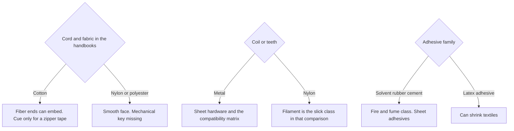

# Sheet Zipper Closure Compatibility

Human page: /literature-reviews/sheet-zipper-closure-compatibility

> **Safety.** Solvent rubber cement on bought sheet: fire and fume class.[^1] Product SDS. [Sheet adhesives](/literature-reviews/sheet-adhesives-and-seam-integrity). [Sheet ventilation](/literature-reviews/sheet-ventilation-solvent-exposure).

## Executive summary

Bought sheet. Zipper choice turns on tape fiber, coil or teeth, and stops. The fiber comparison is cord and fabric in heavy rubber goods, used here as a material cue.[^2][^3] Metal coil is a metal-contact question ([Sheet hardware](/literature-reviews/sheet-hardware-metal-contact)).

## Questions this article answers

- [Which zipper parts matter on sheet?](#which-parts)
- [Cotton tape or a slick nylon or polyester tape?](#cotton-or-slick)
- [How do I choose coil and adhesive?](#choose)
- [What does ASTM D2054 test?](#d2054)

## Which zipper parts matter on sheet? {#which-parts}

### How

| Part | Question |
| --- | --- |
| Woven tape | Cotton, nylon, or polyester |
| Coil or teeth | Nylon, or metal → [Sheet hardware](/literature-reviews/sheet-hardware-metal-contact) |
| Stops and pull | Metal or plastic in the cement zone |

Attach steps: [Sheet adhesives](/literature-reviews/sheet-adhesives-and-seam-integrity). Cloth faces: [Sheet latex–textile bonding](/literature-reviews/sheet-latex-textile-bonding).

### Why

The bond that matters is tape face to sheet. Coil is a second material. ASTM D2054 does not measure that bond.[^5]

## Cotton tape or a slick nylon or polyester tape? {#cotton-or-slick}

### How

Read the tape fiber. Cotton in these handbooks is staple fiber. Nylon and polyester are continuous filaments. The sentences are about cord and fabric, not a named zipper.[^2] Cloth faces: [Sheet latex–textile bonding](/literature-reviews/sheet-latex-textile-bonding).

A latex adhesive can shrink textile.[^1][^4] Bought-sheet lap: solvent rubber cement.

### Why

Cotton is staple fiber; protruding ends embed in the rubber matrix. Rayon, polyamide, and polyester are continuous filaments with a smooth, wax-like surface and lack that mechanical key. The page’s subject is cord and fabric.[^2] The 1966 set states the same limit for rayon, nylon, and polyester (“Terylene” or “Dacron”).[^3]

Porous substrate: latex-adhesive bond mainly mechanical; polymer nature less important. Non-porous: matched polarity.[^4] Vanderbilt places NR in the low-polarity band.[^1]

### Detail

Detail: Abrasion, and one word the two Blackley books do not share

High-tenacity rayon cord: prior abrasion improves static adhesion to rubber. Under dynamic conditions the improvement is not so marked unless a dip follows. Combined effect greater than either step alone.[^2][^3]

1997 page text: latex-casein **abrasive**.[^2] 1966 page text: latex-casein **adhesive**.[^3] Same report otherwise. No silent winner. Tire-cord analog, not calendered-sheet zipper tape.

Detail: Polarity bands for a non-porous face

Non-porous: polarity of the latex should match the surfaces to be joined. High: NBR, XNBR, XSBR, PSBR. Medium: CR, PVC. Low: NR, SBR, BR, IIR.[^1]

Porous: mainly mechanical; non-porous: matched polarity. Non-polar: polyisoprene or SBR. High polarity: acrylonitrile–butadiene, acrylics, styrene–vinylpyridine–butadiene, or carboxylated polymers.[^4]

## How do I choose coil and adhesive? {#choose}

### How

Metal coil and metal stops: [Compatibility matrix](/literature-reviews/compatibility-matrix-metals-oils-plastics) and [Sheet hardware](/literature-reviews/sheet-hardware-metal-contact). Water-based coat on the tape: [Liquid zipper closure compatibility](/literature-reviews/liquid-zipper-closure-compatibility).

### Why

Branch follows the fiber class in the handbooks and the adhesive family.[^2][^1] A latex adhesive can shrink cloth.[^1][^4] Solvent rubber cement is the bought-sheet family and the fire and fume class.[^1]

## What does ASTM D2054 test? {#d2054}

### How

ASTM D2054: colorfastness of zipper tapes to crocking. Not a bond-strength method for natural-rubber sheet.[^5]

### Why

Subject is the textile tape and color rub-off. Textile QC. Not sheet bond strength.[^5]

## Endnotes

[^1]: *The Vanderbilt Latex Handbook*. 3rd ed. Edited by Robert Francis Mausser. Norwalk, CT: R.T. Vanderbilt Company, 1987. https://lccn.loc.gov/92117844 Solvent-adhesive disadvantages include fire hazard and solvent fumes. Latex-adhesive disadvantages include “Shrinks fabrics.” Non-porous: polarity of the latex should match the surfaces to be joined. High: NBR, XNBR, XSBR, PSBR. Medium: CR, PVC. Low: NR, SBR, BR, IIR.

[^2]: *Polymer Latices: Science and Technology — Volume 3: Applications of Latices*. 2nd ed. D. C. Blackley. Chapman & Hall / Springer, 1997. https://books.google.com/books?id=Y2VPGj7YbykC Cotton staple fibre ends embed in rubber. Continuous-filament rayon, polyamide, and polyester have a smooth, wax-like surface and lack that mechanical key. Abrasion of high-tenacity rayon improves static adhesion; dynamic gain needs a following treatment. Page text: “latex-casein abrasive.”

[^3]: *High Polymer Latices: Their Science and Technology*. 2 vols. D. C. Blackley. London: Maclaren; New York: Palmerton, 1966. https://lccn.loc.gov/66077950 Same mechanical-key limit for rayon, polyamide (“nylon”), and polyester (“Terylene” or “Dacron”). Same abrasion report; page text: “latex-casein adhesive.” Tier 4 corroboration. Do not cite this set as Polymer Latices Volume 3.

[^4]: *Practical Guide to Latex Technology*. Rani Joseph. Shawbury: Smithers Rapra Technology, 2013. https://books.google.com/books/about/Practical_Guide_to_Latex_Technology.html?id=NB5AMwEACAAJ “The tendency of aqueous lattices to shrink textiles and to wrinkle paper.” Porous substrates: bond mainly mechanical. Non-porous: matched polarity. Non-polar: polyisoprene or SBR. High polarity: acrylonitrile–butadiene, acrylics, styrene–vinylpyridine–butadiene, or carboxylated polymers.

[^5]: ASTM D2054. Colorfastness of zipper tapes to crocking. Scope boundary: textile tape, not natural-rubber sheet bond strength. No URL recorded.
